# 使用 Azure Data Factory 基于 HTTP 上的 URL 模式增量复制文件

> 原文：<https://towardsdatascience.com/using-azure-data-factory-to-incrementally-copy-files-based-on-url-pattern-over-http-569476b625fc?source=collection_archive---------3----------------------->

## 一个创新的 Azure 数据工厂管道，通过 HTTP 从第三方网络服务器增量复制多个文件


[田宽](https://unsplash.com/@realaxer)在 [Unsplash](https://unsplash.com/?utm_source=medium&utm_medium=referral) 上拍照

使用 Azure 数据工厂复制文件很简单；然而，如果文件被托管在第三方 web 服务器上，那么这就变得很棘手了，复制它们的唯一方法是使用它们的 URL。

在本文中，我们将看到数据工厂活动的一种创新用法，即动态生成 URL，通过 HTTP 获取内容，并将其存储在我们的存储帐户中以供进一步处理。

**警告:** *Microsoft Azure 是一项付费服务，遵循本文可能会导致您或您的组织承担财务责任。*

*在继续本文之前，请阅读我们的使用条款:*[*https://dhyanintech . medium . com/disclaimer-disclosure-disclosure-terms-of-use-fb3 BF BD 1e 0e 5*](https://dhyanintech.medium.com/disclaimer-disclosure-terms-of-use-fb3bfbd1e0e5)

# 先决条件

1.  有效的 Microsoft Azure 订阅
2.  Azure 数据工厂实例
3.  Azure 数据湖存储第二代存储

*如果您还没有设置先决条件，请参考我们之前的文章，了解如何创建它们:*

[](https://medium.com/@dhyanintech/a-definitive-guide-to-turn-csv-files-into-power-bi-visuals-using-azure-4483cf406eab) [## 使用 Azure 将 CSV 文件转换为 Power BI 视觉效果的权威指南

### 使用 Microsoft Azure 产品将新冠肺炎数据转化为惊人的 Power BI 视觉效果的分步指南。

medium.com](https://medium.com/@dhyanintech/a-definitive-guide-to-turn-csv-files-into-power-bi-visuals-using-azure-4483cf406eab) 

本文将建立我们的数据工厂，从 GitHub 的[新冠肺炎存储库中获取公开可用的 CSV 文件，GitHub 由约翰·霍普金斯大学系统科学与工程中心(JHU·CSSE)运营。我们对驻留在**csse _ covid _ 19 _ data/csse _ covid _ 19 _ daily _ reports**中的数据感兴趣。](https://github.com/CSSEGISandData/COVID-19)[此文件夹](https://github.com/CSSEGISandData/COVID-19/tree/master/csse_covid_19_data/csse_covid_19_daily_reports)包含每日病例报告，自 2020 年 1 月 22 日起，每天添加一次新报告。文件遵循一致的命名约定 **MM-DD-YYYY** 。战斗支援车

[](https://github.com/CSSEGISandData/COVID-19) [## CSSEGISandData/新冠肺炎

### 这是由约翰·霍普金斯大学运营的 2019 年新型冠状病毒视觉仪表板的数据存储库…

github.com](https://github.com/CSSEGISandData/COVID-19) 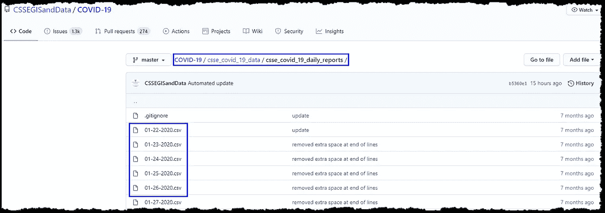

数据来源:GitHub 的文件列表(图片由作者提供)

为我们的项目获取这些文件的典型方式是从 GitHub 下载 zip 格式的存储库，在您的客户机上提取文件，然后手动将文件上传到我们的存储帐户。另一方面，如果我们希望我们的 Power BI 报告与新冠肺炎数据保持同步，我们必须每天上传一个新文件。我们希望找到一种解决方案来自动执行摄取任务，从而在无需额外手动操作的情况下保持数据最新。我们可以使用 Azure 数据工厂来实现这一点。我们的思考过程应该是:

*   创建一个从 GitHub 获取文件的管道，并将其存储在我们的存储帐户中
*   我们使用其 **Raw** URL 一次只能获取一个文件(在 [GitHub URL](https://github.com/CSSEGISandData/COVID-19/tree/master/csse_covid_19_data/csse_covid_19_daily_reports) 打开一个文件，点击 Raw 打开没有 GitHub UI 的文件):[https://Raw . githubusercontent . com/CSSEGISandData/新冠肺炎/master/csse _ covid _ 19 _ data/csse _ covid _ 19 _ daily _ reports/01-22-2020 . CSV](https://raw.githubusercontent.com/CSSEGISandData/COVID-19/master/csse_covid_19_data/csse_covid_19_daily_reports/01-22-2020.csv)

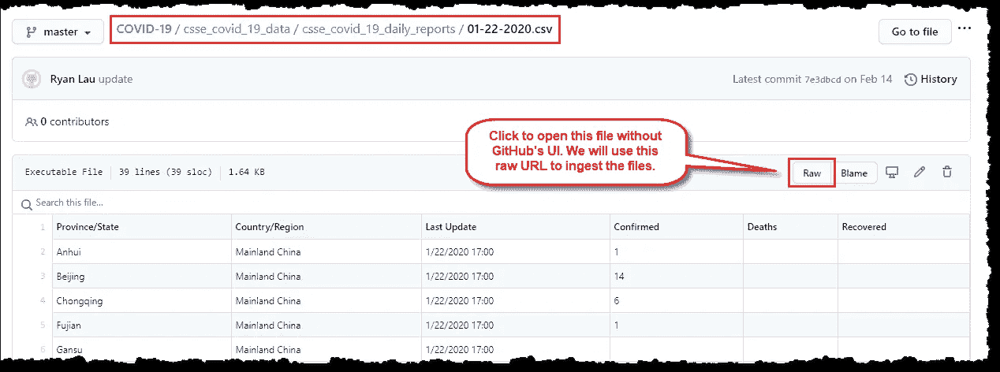

数据源:获取 **Raw** URL(图片由作者提供)

*   回想一下，文件遵循一个命名约定(MM-DD-yyyy . CSV)；我们需要创建数据工厂活动来自动生成文件名，即通过管道请求的下一个 URL。
*   我们需要多次重复这项任务；第一次，我们将获取存储库中已经存在的所有文件，然后每天一次。
*   使用 Azure 数据块转换接收的文件

> *活动通常包含 Azure 数据工厂工作的转换逻辑或分析命令，并定义对数据执行的操作。*
> 
> *管道是一起执行任务的数据工厂活动的逻辑分组。可以调度管道执行，或者可以定义触发器来确定何时需要开始管道执行。*

*延伸阅读:*

[](https://docs.microsoft.com/en-us/azure/data-factory/concepts-pipelines-activities) [## Azure 数据工厂中的管道和活动— Azure 数据工厂

### 适用于:Azure 数据工厂 Azure Synapse Analytics(预览版)本文帮助您了解管道和…

docs.microsoft.com](https://docs.microsoft.com/en-us/azure/data-factory/concepts-pipelines-activities) 

登录到 [Azure 门户](https://portal.azure.com/)，找到并打开你的数据工厂。我们可以通过多种方式做到这一点:

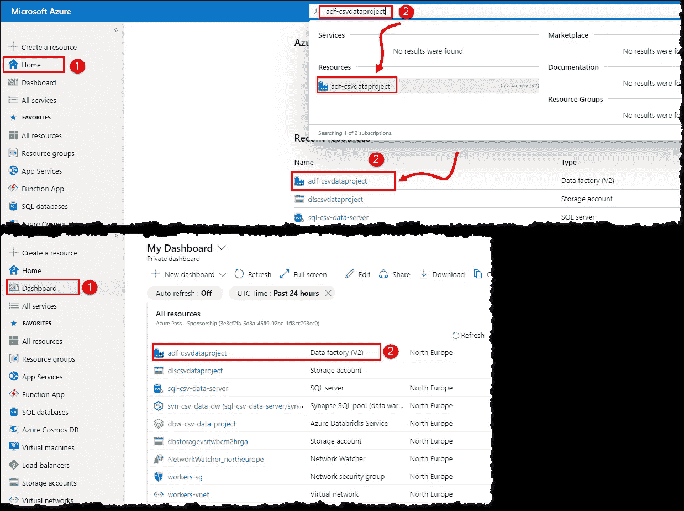

Azure 门户:定位资源(图片由作者提供)

# 设置数据工厂组件

在**概述**页面上选择**作者&监视器**，以在新的浏览器选项卡中加载我们的数据工厂实例。切换到下一个标签页(我们的数据工厂),在左上角的菜单中选择**管理**。让我们从创建链接服务开始，告诉数据工厂我们的资源在哪里。

# 链接服务

> *链接服务就像连接字符串，它定义了数据工厂连接外部资源所需的连接信息。*

我们需要创建两个链接的服务，第一个告诉数据工厂我们的数据源(即 GitHub)以及如何连接到它。我们需要提供 HTTP 地址( **Raw** 没有文件名的存储库 URL)作为**基 URL**(https://Raw . githubusercontent . com/CSSEGISandData/新冠肺炎/master/csse _ covid _ 19 _ data/csse _ covid _ 19 _ daily _ reports/)。遵循以下步骤:

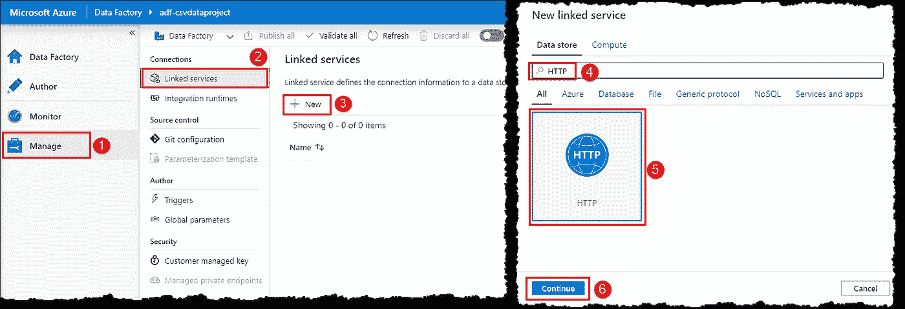

Azure 数据工厂:创建链接服务(图片由作者提供)

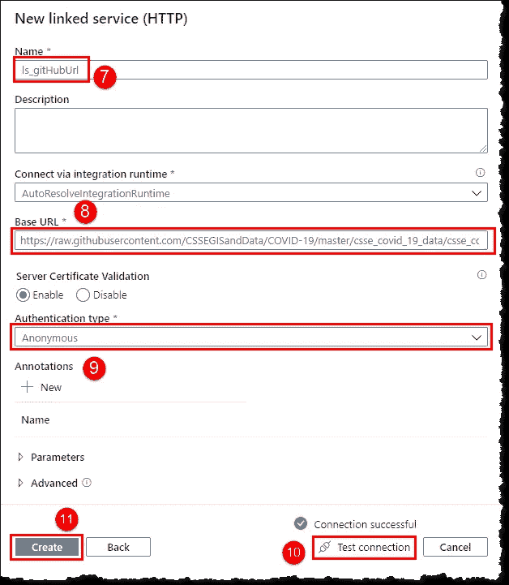

Azure 数据工厂:创建 HTTP 链接服务(图片由作者提供)

第二个链接的服务告诉我们的数据工厂数据目的地(即存储帐户)。创建一个新的链接服务，在**新链接服务**刀片上搜索**存储**，从匹配的资源列表中选择 **Azure Data Lake Store Gen2** ，点击**继续**。从下拉列表(4)中选择正确的存储帐户。

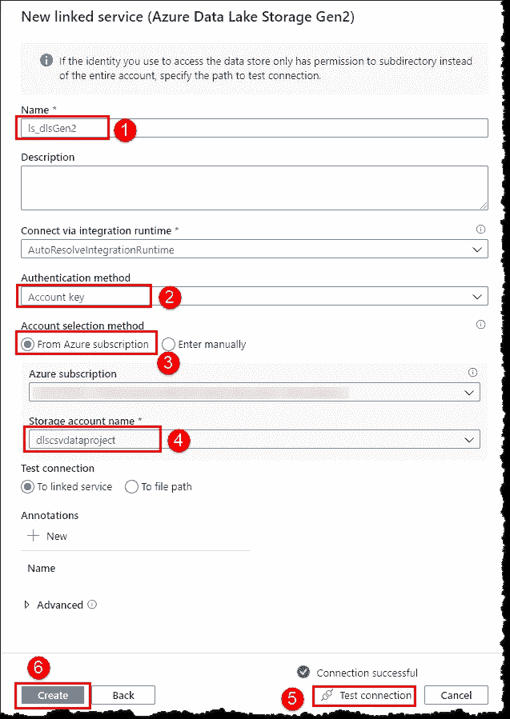

Azure 数据工厂:创建存储链接服务(图片由作者提供)

此时，您的屏幕应该如下所示。点击**发布所有**以保存您的更改，即保存。点击**上的**发布**发布所有**刀片，等待展开完成；可能需要几秒钟。

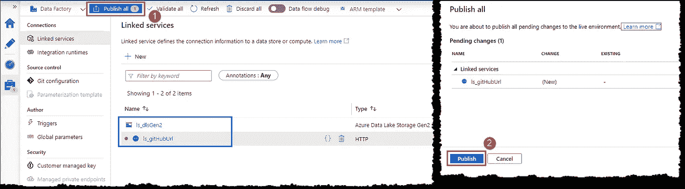

Azure 数据工厂:发布更改(图片由作者提供)

接下来，我们需要创建数据集来告诉我们的数据工厂使用什么数据及其格式。我们需要创建两个数据集链接到我们的两个链接服务。

# 数据集

> 数据集是数据的命名视图，它简单地指向或引用我们想要在活动中用作输入和输出的数据。数据集表示不同数据存储中的数据，可通过链接服务访问。

在左上角菜单中选择**作者**，在**工厂资源**刀片上找到**数据集**，点击显示的数字。选择**新数据集**并按照步骤创建我们的第一个数据集来表示我们的 GitHub 数据。

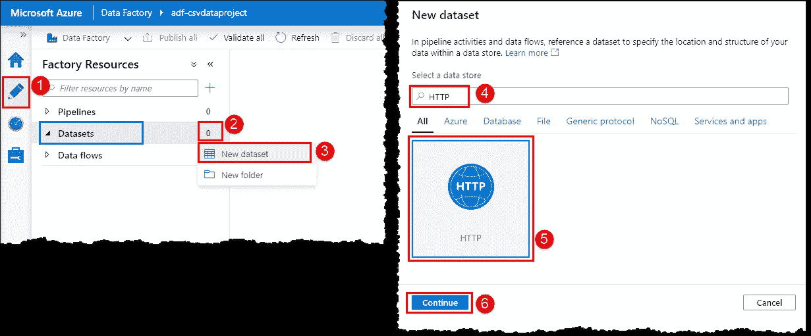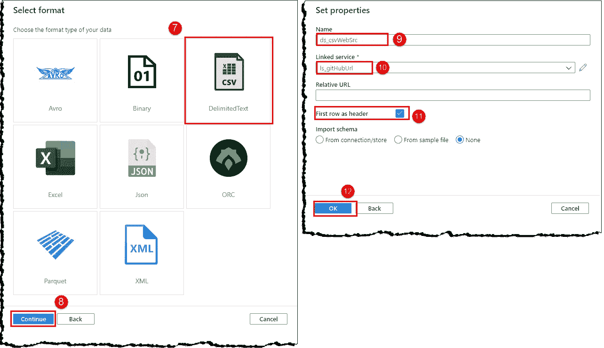

Azure 数据工厂:创建数据集(作者图片)

我们的新数据集将打开，显示进一步配置和定义我们的数据结构的选项。注意，**连接**选项卡下的**基本 URL** 填充了我们在链接服务中提供的原始文件夹 URL。我们的数据位于文件 URL，因此我们需要为数据工厂提供绝对 URL 来消费数据。我们将使用**相对 URL** 字段来导出文件的完整 URL(基本 URL +相对 URL)。然而，我们希望我们的管道获取多个文件；因此，我们将使用一个参数动态生成文件名，而不是提供一个简单的文件名。

> 我们可以使用参数将**外部**值传递到管道、数据集、链接服务和数据流中。通过参数化资源，我们可以每次用不同的值重用它们。
> 
> 参数**设置**用于管道运行的整个持续时间。它们就像编程语言中的常量一样，定义在源代码的顶部。

切换到**参数**选项卡，点击 **+ New** 创建一个新参数。如下所示设置字段；我们使用第一个 CSV 文件的名称作为默认值。切换到**连接**页签，将**相对 URL** 设置为`@dataset().fileName` *。*

*语法引用数据集参数:* `@dataset().PARAMETER_NAME`

我们可以使用正确的语法键入参数名称，或者使用**添加动态内容**刀片来填充它(5–7)。

> Azure 数据工厂中的动态内容使用表达式语言。

*延伸阅读:*

[](https://docs.microsoft.com/en-us/azure/data-factory/control-flow-expression-language-functions) [## Azure 数据工厂中的表达式和函数——Azure 数据工厂

### 适用于:Azure 数据工厂 Azure Synapse Analytics(预览版)本文提供了有关表达式和…

docs.microsoft.com](https://docs.microsoft.com/en-us/azure/data-factory/control-flow-expression-language-functions) 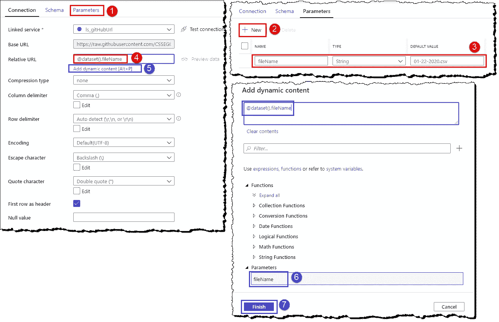

Azure 数据工厂:创建和引用数据集参数(作者图片)

创建一个新的数据集来表示我们的存储帐户中的数据。遵循前面提到的步骤(在**新数据集**刀片上搜索**Azure Data Lake Storage gen 2**而不是 HTTP)。您的新数据集应该如下所示；发布所有更改，使它们可以在我们的数据工厂中使用。

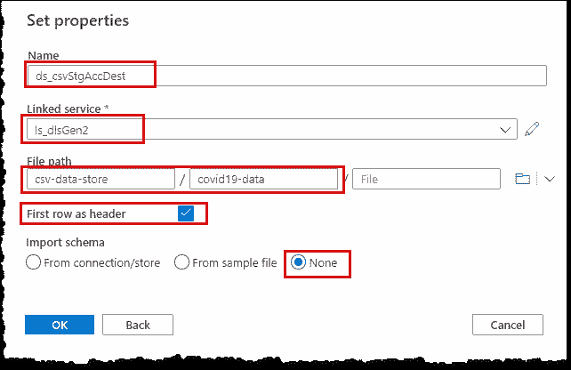

Azure 数据工厂:创建数据集(作者图片)

既然我们已经满足了建立数据工厂的要求，那么是时候创建一个执行实际任务的管道了。让我们从从**工厂资源**刀片创建一个新管道开始(类似于创建一个新数据集)。

# 管道

为您的新管道命名，并在**变量**选项卡中创建两个类型为 string 和 01–22–2020 的变量(I 和 j)作为默认值**。**

> 变量可以在管道开始时设置，并在运行过程中读取和修改。变量在运行时包含实值，可以赋给参数。
> 
> 它们就像编程语言中的常规变量**。**

**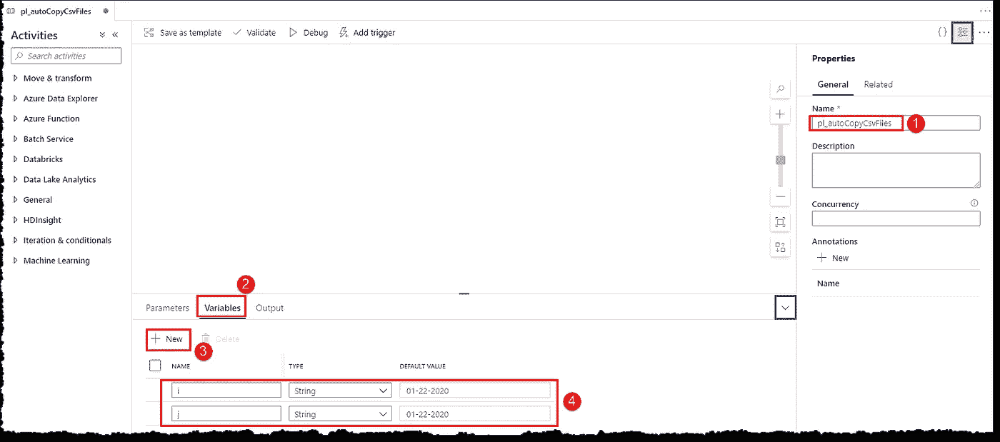**

**Azure 数据工厂:使用变量设置管道(图片由作者提供)**

# **活动**

**是时候将活动添加到我们的渠道中了；所有活动都可以在**活动**刀片上进行。我们将使用以下活动:**

*   **[获取元数据](https://docs.microsoft.com/en-us/azure/data-factory/control-flow-get-metadata-activity):获取我们商店中存在的所有 CSV 文件的列表。最初，这将返回 null，因为我们的存储中还没有文件。该输出将作为下一个*设置变量*活动的输入。**
*   **[设置变量](https://docs.microsoft.com/en-us/azure/data-factory/control-flow-set-variable-activity) (1):用我们存储的最新文件名设置我们的变量 *i* 。最初，这将使用变量 *j* 的默认值(即 01–22–2020)设置 *i* ，因为从*获取元数据*活动的输入将为空。计算输出(变量 *i* )将作为下一个*的输入，直到*活动。**
*   **[直到](https://docs.microsoft.com/en-us/azure/data-factory/control-flow-until-activity):生成从最近可用文件日期到今天的文件名，输入值 *i* 将作为开始日期，今天-1 将作为结束日期。生成的输出(变量 *i* )将作为下一个*复制数据*子活动的输入。**
*   **[复制数据](https://docs.microsoft.com/en-us/azure/data-factory/copy-activity-overview):通过 HTTP 复制实际的文件并存储到我们的存储器中。从*到* activity(变量 *i* )的输入将被传递给我们的源数据集的参数 *fileName，*完成我们到原始 CSV 文件的 URL。该文件将通过 HTTP 访问，并保存到我们的存储。成功端将连接到我们的下一个*设置变量*活动。**
*   **设置变量(2 & 3):为下一次迭代增加变量 *i* 。我们需要两个设置变量活动，因为我们不能引用在**值**字段中设置的变量；因此，我们将使用变量 *j* 作为中间变量来增加 *i* 。**

## **获取元数据**

**在**常规**类别下找到**获取元数据**，将其拖放到画布上。给它一个名字并继续，如下所示。**

***语法引用获取元数据活动的输出:* `@{activity('GET_METADATA_ACTIVITY_NAME').output.FIELD_NAME}`**

**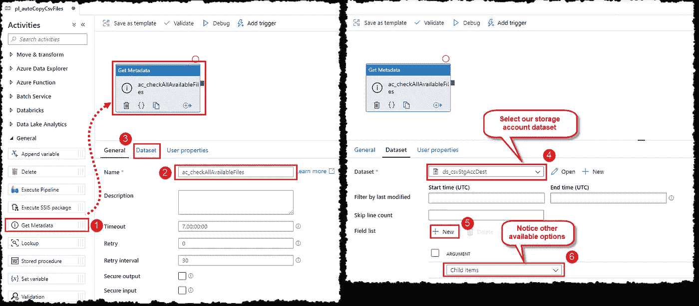**

**Azure 数据工厂:获取元数据活动(图片由作者提供)**

## **设置变量(1)**

**在**常规**类别下找到**设置变量**，将其拖放到画布上。将其与获取元数据活动的**成功**(绿色)结束连接。给它一个名字，并如下设置变量 *i***

```
@if(empty(last(activity('ac_checkAllAvailableFiles').output.childItems)),variables('j'),formatDateTime(addDays(formatDateTime(replace(last(activity('ac_checkAllavailableFiles').output.childItems).name,'.csv',''),'MM-dd-yyyy'),1),'MM-dd-yyyy'))
```

**点击**值**字段可以打开**添加动态内容**刀片；您可以键入或复制粘贴上面的表达式，或者使用 blade 的控件来创建表达式。**

**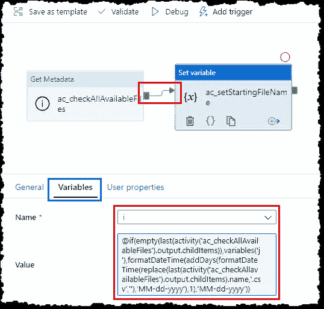**

**Azure 数据工厂:设置变量活动(图片由作者提供)**

## **直到**

**将**定位到**迭代&条件**类别下的**处，将其拖放到画布上，并将其与之前设置的变量活动的成功结束连接。给它一个名字；在**设置**选项卡中，输入以下**表达式**:**

```
@greater(dayOfYear(formatDateTime(variables('i'),'MM-dd-yyyy')),dayOfYear(subtractFromTime(utcnow(),1,'Day')))
```

**移至**活动**选项卡，点击编辑图标添加其余活动。我们将在中添加其他活动*，直到我们需要多次执行它们。单击编辑图标将显示一个空画布，表示我们现在正在向 Until 活动中添加要迭代的活动。***

**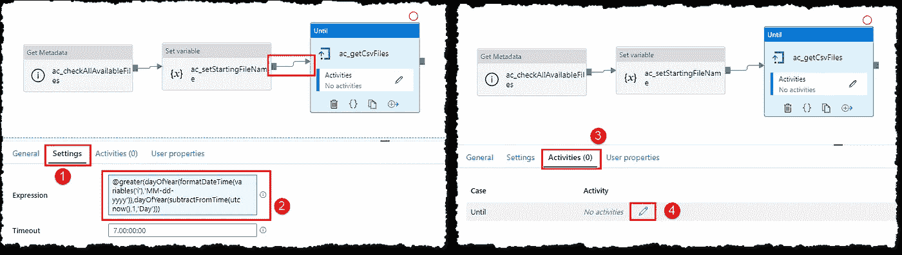**

**Azure 数据工厂:直到活动(图片由作者提供)**

## **复制数据**

**在**移动&变换**类别下找到**复制数据** a，将其拖放到画布上。给它命名，设置**源**和**宿**标签配置，如图所示。我们将用变量 *i* 给**文件名**参数赋值。下面是**文件名**表达式，方便复制粘贴:)**

```
@concat(formatDateTime(variables('i'),'MM-dd-yyyy'),'.csv')
```

**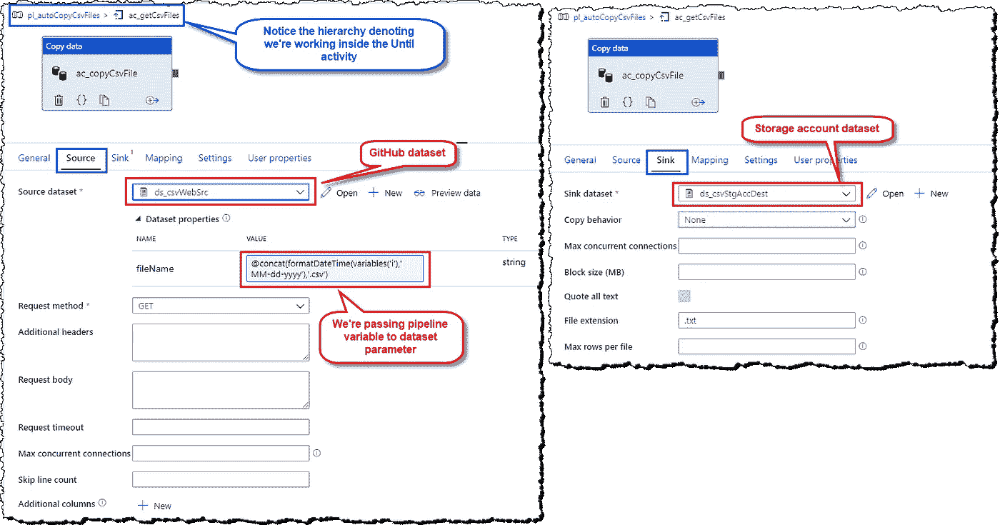**

**Azure 数据工厂:用参数复制数据活动(图片由作者提供)**

## **设置变量(2 和 3)**

**添加另一个**设置变量**活动。将其与**复制数据**活动的 s *成功*结束连接。给它一个名称，并将变量 *j* 设置为**

```
@addDays(formatDateTime(variables('i'),'MM-dd-yyyy'),1)
```

**添加另一个设置变量活动，并将其与前一个设置变量活动的*成功*结束连接。将 *i* 设为`@variables('j')`**

**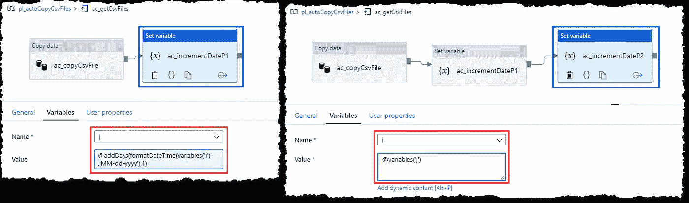**

**Azure 数据工厂:递增参数值(图片由作者提供)**

**我们的管道现在已经准备好了；它应该看起来像下面这样。此外，出于任何故障排除的目的，您可以参考本文末尾来自 GitHub 的我们管道的 JSON。**

**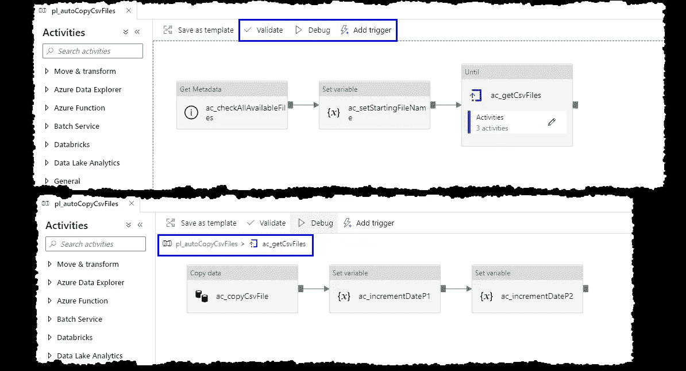**

**Azure 数据工厂:通过 HTTP 复制文件的管道**

**添加所有活动后的下一步是验证我们的管道。找到并选择 **Validate** 选项，以确保我们的管道没有错误并准备好执行。管道**验证输出**刀片将向我们显示验证的结果。**

**我们有两种选择来运行我们的管道和看到我们的劳动成果。我们可以调试运行我们的管道而不发布我们的更改，或者我们可以先发布我们的更改。建议**先调试**运行管道，然后发布更改；调试运行在管道的**输出**选项卡中显示 us 日志和其他有用的跟踪信息。花几分钟时间浏览输出日志，以清楚地了解执行和各种活动。示例输出如下所示。**

****

**Azure 数据工厂:典型的调试管道输出(图片由作者提供)**

**您还可以使用 **Add trigger** 选项立即运行管道，或者设置一个自定义触发器，以特定的间隔、时间或基于外部事件运行管道。**

## **管道 JSON**

# **结论**

**我们提出了一个通过使用 URL 在 HTTP 上复制数据的引人注目的问题。我们讨论了构成管道的各种组件，并建立了一个创新的数据工厂管道来解决手头的问题。我们还讨论了如何设置管道的自动执行，以及管道执行日志的简要概述。**

# **后续步骤**

**如果您正在关注我们关于将 CSV 数据转换为 Power BI 视觉效果的系列文章，请阅读我们的下一篇文章，继续使用 PySpark 清理和转换 Azure Databricks 中的数据。**

**[](https://medium.com/@dhyanintech/cleansing-and-transforming-schema-drifted-csv-files-into-relational-data-in-azure-databricks-519e82ea84ff) [## 在 Azure Databricks 中将模式漂移的 CSV 文件清理并转换为关系数据

### 使用 PySpark 处理模式漂移文件并将其加载到 Azure Databricks 中的 Azure Synapse Analytics 数据仓库

medium.com](https://medium.com/@dhyanintech/cleansing-and-transforming-schema-drifted-csv-files-into-relational-data-in-azure-databricks-519e82ea84ff) 

如果您试图在您的数据工厂管道中添加和执行 Databricks 笔记本，我们有完美的东西向您展示。

[](https://medium.com/@dhyanintech/executing-azure-databricks-notebook-in-azure-data-factory-pipeline-using-access-tokens-3326b8703432) [## 使用访问令牌在 Azure 数据工厂管道中执行 Azure Databricks 笔记本

### 关于如何使用 Azure Key Vault 安全访问在数据工厂管道中添加和执行 Databricks 笔记本的指南…

medium.com](https://medium.com/@dhyanintech/executing-azure-databricks-notebook-in-azure-data-factory-pipeline-using-access-tokens-3326b8703432) 

## 喜欢这个帖子？与 Dhyan 联系

让我们做朋友吧！你可以在 [LinkedIn](https://www.linkedin.com/in/dhyans/) 上找到我或者在 [Medium](https://dhyanintech.medium.com/membership) 上**加入**我。**