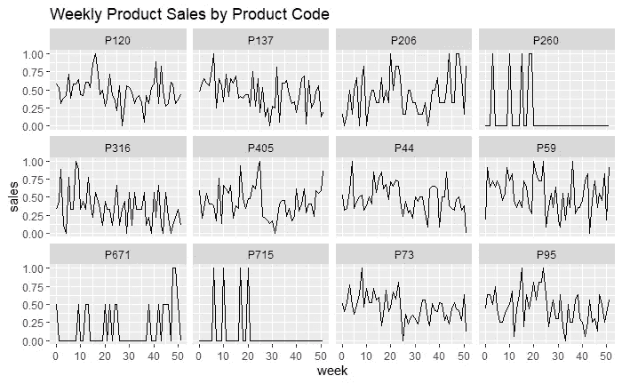
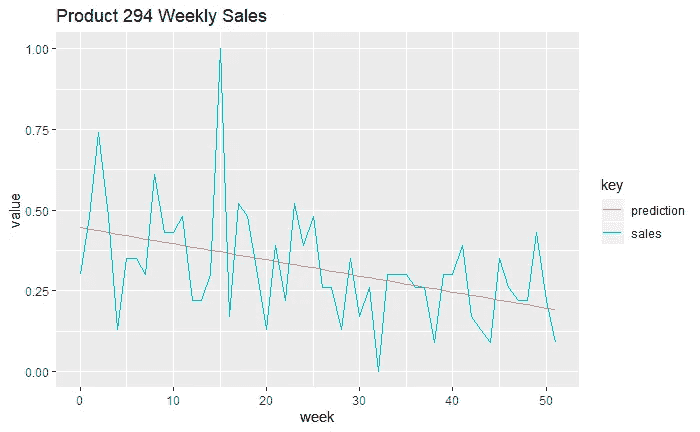
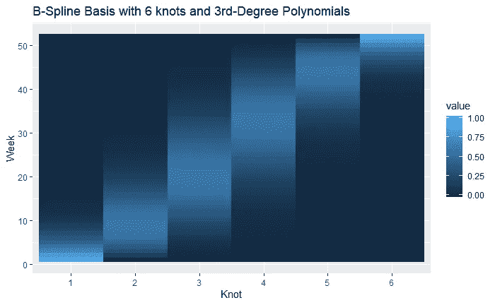
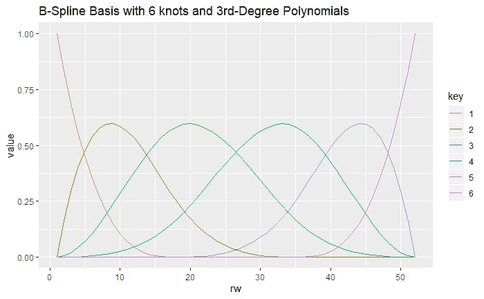
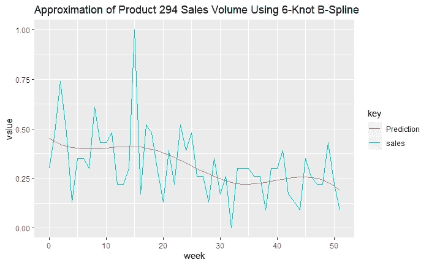
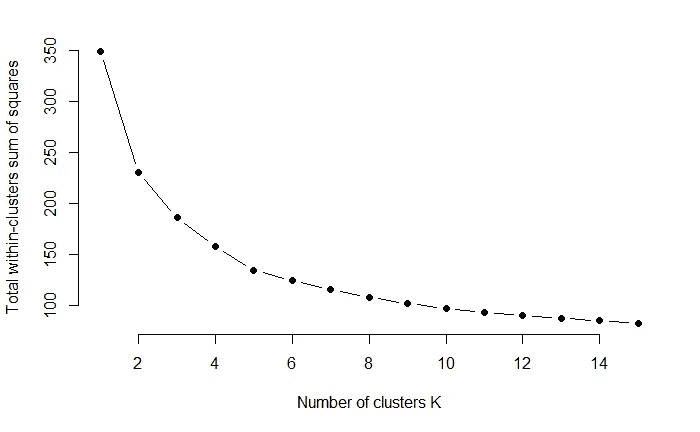
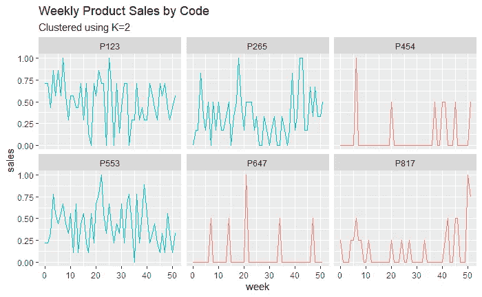
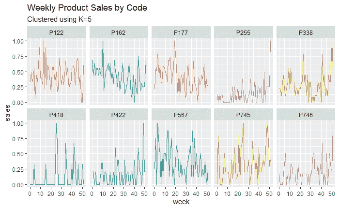
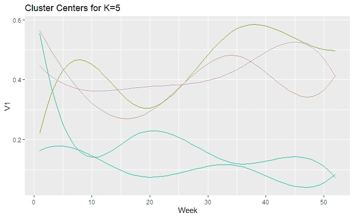

# 用 B 样条和 K 均值聚类时间序列

> 原文：<https://towardsdatascience.com/using-b-splines-and-k-means-to-cluster-time-series-16468f588ea6?source=collection_archive---------35----------------------->

## 在时间序列数据中寻找趋势变得更加容易

斯蒂芬·道森在 [Unsplash](https://unsplash.com?utm_source=medium&utm_medium=referral) 上拍摄的照片

电子商务中的数据科学家不断发现自己在查看时间序列数据。在某些情况下，我们分析单个时间序列并开发预测模型。但是在*的其他案例中*我们正在回顾成千上万的时间序列，并试图找出有趣的模式。

处理一组时间序列可能会很尴尬。它们很难以有意义的方式聚集在一起。然而，使用 B 样条，我们可以简化我们的时间序列，更容易地进行探索性数据分析。

## 现实生活中的例子

假设您是一家大型在线零售商的数据科学家，您的任务是识别产品销售趋势。你可能会得到一个类似于[的数据集，这个数据集在 UCI 知识库](https://archive.ics.uci.edu/ml/datasets/Sales_Transactions_Dataset_Weekly)中。它包含 811 种不同产品的 52 周销量。让我们来看看随机抽样的产品及其标准化销售量:

一个趋势很明显。大多数产品经历了相对稳定的销售，而 3 个产品经历了零星的高峰。在这些时间序列中可能隐藏着其他趋势，但试图通过人工检查来发现它们将是非常耗时和无聊的。

我们可以通过 k-means 等无监督的机器学习算法来运行这些数据，但我们的结果可能会过度拟合。此外，**重要的不仅仅是每周时间序列的值，还有相对的上下移动**，这不会被这个表示所捕获。

因此，我们需要一种方法来以简洁的方式表示我们的时间序列，这种方法不仅可以捕获每周序列的绝对值，还可以捕获形状。这就是 B 样条的用武之地。

# 什么是 B 样条？

b 样条是一种通过使用多项式的分段组合来近似非线性函数的方法**。在深入研究 b 样条之前，让我们先来看看数据集中的单个时间序列，并尝试用线性回归模型对其进行拟合:**

虽然**线性回归捕捉到了总体下降趋势，但它过度简化了系列**中的模式。想象一下，如果不是一个线性回归，我们拟合两个回归模型，一个用于系列的前半部分，另一个用于后半部分。这可能会有所帮助。现在想象一下，如果我们拟合 52 个不同的回归模型，每个模型都适用于系列中特定的一周。虽然这个模型肯定会过度拟合，但它在描述原始系列方面做得很好。

在适合一个模型和适合 52 个模型之间可能有一个中间地带。**这是 b 样条背后的思想——拟合一系列局部模型。**

## 创建 B 样条逼近

b 样条有两个组成部分，一个基和系数。基础决定了超参数:使用多少个局部模型(称为结)以及在每个模型中使用什么次数的多项式。然后将系数乘以这个基数，以逼近原始数据。

b 样条基是一个对角矩阵，有 52 行——系列中的每个时间段一行，每个局部模型一列。我们可以创建一个 b 样条基，它使用 6 个局部模型或节点，并使用三次多项式，代码如下:

如果我们使用热图绘制该矩阵的值，我们会得到如下结果:

**矩阵中的每一列都有唯一的非零值区间**，这些区间共同覆盖了整个矩阵**。因此，通过将矩阵中的每一列乘以不同的系数，我们将能够控制局部区间上近似的形状。下面是我们的 B 样条基的另一种表示。**

通过使用不同的权重或系数组合这六个多项式，我们可以得到原始时间序列的非线性估计。我们可以使用最小二乘估计来获得最佳拟合系数。

这是一个比我们最初的线性回归好得多的近似值。接下来，让我们看看如何使用 b 样条来执行无监督学习。

# B 样条聚类

上述 b 样条可以用 6 个系数来表示。想象一下，如果我们为原始数据集中的所有 811 个时间序列创建一个 b 样条近似。我们将有一个 811x6 的矩阵，比我们原来的 811x52 数据集维数低得多。

通过用不同的 K 值运行 K-means，我们看到对于 K 有几个好的选择，但是为了简单起见，让我们坚持 K=2

现在，让我们从原始时间序列中随机抽取一个样本，看看它们是如何用 K=2 进行聚类的

正如我们最初通过眼睛发现的，**K-意味着区分具有持续销售的产品和具有大量零星峰值的产品**。通过选择不同的 K 值，我们还可以识别时间序列中的不同趋势。我们来看看 K=5

此外，我们可以将我们的聚类的质心乘以基数，以查看每个聚类的平均时间序列。

# 摘要

B 样条提供了一种仅用少量数据点来表示时间序列的有效方法。当我们试图聚集数百、数千或数百万个时间序列时，这就很方便了。

在这个例子中，我们使用 b 样条来执行分割。我们发现了有趣的相似点和时间序列片段，可以用来为产品决策提供信息。但是相同的 b 样条近似也可以用于分类或回归。

# 参考和链接

[1] Github 完整代码在 R[https://Github . com/RoryMichelen/Medium-Articles/blob/master/Clustering _ w _ B _ splines . rmd # L42-L56](https://github.com/RoryMichelen/Medium-Articles/blob/master/Clustering_w_B_Splines.rmd#L42-L56)

[2]数据集:[https://archive . ics . UCI . edu/ml/datasets/Sales _ Transactions _ Dataset _ Weekly](https://archive.ics.uci.edu/ml/datasets/Sales_Transactions_Dataset_Weekly)