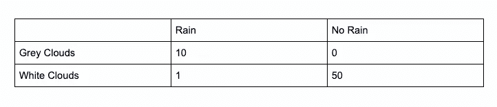
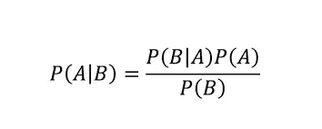

# 利用贝叶斯分类器检测假新闻

> 原文：<https://towardsdatascience.com/using-bayesian-classifiers-to-detect-fake-news-3022c8255fba?source=collection_archive---------24----------------------->

## 有如此多的假新闻在流传，很难找到准确和未经捏造的消息来源。


照片由联合国新冠肺炎办事处通过联合国日内瓦办事处回应

有如此多的假新闻在流传，很难找到准确和未经捏造的消息来源。本文旨在使用朴素贝叶斯分类器对真假新闻进行分类。

# 什么是朴素贝叶斯分类器:

朴素贝叶斯分类器是一种确定性算法，它使用贝叶斯定理对数据进行分类。让我们看一个例子:

假设您想要预测今天下雨的概率:在过去的几天里，您通过观察天空中的云收集了数据。这是你的数据表:



此表显示了在下雨或不下雨的情况下，某个要素出现的次数。我们所拥有的实际上是一个包含下雨概率的表格，假设出现了灰色的云或白色的云。

现在有了数据，我们来做个预测。今天我们看到了灰色的云和没有白色的云，它更可能是一个雨天还是一个晴天？要回答这个问题，我们必须使用贝叶斯定理:



这个定理利用过去的数据做出更好的决策。

假设有灰色云，下雨的概率等于下雨的概率，乘以下雨的概率，除以灰色云出现的概率。

根据我们的数据:

P(B|A)(下雨的概率，给定灰色云)= 10/11

P(A)(下雨的概率)= 11/50+11 = 11/66 = 1/6

P(B)(灰色云的概率)= 1(灰色云已确认出现)

P(A|B) = P(B|A) * P(A) / P(B)

P(A|B) = 10/11 * 1/6 / 1

P(A|B) = 10/66

这是我们的结果！假设出现了灰色的云，下雨的概率是 10/66，也就是说，在 66 种不同的概率中，情景相同的情况下，有 10 种会下雨。

# 该项目:

简单介绍了朴素贝叶斯分类器之后，让我们来谈谈用朴素贝叶斯分类器检测假新闻。

假设新闻是假的，我们将统计一个词在标题中出现的次数。把它变成一个概率，然后计算标题是假的概率，与标题是真的相比。

我使用的数据集有超过 21，000 条真实新闻和 23，000 条假新闻。对于正常的数据集来说，这可能看起来不平衡，但这种不平衡对于计算初始概率是必要的:这是一个标题是假的概率，而不考虑它是什么。你可以联系我在 victorwtsim@gmail.com 的数据集。

## 代码:

```
import pandas as pd
import string
```

这是该程序的三个依赖项:pandas 用于读取 csv 文件，string 用于处理单词的大小写。

```
true_text = {}
fake_text = {}true = pd.read_csv('/Users/XXXXXXXX/Desktop/True.csv')
fake = pd.read_csv('/Users/XXXXXXXX/Desktop/Fake.csv')
```

这个脚本将读取两个数据集，其中包含假新闻和真新闻的实例。

```
def extract_words(category,dictionary):
    for entry in category['title']:
        words = entry.split()
        for word in words:
            lower_word = word.lower()
            if word in dictionary:
                dictionary[lower_word] += 1
            else:
                dictionary[lower_word] = 1
    return dictionary
```

假设标题是假新闻，这个脚本计算一个单词出现的次数，并在字典中为每个单词出现的次数加一。

```
def count_to_prob(dictionary,length):
    for term in dictionary:
        dictionary[term] = dictionary[term]/length
    return dictionary
```

该函数通过计算假新闻标题或真实新闻标题的总字数，将数字转换为概率。

```
def calculate_probability(dictionary,X,initial):
    X.translate(str.maketrans('', '', string.punctuation))
    X = X.lower()
    split = X.split()
    probability = initial
    for term in split:
        if term in dictionary:
            probability *= dictionary[term]
            print(term,dictionary[term])
    return probability
```

该函数将相关概率相乘，计算出标题的“分数”。要进行预测，请比较使用假新闻和真实新闻词典时的得分。如果假新闻字典返回更高的分数，则该模型已经预测该标题是假新闻。

```
true_text = extract_words(true,true_text)
fake_text = extract_words(fake,fake_text)true_count = count_total(true_text)
fake_count = count_total(fake_text)true_text = count_to_prob(true_text,true_count)
fake_text = count_to_prob(fake_text,fake_count)total_count = true_count + fake_count
fake_initial = fake_count/total_count
true_initial = true_count/total_count
```

这个脚本使用上述所有函数为每个单词创建一个概率字典，然后计算标题的“分数”。

```
X = 'Hillary Clinton eats Donald Trump'
calculate_probability(fake_text,X,1)>calculate_probability(true_text,X,1)
```

这个最终脚本评估标题:“希拉里·克林顿吃了唐纳德·特朗普”，以测试模型。

```
True
```

该模型输出 True，因为标题显然是假新闻。

# 您可以改进我的计划的地方:

我创建这个程序作为一个框架，以便其他人可以对它进行改进。以下是一些你可以考虑的事情:

*   考虑短语和单词

一个单词本身没有意义，但是一个短语可以让我们更深刻地了解新闻是否是假的

*   通过网络搜集获得更大的数据集

网上有很多真新闻和假新闻的来源，你只需要找到它。