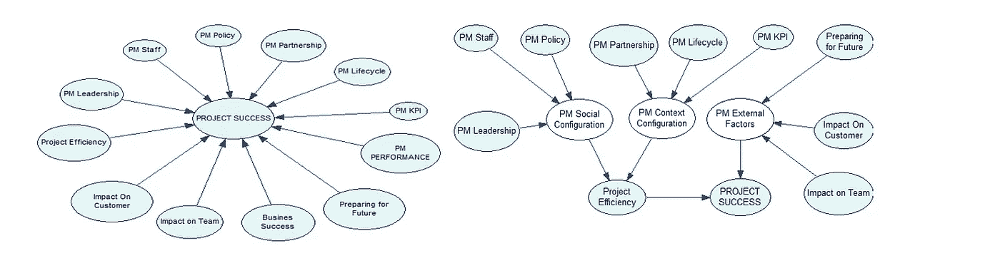
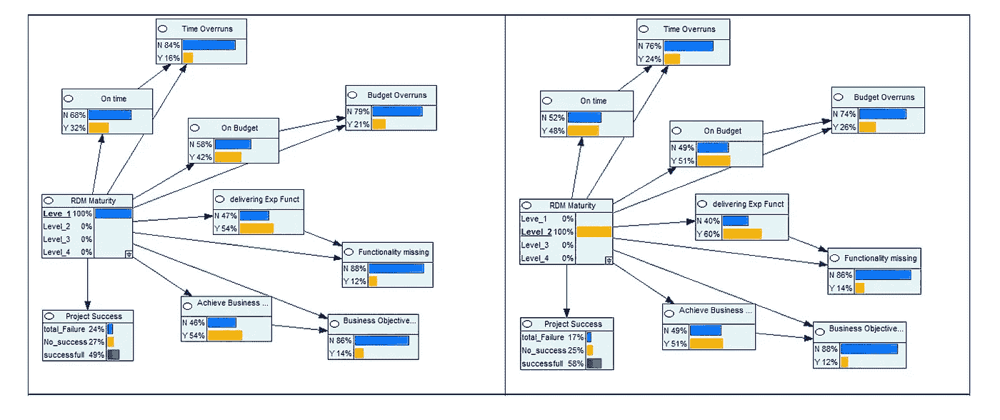
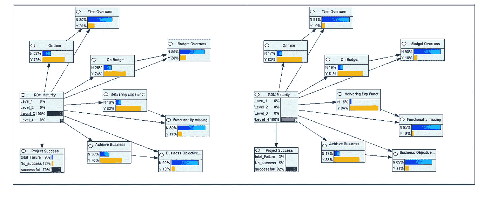
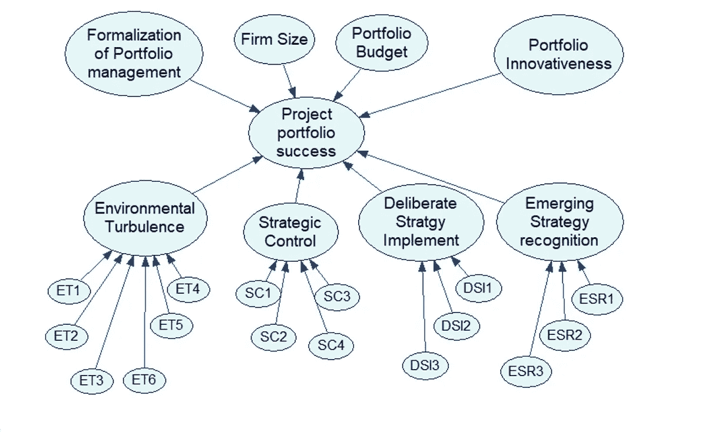
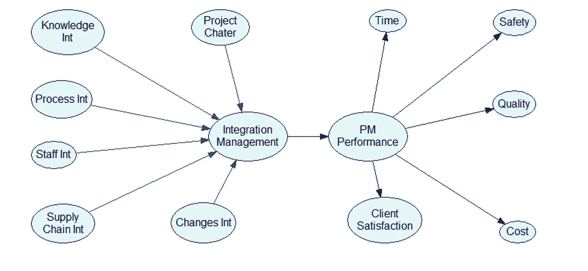
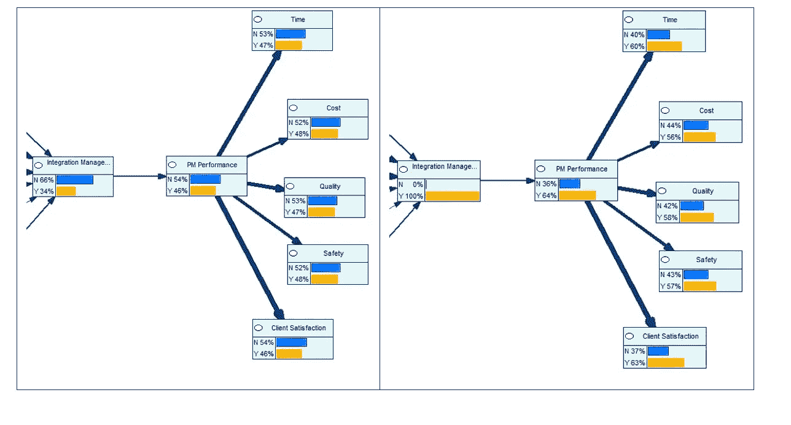
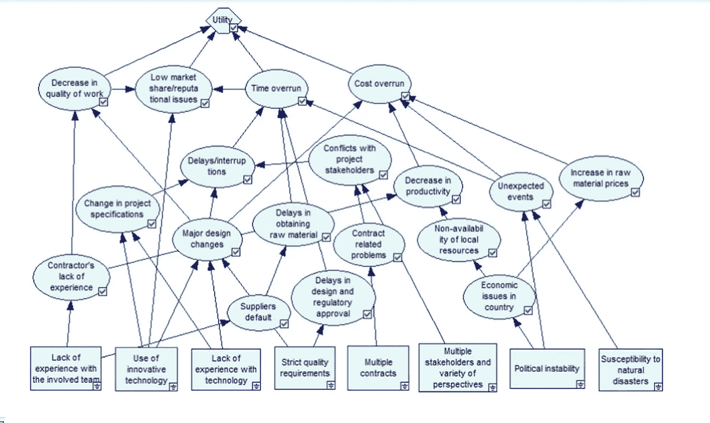

# 构建贝叶斯网络的主要启发式方法——项目管理评估实例

> 原文：<https://towardsdatascience.com/using-bayesian-networks-for-project-management-evaluation-13a6eda50605?source=collection_archive---------25----------------------->

[安德鲁·尼尔](https://unsplash.com/@andrewtneel?utm_source=unsplash&utm_medium=referral&utm_content=creditCopyText)在 [Unsplash](https://unsplash.com/s/photos/project-management?utm_source=unsplash&utm_medium=referral&utm_content=creditCopyText) 上拍照

这篇文章展示了五篇论文的工作，其中项目管理度量与项目性能度量相关。[我们使用在那些论文上发现的数据建立了贝叶斯网络(BN)](/will-you-become-a-zombie-if-a-99-accuracy-test-result-positive-3da371f5134) ，并且我们在前面描述的标准下评估了结果网络。完成这项工作是因为我们想了解如何使用贝叶斯网络对项目管理系统建模，我们想知道哪些是最常见的限制，以及我们可以从以前的工作中获得哪些见解，目的是开发一个新的模型。

这不是对这些作品内容的批评，而是对这些研究在试图根据它们的信息来阐述 BN 时是如何有限的批评。在本节中，我们基于可靠的科学文献探索模型语义的重要性，并使用合格标准来确定构建真实贝叶斯网络的规则。

# 第一个限制:缺乏合成节点和概念结构

我们考虑的第一篇论文题为***探索项目管理的价值:将项目管理绩效与项目成功***(Mir&Pinnington，2014) **。**为了实现这一目标，Mir 和 Pinnington 根据不同领域确定了关键项目的成功驱动因素。这些驱动器对应于 BN 的输入数据。此外，作者有一个抽样数据库，其中包括 4 周内收到的 154 份回复。****

****我们可以通过选择具有中枢特征的 BN 来模拟 Mir 和 Pinnington 的研究(图 1)。在提出的因果模型中，没有合成节点。使用该 BN 的局限性来自于将标准视为从原因节点到项目成功节点的相互依赖因素的基本假设。使用该网络的主要限制来自于计算“*项目成功*节点的 CPT 所需的组合数量。这个数字可能太大，无法使模型足够精确。例如，如果每个节点有两种状态(真/假),项目成功节点将需要 4，096 个值来完成其 CPT。如果每个节点有五个状态，就需要 2.44 亿个值！该 BN 将失去其效用，因为完成“项目成功”节点的 CPT 所需的组合数量可能太大而不够精确。****

********

******图一。** BN 基于 Mir & Pinnington 的/提议的带有合成节点的 BN。****

****这些原因解释了为什么我们建议使用合成节点。在这篇文章中，我解释了更多关于合成节点的内容:****

**** [## 贝叶斯网络和合成节点

### 在这篇文章中，我给出了一个更正式的观点，并讨论了建模的一个重要元素:合成节点。

towardsdatascience.com](/bayesian-networks-and-synthetic-nodes-721de16c47e2) 

这些节点减少了目标节点的 CPT 大小，提高了因果关系可视化的质量。图 1(右侧)对应于我们的建议；它显示了一个基于合成节点的 BN，该 BN 可以替换同一图的左图中显示的网络。如果网络中的每个节点有两个状态，引入合成节点后，“项目成功”节点的 CPT 将有 4 个值要计算，“项目管理社会配置”节点有 8 个值，“项目管理环境配置”节点有 4 个值，“项目管理因素”节点有 8 个值，这意味着总共有 24 个值，而不是 4096 个值。

之后，我们根据这篇文章之前定义的标准，基于这项研究完成了对 Mir 和 Pinnington 的 BN 的简短批评:

 [## 贝叶斯网络中的超参数调整问题

### 在这段历史中，我们讨论了在基于贝叶斯理论建立模型时要考虑的结构标准

towardsdatascience.com](/the-hyperparameter-tuning-problem-in-bayesian-networks-1371590f470) 

**1 —确保语义一致性**:由于每个节点没有具体的可测量输入，专家可能会曲解几个变量。例如，如何知道被评估组织的 PM 策略的水平？

**2 —调整网络的完备性:** Mir 和 Pinnington 的 BN 并不专注于项目管理的某个特定领域，但它汇集了各种概念。不可能确保网络包含了最重要的变量，也不可能揭示它们之间最重要的关系。作者在谈到其工作的局限性时强调了这一点:*“(……)之前的工作也表明，项目成功的认知受到各种* ***和其他与项目环境相关的*** *因素的影响，例如，项目风险，或合同类型的选择”* (Mir & Pinnington，2014)。

**3 —保证结果的相关性:**目标节点上的准确度和精确度之间的权衡很大程度上受研究中描述的方差的影响:*“众所周知，除了 PM 性能之外，其他因素也会影响项目的成功。事实上，45%的差异(如多元回归分析的最佳拟合模型所示)可以通过 PM 性能结构来解释，而 55%的差异仍然无法解释。”*(米尔&平宁顿，2014) **。**

**4 —限制组合爆炸:**由于目标节点依赖于几个输入，因此馈送网络所需的数据量太大。然而，original Mir 和 Pinnington 的 BN 代表了一个很好的例子，说明[引入合成节点如何能够大幅减少](/bayesian-networks-and-synthetic-nodes-721de16c47e2)训练编码模型的计算机所需的信息量。

**5 —保证学习质量:** Mir 和 Pinnington 的 BN 是从一个数据库中构建的，该数据库来自一个抽样，包括在 4 周内收到的 154 份回复。然而，该信息不能被组织在具有允许学习所有 CPT 的结构的数据库中。对于这个网络，不可能测量学习的质量，进行训练/测试比率或使用其他测试指标。

总之，这个例子显示了语义结构和所需数据量之间的关系。本研究展示了引入合成节点如何减少 CPT 计算的示例，这些节点是必要的，但不足以构建满足资格标准的网络。

# 第二个限制:状态数不正确。

我们的下一项研究涉及一篇名为“*量化大型业务应用程序开发中需求定义和管理过程成熟度对项目结果的影响”* (Ellis & Berry，2013) **。**作者定义了需求成熟度和项目运营绩效的不同度量之间的相关性。

我们的首要任务是恢复信息，以便创建一个 BN 来重现 Ellis 和 Berry 的结果。建议的网络有十三个输入，一个中间节点(需求成熟度)和五个输出。我们根据这项研究构建的网络分为两部分。第一个揭示了影响需求成熟度的几个因素(图 2)。

图二。根据(Ellis & Berry 2013)与项目成功的相关因素设计的 BN。

Ellis 和 Berry 论文的第二部分展示了需求成熟度如何影响项目绩效的不同度量(图 3)。

图 3 RDM 成熟度和成功指标

我们在这项研究的基础上，按照本文前面[定义的标准，完成了对埃利斯和贝里的网络的简短批评:](/the-hyperparameter-tuning-problem-in-bayesian-networks-1371590f470)

**1 —确保语义一致性:**他们的 BN 表示需求工程专家选择的标准。这些标准并不详尽，但它们可能与目标相关。

**2 —网络的完整性:** Ellis 和 Berry 选择了专家认可的主要概念。他们论文的范围仅限于需求成熟度。每个概念明确对应每个节点。

**3 —保证结果的相关性:**目标节点有 Yes 或 No 两种状态，每种状态都依赖于 RDM 成熟度节点中所有状态的组合。也就是说，所有的性能指标都仅仅依赖于需求成熟度。每个输出节点都有两个明确的状态(是/否)，但它们在 RDM 的四个状态中的依赖性限制了它们的精度。此外，十二个输入节点中 RDM 成熟度的依赖性限制了结果的精确度。

**4 —限制组合爆炸。**由于所有输入节点都与单个中间节点“RDM 成熟度”相关，并且它具有四个状态，所以其 CPT 的组合是高的(32 768 个值)。没有足够的数据来创建能够给出可靠输出的“RDM 成熟度”节点的 CPT。

**5 —保证良好的学习质量。**由于“RDM 成熟度”节点的 CPT 具有组合爆炸，很可能其 CPT 上的学习质量较低。甚至没有足够的数据来训练网络或测试它。所以网络不能保证学习的质量。

总之，这个网络具有完整的语义结构；然而，仅设置一个具有四种状态的中间节点增加了 CPT 中的组合。相反，最好创建几个合成节点。

# 第三个限制:语义没有严格定义

下一篇论文题为***项目组合管理在培养深思熟虑的和紧急的战略***(科普曼、科克、基伦&格明登，2017) **。**作者提出的关键变量和模型在 182 个中小企业和大公司的双信息源跨行业调查中得到检验。****

********

****图 4: BN 基于 Kopmann 等人(2017 年)****

****我们可以使用前两个案例中提到的[标准来评估 Kopmann 等人(2017)的工作。](/the-hyperparameter-tuning-problem-in-bayesian-networks-1371590f470)****

******1 —确保语义的一致性:**这个网络呈现了宏观环境中包含的可能影响投资组合成功的元素。这些元素被 PM 社区所接受。然而，可能有几个其他因素影响投资组合的成功，如环境、策略定义等。****

******2 —调整网络的完整性:**无法确定该网络是否考虑了所有必要的变量。这些概念得到了项目管理专家社区的验证(Kopmann 等人，2017)。****

******3 —保证结果的相关性:**由于变量数量很大，因此无法衡量结果的质量。此外，与每个变量相关的数据量不足以在它们之间创建关系。****

******4 —限制组合爆炸:**有八个节点针对一个单个节点，数据量不够大，无法为目标节点创建准确的 CPT。此外，文中提出的每个中间节点都有几个输入节点。****

******5 —保证良好的学习质量:**目标节点中的学习没有足够的精度，因为没有帮助建立其 CPT 的结构化数据库。****

****总之，Kopmann 等人(2017)的网络表明，应该定义 BNs 的语义。与其建立一个具有大范围和有限数量变量的因果模型，不如创建一个范围缩小的 BN(例如，不是项目组合管理而是项目管理),它具有详尽和必要数量的变量。****

# ****第四个限制:目标节点太多****

****接下来我们要批判的研究叫做“*整合管理对建设项目管理绩效的影响***”**(Demirkesen&Ozorhon，2017) **。**本文包括了被描述为项目管理集成最佳实践的输入，它使用了一个可用作合成节点的“*集成管理*”节点。这个节点用几个性能指标来衡量:时间、安全、质量、成本和客户满意度。我们从 Demirkesen 和 Ozorhon 的工作中构建了 BN(图 5)。****

********

****图五。BN 基于 Demirkesen & Ozorhon (2017 年)****

****这种因果网络的局限性在评估极端案例时显现出来。例如，图 6 显示了集成管理完全完成时的预期性能。该网络显示了即使 100%的证据处于“是”状态，也将如何传导到 64%的性能概率，这是 32%概率的改进。此外，当在每个定义的性能指标(时间、成本、质量、安全、客户满意度)中划分这个概率时，概率的增加变得不那么重要。****

********

****图 6(Demirkesen & Ozorhon，2017)的敏感性分析。****

****更一般地说，Demirkesen 和 Ozorhon 的模型缺少几个关键点。****

******1 —保证语义一致性:**因果模型侧重于集成管理，节点与该领域相关。该研究的主要贡献在于解释了集成管理如何与项目的运营绩效相关联。Demirkesen 和 Ozorhon 模型的语义一致性是好的。****

******2 —调整网络的完备性:**因果模型的节点用无法从所描述的项目中直接测量的变量定义。没有证据表明此网络中的相关概念是详尽的，或者包括所有关于集成管理的必要评估项目。****

******3 —保证结果的相关性:** PM 绩效目标节点派生为五个节点。因此，答案的准确性降低了。引入更多测量性能的概念会降低结果在准确度和精确度方面的相关性。****

******4 —限制组合爆炸:**集成管理节点上的组合较多，但仍可计算。目标节点中的 CPT 很低，因为每个 CPT 只取决于一个因素(PM 性能)。****

******5 —保证良好的学习质量:**由于所有节点都有两种状态，并且本文中可用的数据足够多，所以 ML 的质量可能是好的。然而，这是不可能的，因为没有足够的措施来做新的测试。****

****总之，从 Demirkesen 和 Ozorhon 的文章《本文》中获得的信息使我们能够再造一个更好的 BN。然而，考虑到数据量，建议只研究一个目标(而不是五个)，以确保结果的相关性。****

# ****第五个限制:因果路径的多重性和 ML 不可能性****

****最后一篇研究论文名为***【建设项目中项目复杂性驱动的风险路径建模】* (Qazi et al .，2016)。这个网络有几个中间节点和四个目标节点，它们汇聚成“效用”函数。BNs 用于评估项目成本超支。数据来自对几家公司项目经理的调查。该模型对其 26 个节点中的每一个使用两种状态:真/假。它有八个输入节点和四个输出节点:******

******Qazi 等人的模型，如图 7 所示，它探索了项目复杂性特征、风险和项目目标之间的相互依赖性。******

************

******图 7。BN 基于 Qazi 等人(2016 年)。******

******我们如何评估拟议中的 BN？******

********1 —确保语义一致性:**作者选择了项目管理专家群体认可的主要概念。然而，没有证据表明这个模型包括了干扰项目开发的变量的详尽列表。******

******2 —调整网络的完整性**:Qazi 等人的网络范围太大。由于有四个目标节点，网络是否考虑了影响这些节点的所有变量并不明显。这项研究没有解释为什么有些节点指向某些目标而不是其他目标。****

******3 —保证结果的相关性:**目标节点有四个，其中一些是相互依赖的。这些节点有两种状态，因此精度和准确度应该是最大的。然而，不可能在每个目标节点中测量这些特征。****

******4 —限制组合爆炸:**Qazi et al . BN 的每个节点都有两种状态。即使在有三个父节点的节点中，也没有组合爆炸。该论文明确地提出了所有的 CPT，因此完全重建整个网络是可能的。****

******5 —保证良好的学习质量。没有足够的数据来训练或测试网络。因此，没有数据库来通过算法测量每个目标的准确度和精确度。******

****关于拟定 BN 的数据*可访问性*存在限制。Qazi 等人的网络不能完全复制，也不能用新的数据集训练。它没有显示任何与 PM 最佳实践实现(没有可观察变量的度量)相关联的完善度(成熟度等级)。不可能评估每个目标节点中结果的相关性，也不可能评估整个 BN 的学习质量。****

# ****综合****

******1。**第一点(确保语义一致性)被大多数网络所满足，因为在所有情况下，信息都是从研究人员已经处理过的科学文章中提取的。在下一章中，我们应该包括专家使用的概念，并用相关的科学文献证明它们符合这个标准。****

******2。**提出的因果模型不能保证网络的完整性。然而，(Ellis & Berry，2013)的研究更接近于构建一个模型，其输入特征有效地定义了需求的成熟度，其输出特征:项目的效率参数。****

******3。**所研究的网络都不能保证结果的相关性。无法定义结果的精确度或准确度。这是构建 BNs 时最难的一点。没有足够的数据来测试这些网络，也不可能对学习算法应用性能测量。然而，(Demirkesen & Ozorhon，2017)教导我们更少的目标节点可以提高网络结果的相关性。****

******4。**组合爆炸是构建 BNs 或更一般地说:网络时出现的一个重要问题。当几个输入节点指向一个目标节点时(Mir & Pinnington，2014)，当中间节点中有太多状态时(Kopmann 等人，2017)，或者当模型包括太多概念和子概念(Ellis & Berry，2013)，都可能发生这种情况。然而，我们发现使用合成节点，并在每个节点中包含两个状态，减少了组合的爆炸。在我们的模型中，我们必须牢记这一启发。****

******5。**我们了解到，为了保证学习质量，我们应该包含一个数据库，并在定义网络后应用指标。即使 Qazi 等人的论文给出了每个节点的 CPT，我们也不能基于 CPT 计算任何学习度量。****

# ****结论:定义 BN 构建规则****

****这篇文章中的分析允许我们提取工作规则来构建我们的模型。我们可以把这些规则总结为:****

*   ****规则 1:限制模型的语义。我们已经展示了 PM 中的文献如何呈现不同性质的实体的相关性。然而，对于一个定义良好的 BN，建议从建模相同性质的实体开始。在我们的案例中，我们将使用项目管理成熟度的概念，排除关于公司核心竞争力或项目环境的概念。****
*   ******规则二:** **限制输入节点数量**。链接到一个节点的许多输入节点会产生太多的组合而无法解决。这将在其子节点中产生组合爆炸。五个以上的输入节点会降低灵敏度分析的影响，因为反向传播算法将不得不覆盖太多的原因，并且每个原因的重要性将被削弱。****
*   ******规则 3:将输入节点的状态数限制为两个**。在输入节点中使用几个状态会导致子节点的组合爆炸。这降低了结果的准确性和相关性。同样，具有两种状态的节点*是/否*增加了网络的易理解性和客观性。****
*   ******规则 4:使用合成节点**。这些节点应该代表网络的语义；因此，应与专家讨论它们在结构中的位置。建议使用合成节点来减少 CPT 爆炸。因此，训练算法所需的数据量将减少，BN 的完整性更高，可解释性以及准确性增加。****
*   ******规则 5:只使用一个具有适当数量状态的目标节点。**我们已经展示了使用多个目标节点如何限制灵敏度分析和网络的客观性。我们建议只有一个具有适当数量状态的目标节点。这个命题解决了可访问性、完整性、精确性、不确定性、可解释性和易理解性之间的折衷。****

*******感谢阅读至此！！！*******

****链接到这篇文章的完整研究可以在下一个链接中找到(这篇文章直到 2020 年 6 月都是免费的)****

**** [## 一种基于贝叶斯网络的提高项目管理成熟度的方法

### 提出了一种建立项目管理成熟度和项目超额成本之间因果关系的方法

www.sciencedirect.com](https://www.sciencedirect.com/science/article/pii/S0166361519309480?dgcid=author)**** 

****要了解 BN 的基础知识，我建议你看这篇文章:****

**** [## 贝叶斯思维导论:从贝叶斯定理到贝叶斯网络

### 假设世界上存在一种非常罕见的疾病。你患这种疾病的几率只有千分之一。你想要…

towardsdatascience.com](/will-you-become-a-zombie-if-a-99-accuracy-test-result-positive-3da371f5134)**** 

> ****如果你想继续阅读这样的故事，你可以[在这里订阅！](https://fesan818181.medium.com/membership)****

******参考文献:******

*****德米尔克森，s .，&奥佐洪，B. (2017)。集成管理对建设项目管理绩效的影响。国际项目管理杂志，35(8)，1639–1654。【https://doi.org/10.1016/j.ijproman.2017.09.008】*****

*****埃利斯，k .，&贝里，医学博士(2013 年)。量化大型商业应用程序开发中需求定义和管理过程成熟度对项目结果的影响。需求工程，18(3)，223–249 页。*****

*******Kopmann，j .、Kock，a .、Killen，C. P .、& Gemünden，H. G. (2017)。项目组合管理在培养深思熟虑的和紧急的策略中的作用。国际项目管理杂志，35(4)，557–570。*[*https://doi.org/10.1016/j.ijproman.2017.02.011*](https://doi.org/10.1016/j.ijproman.2017.02.011)******

******T12 米尔，F. A .，T26 平宁顿，A. H. (2014 年)。探索项目管理的价值:将项目管理绩效和项目成功联系起来。国际项目管理杂志，32(2)，202–217。[*https://doi.org/10.1016/j.ijproman.2013.05.012*](https://doi.org/10.1016/j.ijproman.2013.05.012)******

*******Qazi，a .、Quigley，j .、Dickson，a .、& Kirytopoulos，K. (2016)。项目复杂性和风险管理(ProCRiM):建设项目中项目复杂性驱动的风险路径建模。国际项目管理杂志，34(7)，1183–1198。*[【https://doi.org/10.1016/j.ijproman.2016.05.008】T21](https://doi.org/10.1016/j.ijproman.2016.05.008)**********