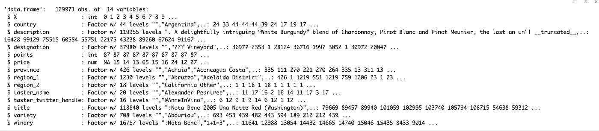
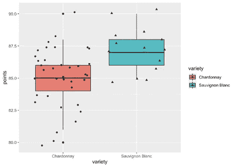
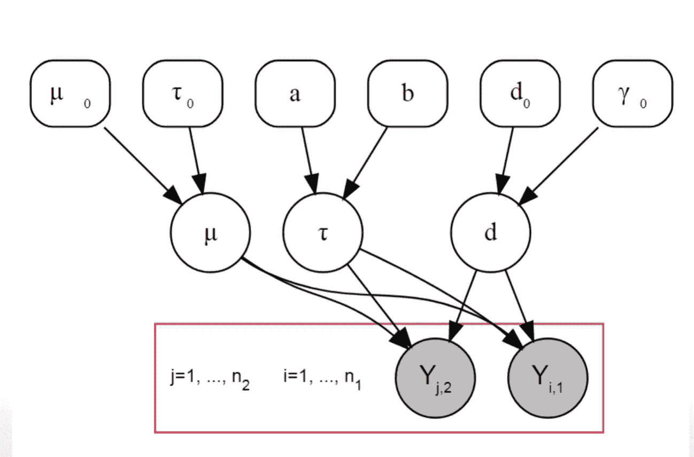
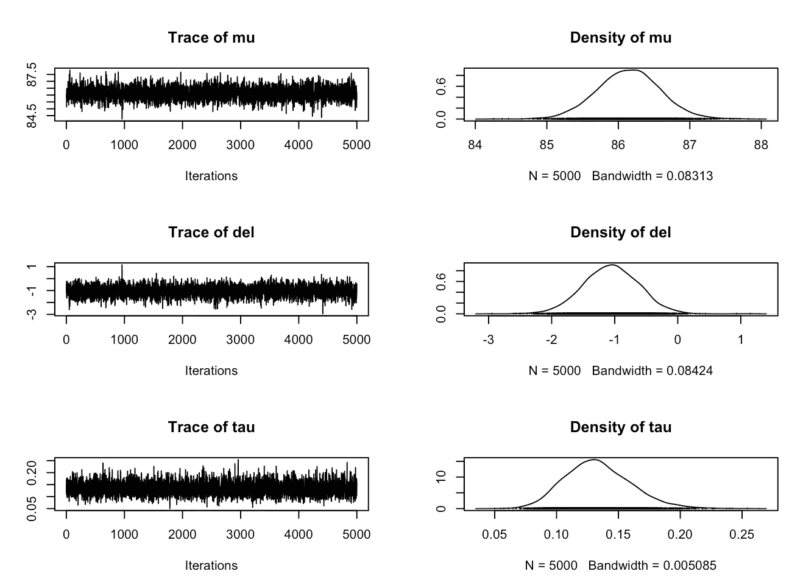
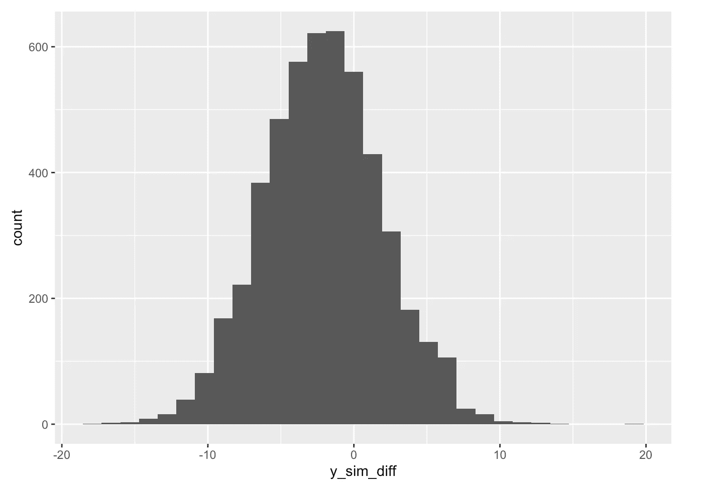

# 用贝叶斯统计比较葡萄酒

> 原文：<https://towardsdatascience.com/using-bayesian-statistics-to-compare-wines-ef2477047cb5?source=collection_archive---------47----------------------->

## *分级建模和 Gibbs 抽样概述，用于比较多组数据。*


照片由 [chuttersnap](https://unsplash.com/@chuttersnap?utm_source=medium&utm_medium=referral) 在 [Unsplash](https://unsplash.com?utm_source=medium&utm_medium=referral) 上拍摄

当被问及更喜欢哪种葡萄酒时，大多数人都会回答红葡萄酒或白葡萄酒(有时还会说玫瑰葡萄酒)。即使我们最终确定了葡萄酒的颜色，仍有成千上万种葡萄酒可供选择(它们尝起来都非常不同)。一个狂热的葡萄酒爱好者可以很容易地区分这些葡萄酒，并且在挑选葡萄酒时对葡萄酒的国家和品种非常挑剔。在这篇博客中，我们将使用统计数据来帮助我们选择哪种葡萄酒更好。

我们将考虑本博客的 [*Kaggle wines 评论*](https://www.kaggle.com/zynicide/wine-reviews) 数据集。这个数据集包含了一些品酒师对世界各地生产的不同葡萄酒的评论。葡萄酒的等级由分数栏给出，从 1 到 100。让我们假设，我的一个朋友喜欢南非的长相思，另一个喜欢智利的霞多丽。他们都认为 15 美元是买一瓶酒的合适金额。现在让我们在不品尝任何一种的情况下完成这个。

让我们从看一下数据集开始这个旅程:

该数据集有 14 列 129971 个数据点。有三个数字列，X，点数，价格；其中 X 是索引。其余 11 列是字符类型。



数据集的结构

现在，我们需要在南非长相思和智利霞多丽之间做出选择，所以让我们从数据集中过滤这些数据点。

```
wine_groups <- wine%>%
  filter( ((variety=="Sauvignon Blanc" & country=="South Africa") | 
            (variety=="Chardonnay" & country=="Chile")) & 
            price == 15)
```

**注意:**两国都生产这两种葡萄酒。所以我们需要使用这种组合过滤条件来选择数据，而不是在不同的过滤器中过滤品种和国家。

按照我们的特定条件选择数据，我们只得到 51 行。让我们先看一下所选的数据集，并形成我们的假设。首先，绘制这两种葡萄酒的箱线图，以估计点数的中值和范围。



从中可以看出“*霞多丽*”的值在 81 到 88 之间，中间值约为 85。长相思的数值范围从 85 到 90，中间值约为 87。从各组的中位数也可以明显看出，长相思比霞多丽有更好的分数，这可以用来形成我们的假设。查看这些值的平均值、中间值和标准偏差:

很明显，长相思被认为比霞多丽更好，但是我们不能确定这一点，因为数据很少。让我们进行一个双样本 t 检验来形成一个假设。

```
## 
##  Two Sample t-test
## 
## data:  points by variety
## t = -3.2599, df = 49, p-value = 0.00203
## alternative hypothesis: true difference in means is not equal to 0
## 95 percent confidence interval:
##  -3.4482245 -0.8181847
## sample estimates:
##      mean in group Chardonnay mean in group Sauvignon Blanc 
##                      85.08108                      87.21429
```

解释这些结果并形成我们的无效假设。无效假设表明两组之间的差异为零。p 值为 0.00203，小于 0.05，表明我们有 95%的把握认为长相思更好，或者我们也可以说有 0.2%的几率差异为零。重要的是，两个平均值之间的差值不为 0。基于这个 t 检验，我们形成了我们的假设，长相思比霞多丽更好评级。我们将尝试使用贝叶斯推理方法来找出这种差异。

# 统计建模

我们现在将使用 Gibbs 采样器来明确地模拟两组葡萄酒之间的差异。这用于对平均值和标准偏差(或精度)值执行完全条件更新。Gibbs Sampler 简化了我们使用 MCMC 方法更新多个参数的任务，它使用一种潜在的方便的全条件概率，将过程分成一次更新一个参数。为了对一个特定参数进行更新，我们将所有其他参数的当前值代入。有三个参数，我们试图用吉布斯采样器来估计，

*   μ，两个定义组的平均值；
*   del，两组的积分差异；
*   τ，精度(定义为 1/Sd)；

我们假设数据的范围覆盖在μ+2d 中，一般精度为τ。因此，这两组可以重新参数化为 mu+del 和 mu-del。其层次模型如下所示:



分层模型图

## **吉布斯采样:**

对于吉布斯采样器的先验值，我们的最佳猜测如下:点数从 80 到 95 不等，中间值约为 85-87，因此 mu 的最佳估计值为 85。我们假设标准差约为 10，因此τ的先验估计值为 1/100。我们将 del 的初始值设为 0，因为根据零假设，组间差异为 0。在采样器的预烧期之后，这种先前的猜测将收敛于它们来自数据的原始值。我们运行采样器 5000 次迭代。对于正态似然性，平均值遵循具有参数μ0 和𝜎2 的正态分布，标准偏差𝜎2 遵循逆伽马分布(因此τ遵循伽马分布)，而δ1 也遵循正态分布。这些分布用于更新我们的吉布斯采样器中的参数。

在从 Gibbs 方法生成样本之后，我们使用 MCMC 拟合方法创建图来分析估计参数(μ、del 和 tau)的收敛性。



迹线和密度图。

从该图中可以观察到，对于所有三个参数，模拟的马尔可夫链已经收敛到其后验分布，并且μ、δ1 和τ的后验参数估计值遵循正态分布。因为μ、δ1 和τ的后验估计也遵循正态分布，所以我们在 Gibbs 方法之前的猜测被认为是正态似然函数的共轭先验。对参数的这种完全有条件的更新为我们提供了如下后验值:

让我们以 mu+del 计算第 1 组(在我们的例子中是“智利霞多丽”)的平均值，我们得到 85.084，以 mu-del 计算第 2 组(“南非长相思”)的平均值，我们得到 87.204，标准偏差为 2.778。基于这些值，我们可以拒绝零假设，并接受两种葡萄酒之间的点数差异不为零。

因此，在我们的案例中，我们有一个赢家，*南非长相思比智利霞多丽得到了* ***2.1198*** *的分数。*

啊，但是我的朋友似乎很坚决，所以我们决定以每瓶 15 美元的价格买下这两款酒。现在来看看南非长相思更好的概率有多大。

## 预测模拟

我们可以再次使用相同的吉布斯采样器对未观察到的数据进行预测。根据上一部分中使用的 Gibbs 抽样拟合模型，我们再创建两个各为 5000 的模拟，第一个用(mu + del)的最后一部分中的平均估计值表示“Chardonnay ”,第二个组用(model)的平均估计值表示“Sauvignon Blanc ”,具有公共标准偏差。在最后部分中接收的相同的吉布斯采样器输出拟合被用作该部分的仿真参数。

我们绘制了从该模拟接收的后验分布，并且它遵循正态分布曲线，



后验分布

这些样品帮助我们检查一种葡萄酒的平均水平是否比其他的好。一种酒的每一个样品都要与其他酒的每一个样品进行核对。这就产生了一个概率，告诉我们哪种酒更好，好多少。

# 结论

*   从我们的分析来看，很明显，南非长相思的评分 ***2.1198 分*** 优于智利霞多丽
*   此外，比较两个模拟组的平均值，我们观察到，对于 ***，70.5%*** 的时间，南非长相思的评分优于智利霞多丽。

# 后续步骤

> 这种建模和比较也可以扩展到多个组，估计组内均值、跨组均值、精度等。
> 
> 这里使用的数据集非常有趣，可以用于点估计、文本分析和 NLP 的回归建模(因为有很多文本列)以及更多…

***欢呼..！！***

在[https://github . com/divyanshumarwah/wine-reviews-statistical-modeling-analysis/blob/master/wine-comparison 上找到代码。Rmd](https://github.com/divyanshumarwah/wine-reviews-statistical-modeling-analysis/blob/master/wine-comparison.Rmd)

在 [LinkedIn](https://www.linkedin.com/in/divyanshumarwah/) 上与我联系并讨论这些想法。

在 [GitHub](https://github.com/divyanshumarwah) 上找到其他令人兴奋的项目。