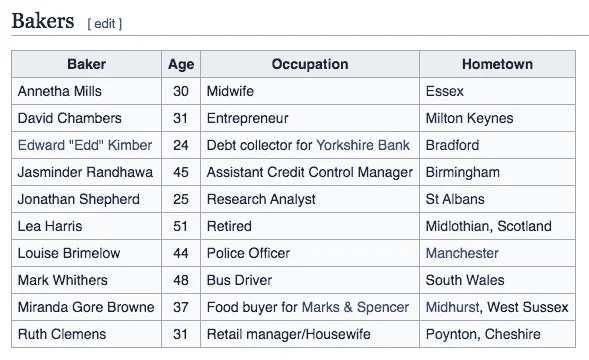
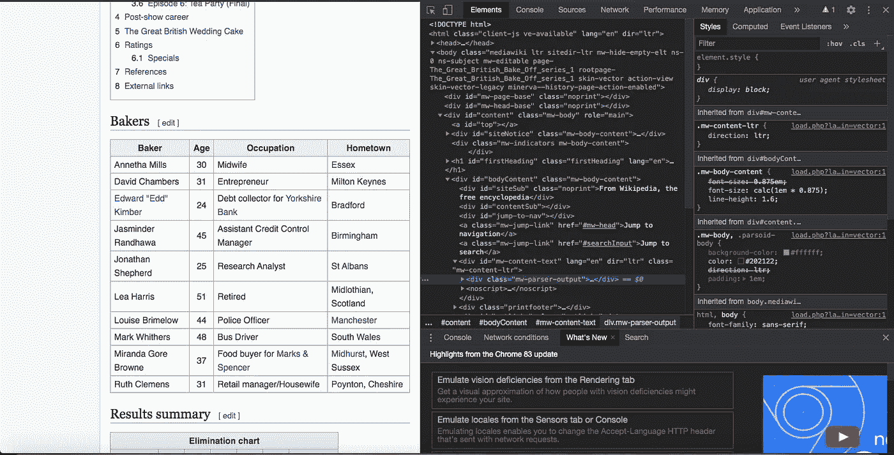
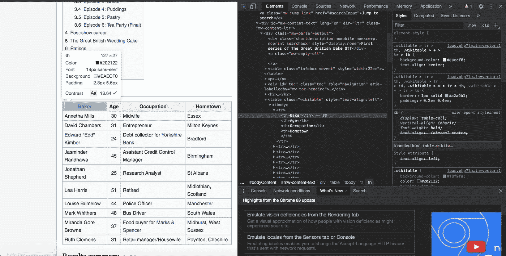
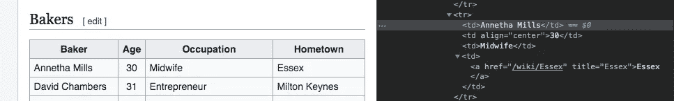

# 在维基百科上使用 BeautifulSoup

> 原文：<https://towardsdatascience.com/using-beautifulsoup-on-wikipedia-dd0c620d5861?source=collection_archive---------50----------------------->

## 使用 BeautifulSoup 将表格(的一部分)变成字典


[国家癌症研究所](https://unsplash.com/@nci?utm_source=medium&utm_medium=referral)在 [Unsplash](https://unsplash.com?utm_source=medium&utm_medium=referral) 上拍摄的照片

如果你不熟悉的话，网页抓取是从网页上获取数据并以列表、字典或表格的形式保存的过程。在 Python 中，包[美汤](https://www.crummy.com/software/BeautifulSoup/bs4/doc/)是人们用来进行网页抓取的。从本质上说，web 抓取就是查看给定网站上的 html 代码，识别代码中您要查找的内容，并告诉您的代码从这些部分获取数据。这里有一个来自英国烘焙大赛第一页的例子。

在本例中，我们将关注第一个表，它包含面包师的全名、年龄、职业和家乡。下面是表格本身的截图



截图来自维基百科页面

现在，我们将查看该页面上的 html 代码，您可以右键单击该页面，然后单击“Inspect”，对我来说，这是倒数第三个，您的结果可能会明显不同。现在，您的屏幕应该看起来像这样:



从这里开始，你可以滚动 html 来阅读代码，找到你要找的东西，但是有一个更简单的方法。如果你看一下 inspect 页面屏幕的左上角，你会看到在一个正方形内有一个看起来像鼠标指针的图标。如果您单击该指针，然后将鼠标悬停在页面上感兴趣的区域上，将会显示该区域在代码中的确切位置:



如果你看一下 inspect 侧，行上高亮显示的文本对应于页面上当前高亮显示的文本。从那里，您可以查看该表的其余代码，并对事物的位置有所了解。现在我们已经为从页面抓取数据做好了准备。

假设我想创建一个字典，其中的键是参赛者的名字，值是一个包含参赛者年龄和家乡的列表。查看页面 inspection，我们可以看到该数据在页面上的位置:



现在进入代码，首先我要导入必要的包、请求和 BeautifulSoup，然后向页面发出请求，并创建我将用来从中提取数据的 Soup。

在这里，我可以创建我的字典，我将它命名为“参赛者姓名年龄城镇”:

遍历代码时，我们会稍微违反直觉，从最后开始。在第 6-8 行，我们看到一个“for”语句，意思是整个字典是一个字典理解(这只是一个列表理解，但作为字典而不是列表)。现在，让我们看看第 7 行的第一部分。

```
soup.find("table", class_="wikitable")
```

在 BeautifulSoup 中，说“find”而不是“find_all”只会返回您告诉代码要查找的任何内容的第一个实例。因此，虽然页面有多个表，但这将只返回第一个表，这很好，因为这是我们想要使用的表。现在转到附加在末尾的 find_all 语句，我们看到我要求它查找所有标记为“tr”的实例，这是 table row 的缩写。第 8 行基本上确保了每当我请求代码查找某个东西时，我不是在请求一个 None 对象，因为那会返回一个错误。

回到第 1 行，我们看到:

```
contestant_name_age_town = {item.td.text:
```

这是分配钥匙，正如我所说的，是参赛者的名字。所以，我说过，对于每一行，查看第一个标记为“td”的内容，并从中提取文本。有趣的是，字典中的值是:

```
[int(item.td.find_next_siblings(limit = 3)[0].text), item.td.find_next_siblings(limit = 3)[2].a.get('href')]
```

您可能注意到的第一件事是，这两个项目都以“item . TD . find _ next _ siblings(limit = 3)”开头。还记得 item.td 是怎么给我们选手名字的吗？接下来的三个条目为我们提供了该行的所有其他信息，或者 item.td 的接下来三个兄弟条目。当您执行“find_next_siblings”时，该函数将返回一个兄弟条目列表。因此，下一项是索引。列表中的第一项是年龄，所以这是第一个兄弟(特别是文本，它被转换成整数)。最后一项是家乡信息，这就是为什么它的索引是 2。从那里我得到了家乡页面的 url 片段。下面是字典理解的打印结果:

```
{'Annetha Mills': [30, '/wiki/Essex'],
 'David Chambers': [31, '/wiki/Milton_Keynes'],
 'Edward "Edd" Kimber': [24, '/wiki/Bradford'],
 'Jasminder Randhawa': [45, '/wiki/Birmingham'],
 'Jonathan Shepherd': [25, '/wiki/St_Albans'],
 'Lea Harris': [51, '/wiki/Midlothian'],
 'Louise Brimelow': [44, '/wiki/Manchester'],
 'Mark Whithers': [48, '/wiki/Wales'],
 'Miranda Gore Browne': [37, '/wiki/Midhurst'],
 'Ruth Clemens': [31, '/wiki/Poynton,_Cheshire']}
```

现在，为什么我取了 url 片段而不仅仅是家乡名呢？因为在我的下一篇文章中，我将向您展示如何创建一个从多个页面中抓取的脚本，以便我们可以提取像家乡的人口和面积这样的数据。