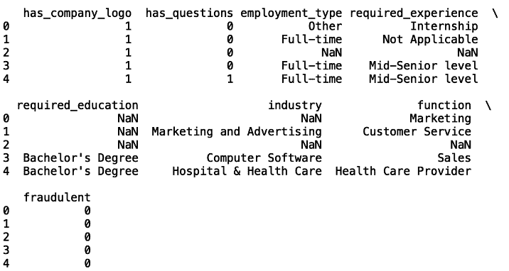
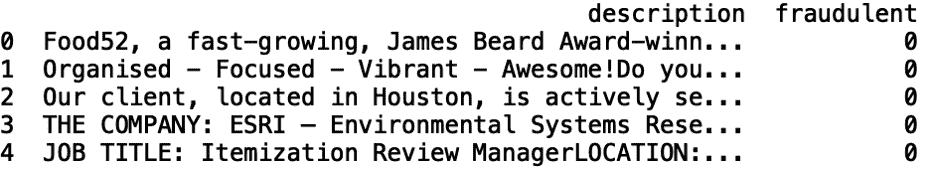
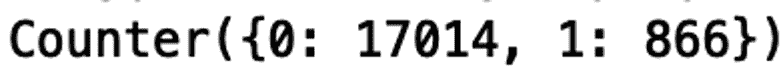
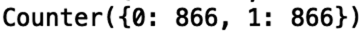

# 利用伯特对抗工作诈骗

> 原文：<https://towardsdatascience.com/using-bert-to-battle-job-scams-d98e6a0ca1e1?source=collection_archive---------53----------------------->

## 伯特模型有许多实际应用。在这里，我们用它来解决一个就业骗局。


[来源](https://www.pexels.com/photo/man-in-white-shirt-using-macbook-pro-52608/)

BERT 是一种现代语言表示方法，由谷歌研究人员在 2018 年开发，并在 2019 年的出版物 [*中概述了 BERT:用于语言理解的深度双向转换器*](https://arxiv.org/pdf/1810.04805.pdf) 的预训练。该方法对于诸如问题回答、语言推理和常识推理的任务是有用的。正如论文所概述的，当在几个基准自然语言理解(NLU)数据集上训练时，BERT 优于先前的自然语言处理(NLP)方法。其中包括通用语言理解评测( [GLUE](https://openreview.net/pdf?id=rJ4km2R5t7) )数据集、多体裁自然语言推理( [MultiNLI](https://cims.nyu.edu/~sbowman/multinli/) )数据集、斯坦福问答数据集( [SQUAD](https://rajpurkar.github.io/SQuAD-explorer/) )等等。

BERT 的独特之处在于它能够将双向上下文转化为单词表示。这到底是什么意思？通常，语言表示是上下文无关模型或单向/从左到右语言模型的结果。BERT 是预训练上下文表征的第一个扩展，包括来自两个方向的上下文。为了理解这一点，让我们考虑三种类型的文本表示:

1.**上下文无关**

一个上下文无关的模型，比如 word2vec 和 GloVe，会在句子“他是一个棒球投手”和“他渴了，所以他要了一罐水”中给单词“pitcher”相同的表示。虽然我们知道，基于上下文，单词“pitcher”有不同的含义，但上下文无关的模型无法提供有区别的表示。

**2。** **单向上下文**

一个单向的上下文模型，比如 OpenAI GPT，会从左到右用前面的单词来表示每个单词。例如，“他曾是棒球投手”中的“pitcher”用“他曾是棒球手”来表示与上下文无关的模型不同，单向模型为单词表示提供了一些上下文。尽管如此，单向模型是有限的，因为单词只能用前面的文本来表示。这种局限性激发了对双向语言模型的需求，这种模型能够完全捕捉单词的上下文含义。

**3。** **双向语境**

虽然单向模型提供了一些上下文，但有时为了完全理解一个单词的意思，两个方向都需要上下文。例如，考虑句子“他知道水罐在桌子上。”像奥博奈·GPT 这样的模特会用“他知道”来代表“投手”这个词伯特是双向的，他会恰当地用“他知道”和“水在桌子上”来表示“水罐”通过用前后文本表示单词，BERT 能够准确地表示单词在文本中的含义。你可以在谷歌人工智能博客[这里](https://ai.googleblog.com/2018/11/open-sourcing-bert-state-of-art-pre.html)阅读更多关于伯特捕捉双向语境的能力。

根据我们的理解，这提出了如何在实践中使用的问题。最相关的应用是谷歌的搜索引擎，它使用 BERT 来增强搜索结果。在这篇[谷歌博客文章](https://www.blog.google/products/search/search-language-understanding-bert/)中，作者概述了实施 BERT 后对搜索结果的一些关键改进。例如，他们使用查询“你能在药店为某人买药吗？”在 BERT 之前，结果建议如何得到一个处方的资源。在伯特之后，结果正确地代表了情境:为另一个人拿处方药，而不是一般的处方。结果显示了相关内容的页面。

现在让我们考虑 BERT 的一个有趣的应用。近几十年来，企业已经采用了各种基于云的招聘广告解决方案，如应用程序跟踪系统(ATS)。虽然这使企业能够更有效地招聘员工，但它也让骗子有机会制作和发布欺诈性内容。具体来说，骗子们已经变得善于为蓝领和秘书工作制作令人信服的广告。此外，通过像 Workable 这样的应用程序跟踪系统，骗子可以毫不费力地收集成千上万份使用欺诈性帖子作为诱饵的简历。

雇佣诈骗有两个目的。首先是收集联系信息，如电子邮件、邮政编码、电话号码和地址。这些信息可以卖给营销人员和陌生来电者。雇佣诈骗的更恶意的目的是身份盗窃。这些虚假帖子通常会将用户从 ATS 引导到第三方网站，然后用户会在那里经历一系列虚假的面试活动。最终，用户被要求提供高度敏感的信息，如社会安全号码和银行账户信息，这些信息可用于洗钱。

最近，爱琴海大学发布了 [*就业骗局爱琴海数据集*](https://www.kaggle.com/shivamb/real-or-fake-fake-jobposting-prediction) ，试图揭露就业骗局问题。该数据包含约 18，000 条包含真实生活和欺诈性招聘广告的记录。识别虚假职位的任务自然属于二进制分类。具体来说，我们将使用 BERT 模型对虚假职位进行分类，通过使用双向上下文来表示职位发布中的单词，这些单词被标记为“欺诈”或“真实”。在这个用例中，在“欺诈性”帖子中找到的单词的上下文含义应该与在“真实”帖子中找到的单词的上下文含义不同。与单向和上下文无关的模型相比，捕获这些双向上下文差异应该导致分类性能的提高。在开始之前，感谢马頔·舒尔加，他的帖子[“伯特来拯救”](/bert-to-the-rescue-17671379687f)启发了我在这里的工作。

现在让我们开始吧！

1.**导入包**

首先，让我们导入一些必要的包:

```
import pandas as pd
import numpy as np
import torch.nn as nn
from pytorch_pretrained_bert import BertTokenizer, BertModel
import torch
from keras.preprocessing.sequence import pad_sequences
from sklearn.metrics import classification_report
```

2.**数据探索**

接下来，让我们将数据读入一个数据框，并打印前五行。我们还可以将最大显示列数设置为“无”:

```
pd.set_option('display.max_columns', None)
df = pd.read_csv("fake_job_postings.csv")
print(df.head())
```



为简单起见，让我们看看“描述”和“欺诈”栏:

```
df = df[['description', 'fraudulent']]
print(df.head())
```



我们分类模型的目标在“欺诈性”一栏中为了了解“欺诈”值的分布和种类，我们可以使用集合模块中的“计数器”:

```
from collections import Counter
print(Counter(df['fraudulent'].values))
```



“0”值对应于正常的工作发布,“1”值对应于欺诈性发布。我们看到数据略有不平衡，这意味着正常的职位发布(17，000)多于欺诈性发布(866)。

在继续之前，让我们删除“NaN”值:

```
df.dropna(inplace = True)
```

接下来，我们希望平衡我们的数据集，使“欺诈”和“非欺诈”类型的数量相等。我们还应该随机改变目标:

```
df_fraudulent= df[df['fraudulent'] == 1]
df_normal = df[df['fraudulent'] == 0]
df_normal = df_normal.sample(n=len(df_fraudulent))
df = df_normal.append(df_fraudulent)
df = df.sample(frac=1, random_state = 24).reset_index(drop=True)
```

再次验证我们得到了想要的结果:

```
print(Counter(df['fraudulent'].values))
```



接下来，我们想要格式化数据，以便它可以用作我们的 BERT 模型的输入。我们将数据分为训练集和测试集:

```
train_data = df.head(866)
test_data = df.tail(866)
```

我们生成一个包含“描述”和“欺诈”关键字的字典列表:

```
train_data = [{'description': description, 'fraudulent': fraudulent } for description in list(train_data['description']) for fraudulent in list(train_data['fraudulent'])]test_data = [{'description': description, 'fraudulent': fraudulent } for description in list(test_data['description']) for fraudulent in list(test_data['fraudulent'])]
```

从字典列表中生成元组列表:

```
train_texts, train_labels = list(zip(*map(lambda d: (d['description'], d['fraudulent']), train_data)))
test_texts, test_labels = list(zip(*map(lambda d: (d['description'], d['fraudulent']), test_data)))
```

生成令牌和令牌 id:

```
tokenizer = BertTokenizer.from_pretrained('bert-base-uncased', do_lower_case=True)train_tokens = list(map(lambda t: ['[CLS]'] + tokenizer.tokenize(t)[:511], train_texts))test_tokens = list(map(lambda t: ['[CLS]'] + tokenizer.tokenize(t)[:511], test_texts))train_tokens_ids = list(map(tokenizer.convert_tokens_to_ids, train_tokens))test_tokens_ids = list(map(tokenizer.convert_tokens_to_ids, test_tokens))train_tokens_ids = pad_sequences(train_tokens_ids, maxlen=512, truncating="post", padding="post", dtype="int")test_tokens_ids = pad_sequences(test_tokens_ids, maxlen=512, truncating="post", padding="post", dtype="int")
```

请注意，我们将输入字符串截断为 512 个字符，因为这是 BERT 可以处理的最大令牌数。

最后，为我们的测试和训练集生成一个基于“欺诈”值的布尔数组:

```
train_y = np.array(train_labels) == 1
test_y = np.array(test_labels) == 1
```

4.**模型构建**

我们创建了我们的 BERT 分类器，它包含一个“初始化”方法和一个返回令牌概率的“转发”方法:

```
class BertBinaryClassifier(nn.Module):
    def __init__(self, dropout=0.1):
        super(BertBinaryClassifier, self).__init__()
        self.bert = BertModel.from_pretrained('bert-base-uncased')
        self.dropout = nn.Dropout(dropout)
        self.linear = nn.Linear(768, 1)
        self.sigmoid = nn.Sigmoid()

    def forward(self, tokens, masks=None):
        _, pooled_output = self.bert(tokens, attention_mask=masks, output_all_encoded_layers=False)
        dropout_output = self.dropout(pooled_output)
        linear_output = self.linear(dropout_output)
        proba = self.sigmoid(linear_output)
        return proba
```

接下来，我们生成训练和测试掩码:

```
train_masks = [[float(i > 0) for i in ii] for ii in train_tokens_ids]
test_masks = [[float(i > 0) for i in ii] for ii in test_tokens_ids]
train_masks_tensor = torch.tensor(train_masks)
test_masks_tensor = torch.tensor(test_masks)
```

生成用于训练和测试的令牌张量:

```
train_tokens_tensor = torch.tensor(train_tokens_ids)
train_y_tensor = torch.tensor(train_y.reshape(-1, 1)).float()
test_tokens_tensor = torch.tensor(test_tokens_ids)
test_y_tensor = torch.tensor(test_y.reshape(-1, 1)).float()
```

最后，准备我们的数据加载器:

```
BATCH_SIZE = 1
train_dataset =  torch.utils.data.TensorDataset(train_tokens_tensor, train_masks_tensor, train_y_tensor)
train_sampler =  torch.utils.data.RandomSampler(train_dataset)
train_dataloader =  torch.utils.data.DataLoader(train_dataset, sampler=train_sampler, batch_size=BATCH_SIZE)test_dataset =  torch.utils.data.TensorDataset(test_tokens_tensor, test_masks_tensor, test_y_tensor)
test_sampler =  torch.utils.data.SequentialSampler(test_dataset)
test_dataloader =  torch.utils.data.DataLoader(test_dataset, sampler=test_sampler, batch_size=BATCH_SIZE)
```

5.**微调**

我们使用 Adam 优化器来最小化二进制交叉熵损失，并且我们使用 1 个时期的批量大小 1 来训练:

```
BATCH_SIZE = 1
EPOCHS = 1bert_clf = BertBinaryClassifier()
optimizer = torch.optim.Adam(bert_clf.parameters(), lr=3e-6)for epoch_num in range(EPOCHS):
    bert_clf.train()
    train_loss = 0
    for step_num, batch_data in enumerate(train_dataloader):
        token_ids, masks, labels = tuple(t for t in batch_data)
        probas = bert_clf(token_ids, masks)
        loss_func = nn.BCELoss()
        batch_loss = loss_func(probas, labels)
        train_loss += batch_loss.item()
        bert_clf.zero_grad()
        batch_loss.backward()
        optimizer.step()
        print('Epoch: ', epoch_num + 1)
        print("\r" + "{0}/{1} loss: {2} ".format(step_num, len(train_data) / BATCH_SIZE, train_loss / (step_num + 1)))
```

我们评估我们的模型:

```
bert_clf.eval()
bert_predicted = []
all_logits = []
with torch.no_grad():
    for step_num, batch_data in enumerate(test_dataloader):token_ids, masks, labels = tuple(t for t in batch_data)logits = bert_clf(token_ids, masks)
        loss_func = nn.BCELoss()
        loss = loss_func(logits, labels)
        numpy_logits = logits.cpu().detach().numpy()

        bert_predicted += list(numpy_logits[:, 0] > 0.5)
        all_logits += list(numpy_logits[:, 0])

print(classification_report(test_y, bert_predicted))
```

这将显示一个包含精确度、召回率和 f1 分数指标的混淆矩阵，所有这些指标都描述了模型的性能。显然，这篇文章只是解决伯特雇佣骗局的初级读本。通过额外的微调，我们可以进一步提高准确性，并发现更多的欺诈性列表。BERT 模型相对于上下文无关和单向上下文模型的优势是显而易见的。双向语言处理使得 BERT 更擅长使用上下文来确定一个列表的合法性，从而保护求职者免受不良行为者的剥削。虽然这只是将机器学习用于解决现实世界问题的一种方式，但它是 BERT 如何有用的一个很好的例子。如果对 BERT 的其他应用感兴趣，可以阅读 [*假新闻分类用 BERT*](/fake-news-classification-with-bert-afbeee601f41) 和 [*俄罗斯巨魔推文:分类用 BERT*](/russian-troll-tweets-classification-using-bert-abec09e43558) 。如果你对伯特方法有兴趣，我鼓励你阅读 [*伯特拯救*](/bert-to-the-rescue-17671379687f) *。*这篇文章的代码可以在 [GitHub](https://github.com/spierre91/medium_code/tree/master/BERT_fake_job_classification) 上找到。感谢您的阅读！