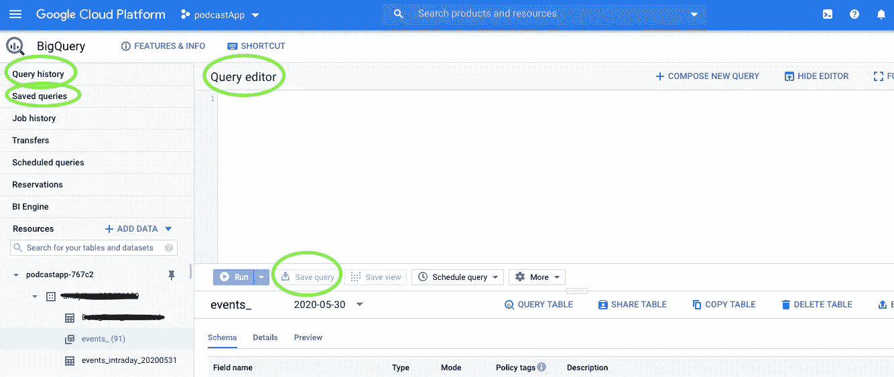
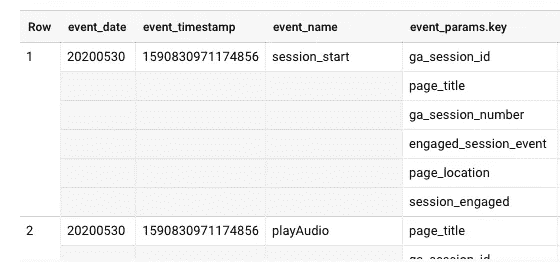
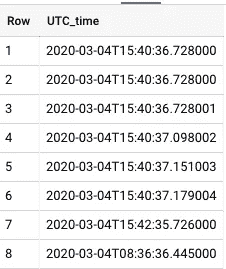
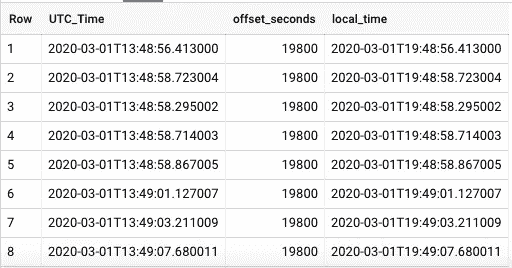
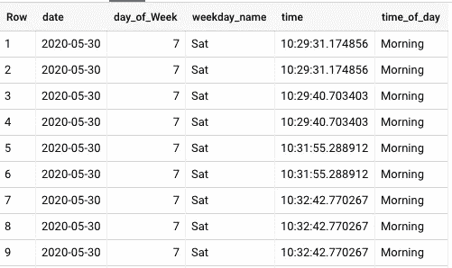
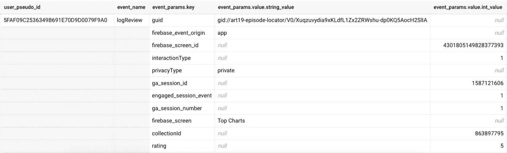
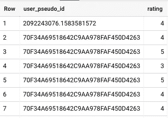
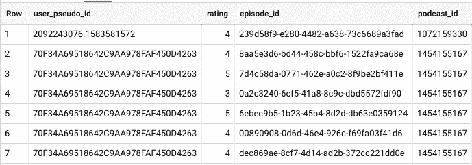
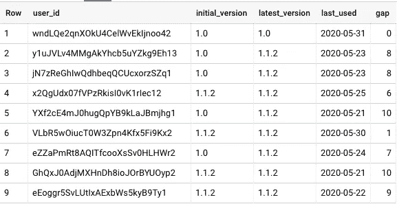

# 使用 BigQuery、Firebase Analytics 来吸引、吸引和评估您的应用用户

> 原文：<https://towardsdatascience.com/using-bigquery-firebase-analytics-to-engage-attract-and-assess-your-app-users-da02980daffa?source=collection_archive---------30----------------------->

## 处理点击流数据时的有用提示和重要转换，以及强大的查询示例。

# 什么是 Firebase Analytics？

你开发了一个令人惊叹的应用程序，但是你如何知道用户是否以正确的方式使用它，或者他们对应用程序的哪些部分更感兴趣？Firebase Analytics 是记录用户分析的最好的免费库之一。无论你的应用是用于 Web、iOS、Android，甚至是 Flutter， [Firebase Analytics](https://firebase.google.com/docs/analytics) 都可以与之集成。一旦集成了分析库，您需要记录您感兴趣的所有事件以及特定于该事件的任何参数，如 *app_purchase* (购买金额)、 *audio_play* (音频 id)等。默认情况下，Firebase 向您显示许多不同的图表来解释您正在记录的事件。如果您想进行更多的定制分析，您可以在 firebase 仪表板中将您的 firebase analytics 链接到 BigQuery。BigQuery 将包含所有的原始数据事件，您可以处理它们来进行更复杂的分析。本文详细说明了如何…..

# 这篇文章是给你的，如果…

您刚刚创建并启动了您的移动应用程序(或网站),现在您有兴趣知道如何查询 Firebase 在我们说话时每秒钟为您处理的庞大数据集。或者您只是好奇，想知道对点击流事件数据的一些有用查询，这些查询可以为您提供一些可操作的见解。无论如何，荣誉和欢迎教程。今天，我们将讨论使用 Google BigQuery 的技巧、诀窍和更多内容。我们开始吧！

# 云控制台中的 BigQuery Web UI

一旦将 firebase analytics 链接到 BigQuery，您的控制台应该是这样的。我将在这个屏幕上提到几个我日常使用的项目:



*   查询编辑器:可以把它想象成我们写查询的黑板。
*   保存查询按钮:保存重要查询以供将来参考的按钮。
*   保存的查询:这是我们将要使用 save query 按钮保存的所有查询的主页。
*   查询历史:它存储您过去运行过的所有查询(当您想要重用查询时很有用)。

既然我们已经理解了基本的布局，让我们直接进入一些有用的查询。

# 日期时间格式

Firebase 擅长跟踪你的应用程序或网站的每次点击的大量*事件*数据。例如，关于应用首次打开的时间、应用最后更新的时间、应用内购买的时间等信息。这意味着与这些事件相关联的时间和日期对于提供洞察力非常有用。默认情况下，Firebase 将事件的日期和时间记录为列 *event_timestamp* 中的一个*整数*。



这个整数基本上是客户端记录事件的时间(以微秒计，UTC)。使用`FORMAT_DATE` & `FORMAT_TIME`将这个整数转换成两个独立的(人类可读的)日期和时间列可能很有吸引力:

```
SELECT 
FORMAT_DATE('%d-%m-%Y', PARSE_DATE('%Y%m%d', event_date)) AS date, 
FORMAT_TIME('%T', TIME(TIMESTAMP_MICROS(event_timestamp))) AS time
FROM analytics_xxxxxxxxx.events_*
```

这给出了以下简洁的输出:


如果您的最终目标是向您的同事或其他利益相关者展示这两个专栏，这种格式应该很适合您。

但是，您可能会使用事件日志文件中的日期和时间列对数据集进行大量转换。在那种情况下，`FORMAT_DATE`将不会是最有效的转换。这是因为它返回的输出是类型为 *string* 的，而 BigQuery 支持的大多数日期和时间函数(比如添加两个日期，将日期截断到特定的粒度)要求日期是 date 或 DATETIME 格式。

在这种情况下，我喜欢使用`TIMESTAMP_MICROS`函数从 event_timestamp 中提取日期和时间，然后使用`CAST AS DATETIME`将这个时间戳转换为 DATETIME 对象:

```
SELECT
  CAST(TIMESTAMP_MICROS(event_timestamp) AS DATETIME) As UTC_Time 
FROM analytics_xxxxxxxxx.events_*
```



注意:默认情况下，存储的时间是 UTC 时区

与存储在 *event_timestamp* 列中的整数相比，这种格式更加清晰。同时，我们设法保留了 DATETIME 格式，这样任何日期或时间转换仍然是可能的。我们在下面的例子中演示了这种格式的一种用法。

## 将 UTC 时间转换为本地时间

UTC 是 Firebase 用来存储与事件相关的日期和时间的默认时区。事件数据库中还记录了另一个名为*‘time _ zone _ offset _ seconds’*的功能，该功能以秒为单位存储与 GMT 的偏差(根据国家的不同，可能为正值或负值)。因此，将这个偏移量加到任何给定的 UTC 时间上，就会得到正确的本地时间。

以下是使用 CTE(通用表表达式)计算本地时间的查询。它首先检查偏移量是否为空，在这种情况下，我们将 UTC 时间设置为本地时间。在非空偏移的情况下，我们首先将偏移秒转换为小时，并使用`DATETIME_ADD`将其添加到 UTC 日期:

```
**WITH CTE AS (**
SELECT *,
 CAST(TIMESTAMP_MICROS(event_timestamp) AS DATETIME) As UTC_Time,
 device.time_zone_offset_seconds AS offset_seconds,
FROM analytics_xxxxxxxxx.events_*
**)****SELECT UTC_Time, offset_seconds,
CASE
WHEN offset_seconds is NULL then UTC_Time
ELSE DATETIME_ADD(
UTC_Time, INTERVAL CAST(offset_seconds/3600 AS INT64) HOUR)
END As local_time
FROM CTE**
```



老实说，我对我的数据库中的空偏移量感到很困扰(天哪，有很多！).因此，我决定通过检查 Firebase 存储的 *geo.country* 列中的国家来手工编码偏移时间，从而解决*其中的一些问题。*

因此，将上面的查询更新为:

```
**WITH CTE AS (**
SELECT *,
  CAST(TIMESTAMP_MICROS(event_timestamp) AS DATETIME) As UTC_Time,
  device.time_zone_offset_seconds AS offset_seconds,
FROM analytics_xxxxxxxxx.events_*
**)**

**SELECT *, 
CASE
  WHEN offset_seconds IS NULL AND geo.country IN ('India', 'Pakistan') THEN DATETIME_ADD(UTC_Time, INTERVAL CAST(5.5 AS INT64) HOUR) 
  WHEN offset_seconds IS NULL AND geo.country = 'United States' THEN DATETIME_SUB(UTC_Time, INTERVAL CAST(5 AS INT64) HOUR) 
  WHEN offset_seconds IS NULL AND geo.country = 'Australia' THEN DATETIME_ADD(UTC_Time, INTERVAL CAST(10 AS INT64) HOUR) 
  WHEN offset_seconds IS NULL AND geo.country = 'Canada' THEN DATETIME_SUB(UTC_Time, INTERVAL CAST(5 AS INT64) HOUR) 
  WHEN offset_seconds IS NULL AND geo.country = 'China' THEN DATETIME_ADD(UTC_Time, INTERVAL CAST(8 AS INT64) HOUR) 
  WHEN offset_seconds IS NULL AND geo.country IN ('France', 'Spain', 'Germany', 'Sweden', 'Italy', 'Sweden', 'United Kingdom', 'Ireland') THEN DATETIME_ADD(UTC_Time, INTERVAL CAST(1 AS INT64) HOUR) 
  WHEN offset_seconds IS NOT NULL THEN DATETIME_ADD(UTC_Time, INTERVAL CAST(IFNULL(offset_seconds,0)/3600 AS INT64) HOUR) 
  ELSE UTC_time
END As local_time
FROM CTE**
```

唷，这看起来好多了！我们已经设法修复了一些主流国家的时间，这些国家在应用程序上注册了大量的流量。

附注:我使用的时差并不准确，例如，加拿大作为一个国家，在西部和东部观察不同的时区，但为了本教程的目的，我采取了更简单的方法。

## 对本地时间进行转换，以提取星期几、工作日名称和时间

一旦我们计算出了本地时间，我们就可以通过引入进一步的转换来更进一步。包含上述所有代码的最终查询如下所示:

```
WITH CTE AS (
SELECT *,
  CAST(TIMESTAMP_MICROS(event_timestamp) AS DATETIME) As UTC_Time,
  device.time_zone_offset_seconds AS offset_seconds,
FROM analytics_xxxxxxxxx.events_*
),**CTE2 AS (**
SELECT *, 
CASE
  WHEN offset_seconds IS NULL AND geo.country IN ('India', 'Pakistan') THEN DATETIME_ADD(UTC_Time, INTERVAL CAST(5.5 AS INT64) HOUR) 
  WHEN offset_seconds IS NULL AND geo.country = 'United States' THEN DATETIME_SUB(UTC_Time, INTERVAL CAST(5 AS INT64) HOUR) 
  WHEN offset_seconds IS NULL AND geo.country = 'Australia' THEN DATETIME_ADD(UTC_Time, INTERVAL CAST(10 AS INT64) HOUR) 
  WHEN offset_seconds IS NULL AND geo.country = 'Canada' THEN DATETIME_SUB(UTC_Time, INTERVAL CAST(5 AS INT64) HOUR) 
  WHEN offset_seconds IS NULL AND geo.country = 'China' THEN DATETIME_ADD(UTC_Time, INTERVAL CAST(8 AS INT64) HOUR) 
  WHEN offset_seconds IS NULL AND geo.country IN ('France', 'Spain', 'Germany', 'Sweden', 'Italy', 'Sweden', 'United Kingdom', 'Ireland') THEN DATETIME_ADD(UTC_Time, INTERVAL CAST(1 AS INT64) HOUR) 
  WHEN offset_seconds IS NOT NULL THEN DATETIME_ADD(UTC_Time, INTERVAL CAST(IFNULL(offset_seconds,0)/3600 AS INT64) HOUR) 
  ELSE UTC_time
END As local_time
FROM CTE
**)****SELECT 
DATE(local_time) as date, -- returns a DATE
EXTRACT(DAYOFWEEK FROM DATE(local_time)) as day_of_Week, 
FORMAT_DATE('%a', DATE(local_time)) as weekday_name,
TIME(local_time) as time, -- returns a TIME
CASE
  WHEN TIME(local_time) BETWEEN '06:00:00' AND '11:00:00' THEN 'Morning'
  WHEN TIME(local_time) BETWEEN '11:00:00' AND '16:00:00' THEN 'Afternoon'
  WHEN TIME(local_time) BETWEEN '16:00:00' AND '19:00:00' THEN 'Evening'
  WHEN TIME(local_time) BETWEEN '19:00:00' AND '23:59:00' THEN 'Night'
  ELSE 'LateNight'
END AS time_of_day
from CTE2**
```



注意:`day_of_Week`是星期日=1 的数字；星期一=2，以此类推。

这些本地时间的转换对于评估你的应用用户何时最活跃，或者一周中的哪一天向他们发送应用内购买营销电子邮件是有意义的，是非常强大的。

# 为推荐系统准备数据

推荐系统基于用户的显式(例如:评级)和隐式(例如:花费的时间)偏好、其他用户的偏好以及用户和项目属性来建议用户感兴趣的项目。在最基本的层面上，为您的应用程序构建任何此类建议所需的数据框需要三列:user_id、item_id 和 rating。让我们看看如何从数据库中查询它。

我已经做了几个星期的播客数据集了(感谢我的朋友，他一直在做一个神奇的播客应用程序，叫做[Podurama](https://podurama.com/)——可以在 Android 和 iOS 上使用)；我记录了一个名为 *logReview* 的自定义事件。每当有人试图对应用程序上的播客进行评级并记录四条主要信息(以及其他信息)时，就会触发该事件:

*   *收藏 Id* :播客 Id
*   *guid* :剧集 id
*   *评级:1 到 5 之间的整数*
*   *交互类型* : 0-删除；1-创建；2-编辑

对于单个用户，该事件的行看起来是这样的:

```
SELECT user_pseudo_id, event_name, event_params
FROM analytics_xxxxxxxxx.events_*
WHERE event_name LIKE '%logReview%'
```



我知道这看起来很吓人，但请耐心听我解释发生了什么。这些事件参数(比如 *rating* 、 *guid* )并没有一个唯一的行，而是被分组到某种具有唯一键值对的 JSON 对象中。我可以解释得更详细，但没有什么能比得上托德·克佩尔曼的精彩解释。

底线是我们可以使用下面的查询中的`UNNEST`只提取我们感兴趣的事件参数。再次向托德大声欢呼，感谢他为我节省了这么多时间，并在这个帖子中解释得如此漂亮。

```
SELECT user_pseudo_id,
(SELECT value.int_value
FROM UNNEST(event_params) WHERE key = 'rating'
) AS rating
FROM analytics_xxxxxxxxx.events_*
WHERE event_name LIKE '%logReview%'
```

我们在这里所做的是告诉 BigQuery 让`unnest`或*将*和 *event_params* 分开到单独的行中，并且只从那些`key = rating` *所在的行中选取`int_value`。*

输出如下所示:



这看起来很棒，除了我们仍然不知道这个评级是哪个播客的插曲。因此，我们将继续提取剧集 id 和播客 id。

```
SELECT user_pseudo_id,
(SELECT value.int_value
FROM UNNEST(event_params) WHERE key = 'rating'
) AS rating,
**(SELECT value.string_value
FROM UNNEST(event_params) WHERE key = 'guid'
) AS episode_id,
(SELECT value.int_value
FROM UNNEST(event_params) WHERE key = 'collectionId'
) AS podcast_id**FROM analytics_xxxxxxxxx.events_*
WHERE event_name LIKE '%logReview%'
```



这看起来*几乎*完美！为什么几乎你问？这是因为我们没有考虑这个评级是否被更改过(记得我们为每个*日志审查*事件存储了*交互类型*)。

从逻辑上讲，我们希望保留用户对播客剧集的最新评价。为了实现这一点，我们将使用`LAST_VALUE`窗口函数、`PARTITIONED BY` *用户 id* 和*剧集 id* 和`ORDERED BY` *时间戳*:

```
**WITH CTE AS (**
SELECT user_pseudo_id,
(
SELECT value.int_value
FROM UNNEST(event_params) WHERE key = 'rating'
) AS rating,
(
SELECT value.string_value
FROM UNNEST(event_params) WHERE key = 'guid'
) AS episode_id,
(
SELECT value.int_value
FROM UNNEST(event_params) WHERE key = 'collectionId'
) AS podcast_id,
(
SELECT value.int_value
FROM UNNEST(event_params) WHERE key = 'interactionType'
) AS interaction_type,
event_timestamp, timeFROM analytics_xxxxxxxxx.events_*
WHERE event_name LIKE '%logReview%'
)**SELECT DISTINCT user_pseudo_id, episode_id, podcast_id,
LAST_VALUE(rating) OVER (PARTITION BY user_pseudo_id, episode_id ORDER BY event_timestamp ROWS BETWEEN UNBOUNDED PRECEDING AND UNBOUNDED FOLLOWING)  AS latest_rating 
FROM CTE**
```

`LAST_VALUE...`调用本质上是对数据进行分区，首先是按用户 id，在每个用户 id 内，按播客剧集。然后，在这些*用户剧集*片段(或分区)的每一个中，结果行按照事件时间戳排序。最后，选择对应于分区中最后一行的额定值。

瞧啊。我们做到了。:)现在我们有了开始我们的推荐系统建模所需的数据框架。您可以单击保存结果按钮将数据框导出到本地计算机上。

# 用于版本更新的定制电子邮件

作为一名应用程序开发人员，每隔几周就会推出一个新版本的应用程序，这是很自然的事情。理想情况下，新版本将有更多的特性和功能，并解决了以前版本的一些令人讨厌的错误。因此，确保大多数早期用户已经过渡到这个最新版本是很重要的，如果他们还没有，通过电子邮件给他们一些提示。

我们将检测所有在我们的应用程序上活跃但尚未切换到最新版本的用户。我们认为那些在过去 10 天内使用过该应用程序的用户是活跃的。

我们将使用`FIRST_VALUE`来检测用户第一次使用我们的应用程序时使用了哪个版本的应用程序。同样，我们将使用我们的好朋友`LAST_VALUE`来检测与该应用程序最近交互相关的应用程序版本，并提取该应用程序上次使用的日期。我们把这些都储存在 CTE 里。

```
WITH CTE AS (
SELECT 
user_id,
FIRST_VALUE(app_info.version) OVER (user_event_window) AS initial_version,
LAST_VALUE(app_info.version) OVER (user_event_window) AS latest_version,
LAST_VALUE(event_timestamp) OVER (user_event_window) AS app_last_used
FROM analytics_xxxxxxxxx.events_*
WHERE device.operating_system <> 'WEB' AND user_id IS NOT NULL
WINDOW user_event_window AS (PARTITION BY user_id ORDER BY event_timestamp ROWS BETWEEN UNBOUNDED PRECEDING AND UNBOUNDED FOLLOWING)
)
```

由于我们对 web 应用程序用户不感兴趣，我们指定了`WHERE`条件来检查设备的操作系统。

我们还使用了一个`WINDOW`调用`user_event_window`来指定事件窗口，这使得代码使用起来更加简洁(通过简化所有冗余的`PARTITION BY`调用)。

现在我们有了应用程序最后一次使用的日期(存储为`app_last_used`)，我们可以使用`DATE_DIFF`从今天的日期中减去它。

```
DATE_DIFF(CURRENT_DATE(), DATE(TIMESTAMP_MICROS(app_last_used)), DAY) AS gap
```

如果结果小于或等于 10，这意味着该用户是一个活跃用户，因此是我们的应用程序更新电子邮件的目标。

现在是检索用户 id 的最终代码，这些用户应该根据他们上次使用应用程序的时间收到应用程序版本更新的电子邮件。

```
WITH CTE AS (
SELECT 
user_id,
FIRST_VALUE(app_info.version) OVER (user_event_window) AS initial_version,
LAST_VALUE(app_info.version) OVER (user_event_window) AS latest_version,
LAST_VALUE(event_timestamp) OVER (user_event_window) AS app_last_used
FROM `podcastapp-767c2.analytics_193436959.events_*`
WHERE device.operating_system <> 'WEB' AND user_id IS NOT NULL
WINDOW user_event_window AS (PARTITION BY user_id ORDER BY event_timestamp ROWS BETWEEN UNBOUNDED PRECEDING AND UNBOUNDED FOLLOWING)
)**SELECT user_id, initial_version, latest_version,
DATE(TIMESTAMP_MICROS(app_last_used)) AS last_used, 
DATE_DIFF(CURRENT_DATE(), DATE(TIMESTAMP_MICROS(app_last_used)), DAY) AS gap 
FROM CTE
WHERE latest_version NOT IN ('1.1.3') -- update the version here in future
GROUP BY user_id, initial_version, latest_version, app_last_used
HAVING gap <= 10**
```



我希望这篇文章为您提供了一些在 BigQuery 中使用事件数据的有用技巧。查看[这篇](/process-mining-to-assess-app-user-behavior-from-clickstream-data-8e53a71428a4)文章，了解如何利用流程挖掘从事件数据中获取更多关于工作时间损失率和冷启动建议的信息。将来，我会提供一些食谱和其他有趣的查询，您可以尝试用于 Firebase 事件分析。

直到下次:)

[](/process-mining-to-assess-app-user-behavior-from-clickstream-data-8e53a71428a4) [## 从点击流数据中评估应用用户行为的流程挖掘

### 对 pm4py python 库的深入介绍

towardsdatascience.com](/process-mining-to-assess-app-user-behavior-from-clickstream-data-8e53a71428a4) [](/how-to-use-bigquery-api-with-your-own-dataset-c901972cebd) [## 如何对自己的数据集使用 BigQuery API？

### 使用 Flask 和 Bigquery APIs 根据用户查询参数从 Bigquery 数据集中提取数据。

towardsdatascience.com](/how-to-use-bigquery-api-with-your-own-dataset-c901972cebd) [](https://medium.com/analytics-vidhya/how-to-use-autokeras-to-build-image-classification-models-using-one-line-of-code-c35b0c36e66e) [## 如何使用 AutoKeras 用一行代码建立图像分类模型？

### 甚至不需要知道 Conv2d、Maxpool 或批处理规范化层是做什么的！

medium.com](https://medium.com/analytics-vidhya/how-to-use-autokeras-to-build-image-classification-models-using-one-line-of-code-c35b0c36e66e)