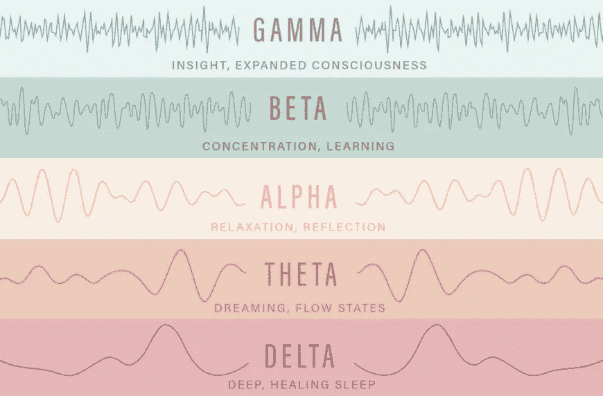

# 用脑电波控制音乐播放列表

> 原文：<https://towardsdatascience.com/using-brainwaves-to-control-a-music-playlist-909668d82546?source=collection_archive---------34----------------------->

## 仅仅通过集中注意力来改变歌曲。

从小到大，我一直在想，是否有一天，只要想到你最喜欢的歌曲，它就会为你播放。我当时并没有意识到，但是像这样的技术如果存在的话，它的影响是巨大的。也就是说，如果我们能想到一首歌并播放出来，瘫痪的人能不能用同样的技术来思考，比如说，移动轮椅并转动轮子？

但现在，我将展示我如何使用 Muse 耳机和物联网技术来改变播放列表中的歌曲。这是我的妹妹在尝试这个系统，她让我们知道她正专注于通过举起拇指来切换歌曲。

如果她给出了一个口头信号，这可能会干扰她的注意力，因为这些神经离大脑更近，需要更多的肌肉运动。然而，拇指的轻微移动不会改变她的脑电波状态太多，这意味着这是一个很好的信号，让我们知道她什么时候开始集中精力改变歌曲。

## 背景资料

很好地理解脑电波是如何工作的，以及它们是如何被读取的，对于理解这个项目中的所有组件是如何组合在一起的非常重要。该项目还使用了物联网技术，包括一个连接到物联网集线器的扬声器和一个连接到集线器的 Muse 头带。

解释脑电波类型的图表。

我先从神经科学说起。如果你想更详细地了解脑电波，你可以阅读我的另一篇关于[解读脑电波](https://medium.com/swlh/interpreting-the-meaning-of-brainwaves-a36bf078c264?source=friends_link&sk=99023e2aeff6a6b4993226b46c63e250)的文章，但我将在这里提供一个简短的总结。脑波分为五种主要类型——δ波、θ波、α波、β波和γ波。δ波是最慢的，出现在睡眠期间，γ波是最快的，出现在高度集中、注意力高度集中的情况下。有了 Muse 头带，我能够非常清楚地阅读β和α的状态，以及更难归纳和阅读的θ状态。这项工作做得非常好，因为这个项目最需要测量β波来检查浓度水平。

以下是该项目的物联网方面的更多细节。正如我之前所说，我需要将两个设备都连接到一个物联网集线器，以便更好地处理。Muse 头带每秒钟都会产生大量需要分析和解释的数据，如果在同一个脚本中完成，不会太准确。

物联网组件的信息流。

物联网集线器是两台物联网设备连接的中央服务器，用于发送和接收信息。在这种情况下，它确实非常有用，因为它可以减少客户端的大量繁重处理工作，还可以保持您的解决方案井井有条，因为无论连接了多少设备，信息都是在一个点上处理的。在这个特定的项目中，信息流可以在旁边的图表中看到。

## 如何测量浓度？

为了达到我们想要的目标，我们需要测量浓度。正如我之前提到的，β波的出现是这部分的完美目标。β波是在专注和学习的状态下出现的，比如你在做作业或者解题的时候。为了首先测量β波，电极需要靠近大脑的额叶或顶叶。

Muse 头带在 AF7 和 AF8 位置提供这些传感器。AF7 位置测量大脑额叶的左侧，AF8 位置测量大脑额叶的右侧。现在，数据从这些位置开始流动，需要建立一个阈值，以确定什么是集中状态，什么不是。

当你处于放松状态时，你的大脑很可能会产生α波而不是β波。这意味着从 Muse 头带传入的β波的频率将小于零，或者是负数。当你开始集中精力做某事时，比如解决一个数学问题，β波的频率会增加，显示大于零的数字。这意味着零很可能是我们在寻找的阈值，来决定你是否在集中注意力。

然而，为了使用零作为阈值，还需要考虑其他因素，例如，如果头带在数字中产生突然的尖峰，因为读取脑电波是一个非常敏感的过程，该怎么办？这也可以通过确保数字逐渐增加或在几秒钟内保持正数来解决，这意味着你肯定处于集中状态。

缪斯发带的代码可以在下面找到。我使用了一个名为 Muselsl 的 Python 库来处理这些头带。

 [## alisyakainth/脑波播放列表/musedata.py

github.com](https://github.com/alisyakainth/brainwave-playlist/blob/master/musedata.py) 

## 连接到扬声器

这个项目的第二个主要部分是将物联网中枢连接到扬声器，当达到专注状态时，扬声器负责切换到播放列表中的下一首歌曲。这是通过首先确保所有的处理都在物联网中枢中完成，以便它可以随时向扬声器发送信号来改变歌曲。一旦达到测试波的阈值，物联网中心就会向扬声器发送一首新歌，并立即播放。

为此，我使用了一个名为 winsound 的 Python 模块来控制设备的声音输出，比如开始和停止音轨。对于所有进出物联网集线器的连接，我使用了一个名为 Socket 的模块，它建立了一个 TCP 连接。我还为 Muse 头带使用了一个名为 BlueMuse 的特殊蓝牙流媒体服务，因为它可以与头带建立更强的连接，并且可以直接从这个流中访问数据。

现在，只要集中精神去改变一首歌，你就能改变它！正如一开始提到的，这项技术可以有更多的实际用途，比如帮助那些处于锁定状态的人交流或者以更好的方式控制假肢。我很兴奋看到这项技术的未来发展和它所拥有的东西！

物联网集线器和扬声器的代码可以在下面找到。

 [## alisyakainth/脑波播放列表/iothub.py

github.com](https://github.com/alisyakainth/brainwave-playlist/blob/master/iothub.py)  [## alisyakainth/脑波播放列表/扬声器. py

github.com](https://github.com/alisyakainth/brainwave-playlist/blob/master/speaker.py)