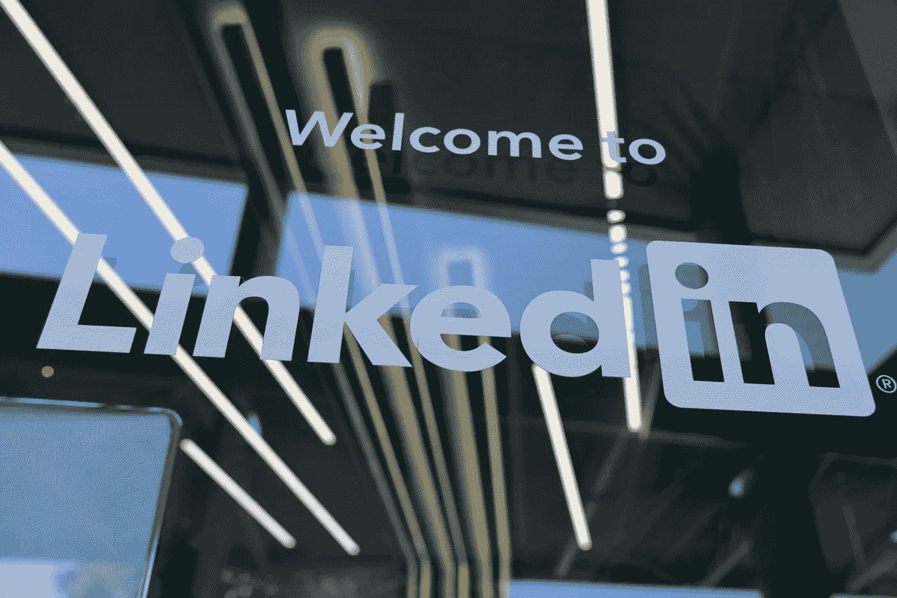
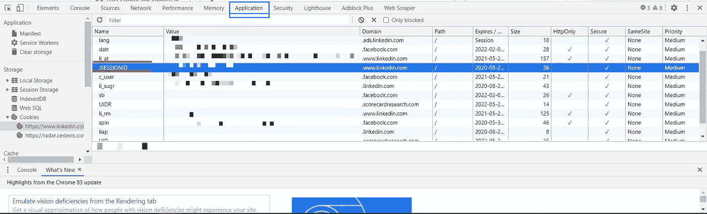

# 使用浏览器 Cookies 和 Voyager API 通过 Python 抓取 LinkedIn

> 原文：<https://towardsdatascience.com/using-browser-cookies-and-voyager-api-to-scrape-linkedin-via-python-25e4ae98d2a8?source=collection_archive---------18----------------------->

在这篇文章中，我们将使用 requests 的 Sessions 方法、浏览器 cookies 和 LinkedIn 的 voyager API 从 LinkedIn 收集数据。

格雷格·布拉在 [Unsplash](https://unsplash.com/s/photos/linkedin?utm_source=unsplash&utm_medium=referral&utm_content=creditCopyText) 上的照片

抓取 LinkedIn 每天都变得越来越困难，尤其是如果你使用像 UiPath，Selenium 等开放软件的话。LinkedIn 软屏蔽你，并在登录时添加一个 reCAPTCHA，这变得很难绕过。LinkedIn 的 voyager API 可能是从 LinkedIn 提取信息的最佳方式。

LinkedIn 的数据可以用于许多目的，从线索生成开始，搜索工作，如果你是一名招聘人员，你可以为你的组织找到合适的候选人，如果你想为你的公司找到投资者，底线是你可以使用 LinkedIn 获得数据以满足你的需求。最重要的是你必须知道你在寻找什么。

# 我们开始吧

我们将使用 LinkedIn 的 voyager API 来抓取一家公司的 about 页面。
见/找*航海家 API 的完整文档阅读* [*此处*](https://linkedin.api-docs.io/v1.0) *。*

首先，最重要的部分是获取浏览器 cookies，我们将在该过程的后期阶段使用它们。在深入研究不同类型的 Linkedin Cookies 之前，您将需要来自您的 LinkedIn 登录会话的两个主要 cookie，让我们看看如何访问我们的 cookie，只需遵循这些简单的步骤。点击谷歌浏览器中的选项(右上角有 3 个垂直点)。
2。在这之后，点击更多工具，然后是开发人员工具(你也可以通过使用键盘组合-ctrl+shift+I 来达到这里)。

现在，一旦您获得了开发人员工具的访问权限，您将看到名为 Elements、console 等选项卡。导航到 Application 选项卡，从这里复制两个 cookies 的值，分别命名为 li_at 和 JSESSIONID。

记下这两个 cookies 的值，并将其存储在某个我们稍后会用到的地方。我已经模糊了值，以防止我的帐户可能被滥用。

现在，我们已经完成了最初的部分，让我们进入有趣的部分——你猜对了——编码。

下面是完整的代码，我们一步步来看。

variables headers 是一个包含用户代理的字典，你也可以通过运行简单的 Google 搜索“我的用户代理”来使用自己的代理，你会得到类似这样的结果，只需粘贴你的结果并继续前进。

现在，LinkedIn 给每个公司页面分配一个唯一的 id，你可以很容易地找到它。一旦你有了那个，就用代码中的一来代替那个数字。

*https://www . LinkedIn . com/voyager/API/entities/companies/{公司 id}*

现在，我们将使用最初从浏览器中提取的 cookies 创建一个会话。

`s.cookies['li_at'] = "your li_at cookie"
s.cookies['JSESSIONID'] = "your JSESSIONID"`

此外，我们需要 csrf-token 身份验证，并在我们的头中设置它。为此，我们需要修改 JSESSIONID 键，您的 JSESSIONID 将如下所示:

`"ajax:7454514581611861831542146"`

将需要从 JSESSIONID 中剥离`"`，然后将其添加到标题中:

`s.headers["csrf-token"] = s.cookies["JSESSIONID"].strip('"')`

最后一部分非常简单，向 voyager API 发送 get 请求，并将响应转换为字典。

在这之后，你会看到关于该公司的所有信息。

# 脚注

有许多工具(我个人使用的一个工具是 [PhantomBuster](https://phantombuster.com/) )可以做完全相同的事情，但是在规模上，它们本质上做的是在两个请求之间放置一个等待时间以及一些其他技巧。

这个脚本只是为了提取公司的详细信息，如果你试图在一个循环中运行它来一次获得成千上万 Linkedin 公司页面的详细信息，Linkedin 会阻止你，还可能永久禁止你的帐户，这可能非常非常难以恢复。

这只是我们用 voyager API 构建的一个工作流，你可以用它做很多很酷的事情，从获取一个人的个人资料开始，回复对话，发送连接请求或回复它们，用高级过滤器进行工作搜索，喜欢或评论帖子。简而言之，你可以做任何你在 LinkedIn 上做的事情，但是有它的 API，没有 UI。如果你还想看另一篇关于其他事情的文章，请在下面评论。