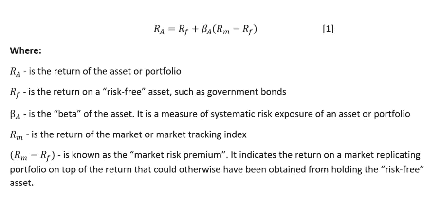
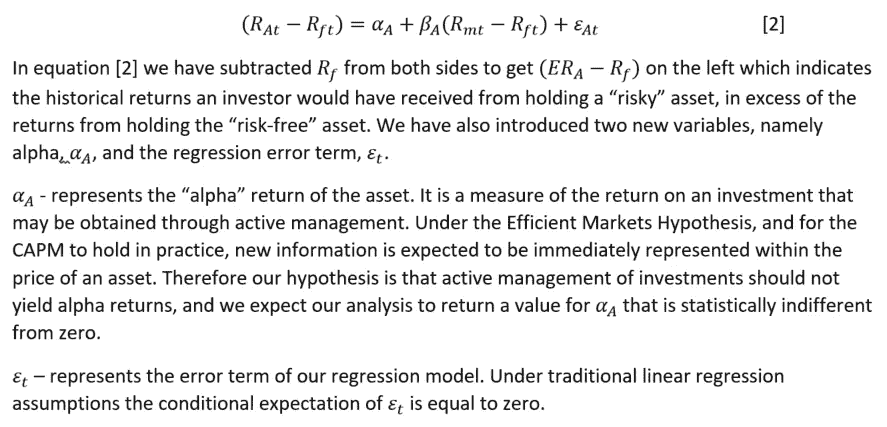
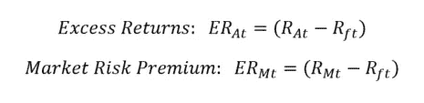
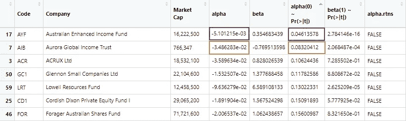
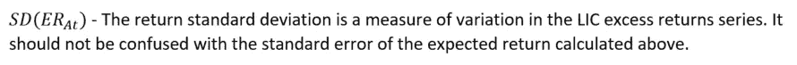
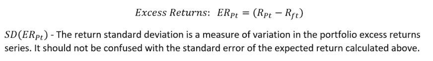
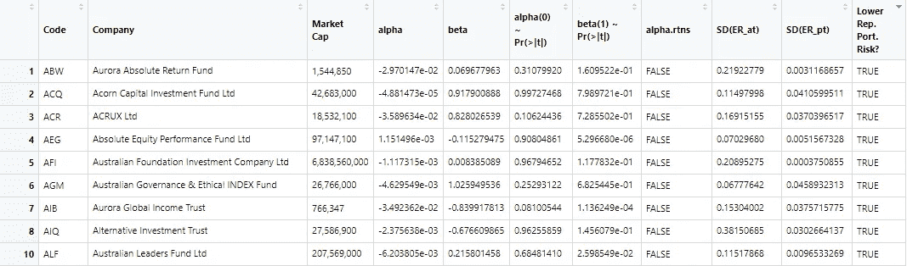

# 用 CAPM 评价上市投资公司的绩效

> 原文：<https://towardsdatascience.com/using-capm-to-evaluate-the-performance-of-listed-investment-companies-with-r-4b3301cce76b?source=collection_archive---------30----------------------->

## 投资者选择投资 LIC 证券的主要原因是追求高于市场基准的回报，即阿尔法回报。我们利用资本资产定价模型分析了 118 家 ASX 上市投资公司过去 5 年的业绩。

投资回报应该补偿投资者投入资本的时间价值，以及部分或全部投资可能损失的风险。资本资产定价模型(CAPM)在金融领域被广泛使用，作为一种手段，在给定持有特定资产而非持有“无风险”资产(如主权政府债券)的相关风险水平的情况下，确定投资者预期从投资中获得的补偿水平。

# 风险类型

*特殊(非系统)风险*——指特定资产特有的风险。可以通过分散投资和保持结构良好的投资组合来降低特殊风险(Investopedia 2019a)。

*系统性风险*——指无法通过投资组合多样化来降低的市场范围风险。虽然投资者可以建立一个投资组合来限制他们的系统风险敞口，但 CAPM 理论表明，这将伴随着他们预期获得的回报的权衡(Investopedia 2019b)。

# 资本资产定价模型与计算金融资产的预期收益

因为有可能以消除特殊风险的方式分散投资，CAPM 假设投资回报不能补偿投资者持有这种类型的风险。因此，投资者必须分散投资，以避免承担无法获得补偿的风险*。

*[*如何实现这种多样化超出了本文的范围，但是，在以后的文章中，我将讨论现代投资组合理论，该理论能够开发旨在通过资产多样化消除特殊风险的资产组合，并根据个人风险承受能力偏好获得适当的系统风险敞口水平。]*

CAPM 方法描述了一项资产的*预期回报*与其*系统风险*之间的关系。为了计算给定风险的资产的预期回报，通过 CAPM，使用以下等式:



通过操纵这个等式，我们可以利用金融资产数据和回归分析来首先评估 CAPM 理论在实践中是否成立，其次评估特定金融资产的表现。



这种方法源自 Jensen (1968)，在该方法中，系统地考察了美国共同基金的表现，以确定是否有任何基金能够“跑赢市场”(Brooks 2008，第 67-81 页)。

# 利用 CAPM 评估目前在澳大利亚证券交易所上市的投资公司的业绩

*上市投资公司(lic)——*LIC 类似于管理型共同基金，但是，投资者可以像在证券交易所买卖普通股一样买卖 LIC 股票。因此，历史定价数据在网上很容易获得，可以很容易地进行分析。一般来说，持有 LIC 证券的目的是获得 LIC 经理人的技能和专业知识，他们利用积极的投资策略来超越既定的基准。对于持有 LIC 证券的投资者，每年收取 1.0-1.5%的管理费。当回报率高于规定的基准时，低收入国家收取绩效费也并不少见，通常为基准回报率的 10-20%(first links，2016)。

*被动交易所交易基金(ETF)——*与主动管理的低收入国家不同，被动管理的 ETF 的目标是复制既定基准的表现，如市场指数(ASXETFS.com 2019)。投资者持有被动 ETF 的预期费用通常只是主动管理型低收入国家的一小部分。例如，我们的分析使用 Vanguard Australia n Shares Index ETF(VAS ),该指数试图在考虑费用之前跟踪标准普尔/ASX 300 指数的回报，截至 2020 年 5 月，费用为每年 0.1%(Vanguard 2020)。

*为什么投资者更喜欢 LIC 而不是被动型 ETF？* —使用上面介绍的 CAPM 术语，投资者选择 LIC 投资而不是被动 ETF 的主要原因是相信 LIC 经理采用的主动投资策略将产生“alpha”回报( *alpha* > 0)，同时将风险敞口降至最低。

# 实例分析——评估过去 5 年里低收入国家的绩效

以下章节将利用 Jensen (1968)的 CAPM 方法，通过获得每种证券的 *alpha* 和 *beta* 参数的估计值，来检验澳大利亚低收入国家的历史表现。此外，我们将使用我们的发现来评估构建投资组合的潜力，以复制使用被动指数跟踪交易所交易基金(ETF)，即先锋澳大利亚股票指数 ETF (VAS)和澳大利亚联邦政府债券的 LIC 资产的回报。

我们分析的首要任务是获得所需的数据。我们决定使用过去 5 年的月度回报数据，因为这是计算 CAPM 参数*的常见时间框架和频率，但是，分析和代码可以很容易地进行调整，以适应替代的时间框架和频率。在我们的分析中，我们使用了从 2015 年 6 月 1 日到 2020 年 3 月 1 日的退货数据。

*[*这是目前在雅虎(Au)上用于 beta 计算的时间框架和频率】*

## 数据收集

*LIC 列表—* 从[https://www.asxlics.com](https://www.asxlics.com/)获得当前在 ASX 交易的 118 个低收入国家的列表，作为数据帧导入 R 并清理。

```
# IMPORT AND TIDY LIC LIST #################################

LICs <- read.csv("https://www.asxlics.com/uploads/csv/20200401-lics.csv", header = TRUE)
n <- nrow(LICs)
LICs <- LICs[c(2:n), 1:3]
lic.colnames <- c("Code", "Company", "Market Cap")
names(LICs) <- lic.colnames
ticker <- as.character(LICs[,1])
row.names(LICs) <- ticker
```

*无风险利率数据—* 主权政府债券作为“无风险”资产在金融领域被广泛使用(Investopedia 2020b)。在我们的分析中，我们将使用 5 年到期的澳大利亚联邦政府债券的收益率数据*。这一数据可以从澳大利亚储备银行的网页上获得。

*[*选择 5 年时间框架只是因为它与为数据收集选择的 5 年时间框架非常匹配。]*

*[**在将这些数据导入 R 之前，我们很快在 Excel 中将日期格式化为 YYYY-MM-DD。]*

```
# IMPORT AND TIDY RISK-FREE RATE DATA ######################

Rf <- import("f2.1-data.csv") ## need to have manually formatted dates to YYYY-MM-DD in Excel
n <- nrow(Rf)
Rf <- Rf[c(12:n), c(1, 4)]
Rf <- Rf[!apply(Rf == "", 1, all),]
Rf$V1 <- as.Date(Rf$V1)
Rf$V4 <- as.numeric(Rf$V4)
Rf$V4 <- ((1+(Rf$V4/100))^(1/12)-1)
Rf <- xts(Rf$V4, order.by = Rf$V1)
names(Rf) <- c("Rf")
```

*基准指数数据—* 我们选择使用被动管理的[先锋澳大利亚股票指数 ETF (VAS)](https://www.vanguardinvestments.com.au/retail/ret/investments/product.html#/fundDetail/etf/portId=8205/?overview) 的定价数据作为市场回报的代理。该基金寻求跟踪标准普尔/ASX 300 指数的回报，因此，如果我们明确使用该市场指数的直接价格数据，或者在较小的程度上使用其他指数，如 All Ordinaries 或标准普尔/ASX 200 指数，我们预计会获得可比的结果。使用 Vanguard ETF 数据的原因是，它将使我们能够根据我们的初始 CAPM 建模轻松地生成复制投资组合。增值服务的历史价格数据从雅虎财经获得。我们使用“Adj. Close”价格数据，因为该数据系列针对股息分配进行了调整，并使我们的分析能够考虑投资者有权获得的股息现金流以及资本收益回报。

```
# IMPORT AND TIDY BENCHMARK DATA ###########################

Rb <- read.csv("https://query1.finance.yahoo.com/v7/finance/download/VAS.AX?period1=1430265600&period2=1588118400&interval=1mo&events=history")
n <- nrow(Rb)
Rb <- Rb[c(1:n-1), c(1,6)]
Rb$Date <- as.Date(Rb[, 1])
Rb <- xts(Rb$`Adj.Close`, order.by = Rb$Date)
names(Rb) <- c("Rb")
Rb$Rb <- Return.calculate(Rb$Rb, method = "log")
```

*LIC 数据—* 低收入国家清单随后被用于从[雅虎财经](https://au.finance.yahoo.com/)获得每一个低收入国家的历史定价数据。再次使用“可调接近”价格数据。使用 R，将数据与无风险数据和基准数据一起编译到一个 xts 对象中，然后进行裁剪。

```
# IMPORT AND TIDY LIC DATA #################################

url_f <- "https://query1.finance.yahoo.com/v7/finance/download/"
url_e <- ".AX?period1=1430265600&period2=1588118400&interval=1mo&events=history"
n <- nrow(LICs)
data <- merge(Rf, Rb)
k <- nrow(data)
for(i in 1:n){
  url_temp_ch <- as.character(LICs[i,1])
  url_temp <- paste(url_f, url_temp_ch, url_e, sep = "")
  Ra_temp <- data.frame(rep(NA, k))
  try(Ra_temp <- read.csv(url_temp, na.strings = c("null")), silent = T)
  n_temp <- nrow(Ra_temp)
  try(Ra_temp <- Ra_temp[c(1:n_temp-1), c(1,6)], silent = T)

  if(is.na(Ra_temp[1, 1]) != TRUE){
    Ra_temp$Date <- as.Date(Ra_temp[, 1])
    Ra_temp <- xts(Ra_temp$`Adj.Close`, order.by = Ra_temp$Date)
    header <- as.character(LICs[i,1])
    names(Ra_temp) <- header
    Ra_temp[, 1] <- Return.calculate(Ra_temp[, 1], method = "log")
    data <- merge(data, Ra_temp)
    rm(Ra_temp)
  }
  else if(is.na(Ra_temp[1, 1]) == TRUE){
    data_temp <- data
    data_temp$Rf <- rep(data_temp[1, 2], k)
    data_temp <- data_temp$Rf
    header <- as.character(LICs[i,1])
    names(data_temp) <- header
    data <- merge(data, data_temp)
    rm(data_temp)
  }
}
n <- nrow(data)
data <- data[complete.cases(data[1:n, c(1, 2)]),]
LIC.list <- names(data)
names(data) <- LIC.list
n <- ncol(data)
LIC.list <- LIC.list[3:n]
```

*生成 CAPM 变量—* 如上所述，CAPM 回归分析要求我们计算每个 LIC 的“超额收益”和“市场风险溢价”。如果我们希望导出并保存数据，这些数据将被计算并添加到一个名为“capm.data”的新数据框架中。



```
# GENERATE CAPM VARIABLES ##################################

n <- ncol(data)
capm.data <- as.xts(merge(data$Rf, data$Rb-data$Rf))
names(capm.data) <- c("Rf", "mrp")
for(i in 3:n){
  Ra.Er_temp <- as.xts(data[, i]-data$Rf)
  header <- as.character(names(data))
  header <- paste(header, ".Er", sep = "")
  names(Ra.Er_temp) <- header[i]
  capm.data <- merge(capm.data, Ra.Er_temp)
}
n <- ncol(capm.data)
LICs$Code <- LIC.list
```

## 计算 CAPM 参数α和β

编辑完数据后，我们现在准备计算 CAPM 参数*α*和*β*。为此，我们使用一系列线性回归，将我们的低收入国家的“超额收益”作为因变量，将“市场风险溢价”作为解释变量。值得注意的是，并非我们所有的低收入国家都有整个 5 年期的数据，因此，由于可用数据点较少，一些参数的估计会不太精确*。下面的代码计算参数 *alpha* 和 *beta* ，并使用 t-test 函数来生成 p 值，这样我们就可以对参数估计的精确度有所了解。

*[*同样，人们可能更喜欢调整时间框架和频率来缓解这一问题。】*

```
# LOAD t-TEST FUNCTION #####################################

ttest <- function(reg, coefnum, val){
  co <- coef(summary(reg))
  tstat <- (co[coefnum,1]-val)/co[coefnum,2]
  2 * pt(abs(tstat), reg$df.residual, lower.tail = FALSE)
}

# CALCULATE CAPM PARAMETERS ################################

n <- ncol(capm.data)
capm.para <- data.frame()
for(i in 3:n){
  try(
    capm <- lm(capm.data[, i] ~ capm.data$mrp)
  , silent = T)
  para.temp <- data.frame(rep(0, 4))
  try(para.temp <- capm$coefficients, silent = T)
  para.temp <- as.data.frame(para.temp)
  para.temp <- as.data.frame(transpose(para.temp))
  try(para.temp[1, 3] <- ttest(capm, 1, 0), silent = T)
  try(para.temp[1, 4] <- ttest(capm, 2, 1), silent = T)
  names(para.temp) <- c("alpha", "beta", "alpha(0) ~ Pr(>|t|)", "beta(1) ~ Pr(>|t|)")
  row.names(para.temp) <- as.character(LICs[i-2,1])
  capm.para[i-2, 1:4] <- para.temp[1, 1:4]
  try(rm(capm), silent = T)
  rm(para.temp)
}
row.names(LICs) <- LICs$Code
LICs <- merge(LICs, capm.para, by.x = 1, by.y = 0, all.x = TRUE, all.y = TRUE)
```

对于 *beta* ，我们简单地测试了我们的估计值与 1 无关的假设，即 LIC 证券倾向于与市场整体一致*移动。

*[*该测试和随后的 p 值与我们的特定分析路线不太相关，但是，可以修改 t 测试来测试是否与任何特定值无关，因此，如果我们选择将我们的分析深入到个别低收入国家，以及它们在历史上如何对更广泛的市场波动做出反应，这可能是有用的。]*

对于 *alpha* ，我们的假设是我们的估计值从零开始是无关紧要的，这表明我们还没有发现 LIC 经理人的表现优于市场，或者根据我们收集的数据，有证据表明 CAPM 不成立。因此，我们只需检查我们是否获得了任何 lic 的正的且具有统计显著性的 *alpha* 值。

```
# CHECK FOR POSITIVE AND SIGNIFICANT ALPHA RETURNS #########

LICs$alpha.rtns <- ifelse(LICs$`alpha(0) ~ Pr(>|t|)`<= 0.05 & LICs$alpha > 0.0, "TRUE", "FALSE")
```

我们的结果显示，在此期间，没有 LIC 取得了统计上显著的(在 95%的置信水平下)和正的 *alpha* 回报。事实上，只有一个 LIC 的估计 *alpha* 值在统计上不同于零，在这种情况下， *alpha* 值为-0.0051，这表明相对于系统风险敞口，这个 LIC 的表现低于市场。如果我们将“显著性”截止值扩大到 90%的置信水平，我们只发现一个额外的具有显著 *alpha* 值的低收入国家，同样估计为负值，表明表现不佳。因此，我们可以得出结论，我们的分析无法找到证据表明，相对于风险敞口，积极管理的地方政府投资公司为投资者带来的回报明显不同于更广泛市场的回报。



排序结果表的标题

# 构建复制产品组合

由于我们现在已经看到，低收入国家并没有通过提供具有统计意义的更高回报来超越市场，我们能够将无风险资产和市场跟踪 ETF 相结合，以更低的风险敞口复制 LIC 的回报。从我们上面关于 alpha 回报的发现中，我们知道我们的复制投资组合和 LIC 证券投资组合的预期回报在统计上不会彼此不同*。因此，如果我们能够证明，与相对 LIC 相比，我们的复制投资组合表现出较小的回报差异，我们就可以确信，这些投资组合为投资者提供了可比的回报，同时降低了风险。

*[*在这一点上，我们还需要提醒自己，我们没有考虑到地方投资公司可能收取的任何管理费或绩效费。]*

## 计算 lic 及其相对复制组合的标准差

我们首先需要使用每个 LIC 之前产生的数据序列来计算 LIC 超额收益的标准差。



```
# CALCULATE SD(x) FOR LICs #################################

k <- ncol(data)-2
sd.temp <- as.numeric(vector())
er.list <- names(capm.data)
n <- nrow(er.list)
er.list <- er.list[3:(k+2)]
for(i in 1:k){
  sd.temp[i] <- STDEV(capm.data[, er.list[i]])
}
sd.temp <- as.data.frame(as.numeric(sd.temp))
row.names(sd.temp) <- LIC.list
names(sd.temp) <- c("SD(ER_at)")
LICs <- merge(LICs, sd.temp, by.x = 1, by.y = 0, all.x = TRUE, all.y = TRUE)
```

接下来，我们需要计算复制投资组合的超额回报，首先计算每个时期的历史回报，然后减去无风险利率。由此，可以计算复制投资组合超额收益的标准差。



```
# CALCULATE SD(x) FOR REP. PORT. ###########################

k <- nrow(data)
j <- nrow(LICs)
sd.temp <- as.numeric(vector())
for(i in 1:j){
  beta.temp <- as.data.frame(rep(LICs[i, 5], k))
  rep.port.temp <- beta.temp
  Rf.temp <- as.numeric(data$Rf)
  rep.port.temp <- add_column(rep.port.temp, Rf.temp, .after = 100)
  rtn.temp <- as.data.frame(data[, 2])
  rep.port.temp <- add_column(rep.port.temp, rtn.temp, .after = 100)
  names(rep.port.temp) <- c("Beta", "Rf", "Rtn")
  port.temp <- (1-rep.port.temp$Beta)*rep.port.temp$Rf+rep.port.temp$Beta*rep.port.temp$Rtn
  rep.port.temp <- add_column(rep.port.temp, port.temp, .after = 100)
  names(rep.port.temp) <- c("Beta", "Rf", "Rtn", "Port. Rtn")
  rep.port.temp$`Port. Rtn` <- as.numeric(unlist(rep.port.temp$`Port. Rtn`))
  rep.port.temp$Rtn <- as.numeric(unlist(rep.port.temp$Rtn))
  rep.port.temp$Exc.Port.Rtn <- as.numeric(unlist(rep.port.temp$`Port. Rtn`-rep.port.temp$Rf))
  sd.temp[i] <- STDEV(rep.port.temp[, 5])
}
LICs$"SD(ER_pt)" <- sd.temp
```

最后，我们检查我们的复制投资组合的回报率的标准差是否低于 LIC 证券的回报率，这表明风险暴露较少。

```
# COMPARE SD(x) PERFORMANCE ################################

LICs$'Lower Rep. Port. Risk?' <- ifelse(LICs$`SD(ER_pt)` <= LICs$`SD(ER_at)`, "TRUE", "FALSE")
```

结果表明，对于我们分析中的每个 LIC，我们都能够产生一个复制投资组合，将被动指数跟踪 ETF 和无风险资产结合起来，这将产生可比的回报率，同时使投资者面临更小的风险。



结果表主管(包括复制组合风险分析)

# 结论

我们通过这一分析表明，在我们的样本期(2015 年 6 月 1 日至 2020 年 3 月 1 日)内，我们未能拒绝我们的假设，即 LIC 经理人无法持续提供高于持有被动指数跟踪 ETF 和无风险资产的复制投资组合所提供的回报。此外，持有 LIC 证券的投资者被收取更高的管理费，在某些情况下，还要收取绩效费，他们持有这些证券是因为他们相信，他们的 LIC 经理的专业技能将会以最低的风险敞口带来最高的回报。然而，我们已经看到，通过持有复制投资组合，投资者也将能够减少他们的风险敞口。

需要注意的是，与所有金融资产一样，过去的表现并不总是未来表现的可靠指标。上述分析使用了 5 年的月度价格数据，使用不同的时间框架和周期可能会产生不同的结果。我发布这篇文章的目的不是提供财务建议，而是分享方法和编码，让其他人根据自己的喜好复制。

*感谢您一直读到文章结尾！很想听听大家对以上的任何评价。欢迎随时留言，或者通过* [*LinkedIn*](https://www.linkedin.com/in/davidharristunks/) *联系我。*

## r 包装清单

```
# Packages #############################pacman::p_load(pacman, expss, jtools, NCmisc, PerformanceAnalytics, purrr, quantmod, rio, stats, tibble, tidyquant, utils, xts, zoo)
```

***来自《走向数据科学》编辑的提示:*** *虽然我们允许独立作者根据我们的* [*规则和指导方针*](/questions-96667b06af5) *发表文章，但我们并不认可每个作者的贡献。你不应该在没有寻求专业建议的情况下依赖一个作者的作品。详见我们的* [*读者术语*](/readers-terms-b5d780a700a4) *。*

## 参考

ASXETFS.com(2019 年)——[https://www.asxetfs.com](https://www.asxetfs.com/)【访问日期:2020 年 5 月 8 日】

ASXLICS.com(2019 年)——[https://www.asxlics.com](https://www.asxlics.com/)【访问日期:2020 年 5 月 8 日】

布鲁克斯，C . 2008，《金融计量经济学导论》，第二版，剑桥大学出版社

Firstlinks (2016 年)——[https://www . first links . com . au/understanding-lic-fee-structures](https://www.firstlinks.com.au/understanding-lic-fee-structures)【2020 年 8 月 5 日访问】

投资媒体(2019 年 a)——[https://www.investopedia.com/terms/u/unsystematicrisk.asp](https://www.investopedia.com/terms/u/unsystematicrisk.asp)【2020 年 5 月 8 日访问】

investopedia(2019 年 b)—[https://www.investopedia.com/terms/s/systematicrisk.asp](https://www.investopedia.com/terms/s/systematicrisk.asp)【2020 年 5 月 8 日访问】

investopedia(2020 a)—[https://www.investopedia.com/terms/c/capm.asp](https://www.investopedia.com/terms/c/capm.asp)【2020 年 8 月 5 日访问】

investopedia(2020 年 b)—[https://www.investopedia.com/terms/r/riskfreeasset.asp](https://www.investopedia.com/terms/r/riskfreeasset.asp)【2020 年 5 月 8 日访问】

澳洲储备银行(2020)——【https://www.rba.gov.au/statistics/tables/#interest-rates 【2020 年 08 月 05 日获取】

先锋(2020)——[https://www . vanguard investments . com . au/ret/ret/investments/product . html #/fund detail/ETF/portId = 8205/？概述](https://www.vanguardinvestments.com.au/retail/ret/investments/product.html#/fundDetail/etf/portId=8205/?overview)【访问日期:2020 年 8 月 5 日】

雅虎财经(2020 年)——[https://au.finance.yahoo.com](https://au.finance.yahoo.com/)【2020 年 5 月 8 日采访】


图片:pixabay.com