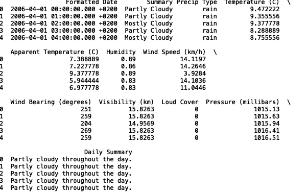
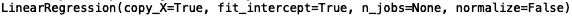
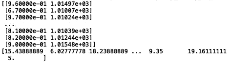
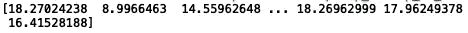
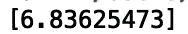
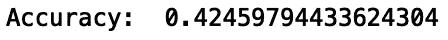

# 使用类进行机器学习

> 原文：<https://towardsdatascience.com/using-classes-for-machine-learning-2ed6c0713305?source=collection_archive---------5----------------------->

## 使用面向对象编程来构建模型


Clem Onojeghuo 在[像素](https://www.pexels.com/photo/assorted-assortment-booth-boxes-375897/)上拍摄的照片

类提供了一种结合数据和功能的有用方式。类的模块化支持有效的故障排除、代码重用和问题解决。例如，如果您的代码中断，您将能够指向一个特定的类或类方法，而不必筛选太多其他代码。由于这些因素，模型开发自然地适合于面向对象的编程实践。

在本帖中，我们将讨论如何使用面向对象编程来读取数据、分割数据以进行训练、拟合模型以及进行预测。我们将使用天气数据，这些数据可以在[这里](https://www.kaggle.com/budincsevity/szeged-weather)找到。

在我们开始之前，让我们进口熊猫:

```
import pandas as pd 
```

现在，让我们定义一个名为 Model 的类:

```
class Model:
    def __init__(self, datafile = "weatherHistory.csv"):
        self.df = pd.read_csv(datafile)
```

该类将有一个“__init__”函数，也称为构造函数，它允许我们在创建该类的新实例时初始化数据。我们可以将一个新变量“model_instance”定义为一个对象(模型类的一个实例):

```
if __name__ == '__main__':
    model_instance = Model()
```

我们应该能够通过对象“model_instance”访问数据框让我们调用数据框并打印前五行数据:

```
if __name__ == '__main__':
    model_instance= Model()
    print(model_instance.df.head())
```



看起来不错。

接下来我们可以在初始化函数中定义一个线性回归对象。不要将它与“model_instance”混淆，后者是我们的自定义类“model”的一个实例:

```
class Model:
    def __init__(self, datafile = "weatherHistory.csv"):
        self.df = pd.read_csv(datafile)
        self.linear_reg = LinearRegression()
```

同样，值得注意的是 LinearRegression 是一个独立于我们的自定义“模型”类的类，并且在代码行中:

```
self.linear_reg = LinearRegression()
```

我们正在定义 LinearRegression 类的一个实例。

现在，让我们确保可以访问我们的线性回归对象:

```
if __name__ == '__main__':
    model_instance = Model()
    print(model_instance.linear_reg)
```



接下来我们要做的是定义一个方法，让我们分割数据用于训练和测试。该函数将采用一个“test_size”参数，让我们指定训练和测试的规模。

首先，让我们从“sklearn”中导入“train_test_split”方法，并导入“NumPy”:

```
from sklearn.model_selection import train_test_split
import numpy as np
```

我们将建立一个线性回归模型来预测温度。为简单起见，让我们用“湿度”和“压力(毫巴)”作为输入，用“温度”作为输出。我们将分割方法定义如下:

```
def split(self, test_size):
        X = np.array(self.df[['Humidity', 'Pressure (millibars)']])
        y = np.array(self.df['Temperature (C)'])
        self.X_train, self.X_test, self.y_train, self.y_test = train_test_split(X, y, test_size = test_size, random_state = 42)
```

接下来，让我们打印“X_train”和“y_train”以供检查:

```
if __name__ == '__main__':
    model_instance = Model()
    model_instance.split(0.2)
    print(model_instance.X_train)
    print(model_instance.y_train)
```



我们现在将为线性回归模型定义一个“拟合”函数:

```
def fit(self):
        self.model = self.linear_reg.fit(self.X_train, self.y_train)
```

我们还将定义一个“预测”函数:

```
def predict(self):
        result = self.linear_reg.predict(self.X_test)
        return result
```

现在，让我们打印我们的测试预测，其中测试规模是数据的 20%:

```
if __name__ == '__main__':    
    model_instance = Model()   
    model_instance.split(0.2)    
    model_instance.fit()
    print(model_instance.predict())
```



我们还可以打印模型性能:

```
if __name__ == '__main__':
    model_instance = Model()
    model_instance.split(0.2)
    model_instance.fit()    
    print("Accuracy: ",     model_instance.model.score(model_instance.X_test, model_instance.y_test))
```


我们还可以向我们的 predict 方法传递一个“input_value”参数，这将允许我们做出样本外的预测。如果“无”通过，则将对测试输入进行预测。否则，将对“输入值”进行预测:

```
def predict(self, input_value):
    if input_value == None:
        result = self.linear_reg.predict(self.X_test)
    else: 
        result = self.linear_reg.predict(np.array([input_value]))
    return result
```

让我们用一些样本外的测试输入来预测:

```
if __name__ == '__main__':
    model_instance = Model()
    model_instance.split(0.2)
    model_instance.fit()    
    print(model_instance.predict([.9, 1000]))
```



我们还可以将随机森林回归模型对象定义为模型字段，并运行我们的脚本:

```
class Model:
    def __init__(self, datafile = "weatherHistory.csv"):
        self.df = pd.read_csv(datafile)
        self.linear_reg = LinearRegression()
        self.random_forest = RandomForestRegressor()
    def split(self, test_size):
        X = np.array(self.df[['Humidity', 'Pressure (millibars)']])
        y = np.array(self.df['Temperature (C)'])
        self.X_train, self.X_test, self.y_train, self.y_test = train_test_split(X, y, test_size = test_size, random_state = 42)

    def fit(self):
        self.model = self.random_forest.fit(self.X_train, self.y_train)

    def predict(self, input_value):
        if input_value == None:
            result = self.random_forest.fit(self.X_test)
        else: 
            result = self.random_forest.fit(np.array([input_values]))
        return result if __name__ == '__main__':
    model_instance = Model()
    model_instance.split(0.2)
    model_instance.fit()    
    print("Accuracy: ", model_instance.model.score(model_instance.X_test, model_instance.y_test))
```



您可以轻松地修改代码来构建支持向量回归模型、“xgboost”模型等等。我们可以通过向构造函数传递一个参数来进一步一般化我们的类，当指定时，该构造函数从可能的模型列表中选择。

逻辑可能看起来像这样:

```
class Model:
    def __init__(self, datafile = "weatherHistory.csv", model_type = None):
       self.df = pd.read_csv(datafile) if model_type == 'rf':
            self.user_defined_model = RandomForestRegressor() 
       else:
            self.user_defined_model = LinearRegression()
```

并且修改了“拟合”和“预测”方法:

```
 def fit(self):
        self.model = self.user_defined_model.fit(self.X_train, self.y_train)

    def predict(self, input_value):
        if input_value == None:
            result = self.user_defined_model.fit(self.X_test)
        else: 
            result =     self.user_defined_model.fit(np.array([input_values]))
        return result
```

我们执行如下:

```
if __name__ == '__main__':
    model_instance = Model(model_type = 'rf')
    model_instance.split(0.2)
    model_instance.fit()    
    print("Accuracy: ", model_instance.model.score(model_instance.X_test, model_instance.y_test))
```


如果我们传递“None ”,我们会得到:

```
if __name__ == '__main__':
    model_instance = Model(model_type = None)
    model_instance.split(0.2)
    model_instance.fit()    
    print("Accuracy: ", model_instance.model.score(model_instance.X_test, model_instance.y_test))
```


我将在这里停下来，但我鼓励您添加额外的模型对象。您可以尝试的一些有趣的例子是支持向量机、“xgboost”回归和“lightgbm”回归模型。添加帮助器方法也很有用，这些方法可以为任何数字列生成汇总统计信息，如平均值和标准偏差。您还可以定义通过计算统计数据(如相关性)来帮助您选择要素的方法。

概括地说，在这篇文章中，我讨论了如何在面向对象编程框架中构建机器学习模型。这个框架对于故障诊断、问题解决、字段收集、方法收集等等非常有用。我希望您能在自己的数据科学项目中找到 OOP 的用处。这篇文章的代码可以在 GitHub 上找到。感谢阅读，机器学习快乐！