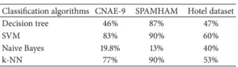
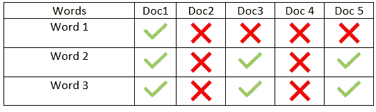
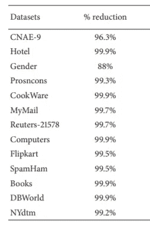
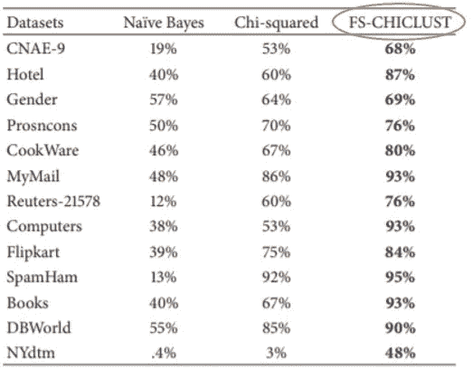
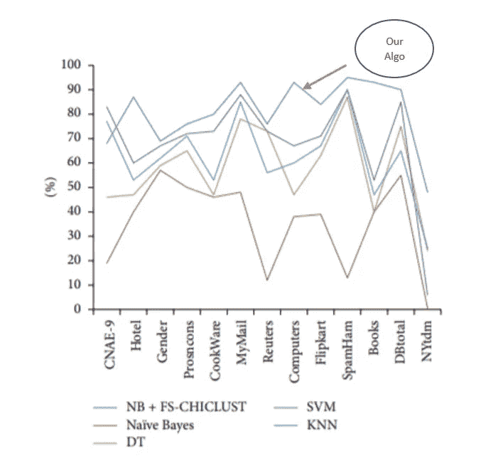
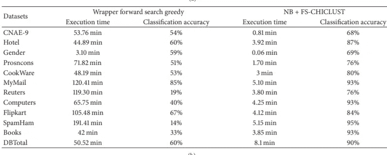

# 使用聚类改进分类—一个用例

> 原文：<https://towardsdatascience.com/using-clustering-to-improve-classification-a-use-case-afb92106088e?source=collection_archive---------48----------------------->

## 提升朴素贝叶斯文本分类

在今天的博客中，我们将给出一篇发表在印度期刊《国际学术研究通知》上的早期文章的直觉。标题中给出了故事的情节。体裁是文本分类。主角是朴素贝叶斯和 k 均值。

这篇文章有两个目的

*   激励你尝试自己的直觉(开始可能有点疯狂，比如使用聚类进行分类，实际上我被我的一位教授骂了一顿)并转化为正式的方法
*   将作为将直觉转化为成熟的研究文章的蓝图。最重要的部分是你如何系统地建立你的工作方法。

它可以分为以下任务

**任务 1:确定朴素贝叶斯需要改进**

我们选取了 3 个公开可用的数据集。挑选了另外 3 种最大似然算法，并做了实证研究。

图 1:朴素贝叶斯与其他分类器(来源:作者)

这足以说明与其他算法相比，朴素贝叶斯的性能确实不佳。

**提示**:为了再现性，给出尽可能多的程序细节。挑选足够流行的算法进行比较。

还值得努力吗？我举两个论据，朴素贝叶斯是最容易理解的方法之一，其次，它相当快。

为了快速理解朴素贝叶斯，您可以使用参考文献 3

任务 2:发展直觉

这没有固定的公式。我们的想法是朴素贝叶斯假设特征或属性相互独立。这是它非常快的原因之一，同时这也是一个限制的弱点。对于文本分类，单词是我们的特征。具体来说，使用由来已久的 tf-idf 技术将文本转换成数字。更多的细节你可以查阅参考文献 5。

T 也就是说，如果它想吃披萨，就给他吃披萨，而不是全餐自助餐。

**我们如何找到独立的或者相对独立的单词？**

**嵌入**:第一步是拥有单词的特征表示。我们的观点是，如果两个单词在文档中出现的频率相似，那么它们就是相似的。我们来举个例子。

图 2:单词的嵌入(来源:作者)

如果我们看上面的表，并假设勾号表示文档中存在该单词，而叉号表示文档中不存在该单词，那么我们可以得出结论

*   单词 1 和单词 2 不相似
*   单词 2 和单词 3 相似

现在，如果我们把这种直觉松散地延伸一下，得出不是很相似的词相对独立的结论，可能不是很不正确。

**如何轻松找到一组相对独立的单词？**

字数和文档数量都很庞大。我们怎么可能在这么大的矩阵中找到它呢？另一个直觉，如果我们能根据相似度对特征进行分组，我们能不能不得到相对独立的词(特征)组。怎么做？这难道不像是一个集群问题吗？**答对了！**我们简单的对单词嵌入使用 k-means

*   形成 k 个聚类，每个聚类将有一组相似的单词
*   从每个聚类中选出一个有代表性的单词(最接近平均值)

这是论文的关键所在。有一些细微的差别，我会推荐你读这篇文章。我们首先使用卡方来删除一些特征(改天会有更多)，让我们假设它有助于剔除无关紧要的单词。这种特征选择方法，我们称之为 **FSCHICLUST。**

我们可能有兴趣知道，通过这种方法减少了多少单词？

图 FSCHICLUST 实现的特征减少百分比(来源:作者)

我们可以从图 3 中看到，现在使用的单词数量显著减少。你一定很怀疑，就这么几句话，真的有用吗？我们现在回答这个问题。

**任务 3:建立你的方案作品**

这是一个棘手的部分，我们需要通过打破它来真正地计划好它。

*   首先，它比普通的朴素贝叶斯好吗？
*   其次，如果是(第一个问题的答案),那么性能是否可以与其他分类器相比？
*   第三，如果我们用朴素贝叶斯应用任何标准的特征选择算法，我们的方法工作得更好吗？

*我们必须证明这些词集是否提供了更好的分类准确性，这次我们增加了数据集的数量。*

图 4:使用 FSCHICLUST 的朴素贝叶斯和特征选择(来源:作者)

与其他分类器相比，它做得好吗？分类器在相同的数据集上进行比较。

图 5:改进的朴素贝叶斯与其他分类器(来源:作者)

*第三，与其他特征选择算法相比，它做得好吗*

图 6:使用其他特征选择算法提出方法(来源:作者)

因此，我们看到我们所有的问题都得到了很好的满足，所以它可能也会满足审查者。

**结论:**

在本文中，我们讨论了如何使用 k-means 在文本分类中改进朴素贝叶斯。

*   我们首先确定朴素贝叶斯做得不好。
*   然后，我们开发了一个基于聚类的特征选择方案，只选择几个词
*   论证这个方案的工程，如前所述，这必须系统地进行，可能是最重要的一点。

**参考文献**:

[1] Dey Sarkar S，Goswami S，Agarwal A，Aktar J .使用朴素贝叶斯进行文本分类的新特征选择技术。国际学术研究通知。2014;2014.(【https://www.hindawi.com/journals/isrn/2014/717092/】T2

[2] Sarkar、Subhajit Dey 和 Saptarsi Goswami。“基于过滤器的文本分类特征选择方法的实证研究。”*国际计算机应用杂志* 81.6 (2013)。

[3][https://towards data science . com/all-about-naive-Bayes-8e 13 cef 044 cf](/all-about-naive-bayes-8e13cef044cf)

[https://archive.ics.uci.edu/ml/datasets.php](https://archive.ics.uci.edu/ml/datasets.php)

[5][https://towards data science . com/natural-language-processing-feature-engineering-using-TF-IDF-E8 b 9d 00 e 7 e 76](/natural-language-processing-feature-engineering-using-tf-idf-e8b9d00e7e76)