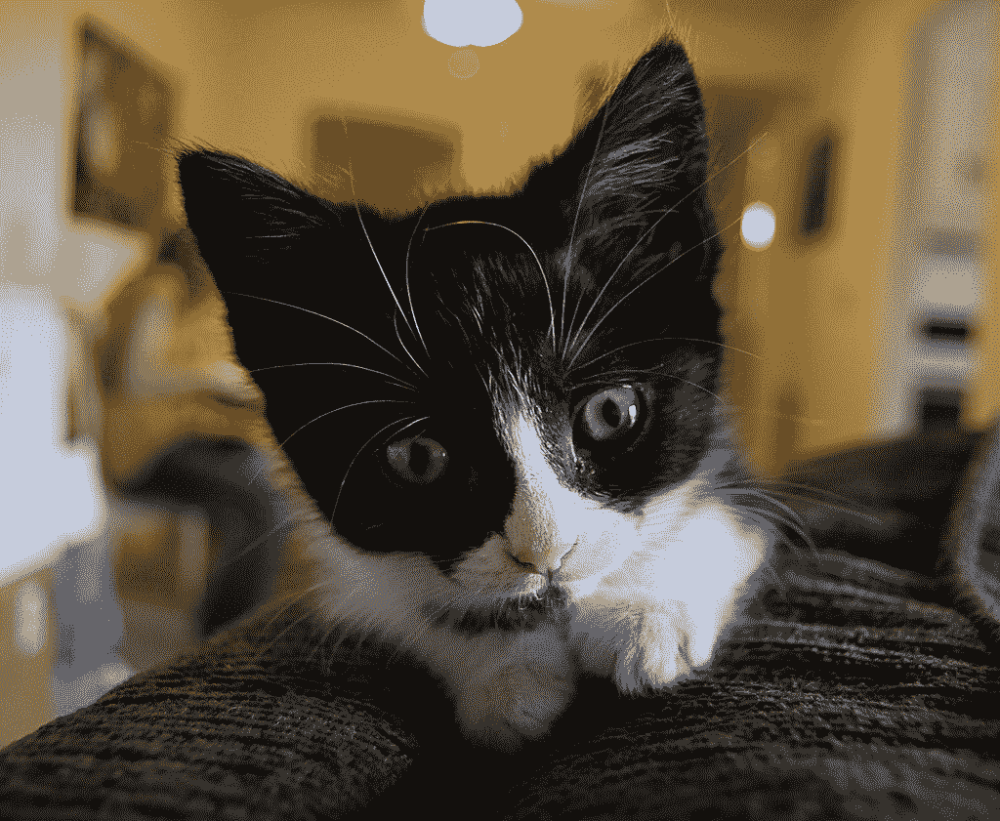

# 利用计算机视觉寻找最佳猫咪照片

> 原文：<https://towardsdatascience.com/using-computer-vision-to-find-the-best-cat-photo-from-a-video-fd11c43596b8?source=collection_archive---------58----------------------->

## 与 YOLO、哈尔·卡斯卡特和 CPBD 一起

作者:基拉·巴拉德，安德鲁·傅，什拉万·纳格斯瓦兰，艾米莉·谢

*这篇博客文章介绍了作者在哈佛应用计算科学研究所与 Austin Pets Alive 合作的* [*顶点*](https://www.capstone.iacs.seas.harvard.edu/) *课程项目中所做的工作！领养孩子。本文所表达的观点仅代表作者的观点，并不代表他们的合作组织。*

# **TL；博士**

我们使用 ML 和计算机视觉技术来优化收容所猫的照片，以提高它们的收养率。见[此视频](https://drive.google.com/open?id=1my7nXpWfzQm6papgjGclM-S8713xUOWb)或[此海报](https://drive.google.com/file/d/1YBNkckH_-9nSLmKt-p5Lb3fVfCkVXJAq/view?usp=sharing)。

# 介绍

鉴于美国动物收容所的拥挤问题，每年有数百万收容所的动物被实施安乐死。奥斯汀宠物活着！总部位于德克萨斯州的关注动物福利的组织 APA 试图通过倡导不杀动物来解决这个问题。作为他们努力的一部分，他们已经与一家技术公司 [Adoptimize](https://adoptimize.co/) 合作，该公司提供软件来自动选择给定动物视频的最佳照片。由此产生的高质量照片转化为增加的收养率，从而降低安乐死率。然而，尽管 Adoptimize 产生了重大影响，但他们的技术只对狗有效，并不能推广到其他动物。

照片来自[https://adoptimize.co/](https://adoptimize.co/)

考虑到收养率较低，收容所的猫比它们的犬类同伴更需要这项技术。作为我们在哈佛的顶点项目的一部分，我们与 APA 和 Adoptimize 合作，为猫开创了一个类似的过程，总体目标是提高猫的收养率，以减少它们安乐死的机会。因此，这个项目的目标是产生一个模型，当给定一个猫的视频时，它能选择最佳的帧。我们最终设计了一个逻辑回归模型，对通过各种计算机视觉技术提取的特征进行预测。

[trieu88](https://www.flickr.com/photos/90812846@N00) 的[【coraline 1】](https://www.flickr.com/photos/90812846@N00/3529253428)在 [CC BY-ND 2.0](https://creativecommons.org/licenses/by-nd/2.0/?ref=ccsearch&atype=rich) 下获得授权

# **数据和标签**

我们的数据由我们的合作伙伴提供的 79 个收容所猫的视频组成。一眼看去，这些视频平均持续时间为 23 秒，最短 2 秒，最长 55 秒。它们大多以每秒 60 帧的速度播放，分辨率一般为 200 万像素。

图 1:直方图显示，我们数据集中的大部分视频大约为 20 秒或更短，而所有视频都不到一分钟。

为了更好地理解我们的数据集，这里有一个示例视频:

 [## sample _ 猫 _ 视频. mp4](https://drive.google.com/file/d/1YLAgFqWCqntUvnshHlOey7RbO4oDZ91m/view) 

虽然筛选起来很有趣，但这些数据在规模和质量方面带来了一些挑战。例如，许多视频是在弱光环境下拍摄的。有时猫在狗窝里，笼子的栅栏挡住了任何清晰的视线。在行为方面，有些猫特别胆小，躲着镜头。数据的另一个挑战是视频质量，因为许多视频是在移动设备上拍摄的，而不是在更高分辨率的摄像机上拍摄的。最后，数据集的大小有限，因为我们只有 79 个视频可以处理。

最重要的是，一个主要的障碍是我们的数据没有按照图像质量来标注。由于受监督的机器学习方法将最好地支持我们获得最佳照片的目标，我们需要找到一种以系统方式标记帧质量(因变量)的方法。

为了实现这一点，我们编写了一个简单的脚本，在我们的数据集中随机采样快照，通过一个准系统 UI 提供给我们，并记录我们的注释。对于质量本身的衡量，我们使用了通常在心理测量调查表格中使用的李克特量表，从 1 到 5 指定一个值，1 表示质量最低的照片，5 表示质量最高。在第一轮“实践”评分之后，为了就哪种类型的图像对应于每个李克特值达成普遍一致，我们坐下来，在我们的视频中共标记了 471 帧。

图 2:我们的标签界面截图。

在检查生成的数据集时，我们发现它略有偏差，因为高质量帧的比例很低(只有 12%的帧得分为 5)。因此，我们决定通过从互联网上获取额外的 20 个剪辑并对它们重复标记过程来扩展这个数据集，使我们的总数据集超过 500 个。唯一的挑战是互联网上没有猫的视频——任何地方都没有。

# **特征工程**

## **物体检测**

我们怀疑我们缺乏足够的数据用于深度学习方法，所以我们在合作伙伴的领域知识的指导下，将我们的努力集中在特征工程上。我们的第一个任务是检测一帧中是否有猫。我们研究了两种不同的对象检测算法:哈尔级联分类器[ [1](#16c7) ](一种相对传统的方法)以及 YOLO [ [2](#b47b) ](更接近最先进的技术)。

Haar 级联分类器使用 Haar-like 特征，该特征是相邻矩形区域中像素强度的和与差。Haar-like 特征用于训练决策树桩的 AdaBoost 集合。一系列这样的集成以增加的复杂度和降低的假阳性率来构造，从而尽可能快地拒绝负样本。我们能够使用在 OpenCV 中的猫脸上训练的开箱即用的实现。

YOLO 采用卷积神经网络(CNN)的形式，是一种单程对象检测算法，为对象提出边界框，并同时对它们进行分类。图像被分成网格，每个单元负责产生固定数量的边界框(包括边界框包含对象的置信度)以及类的概率分布，假设存在对象。在[这个训练设置](https://blog.insightdatascience.com/how-to-train-your-own-yolov3-detector-from-scratch-224d10e55de2)和[猫数据集](https://www.kaggle.com/crawford/cat-dataset) [ [3](#32f5) ]的帮助下，我们使用了在 ImageNet 上预先训练的 YOLO 网络，并对其进行了微调，以检测猫的头部、耳朵、眼睛和鼻子。

图 3:由 [Richardpics2](https://www.flickr.com/photos/139036569@N06) 拍摄的照片 [cat-5](https://ccsearch.creativecommons.org/photos/9762d4cc-6ba6-4b0a-94a7-63e014c893c4?fbclid=IwAR0LXO4BOpCWASlN_DVK9kq43UDYX9gKJoVZJx5mvgsJ3wHmC0fKtQIYkFE) 上通过我们微调的 YOLO 模型提取的特征。 [CC PDM 1.0](https://creativecommons.org/publicdomain/mark/1.0/) 。

我们决定使用 YOLO 网络进行对象检测，而不是 Haar 级联分类器，因为它具有更高的召回率和一次检测多个特征的能力。我们将检测到的鼻子、眼睛和耳朵的置信度分数保存为一组预测值。

图 4:鼻子和眼睛的定量对象检测特征测量相对于每一帧的我们的标记类的曲线图都显示了有希望的相关性。

## **衍生特征**

使用边界框，我们能够计算一组额外的特征，包括:

*   从头部中心到框架中心的距离
*   头部相对于框架的大小
*   两只眼睛大小的比例
*   两只耳朵大小的比例

我们认为，头部与图像中点的距离将反映出猫的居中程度，而头部的相对大小将作为猫在图像中所占百分比的一个不错的代表。最后，通过眼睛和耳朵的比例，我们旨在捕捉猫的脸可能偏离相机的角度。

## 锐利

由于图像清晰度往往是照片质量的一个因素，我们研究了两种不同的清晰度指标:应用拉普拉斯滤波器后像素强度的方差，以及模糊检测的累积概率(CPBD) [ [4](#d2a2) ]。在将这两种方法应用于我们的数据集时，我们只测量了猫头部边界框内区域的锐度。

我们从拉普拉斯方差开始，但是发现这个度量不能准确地表示图像的清晰度。然而，CPBD 指标与我们的数据集表现出了稍好的相关性，并且更容易处理，因为它是在 0-1 范围内标准化的。因此，我们最终选择这种方法作为我们的图像清晰度的措施。

## EDA 预测器

在对我们的特征进行进一步的探索性数据分析后，我们发现产生最有希望的相关性的预测因子是由 YOLO 产生的检测到的眼睛、鼻子和耳朵的置信度值。这是有意义的，因为网络的训练数据大多包含正面朝向的猫的图像，这些图像具有安静的特征(警觉的眼睛，没有咆哮的鼻子等)——这些特征在一张好的猫收养照片中是可取的。

图 5:针对耳朵的定量对象检测特征测量和针对每一帧的我们的标记类别的锐度的图都显示了有希望的相关性。

有趣的是，我们也注意到清晰度和图像质量之间的关系并不*那么明显。经过进一步思考，这可能是因为“好”的猫照片不一定是最清晰的——一张适度清晰、但带有温暖模糊的照片可能比一张猫脸转向一侧的非常清晰的照片更有吸引力。*

此外，我们在要素中发现了某种程度的多重共线性，这需要在建模中解决。

图 6:我们的预测因子的相关矩阵显示了共线性。

# **造型**

## **基线模型**

对于我们的基线，我们用来对我们开发的模型进行测试，我们只是从输入视频中返回任何检测到猫头的随机帧。

## **初始模型**

我们最初的模型基于特征的主观函数，其中我们对子集应用任意权重——在对我们的特征进行更深入的研究之前——我们直觉地认为最相关的是:锐度和头部大小。然后，该模型根据这两个特征的相对排名对每一帧进行评分，并返回得分最高的图像。

然而，这个最初的模型主要是作为一个粗略的概念证明。一旦我们有了足够数量的带注释的数据，我们在构建最终模型时就转向一种更有纪律的数据驱动的方法。

## **最终模型**

我们最终使用了一个逻辑回归分类器来预测给定每个特征的图像质量标签。我们应用 L1 正则化来解决我们在要素中发现的一些共线性。为了进一步调整，我们检查了系数，发现头部的大小和它与中心的距离证明是没有意义的，所以我们删除了这些特征。

最终的模型通过回归运行每一帧，然后选择具有最大可能性的图像作为好或优秀(在 Likert 标度上分别为 4 级或 5 级)。

乍一看，这个模型表现得相当不错。如果我们将先前的示例视频传递给它，我们将返回以下帧:

我们的逻辑回归模型选择的“最佳”框架。

考虑到原始视频很少提供猫完全可见的镜头(因为狗窝栅栏经常与猫重叠)，以及经常转向天花板或地面的抖动相机，这被证明是一个特别好的结果(当然，我们通过测试定量评估性能，在下一节中进一步描述)。

## **其他模式探索**

虽然逻辑回归最终产生了最好的结果，但我们也用其他模型进行了实验。简单地说，我们尝试了线性回归，但是发现它产生了无法解释的结果，并且没有胜过逻辑回归。

接下来，我们尝试从头开始训练 CNN。然而，根据我们调整参数的方式，准确性分数仅在 30–40%之间。这很可能是由于我们的数据集的大小，它对于模型中的参数数量来说太小了。这可能是由于给定剪辑中的许多采样帧在逐个像素的基础上是相似的，并且被类似地评级，从而导致网络学习适应特定的视频。

作为应用深度学习的最后一次尝试，我们还研究了迁移学习，使用了在 ImageNet 上预先训练的 InceptionV3 网络。这产生了同样令人失望的结果。

# **最终结果**

考虑到这个问题固有的主观性质——因为没有量化标准来认为一张照片比另一张照片“更好”——我们创建了一个受 A/B 测试启发的框架来评估我们的模型相对于基线的性能。该界面以随机顺序向用户呈现两张照片:一张由开发的模型生成，另一张由基线生成。不知道哪个是哪个的用户必须选择他们认为更好的图像。

图 7:我们的基本盲 A/B 测试框架的界面。

利用这一点，我们根据基线评估了初始和最终模型的性能，并发现了有希望的结果。

初始模型在 64%的时间里被选择在基线之上，而我们的最终模型在 75%的时间里被选择在基线之上，证明了显著的改进(注意，不同的测试集被用于评估两个模型)。如果我们认为照片质量与基线不可区分是成功的，那么我们最终模型的性能指标是*甚至*更好: **96%的时候，用户要么喜欢我们最终模型的框架，要么无法将其与基线区分开来。**

图 8:逻辑回归模型性能的最终结果。

# **总结与未来工作**

通过我们改进的逻辑回归模型，我们的项目证明是成功的，至少在 96%的视频上表现得和基线一样好。我们最终交付给合作伙伴的是一个 web 应用原型，它允许用户上传一只猫的视频，并随后显示我们的模型认为是最好的帧。

在我们项目的范围之外，如果有更多的时间，我们还想探索许多项目。首先，web 应用原型需要相当长的时间来运行，主要是由于逐帧的 YOLO 对象检测。对于较长的视频来说尤其如此，因此并行化这个过程会很有帮助。此外，测量我们的项目一旦被我们的合作伙伴采用后的下游影响将是令人满意的——也就是说，在使用我们的模型返回的照片的情况下，确定猫的收养率是否确实提高了。

最后，作为数据科学家，我们永远不会完全完成；我们总是有能力完善和改进我们的模型——无论这意味着找到可扩展的方法来收集更多数据，还是进行进一步的实验来调整参数。

就这样，我们留给你一张猫的照片。祝你在网上找到另一个。

[personaltrainertoronto](https://www.flickr.com/photos/121183998@N08) 的[《Kitty》](https://www.flickr.com/photos/121183998@N08/43121058814)由 2.0 的 [CC 授权](https://ccsearch.creativecommons.org/photos/null?ref=ccsearch&atype=rich)

# **致谢**

我们要感谢我们在奥斯汀宠物生活和收养的合作伙伴，以及我们的课程导师克里斯·坦纳，感谢他们在整个项目中的指导。最后，我们要感谢哈佛大学[应用计算科学研究院](https://iacs.seas.harvard.edu/home)给予我们的大力支持。

# **链接**

github:[https://github . com/iacs-capstone-2020-adoptimize/final _ project](https://github.com/iacs-capstone-2020-adoptimize/final_project)

# **参考文献**

[1] P. Viola 和 M. Jones，“使用简单特征的增强级联的快速对象检测”，2001 年 IEEE 计算机学会关于计算机视觉和模式识别会议的*会议录。CVPR 2001 年*，第 1 卷，第 I-I 页，2001 年 12 月

[2] J. Redmon，S. Divvala，R. Girshick 和 a .法尔哈迪，“你只看一次:统一的实时对象检测”， *2016 年 IEEE 计算机视觉和模式识别会议(CVPR)* ，内华达州拉斯韦加斯，2016 年，第 779–788 页

[3] W. Zhang，J. Sun，和 X. Tang，“猫头检测-如何有效地利用形状和纹理特征”，欧洲计算机视觉会议*第 802–816 页，Springer，2008 年。*

[4] N. D. Narvekar 和 L. J. Karam，“一种基于模糊检测累积概率的无参考图像模糊度量(CPBD)，”IEEE 图像处理汇刊*,*，第 20 卷，第 9 期，第 2678-2683 页，2011 年 9 月，doi:10.1109/tip . 2011 . 26661 . 2020106