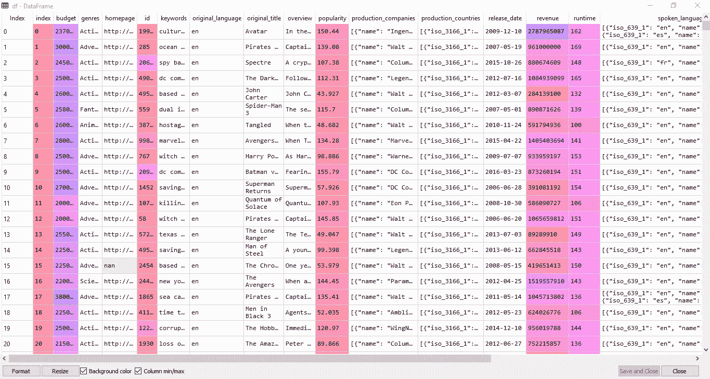
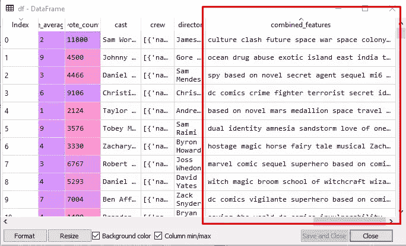
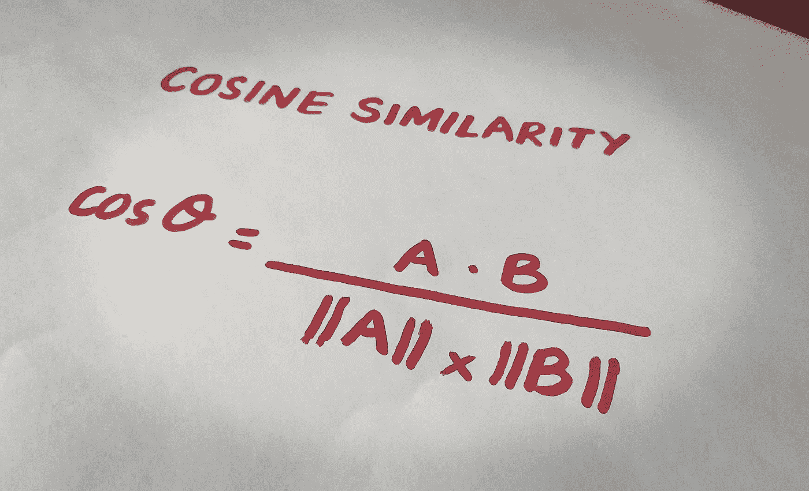
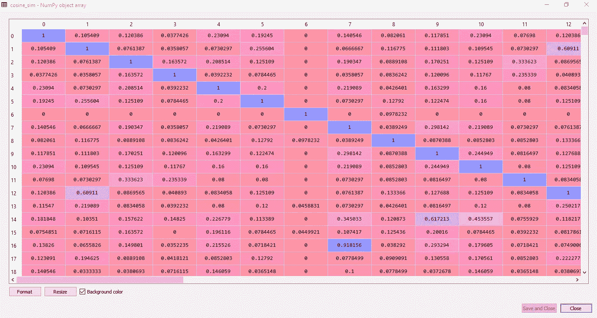
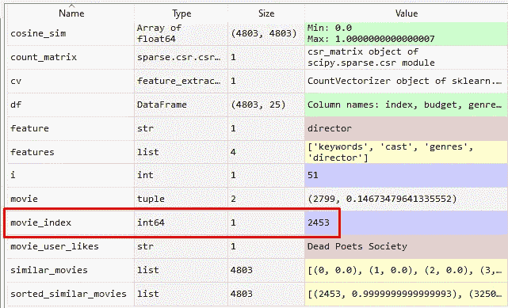
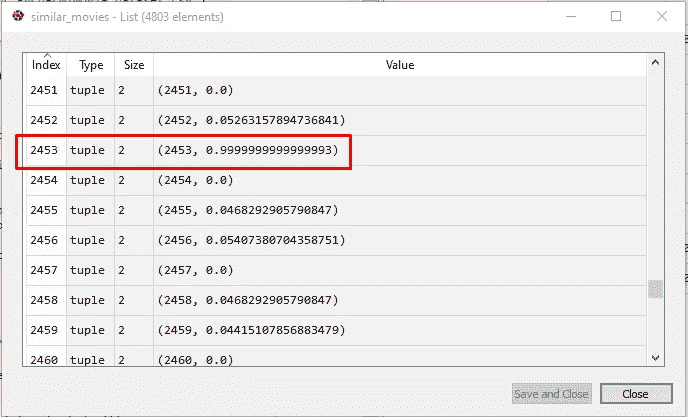
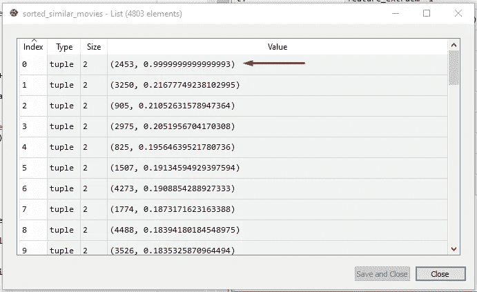
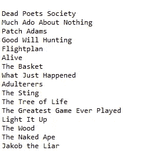

# 利用余弦相似度构建电影推荐系统

> 原文：<https://towardsdatascience.com/using-cosine-similarity-to-build-a-movie-recommendation-system-ae7f20842599?source=collection_archive---------3----------------------->

## 使用余弦相似性构建基于 Python 的电影推荐系统的分步指南


图片由 [Jade87](https://pixabay.com/users/jade87-3234870/?utm_source=link-attribution&utm_medium=referral&utm_campaign=image&utm_content=4011346) 来自 [Pixabay](https://pixabay.com/?utm_source=link-attribution&utm_medium=referral&utm_campaign=image&utm_content=4011346)

你有没有想象过，在你已经喜欢的电影的基础上，你在高中学习的一个简单的公式会在推荐你一部电影的过程中发挥作用？

好了，现在我们使用**余弦相似度**(归一化向量的点积)来构建一个**电影推荐系统**！

# 什么是推荐系统？

**推荐系统**是一类重要的机器学习算法，为用户提供“相关”建议。Youtube、亚马逊、网飞，都在推荐系统上发挥作用，系统根据你过去的活动(**基于内容的过滤**)或根据与你相似的其他用户的活动和偏好(**协同过滤**)向你推荐下一个视频或产品。同样，脸书也使用推荐系统来推荐你线下可能认识的脸书用户。


照片由[格伦·凯莉](https://unsplash.com/@glencarrie?utm_source=medium&utm_medium=referral)在 [Unsplash](https://unsplash.com?utm_source=medium&utm_medium=referral) 上拍摄

推荐系统的工作基于内容或访问内容的用户之间的相似性。

有几种方法可以衡量两个项目之间的相似性。推荐系统使用这个**相似矩阵**向用户推荐下一个最相似的产品。

在本文中，我们将构建一个机器学习算法，根据用户喜欢的电影推荐电影。这个机器学习模型将基于**余弦相似度**。

# 获取数据集

构建电影推荐系统的第一步是获取适当的数据。您可以从网上下载电影数据集，或者从下面的链接下载，该链接包含一个 22MB 的 CSV 文件，标题为“ **movie_dataset.csv** ”:

[](https://github.com/MahnoorJaved98/Movie-Recommendation-System/blob/main/movie_dataset.csv) [## mahnoorjaved 98/电影推荐系统

### 此时您不能执行该操作。您已使用另一个标签页或窗口登录。您已在另一个选项卡中注销，或者…

github.com](https://github.com/MahnoorJaved98/Movie-Recommendation-System/blob/main/movie_dataset.csv) 

现在让我们来探索数据集吧！

我们的 CSV 文件总共包含了 **4802 部电影**和 **24 个栏目**:索引、预算、流派、主页、id、关键词、原创 _ 语言、原创 _ 标题、概述、人气、制作 _ 公司、制作 _ 国家、发行 _ 日期、收入、运行时间、口语、状态、标语、标题、vote_average、vote_count、演员、剧组和导演(唉！).

在所有这些不同的特性中，我们感兴趣的是找出相似之处，以便提出下一个建议，这些特性如下:

> **关键词**、**剧组**、**流派** & **导演**。

喜欢恐怖电影的用户很可能会喜欢另一部恐怖电影。一些用户可能喜欢在电影的演员阵容中看到他们最喜欢的演员。其他人可能喜欢某个人导演的电影。结合所有这些方面，我们入围的 4 个特征足以训练我们的推荐算法。

# **开始编码**

现在，让我们从编码开始。首先，让我们导入我们需要的库，以及电影数据集的 CSV 文件。

```
import pandas as pd
import numpy as np
from sklearn.feature_extraction.text import CountVectorizer
from sklearn.metrics.pairwise import cosine_similaritydf = pd.read_csv(r"...\movie_dataset.csv")
```

我们将导入两个重要的库用于数据分析和操作；**熊猫**和 **numpy** 。我们还将导入 Scikit-learn 的 **CountVectorizer，**用于将一组文本文档转换成一个术语/标记计数的向量。

最后，我们将从 sklearn **，**中导入**余弦 _ 相似度**作为我们相似度矩阵的度量(这将在后面详细讨论)。

我们将 CSV 文件读入数据帧 **df** ，然后可以在 Python IDE 的变量浏览器中访问它。



CSV 加载到数据帧中(图片由作者提供)

# 功能列表

我们将列出我们将使用的功能。如上所述，考虑到我们手头的问题，我们将只使用与我们最相关的特性。因此，我们选择的功能将是**关键词**，**演员**，**流派** & **导演**。

此外，我们将做一些**数据预处理**，并用空格/空字符串替换任何具有 NaN 值的行，这样在运行代码时就不会产生错误。这个预处理已经在 for 循环中完成了。

```
features = ['keywords', 'cast', 'genres', 'director']for feature in features:
    df[feature] = df[feature].fillna('')
```

# 将相关特征组合成单个特征

接下来，我们将定义一个名为 **combined_features 的函数。该函数将把我们所有有用的特征(关键字、演员、流派&导演)从它们各自的行中组合起来，并返回一个包含所有组合特征的行。**

```
def combined_features(row):
    return row['keywords']+" "+row['cast']+" "+row['genres']+" "+row['director']df["combined_features"] = df.apply(combined_features, axis =1)
```

我们将添加一个新列， **combined_features** 到我们现有的 dataframe (df)中，并将上述函数应用于每一行(轴= 1)。现在，数据帧的末尾将有一个额外的列，由多行组合特征组成。



我们的数据框架中的组合特征栏(图片由作者提供)

# 提取特征

接下来，我们将从数据中提取特征。

sklearn.feature_extraction 模块可用于从由文本和图像等格式组成的数据集中提取机器学习算法支持的格式的要素。我们将使用 **CountVectorizer 的 fit . transform**来计算文本的数量，并将转换后的矩阵 **count_matrix** 打印成一个数组，以便更好地理解。

```
cv = CountVectorizer()
count_matrix = cv.fit_transform(df["combined_features"])
print("Count Matrix:", count_matrix.toarray())
```

# 使用余弦相似度

我们将使用来自 Sklearn 的**余弦相似度**作为度量来计算两部电影之间的相似度。

余弦相似性是一种用于衡量两个项目相似程度的度量。在数学上，它测量的是在多维空间中投影的两个向量之间的角度余弦。输出值范围从**0–1**。

> ***0 表示没有相似性，其中 as 1 表示两个项目 100%相似。***



余弦相似度(图片由作者提供)

python 余弦相似度或余弦内核将相似度计算为输入样本 X 和 y 的归一化点积。我们将使用 sk learn**Cosine _ Similarity**来查找计数矩阵中两个向量的 cos θ 。

```
cosine_sim = cosine_similarity(count_matrix)
```

**cosine_sim** 矩阵是一个 numpy 数组，用于计算每部电影之间的余弦相似度。下图可以看到，电影 0 与电影 0 的余弦相似度为 1；它们 100%相似(理应如此)。

类似地，电影 0 和电影 1 之间的余弦相似度是 0.105409(电影 1 和电影 0 之间的分数相同——顺序无关紧要)。

电影 0 和 4 比电影 0 和 3 更相似(相似性分数为 0.23094)(分数= 0.0377426)。

带有 1 的对角线表示情况是什么，每部电影“x”都与自己 100%相似！



余弦相似矩阵(图片由作者提供)

# 用户喜欢的内容

下一步是在 **movie_user_likes** 变量中输入用户喜欢的电影。

由于我们正在建立一个基于内容的过滤系统，我们需要知道用户的喜欢，以便预测类似的项目。

```
movie_user_likes = "Dead Poets Society"def get_index_from_title(title):
    return df[df.title == title]["index"].values[0]movie_index = get_index_from_title(movie_user_likes)
```

假设我喜欢电影《死亡诗社》。接下来，我将构建一个函数来从这部电影的名称中获取索引。该索引将保存在 **movie_index** 变量中。



用户喜欢的电影的电影索引变量(作者图片)

# 生成相似电影矩阵

接下来，我们将生成一个类似电影的列表。我们将使用我们给出的电影的**电影 _ 索引**作为输入**电影 _ 用户 _ 喜欢**。enumerate()方法将向可迭代列表**余弦 _sim** 添加一个计数器，并以列表**相似 _ 电影**的形式返回它，其中包含每个索引的相似性得分。

```
similar_movies = list(enumerate(cosine_sim[movie_index]))
```



相似电影列表(作者图片)

# 按降序对相似电影列表进行排序

下一步是对列表中的电影进行排序**相似 _ 电影**。我们使用了参数 reverse=True，因为我们希望列表按降序排列，最相似的条目在顶部。

```
sorted_similar_movies = sorted(similar_movies, key=lambda x:x[1], reverse=True)
```

**sorted_similar_movies** 将是按照与输入电影 **movie_user_likes** 的相似性分数降序排序的所有电影的列表。

从下图可以看出，相似度得分为 0.9999999999999999993 的最相似的一个在最上面，其索引号为 2453(电影是我们作为输入给出的'死亡诗社'，有道理吧？).



相似分数排序的相似电影列表(图片由作者提供)

# 印刷相似的电影

现在，项目的最后一部分来了，打印电影的名字，类似于我们通过 **movie_user_likes** 变量给系统输入的名字。

如 **sorted_similar_movies** 列表所示，电影按其索引号排序。打印索引号对我们来说没有用，所以我们将定义一个简单的函数，将索引号转换成电影标题，就像在 dataframe 中一样。

> *索引号→电影名称*

接下来我们将在 for 循环中调用这个函数来打印来自 **sorted_similar_movies** 的第一个“x”个电影。

在我们的例子中，我们将打印 4802 部电影中最相似的 15 部电影。

```
def get_title_from_index(index):
    return df[df.index == index]["title"].values[0]i=0
for movie in sorted_similar_movies:
    print(get_title_from_index(movie[0]))
    i=i+1
    if i>15:
        break
```

# **运行整个代码**

现在应用程序来了。使用上述步骤编写您自己的推荐系统，并通过将您喜欢的电影交给 **movie_user_likes** 来运行代码。

我给了“**死亡诗社**”，它给我打印了以下类似的电影:



IPython 控制台(图片由作者提供)

可以看出，最相似的显然是电影本身。算法定义“**无事生非**”为下一部最相似的电影！(将它添加到我的“观察列表”😄)

本文到此为止！本文提供了一种实践方法，通过在任何 python IDE 上编写代码，从头开始构建推荐系统。

现在，一旦建立了算法，是时候拿些爆米花，看你的系统推荐的电影了！！😁


爆米花时间！(照片由 [Unsplash](https://unsplash.com/s/photos/cast-movie?utm_source=unsplash&utm_medium=referral&utm_content=creditCopyText) 上的[乔治亚·瓦吉姆](https://unsplash.com/@georgiavagim?utm_source=unsplash&utm_medium=referral&utm_content=creditCopyText)拍摄)