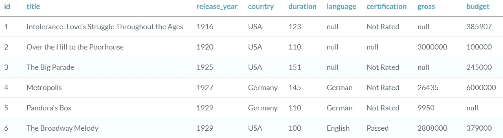
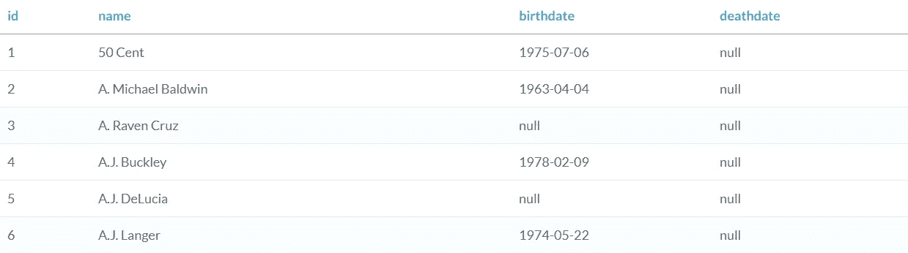
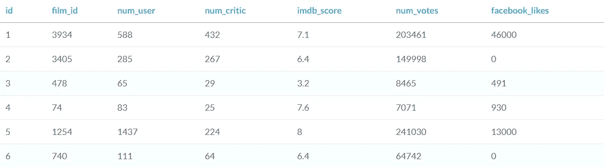
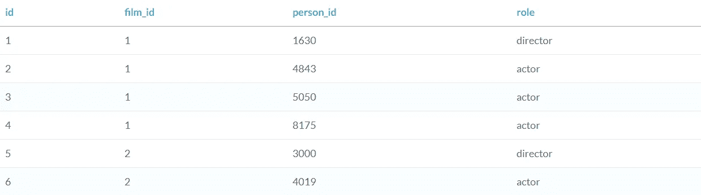
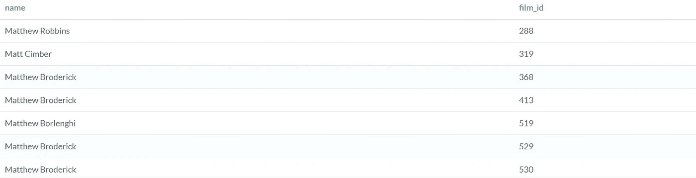
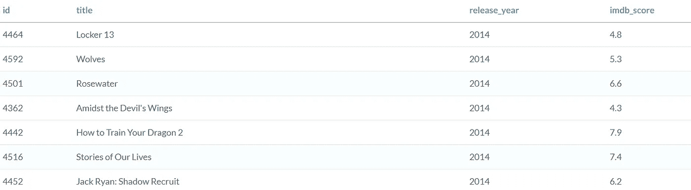
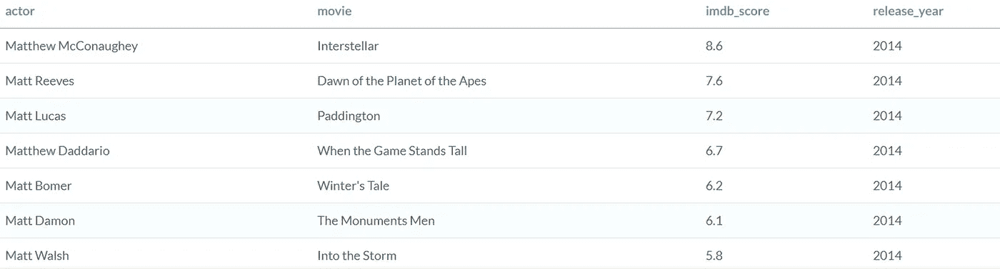

# 如何在 SQL 中使用 cte

> 原文：<https://towardsdatascience.com/using-ctes-to-improve-sql-queries-dfcb04b7edf0?source=collection_archive---------6----------------------->

## 启动和运行 cte 的介绍


照片来自 [Pexels](https://www.pexels.com/photo/man-in-white-shirt-using-macbook-pro-52608/?utm_content=attributionCopyText&utm_medium=referral&utm_source=pexels) 的 [Tim Gouw](https://www.pexels.com/@punttim?utm_content=attributionCopyText&utm_medium=referral&utm_source=pexels)

如果您曾经使用过 SQL，您就会知道当您创建一个对以后使用有帮助的编写良好的查询时，它是多么重要。通常，当您查询某个东西时，您只使用它一次，但是有时您需要引用旧的查询——这就是**通用表表达式(cte)**的用武之地！

> 一个 [CTE](https://www.sqlservertutorial.net/sql-server-basics/sql-server-cte/) 允许你定义一个临时命名的结果集，在一个语句的执行范围内临时可用，比如`[*SELECT*](https://www.sqlservertutorial.net/sql-server-basics/sql-server-select/)`、`[*INSERT*](https://www.sqlservertutorial.net/sql-server-basics/sql-server-insert/)`、`[*UPDATE*](https://www.sqlservertutorial.net/sql-server-basics/sql-server-update/)`、`[*DELETE*](https://www.sqlservertutorial.net/sql-server-basics/sql-server-delete/)`或者`[*MERGE*](https://www.sqlservertutorial.net/sql-server-basics/sql-server-merge/)`。

对于本教程，我将假设您具有初级—中级 SQL 经验。如果你没有，这里有一些很好的资源可以帮助你开始。

*   [数据营](https://www.datacamp.com/courses/)
*   周末速成班
*   [学习 MS SQL Server + PostgreSQL](https://www.udemy.com/course/sqldatabases/)

# 入门指南

我将从 [**Datacamp 的**](https://www.datacamp.com/courses) SQL 课程中使用一个电影数据库。(如果你是一名拥有***【edu】***电子邮件的学生，并且想要获得三个月的免费 Datacamp 访问— [GitHub 学生开发者包](https://education.github.com/pack))。

电影数据库由以下表格(+列)组成:

*   **电影**——(id、片名、上映年份、国家/地区、时长、语言、认证、总票房、&预算)
*   **人**——(身份证，姓名，出生日期，&死亡日期)
*   **评论**——(电影 id，用户数量，评论数量，imdb 评分，投票数量，& facebook 点赞)
*   **角色**——(id，film_id，person_id，角色)

我们可以看到表格和列。可以用几把钥匙把桌子连接起来。下面是每个表的快照。



**影片表(** [**【数据营】**](https://www.datacamp.com/courses) **)**



**人表(**[**data camp**](https://www.datacamp.com/courses)**)**



**评论表(**[**data camp**](https://www.datacamp.com/courses)**)**



**角色表(**[**data camp**](https://www.datacamp.com/courses)**)**

# CTEs 简介

如前所述，cte 在语句的执行范围内暂时可用。

这是 CTE 的基本布局。

```
**WITH** CTE_NAME(column_1, column_2, column_3)
**AS**
    (--***normal SQl query***
       SELECT *
       FROM table)
```

在上面的代码中，CTE 必须以带有的**开始。这告诉您的查询这是一个 CTE 语句。接下来， **CTE_NAME** 是你想给它取的名字。你可以给它起任何名字，但是由于这通常是用于以后的参考，所以它应该是有意义的。column_1、column_2、& column_3 是您希望为列设置别名的名称。最后，**作为**，是 SQL 语句的开始，我将其标记为# *普通 SQL 查询*作为注释参考。**

让我们看看它的实际效果吧！

我们的目标是编写几个可以构建到 CTE 中的查询。我们试图找到以下内容，

> 2014 年 IMDB 收视率最高的电影，演员的名字以“Matt”开头

我们可以立即看到查询可以分解成几个部分。

1.  Names = 'Matt '
2.  电影和 IMDB 评级
3.  2014 年
4.  第三高的 IMDB

对于这个例子，我们将创建两个 cte。

# 第一个查询 Matt 这个名字

我们将首先编写一个没有 CTE 语法的查询来调用整个数据库中名字中包含“Matt”的所有人。我们还想加入 *roles* 表，以找出该演员所在的确切的 *film_id* 。

```
SELECT p.name, r.film_id
FROM people AS p
JOIN roles AS r
ON p.id = r.person_id
WHERE p.name LIKE 'Matt%'
```



所有“马特”名字的输出和他们出演的电影

现在我们有了一个调用所有 Matt 的查询，我们可以在以后构建 CTE 时使用它。

# 第二个问题—2014 年电影和 IMDB 评级

我们希望构建下一个查询来查找 2014 年的每部电影，并加入*评论*表来查找它们的 IMDB 评级。

```
SELECT f.id, f.title, f.release_year, r.imdb_score
FROM films AS f
JOIN reviews AS r
ON f.id = r.film_id
WHERE f.release_year = 2014
```



查询输出

现在，我们已经从两个查询中获得了所有必要的信息，可以找到答案，找出由名为“Matt”的演员主演的电影在 IMDB 中的评分最高

# 建造 CTE

让我们结合前面的两个查询来创建这个 CTE。当我们想在同一个语句中添加第二个 CTE 时，我们添加一个逗号并添加第二个 AS 语句，如下所示。

```
**WITH**
    **MATT_cte**(actor, ***film_id***)
        **AS**(
            SELECT p.name, r.film_id
            FROM people AS p
            JOIN roles AS r
                ON p.id = r.person_id
            WHERE p.name LIKE 'Matt%')**,****IMDB_cte**(***film_id***, movie, release_year, IMDB_Score)
        **AS**(
            SELECT f.id, f.title, f.release_year, r.imdb_score
            FROM films AS f
            JOIN reviews AS r
                ON f.id = r.film_id
            WHERE f.release_year = 2014)
```

我们的 CTE 已经构建并保存了别名为 **MATT_cte** 和 **IMDB_cte** 的两个查询。这些别名将在我们运行最终代码时作为参考。

需要注意的是，如果您计划连接稍后创建的两个 cte，您将需要在两个 cte 中都有一个[外键](https://www.w3schools.com/sql/sql_foreignkey.asp)。在这种情况下，我们的外键在两个表中都是 ***film_id*** *。*

# 使用 cte

我们都准备使用我们的 cte 并得到我们的答案！让我们加入我们新的临时结果，并找出它是哪部电影。提醒，我们正试图得到以下。CTE 将需要在同一个查询中被引用，所以我们在它下面添加了最后一个查询。

> 2014 年 IMDB 收视率最高的电影，演员的名字以“Matt”开头

```
WITH
    MATT_cte(actor, film_id)
        AS(
            SELECT p.name, r.film_id
            FROM people AS p
            JOIN roles AS r
                ON p.id = r.person_id
            WHERE p.name LIKE 'Matt%'),IMDB_cte(film_id, movie, release_year, IMDB_Score)
        AS(
            SELECT f.id, f.title, f.release_year, r.imdb_score
            FROM films AS f
            JOIN reviews AS r
                ON f.id = r.film_id
            WHERE f.release_year = 2014)**SELECT *
FROM MATT_cte AS m
JOIN IMDB_cte AS i
    ON m.film_id = i.film_id
ORDER BY i.IMDB_Score DESC**
```



查询输出

我们已经成功地找到了所有包含“马特”的名字，电影名称，IMDB 评分和上映年份。

我们最终的答案是,**星际**是 2014 年 IMDB 中收视率最高的电影，它有一个名字以“马特”开头的演员。


桌面壁纸由[刺客大师](https://desktopwalls.net/user/the-master-assassin/)

# 最终结果

我希望您看到 cte 为您的 SQL 查询带来的价值。如果您计划一次又一次地调用同一个查询，最好使用它。例如，如果我们只想要 IMDB 评分高于 8 的电影，我们可以创建一个临时结果来确保 CTE 始终可用。

SQL 中使用的另一个有用的方法是子查询。我计划分享一个关于如何使用子查询的教程，所以一定要跟着我学习更多的课程！

在 [**Linkedin**](https://www.linkedin.com/in/jasonmchlee/) 或 [**Github**](https://github.com/jasonmchlee) 上与我联系