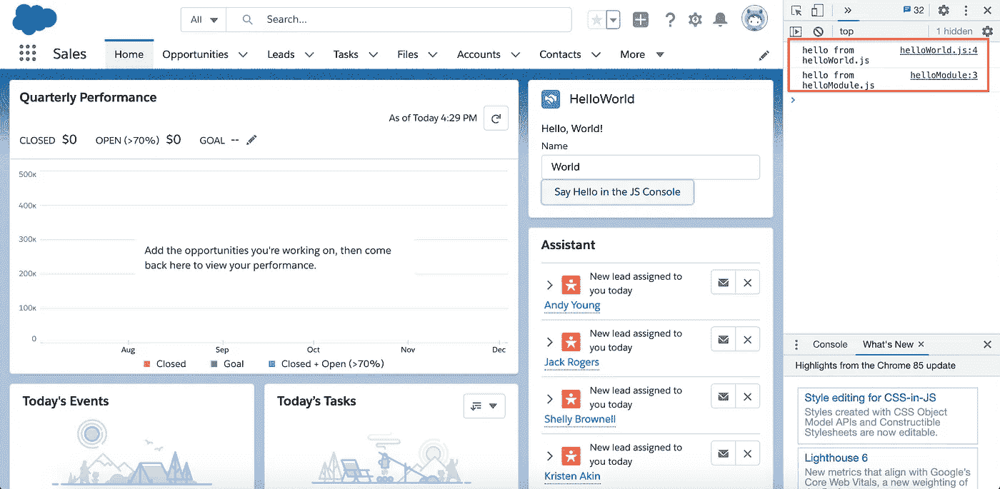

# 在 Salesforce 组织中使用自定义 JavaScript 模块作为静态资源

> 原文：<https://towardsdatascience.com/using-custom-javascript-modules-as-static-resources-in-salesforce-orgs-4b6df1477dc4?source=collection_archive---------13----------------------->

## 上传一次 JavaScript 模块，并在任何 Lightning Web 组件中使用它

本教程将引导您将自定义 JavaScript 模块与 Salesforce Lightning Web 组件集成，并在 Salesforce 组织中使用它们。

# Salesforce Developer 101:术语和基本概念


某机构截图(作者:Lynn Zheng)

## 什么是 Salesforce 组织？

Salesforce 组织是一个面向客户的平台，包含 Salesforce 数据。

## 什么是闪电网页组件(LWC)？

lightning web 组件本质上是一个 [Web 组件](https://developer.mozilla.org/en-US/docs/Web/Web_Components)，它使用 Salesforce 品牌的样式并封装 Salesforce 数据。

# 开发环境和工具包

您将需要什么:

*   一个 [Trailhead](https://trailhead.salesforce.com/home) 账户，允许你创建一个 Trailhead 游乐场/测试组织
*   Salesforce 开发人员体验(SFDX)命令行客户端
*   [Visual Studio 代码](https://code.visualstudio.com/)

如果您尚未设置完整的 Salesforce 开发人员体验(SFDX)环境，请转到 Trailhead，注册并完成[快速入门:Lightning Web Components Trail](https://trailhead.salesforce.com/en/content/learn/projects/quick-start-lightning-web-components)。这将建立我们在本教程中需要的整个工具包，应该不会超过 20 分钟。

如果你是 Visualforce 或 Aura 开发人员，已经建立了 SFDX 但不熟悉 LWC，我建议你完成快速入门的最后一个模块[: LWC 小径](https://trailhead.salesforce.com/content/learn/projects/quick-start-lightning-web-components/create-a-hello-world-lightning-web-component)来创建一个 HelloWorld LWC。

如果您已经熟悉 SFDX 和 LWC，请继续创建一个简单的 HelloWorld LWC。LWC 不需要超过`<div>Hello World</div>`的任何东西。


自定义 HelloWorld LWC 位于左侧面板的顶部

无论您来自何方，您最终都会看到一个 org 页面，其中包含一个带有文件**helloWorld.html、helloWorld.js、**和 **helloWorld.js-meta.xml 的定制 LWC。**

使用`lightning-button`标签向自定义 LWC 添加一个按钮。它的`label`属性包含它显示的文本。它的`onclick`属性应该指向一个名为`clickHandler`的事件处理程序。

在**helloWorld.html**中，为按钮添加 HTML:

```
<lightning-button label=”Say Hello in the JS Console” onclick={clickHandler}></lightning-button>
```

在 **helloWorld.js** 中，实现`clickHandler`方法:

```
clickHandler() {
    console.log('hello from helloWorld.js');
}
```

打开默认组织页面(在 Visual Studio 代码中，Command + Shift + P，SFDX: Open Default Org)，打开 web 控制台，点击按钮，我们应该会看到控制台日志。


**如果组织没有自动刷新，点击页面右上角的齿轮图标，进入页面设置，刷新当前页面，保存。**


# 创建静态资源 JavaScript 模块

在**force-app/main/default/static resources 下创建两个文件，helloModule.js、**和**hello module . resource-meta . XML .**


要使用自定义 JavaScript 文件作为静态资源，我们需要将它包装在一个[立即调用的函数表达式(IIFE)中。](https://developer.mozilla.org/en-US/docs/Glossary/IIFE)

**helloModule.js 中的生活:**

```
(function() {
    function sayHello() {
        console.log('hello from helloModule.js');
    }
    // this makes the sayHello function available in the window     namespace
    // so we can call window.sayHello from any LWC JS file
    window.sayHello = sayHello;
})();
```

在**hello module . resource-meta . XML**中，我们指定了资源内容类型和缓存控制属性:

```
<?xml version="1.0" encoding="UTF-8"?>
<StaticResource ae na" href="http://soap.sforce.com/2006/04/metadata" rel="noopener ugc nofollow" target="_blank">http://soap.sforce.com/2006/04/metadata" fqn="helloWorld">
  <cacheControl>Private</cacheControl>
  <contentType>application/javascript</contentType>
</StaticResource>
```

将**force-app/main/default/static resources**部署到 org。在组织页面上，转到**设置**并搜索**静态资源。**应该有一个名为 **helloModule** 的资源，类型 application/javascript，私有缓存控制。


# 在 LWC 中使用静态资源

在 **helloWorld.js** 中，添加静态资源和加载静态资源的方法的导入:

```
import SAY_HELLO from '[@salesforce/resourceUrl](http://twitter.com/salesforce/resourceUrl)/helloModule';
import { loadScript } from 'lightning/platformResourceLoader';
```

然后实现一个在页面上呈现 LWC 时运行的回调:

```
renderedCallback() {
    loadScript(this, SAY_HELLO)
    .then(() => console.log('Loaded sayHello'))
    .catch(error => console.log(error));
}
```

将此 LWC 部署到组织。刷新 org 页面，我们应该会看到控制台日志，表明已经成功加载了 **helloModule** 静态资源。


既然资源已经成功加载，我们就能够在 LWC 中使用函数`sayHello`。在 **helloWorld.js** 中，更新按钮点击处理程序调用`window.sayHello`:

```
clickHandler() {
    console.log('hello from helloWorld.js');
    window.sayHello();
}
```

部署到 org，刷新，点击按钮，我们应该看到来自 **helloModule** 的日志打印到控制台。



# **奖励:创建一个静态资源 JavaScript 模块，调用第三方 API**

由于 Salesforce org 的默认安全设置，如果我们的 JavaScript 函数需要调用非 Salesforce 的第三方 API，我们需要将这些站点列为 CSP(内容共享策略)可信站点。我们将以 [JSONPlaceholder](https://jsonplaceholder.typicode.com/) 为例。转到**设置**并搜索 **CSP 可信站点**。添加新的可信站点，如下所示:(注意，Salesforce 不接受以正斜杠结尾的 URL，即`https://mysite.com`有效，但`https://mysite.com/`无效。)


CSP 可能需要两到五分钟才能生效。同时，向 **helloModule.js** 添加一个函数(仍在 IFFE 中)，并将其公开给 window 名称空间:

```
function retrieveData(dataId) {
    fetch('[https://jsonplaceholder.typicode.com/todos/'](https://jsonplaceholder.typicode.com/todos/') + dataId)
    .then(response => response.json())
    .then(json => console.log(json));
}
window.retrieveData = retrieveData;
```

更新 **helloWorld.js** 中的`clickHandler`以使用带参数的`window.retrieveData`:

```
clickHandler() {
    console.log('hello from helloWorld.js');
    window.sayHello();
    for (let i = 1; i < 4; i++) {
        window.retrieveData(i);
    }
}
```

部署、刷新，如果没有 CSP 错误(这意味着 CSP 尚未生效)，我们应该能够在控制台日志中看到一些从第三方 API 获取的 JSON 数据。


完整的文件如下:

**helloWorld.html:**

```
<template>
  <lightning-card title="HelloWorld" icon-name="custom:custom14">
    <div class="slds-m-around_medium">
      <p>Hello, {greeting}!</p>
      <lightning-input label="Name" value={greeting} onchange={changeHandler}></lightning-input>
      <lightning-button label="Say Hello in the JS Console" onclick={clickHandler}></lightning-button>
    </div>
  </lightning-card>
</template>
```

**helloWorld.js:**

```
import { LightningElement } from 'lwc';
import SAY_HELLO from '[@salesforce/resourceUrl](http://twitter.com/salesforce/resourceUrl)/helloModule';
import { loadScript } from 'lightning/platformResourceLoader';export default class HelloWorld extends LightningElement {
    greeting = 'World';
    changeHandler(event) {
        this.greeting = event.target.value;
    }
    clickHandler() {
        console.log('hello from helloWorld.js');
        window.sayHello();
        for (let i = 1; i < 4; i++) {
            window.retrieveData(i);
        }
    }
    renderedCallback() {
        loadScript(this, SAY_HELLO)
        .then(() => console.log('Loaded sayHello'))
        .catch(error => console.log(error));
    }
}
```

**helloModule.js:**

```
(function() {
    function sayHello() {
        console.log('hello from helloModule.js');
    }
    function retrieveData(dataId) {
        fetch('[https://jsonplaceholder.typicode.com/todos/'](https://jsonplaceholder.typicode.com/todos/') + dataId)
        .then(response => response.json())
        .then(json => console.log(json));
    }
    // this makes the sayHello function available in the window namespace
    // so we can call window.sayHello from any LWC JS file
    window.sayHello = sayHello;
    window.retrieveData = retrieveData;
})();
```

更多资源，请查看 [Trailhead](https://trailhead.salesforce.com/) 和 [Salesforce 面向开发者的官方文档](https://developer.salesforce.com/)。