# 在家工作时使用计算机视觉和机器学习来监控活动

> 原文：<https://towardsdatascience.com/using-cv-and-ml-to-monitor-activity-while-working-from-home-f59e5302fe67?source=collection_archive---------23----------------------->

## 介绍在嵌入式系统上构建基于视觉的健康监测软件

世界上大多数人在这种封锁期间呆在家里面临的最大挑战之一是身体活动的突然限制，尤其是当被限制在一个小空间内时。为了帮助解决这个问题，我想看看我是否可以使用计算机视觉来帮助激励自己更加积极，这将是一件有趣的事情。

在这篇文章中，我将分享我的方法，以及一个完整的示例[源代码](https://github.com/raymondlo84/nvidia-jetson-ai-monitor)，它展示了帮助监控和改善许多呆在家里的人的生活质量的潜力。这个想法是拥有一个低成本、支持 GPU 的基于视觉的系统(99 美元 [NVIDIA Jetson Nano](https://developer.nvidia.com/embedded/jetson-nano-developer-kit) )，该系统可以在 edge 上执行大多数计算机视觉处理(例如，人脸检测、情感分类、人物检测和姿势估计)一体化易于安装的软件包。然后，该系统可以处理从本地收集到远程云的数据，以便进行后处理，并重新分发到为一个或多个健康状况提供仪表板的服务器。

为了解决隐私问题，我讨论了通过仅上传经过后处理的数据来保护用户隐私的方法，这些数据包含分类的情感数据、面部特征和身体姿势数据，而不是实际的相机馈送。虽然您还可以做更多的事情来隐藏数据，但是这个例子将为您指出正确的方向。

这个概念验证是一个简单的应用程序，它根据我的身体姿势和情绪显示我的活动仪表板。整个系统运行在 99 美元[的 NVIDIA Jetson Nano 开发板](https://www.arrow.com/en/products/945-13450-0000-100/nvidia?gclid=CjwKCAjw-YT1BRAFEiwAd2WRtoW2b85CEgocHgviFTHyFgf5h9x7enp-tIAzu9kqWLaf-fUyUsQBuRoCzKcQAvD_BwE)和大约 40 美元的[网络摄像头](https://www.bhphotovideo.com/c/product/825671-REG/Logitech_960_000694_C270_HD_Webcam_Black.html)上。这种设置有助于人们在跟踪活动的同时专注于工作。

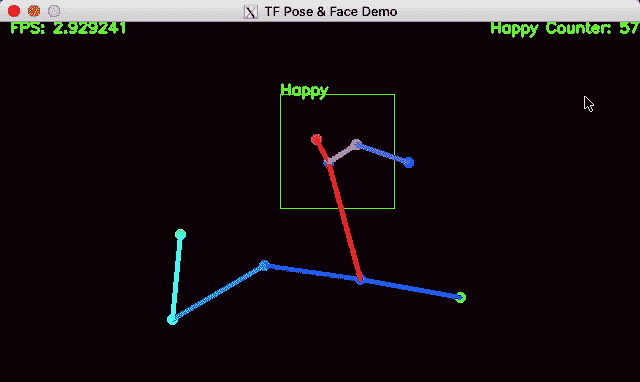

开启隐私模式的最终结果，因此仅显示已处理的数据。

让我们来看看如何构建和我一样的系统。

# 设置网络摄像机服务器

我采取的第一个设置是建立一个网络摄像头服务器，这样我就可以根据需要向系统添加尽可能多的摄像头，并且还可以以分布式和可扩展的方式处理这些帧。

在 Linux 中，我们可以通过一个名为“ [Motion](https://motion-project.github.io/index.html) ”的程序轻松设置自动网络摄像头流。该计划允许您创建一个智能安全摄像机，检测运动，更重要的是作为服务器传输运动 JPEG (MJPEG)。这个特性非常有用，它允许我们异步运行这些应用程序，而不会使任何特定机器上的每个相机流陷入困境。

要在 NVIDIA Jetson Nano 上安装 motion，只需使用以下命令行。

```
sudo apt-get install motion
```

然后，我们编辑[运动配置文件](https://motion-project.github.io/motion_config.html#configfiles)来设置分辨率和帧率。默认情况下，motion 应用程序被配置为检测运动和捕捉帧，这不是我们在用例中想要的。

```
nano /etc/motion/motion.conf
```

这里，您需要将摄像机馈送(**帧速率**)和流馈送( **stream_maxrate** )的分辨率和帧速率更改为 **640** x **320** 和 **15** fps。

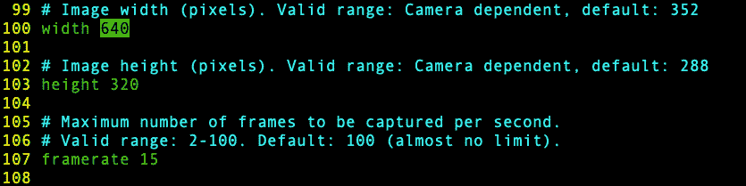

如果你有一个更强大的机器，如 [Jetson Xavier](https://developer.nvidia.com/embedded/jetson-agx-xavier-developer-kit) ，你可以设置更高的分辨率和帧速率，以便更好地跟踪远距离物体。

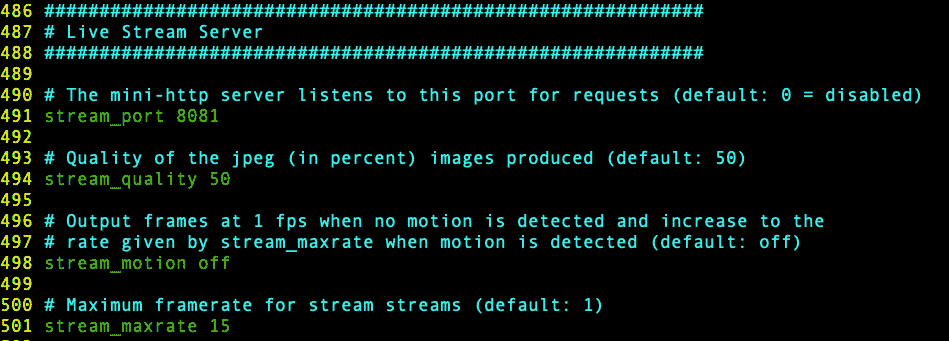

然后，我们关闭自动快照和视频捕捉功能(即，将**输出 _ 图片**设置为**关闭**)。这一点很重要，否则你的硬盘会很快被新捕获的内容填满。

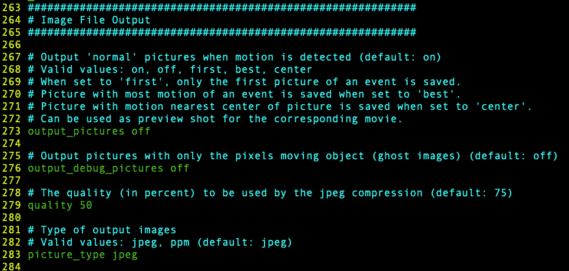

配置 Motion 后，您需要允许它在启动时作为服务运行。

```
nano /etc/defaultmotion
```

您将这一行编辑为

```
start_motion_daemon=yes
```

现在你需要编辑位于**/etc/Motion/Motion . conf**的主配置文件，并将 Motion [守护进程](https://motion-project.github.io/motion_config.html#daemon)设置为 on。重启电脑后，Motion 现在应该会自动运行。

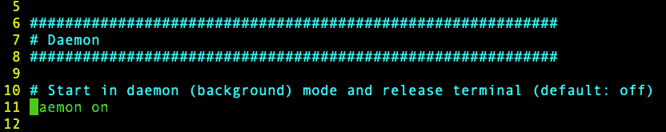

以下命令控制 Motion 服务:

*   启动 Motion 服务:

```
sudo service motion start
```

*   停止运动服务:

```
sudo service motion stop
```

*   重新启动 Motion 服务:

```
sudo service motion restart
```

要预览订阅源，只需打开浏览器并转到以下链接:

```
[http://localhost:8080](http://localhost:8080)
```

此时，您将能够看到摄像机馈送的预览。现在是我们真正使用它的时候了。

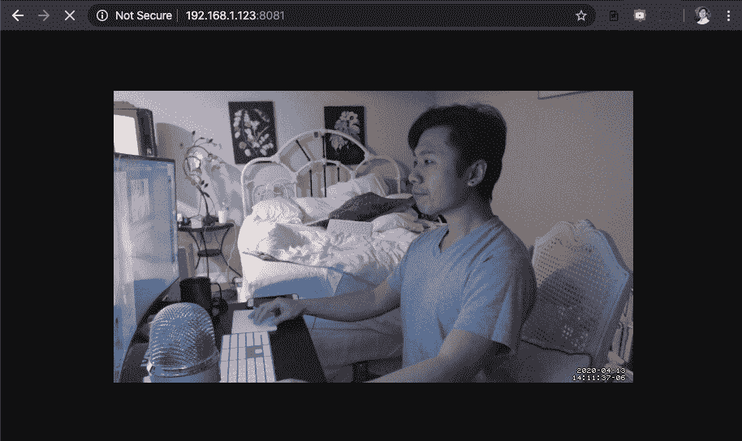

# 用于姿态估计的机器学习工具

该系统的主要目标之一是更好地了解一个人在家的活动。为了做到这一点，我们将创建一个姿势估计程序，跟踪一个人的姿势。更重要的是，姿势估计允许你通过省略你的相机的馈送来创建一个隐私层，并且只显示处理过的数据。

首先，您需要安装 Tensorflow 和 OpenPose 库。GitHub 成员 [**karaage0703**](https://github.com/karaage0703) 在为 NVIDIA Jetson Nano 整合安装脚本方面做了一项令人惊叹的工作。在这里你可以按照 GitHub 的说明来设置工具，下面是 Github 库的链接。

```
github clone [https://github.com/karaage0703/jetson-nano-tools](https://github.com/karaage0703/jetson-nano-tools)
```

特别是，您想要运行**‘install-tensorflow . sh’**和**‘install-Pose-Estimation . sh’**脚本来在您的机器上安装 tensor flow 和 Pose Estimation 库。

```
$ cd ~/jetson-nano-tools
$ ./install-tensorflow.sh
$ ./install-pose-estimation.sh
```

这个过程可能需要 30 分钟，所以在执行完命令后休息一下，做做伸展运动。一旦您有了合适的工具，让我们看看我写的 Python 脚本，它允许您捕获、处理和可视化数据。

# 姿态估计

我创建了一个 Python 脚本，它使用了刚刚安装的工具集，这是骨架覆盖在摄像机镜头上的结果。

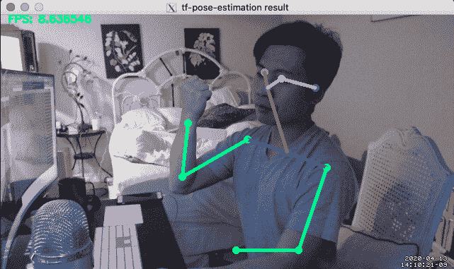

在 NVIDIA Jetson Nano 上运行的 OpenPose 库的输出示例

你可以在这里查看我写的脚本:

```
git clone [https://github.com/raymondlo84/nvidia-jetson-ai-monitor](https://github.com/raymondlo84/nvidia-jetson-ai-monitor)
```

**‘run _ web cam _ IP . py’**脚本有两个基于 CMU 感知计算实验室 OpenPose 项目的关键功能。

> [OpenPose](https://github.com/CMU-Perceptual-Computing-Lab/openpose) 代表了第一个在单幅图像上联合检测人体、手、面部和脚关键点(总共 135 个关键点)的实时多人系统

这个库是一个非常强大的工具，它可以通过 GPU 加速检测完整的人体骨骼。有了这些，现在想象你如何跟踪人体姿势，为你提供适当的反馈。例如，您可以创建一个颈部角度检测器，并在工作期间帮助固定您的身体姿势。

```
from tf_pose.estimator import TfPoseEstimator
from tf_pose.networks import get_graph_path, model_wh
```

脚本的主循环对 IP 摄像机捕获的每一帧进行推断。然后，这两行将执行推理并在框架上绘制结果

```
humans = e.inference(image, resize_to_default=(w > 0 and h > 0), upsample_size=args.resize_out_ratio)image = TfPoseEstimator.draw_humans(image, humans, imgcopy=False)
```

NVIDIA Jetson 的 GPU 可以在 **320** x **160** 分辨率下，使用 **mobilenet_thin** 模型，以大约 7–8 fps 的速度执行姿态估计。对于一台满负荷使用不超过 10W 功率的机器来说，这是非常令人印象深刻的。随着身体姿态的估计，现在可以预测一个人有多活跃。这类似于一个 FitBit，但我们使用的不是加速度计或陀螺仪，而是来自摄像机的视频信号。

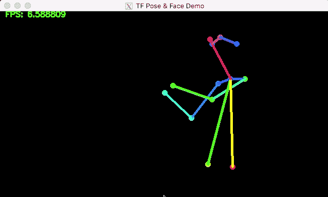

在 NVIDIA Jetson Nano 上运行 OpenPose

# 人脸检测和情感分析

此时，我们计划要做的一切都已经实现了，但是为什么不利用捕获的视频做更多的事情呢？让我们看看如何从面部反应中检测情绪，以便用 GPU 构建一个快乐的仪表。要做到这一点，我们需要添加代码来决定一个人的面部和情绪。令人惊讶的是，这两个系统都在 GPU 上利用 Tensorflow，因此我们不需要分配大量的内存，只需要最少的开销。同样，还有额外的优化，如智能地选择基于身体姿态的人脸检测的边界框，以获得额外的速度。

目前，处理速度约为每秒 7 帧，面部检测和情感分析的分辨率为 **320x160** 。然而，使用分布式设置，我可以通过将工作卸载到 GPU 集群设置中的另一个节点上，轻松地将速率提高一倍或两倍。即使每秒更新 3 次，系统每天也将有大约 **259，200** 个样本。这不是一个微不足道的数据量。

为了执行情感分析，这次我将包括 Keras 库和[人脸识别](https://github.com/ageitgey/face_recognition)包。

```
import face_recognition
import keras
from keras.models import load_model
from keras.preprocessing.image import img_to_array
```

然后，这条线从图像中提取检测到的面部的位置。

```
face_locations = face_recognition.face_locations(small_image, model=’cnn’)
```

参数 **mode='cnn'** 使我们能够使用 CUDA GPU 加速代码，并在不同视角或遮挡情况下提供更好的准确性。

一旦它从图像中检测到人脸，人脸图像就会根据我们预先训练的模型([_ mini _ xception . 106–0.65 . HD F5](https://github.com/abhijeet3922/FaceEmotion_ID))运行[预测函数](https://appliedmachinelearning.blog/2018/11/28/demonstration-of-facial-emotion-recognition-on-real-time-video-using-cnn-python-keras/)，并将人脸分为七类:*愤怒、厌恶、害怕、快乐、悲伤、惊讶或中性。*

```
emotion_dict = [“Angry”, “Disgust”, “Scared”, “Happy”, “Sad”, “Surprised”, “Neutral”]model = load_model(“emotion_detector_models/_mini_XCEPTION.106–0.65.hdf5”, compile=False)model_result = model.predict(face_image)
```

基本上，实际工作大约是 5 行代码，我还提供了额外的示例代码([**web cam _ face _ detect . py**](https://github.com/raymondlo84/nvidia-jetson-ai-monitor/blob/master/webcam_face_detect.py))来单独运行这一部分进行您自己的测试。

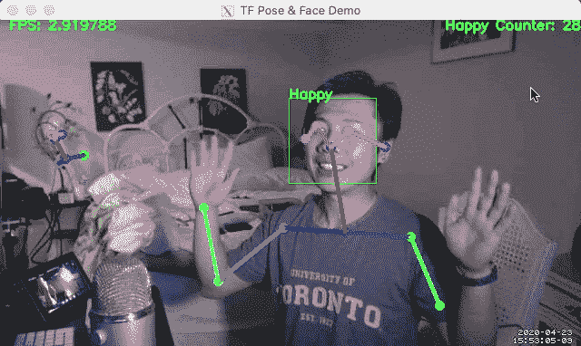

在 GPU 上运行姿势估计、人脸检测和情感分析。

# CPU/GPU 性能

从我的实验中得到的一个重要收获是，这些 CV+ML 算法可以与 GPU 设置很好地堆叠在一起。默认情况下，Tensorflow 的核心占用了大量内存，因此无论如何最好地利用资源是明智的。现在，随着 CPU 完全从处理中释放出来，我们有超过 **300%** 的 CPU 处理资源可用于许多其他任务，例如对已处理数据进行记账。

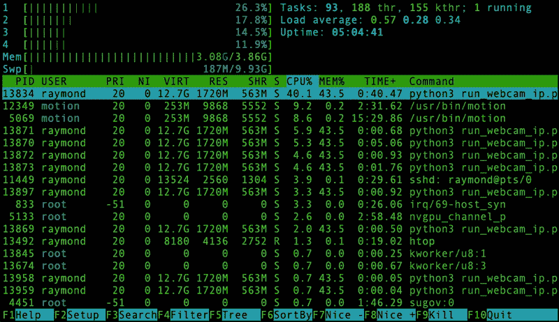

请注意，即使同时运行所有算法，我们的 CPU 使用率也非常低。

# 最后的想法

这里我们有一个低成本的监控系统，可以监控身体姿势，进行面部检测，并返回基本的情绪分析。这三个特性代表了一个全新的基于视觉的健康仪表板的基础，全部基于 GPU。最棒的是，这可以用一台 99 美元的机器来建造。想象一下可能性！

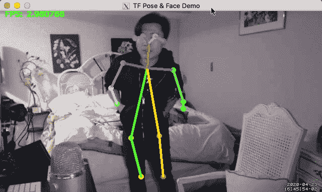

启用隐私模式

通过姿势估计、面部检测和情绪分析，我可以提取运动参数，如每天的平均运动，并跟踪我自己的情绪数据，而无需将我的图像与云共享。这个数据并不完美，但这种反馈可以被证明对改善长时间坐在电脑前的姿势非常有用(例如，颈部问题)。此外，通过一些小的修改，这可以很快变成一个睡眠监视器，并有其他潜在的健身用途可以扩展。

# 关于我

目前，我住在硅谷，并在英特尔担任 OpenVINO Edge 人工智能软件布道者。此前，我是 [Meta](https://www.crunchbase.com/organization/meta-view) 的联合创始人兼首席技术官，在那里我发布了两套增强现实开发工具包。作为 Meta 公司研发部门的负责人，我曾与数百名出色的工程师一起工作，创造出最先进的技术和 CV 算法，如 SLAM、3D 手部跟踪和 AR/XR 的新 UX。在我的博士研究期间，我还发表和开发了关于 HDR 视频处理的实时 GPGPU 应用程序，并用 3D 深度感应相机创建了增强现实原型。我始终相信，技术的可及性和简单性是创造颠覆性变革所必需的。现在，我看到人工智能边缘计算的快速增长可以以非常低廉的成本带来许多智能应用。而这篇帖子只是这种不断增长的趋势的开始。