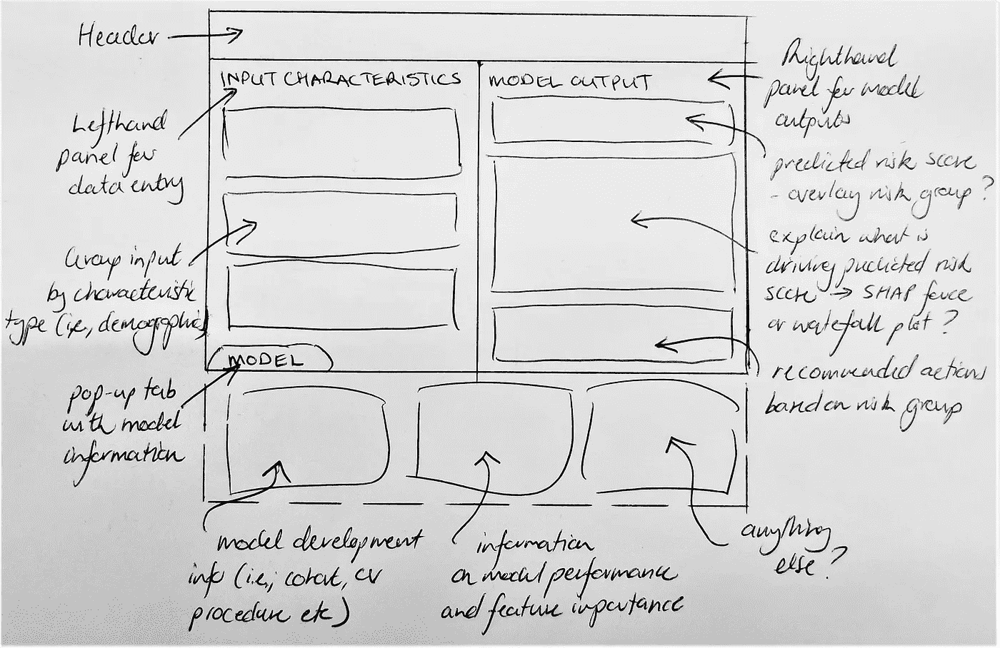
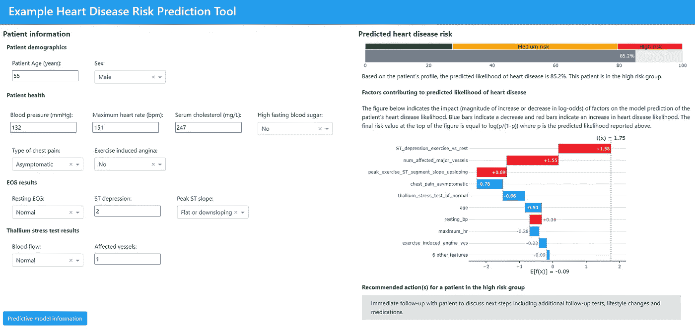
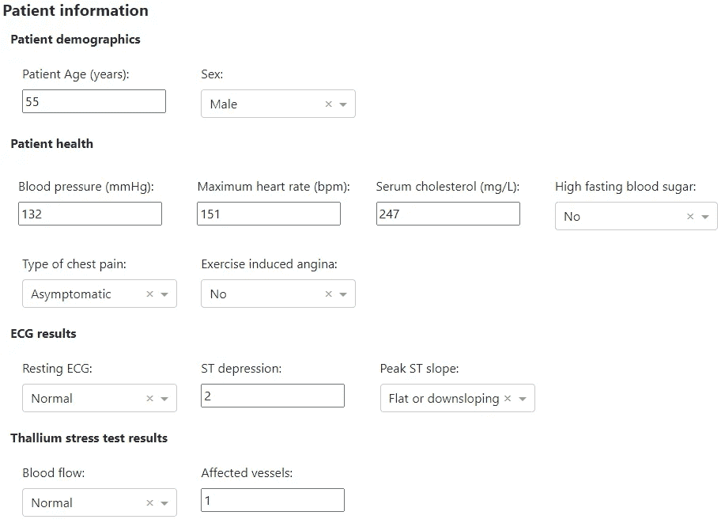
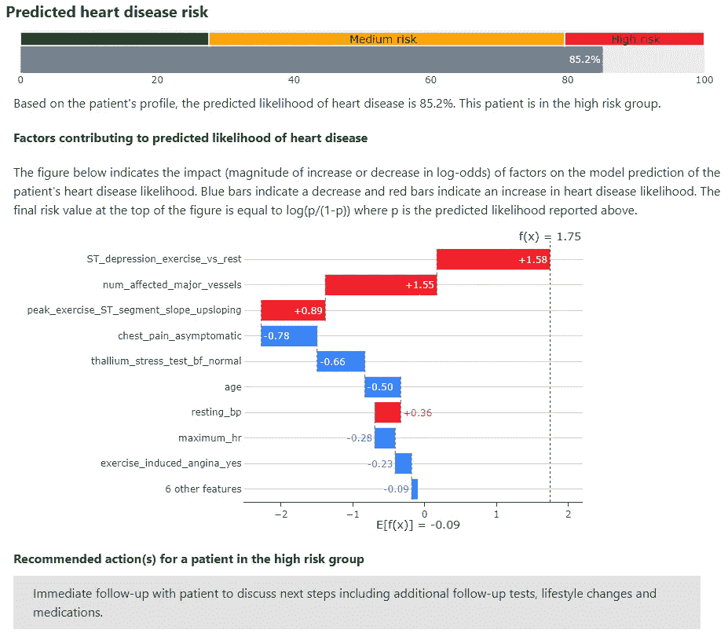
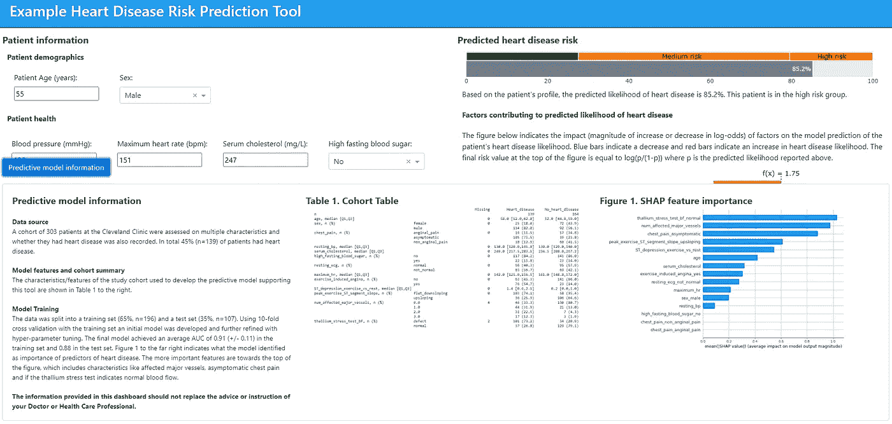

# 使用 Dash 引导心脏病预测模型

> 原文：<https://towardsdatascience.com/using-dash-to-pilot-a-predictive-model-for-heart-disease-a1dab01035ac?source=collection_archive---------45----------------------->

## 如何设计你的用户界面并在 Dash 中运行

图片由 WrightStudio 从 [Adobe Stock](https://stock.adobe.com/uk/images/predictive-analytics-big-data-analysis-business-intelligence-internet-and-modern-technology-concept-on-virtual-screen/262174953) 获得许可。

# 背景

在[之前的一篇文章](/developing-a-model-for-heart-disease-prediction-using-pycaret-9cdf03a66f42)中，预测心脏病的模型是使用 PyCaret 开发的。现在，假设我们希望在临床环境中试验这个模型。我们首先需要的是模型的 UI，这样它就可以被部署了。我们还将假设该工具用于筛选以推荐后续行动，而非诊断。

在此示例中，为了便于说明，我们将重点关注以下内容:

1.  确定最低关键要求以及如何满足这些要求。
2.  勾画出一个包含关键需求的用户界面。
3.  使用 Dash 创建工作版本。

该应用程序是使用 PyCharm 开发的，所有资料都可以在我的 [GitHub](https://github.com/jason-bentley/medium_articles/tree/master/heart_disease_dash) 上找到。

**免责声明:**在现实环境中，当部署一种新的预测模型来预防、诊断或治疗健康状况时，需要考虑许多因素，包括已证明的影响、伦理和算法偏差以及法律要求(即 [SaMD](https://www.regulations.gov/document?D=FDA-2019-N-1185-0001) ，患者隐私)。虽然这些考虑非常重要，但它们超出了本文的范围。

# 要求

与临床同事合作，假设确定了以下要求:

1.  用于输入预测模型中用作特征的患者特征的位置。
2.  患者的输出风险评分，也将他们分配到风险组。
3.  协助卫生保健从业者理解/传达哪些风险因素导致了患者的风险。为此，我们将使用 [SHAP 值](https://papers.nips.cc/paper/7062-a-unified-approach-to-interpreting-model-predictions.pdf)。
4.  根据患者所属的风险群体，推荐下一步行动。
5.  有关用于生成预测风险分值的模型是如何开发的及其性能的信息。我们也可以包括一些关于队列和重要风险因素的一般信息。

# 用户界面

基于上述要求，由以下部分组成的简单结构是一个合理的起点:

1.  数据输入(要求 1)
2.  预测模型输出/解释/建议的下一步行动(要求 2、3 和 4)
3.  模型开发信息(要求 5)

我们 Dash 应用的大致布局如图**图 1** 所示。

**图一。**使用 Dash 粗略勾画出我们想要创建的东西的轮廓。请原谅我的笔迹！(图片由作者提供)

# Dash 应用程序

根据上述要求和草图，第一个工作应用如图**图 2** 所示。请注意，这些截图是在宽屏(24 英寸，16:9，1920 x 1080)上观看的。在较小或不宽的屏幕上，对齐可能会关闭。我强烈推荐克隆 GitHub repo 并亲自探索 UI！

**图二。**主视图！(图片由作者提供)

## 数据输入

在应用程序主视图的左侧，我们为用户提供了适当的机制来输入所需的信息，从而为预测模型生成特征(**图 3** )。在可能的情况下使用下拉菜单(所有分类特征)，否则可以直接为数字特征输入值。

**图 3。**主视图左侧面板，包含预测模型的数据输入。(图片由作者提供)

通常，数据预处理管道将嵌入到应用程序中，以处理插补或缩放等步骤。在这种情况下，由于最少的预处理，而且除了一种情况之外，所有输入的数据都是特征值，所以我选择保持简单。

## 预测模型输出/建议行动

应用程序的右侧根据我们的预测模型总结了所需的输出(**图 4** )。首先，我们得到一个预测的风险评分，用于将患者归入三个风险组之一。

**图 4。**预测风险总结和建议措施。(图片由作者提供)

接下来，SHAP 值和瀑布图用于传达哪些患者因素对风险贡献最大。这个想法是，它将帮助用户看到模型认为哪些因素导致心脏病风险，如果可以修改，可以针对生活方式进行干预。当然，这伴随着通常的联想，而不是因果关系。shap 包瀑布图(Scott Lundberg )不容易整合到 dash 应用程序中，所以我使用 plotly 瀑布图创建了自己的副本。

最后，有一个(虚构的)行动建议，基于病人属于三个风险组中的哪一个。这个想法是提示一系列明智的后续步骤，无论是生活方式的改变，进一步的测试，还是后续的预约。这也可以用作参考已批准的预防/治疗医学疾病的指南的地方，或者作为转介到适当服务(即，参考营养咨询)的起点。应与临床同事合作制定风险分组和相应的措施。

## 模型数据

在本节中，我们添加了关于所用数据、所选模型、培训/调整流程、绩效指标、描述性比较心脏病患者和非心脏病患者的研究队列表以及基于 SHAP 的特征重要性的信息(**图 5** )。

**图五。**屏幕底部的可扩展面板显示了模型开发的基本信息。(图片由作者提供)

我们还可以考虑包括整个研究群组的平均特征、外部验证程序或其他研究(如果适用)、支持该工具的已发表工作的参考文献、突出任何特征交互等。

# 改进的潜力

一如既往，任何试点用户界面都有改进的潜力，例如:

1.  **简化数据输入:**我们本可以减少需要输入的信息，因为一些特征对预测风险没有影响。我保留了所有东西，这样其他使用相同数据集开发自己模型的人就可以简单地交换模型。pkl 文件，并按原样使用仪表板。
2.  **自动数据输入:**我们可以使用文件上传或直接数据库连接来代替手动数据输入。但是我们所拥有的对于这个例子来说已经足够了，并且作为一个试验的一部分，不会有太多的负担。
3.  **模型校准:**使用预测风险评分等级有助于推荐后续行动，如本例所示。如果我们向患者报告心脏病的可能性，我们的预测概率必须经过很好的校准(即，与心脏病发生的实际机会一致)。

你还会做出哪些改进，或者你会有哪些不同的做法？

# 摘要

我们为飞行员准备好了仪表盘。使用 Dash 更接近于部署范围的定制端。这可以通过 PowerBI 或 Qlik 等其他工具部署，作为可能的中端选项。我们也可以采用低端方法，使用例如 [FastAPI](https://fastapi.tiangolo.com/) 创建一个 API。在以后的文章中，我将尝试使用这些 UI 选项重新创建 Dash 应用程序。

感谢您的阅读，我希望您花些时间从这个例子中探索 Dash UI。一如既往，非常欢迎评论、想法、反馈和讨论！