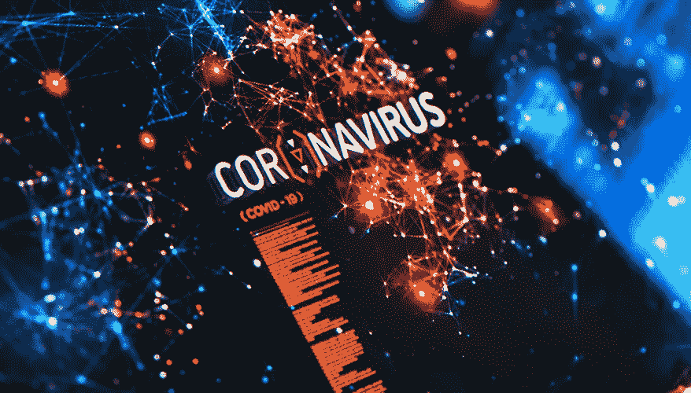

# 利用数据科学和先进技术抗击流行病

> 原文：<https://towardsdatascience.com/using-data-science-and-advanced-technologies-to-fight-pandemics-dac3b5f45458?source=collection_archive---------74----------------------->

## 数字生物学

## 抗击流行病需要生物技术、人工智能等等。我们准备好了吗？因为现在已经不是 1918 年了。

iStock 插图

黛安·迪厄利斯、彼得·伊曼纽尔、詹姆斯·佐丹奴和亚历山大·泰特斯

在军队中听到的一个常见表达是，“我们总是在打最后一场战争。”面对全球对新冠肺炎危机的反应，“最后一场战争”是 1918 年的疫情流感。

尽管历史提供了宝贵的教训，但根据当前的环境、能力和复杂性重新审视过去的问题和解决方案是至关重要的。新冠肺炎疫情造成了一个既要确保公共安全和健康，同时又要努力稳定和维持经济的两难境地。

与此同时，显而易见有益的可用先进技术并没有被充分利用来最大限度地利用道德上合理、有效和高效的方法来减少疫情对我们社会和经济的影响。[如果说有什么时候可以使用这些工具，那就是现在](https://onezero.medium.com/the-2020s-will-be-the-decade-of-the-bioeconomy-b722420c6bff)。

# 疾病监测数据平台需要现代化

测试提供了对疾病特征和模式的理解——如发病率、流行率、恢复和人口统计学——并且应该更早开始。检测病毒感染和暴露的技术已经成熟，但它们缺乏协调，也没有与私营部门的扩大途径联系起来。基因组测试可以揭示谁风险最大，谁可能恢复的数据。[因此，关键数据缺失，而这些数据是](/advanced-analytics-is-nice-but-how-about-we-start-with-simple-analytics-73ff6c7524fb)为决策提供信息所必需的，包括物理距离的范围、对社会经济振兴的影响以及美国国防力量的准备情况。

照片由 [NASA](https://unsplash.com/@nasa?utm_source=unsplash&utm_medium=referral&utm_content=creditCopyText) 在 [Unsplash](https://unsplash.com/s/photos/data?utm_source=unsplash&utm_medium=referral&utm_content=creditCopyText) 上拍摄

像新冠肺炎这样的传染病的早期识别需要全球分布的一系列硬件和软件，放置在足够多的位置，以创建一个链接收集站点的网络。这需要通过战略联盟和公私伙伴关系以及国际竞争者的合作企业来发展生物监测系统。这种能力和合作目前还不存在——无论是美国联邦政府还是我们的许多全球合作伙伴。与全球竞争对手的合作监控机制，尽管公认困难重重，但目前仍很紧张，因此也很脆弱。当然，实现这种“合作竞争”需要谨慎和相当的技巧，而这需要更加信任情报和外交服务。

# 应该定期使用计算工具

应该采用人工智能、机器学习和数字健康方法来模拟病毒的潜在传播，以及识别、设计和开发测试和治疗(如果不是预防的话)干预措施。在最令人担忧的病原体成为流行病的情况下，人工智能和数字卫生不属于准备协议的一部分。如果疫情开始，这种准备将是“超前的”——而不是在快速演变的危机中不得不“启动”疫情反应的这种努力。

当然，任何支持和提供个人实时医疗数据的方法都会在民用和军用环境中产生伦理、法律和社会问题。需要制定法律措施，以防止或减轻治疗和关注方面的潜在偏见，并减少数据黑客行为的风险和可能的影响。

由 [NASA](https://unsplash.com/@nasa?utm_source=unsplash&utm_medium=referral&utm_content=creditCopyText) 在 [Unsplash](https://unsplash.com/s/photos/data?utm_source=unsplash&utm_medium=referral&utm_content=creditCopyText) 上拍摄的照片

供应链也需要技术现代化。新冠肺炎效应对全球贸易的影响向我们展示了美国供应链的脆弱性及其对外依存度，并揭示了对更灵活、更便捷的供应链的需求。这需要对进口进行严格检查，探索创新的制造技术，并防范来自国外的单点故障。

私营部门的许多公司已经证明，在上述计算工具的帮助下，他们可以快速灵活地将生物技术平台导向诊断和医学分子的生产和规模化。这些努力应该更有规律地加强传统供应链。

# 现在不是 1918 年，也不一定要再来一次

新冠肺炎危机应该从字面意义上来理解——一个变革的时代。我们可以从 1918 年的疫情中学到一些适用于当下的经验。正如 1918 年的疫情威胁、促使医疗反应系统做出反应并改变了医疗反应系统一样，今天的政府、民间和商业部门的基础设施和职能也必须如此。

当前新兴的生物技术可以——也应该——参与开发先进的诊断测试和工具，创建更准确的流行病学模型，创新医疗对策和制造平台，并以数字方式让美国公民参与应对。无论威胁是自然的还是人为的，这种方法必须在一个网络化的生物安保企业中使用，这个企业需要一个全国性的系统，以便能够作出更加有效和高效的反应。这样一个系统将能够更好地预测、准备(如果不能防止的话)下一次生物安保问题，而不仅仅是重复上一次的错误。

***编者按:*** [*走向数据科学*](http://towardsdatascience.com/) *是一份以数据科学和机器学习研究为主的中型刊物。我们不是健康专家或流行病学家，本文的观点不应被解释为专业建议。想了解更多关于疫情冠状病毒的信息，可以点击* [*这里*](https://www.who.int/emergencies/diseases/novel-coronavirus-2019/situation-reports) *。*

Diane DiEuliis 是国防大学大规模杀伤性武器研究中心的高级研究员。彼得·伊曼纽尔是陆军未来司令部化学生物中心的高级生物工程研究科学家。James Giordano 是乔治敦大学医学中心神经病学和生物化学系的教授，也是海军战争学院生物安全、技术和伦理项目的高级研究员。亚历山大·提塔斯是高级再生制造研究所的首席战略官。本文中表达的观点仅是作者的观点，并不反映国防部或美国政府的官方政策或立场。

**这篇关于** [**对抗流行病的技术**](https://www.nationaldefensemagazine.org/articles/2020/5/15/apply-advanced-technologies-to-fight-pandemics) **最初出现在国防上。**