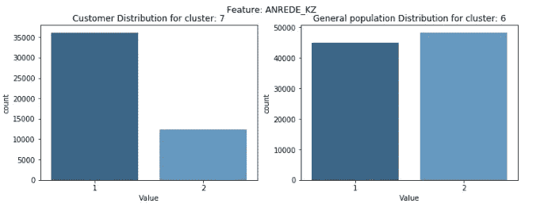
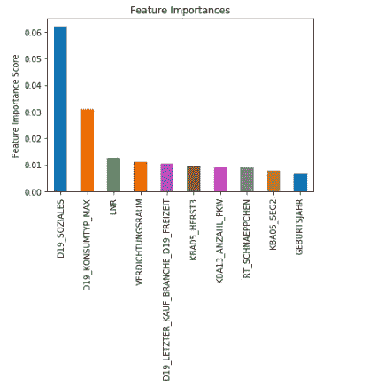

# 利用数据科学获取客户

> 原文：<https://towardsdatascience.com/using-data-science-for-customer-acquisition-2001525792f?source=collection_archive---------11----------------------->

## 客户细分报告和客户反应预测

为了给自己的品牌带来新客户，公司一直在开发他们的客户获取流程和策略。尽管这并不容易！任何基本客户获取计划的第一步都是**识别优质潜在客户**，猜猜看！**数据科学可以帮助我们做到这一点**！这个项目是关于可以用来理解顾客的特点，并可能获得他们的策略。

该项目应用机器学习算法，以便从人口统计数据中获取潜在客户的信息。这是由贝塔斯曼子公司 Arvato Financial Solutions 提供的 Udacity 机器学习工程师纳米学位项目的顶点项目。我选择这个项目主要是因为提供的数据是真实的，而且几乎没有对其进行清理。除此之外，我真的很喜欢了解业务和客户的需求，以便为公司和那些使用商业产品或服务的人提供最佳体验。

项目的第一部分包括基于 Arvato Financial Solutions 的现有客户和德国普通人群构建客户细分报告。为此，我使用无监督学习技术来识别最能描述公司核心客户群的人群。

第二部分包括建立客户营销活动响应预测器，以识别最有可能转化为客户的个人。为了做到这一点，我尝试了一些监督学习算法，并最终找到了给我最好 ROC AUC 分数的算法。

***你可以在我的***[***Github***](https://github.com/jmcabreira/Data-Science-Projects/tree/master/Customer_Segmentation_Report)***页面查看我开发的所有代码。***

# 数据:

如上所述，该项目的数据由德国贝塔斯曼的子公司 Arvato Financial Solutions 提供。有六个数据文件与本项目相关，如下所示:

**第一部分)客户细分**

*   **uda city _ AZDIAS _ 052018 . CSV**:德国普通人口的人口统计数据
*   **uda city _ CUSTOMERS _ 052018 . CSV**:邮购公司客户的人口统计数据
*   **DIAS 信息级别—属性 2017.xlsx** :属性和描述的顶级列表，按信息类别组织
*   **DIAS 属性-值 2017.xlsx :** 每个变量的数据值按字母顺序排列

**第二部分)营销活动响应预测**

*   **uda city _ maillout _ 052018 _ train . CSV**:作为营销活动目标的个人的人口统计数据
*   **uda city _ maillout _ 052018 _ test . CSV**:作为营销活动目标的个人的人口统计数据

*注意:已将* ***DIAS 信息级别*** *和****DIAS Attributes xlsx 文件*** *翻译为 data_info.csv 文件，该文件包含关于特征及其各自可能值的信息*。

# 数据预处理:

为了给机器学习算法提供输入，必须执行几个干净的预处理步骤。特别是，所提供的数据需要经过 8 个步骤的预处理和特征工程。您知道 80-20 法则吗？嗯，许多人说数据科学项目大约 80%的时间花在数据准备(预处理)上，20%花在数据分析和机器学习方法上。这正是在这个特殊的项目中发生的事情。我建立了一个函数，可以完成所有必需的过程，如下所示:

## 第 1 步-删除功能

由于缺失值的数量，清理功能会删除 35 个特征(列)。这些列包含超过 40%的 nan 数据。信息的缺乏可能会对模型产生负面影响，正因为如此，我决定摆脱它们。除此之外，对于客户数据集 I，该函数还删除了三个额外的列(*“CUSTOMER _ GROUP”，“ONLINE_PURCHASE”，“PRODUCT _ GROUP”*)。

每个要素的缺失值百分比分布

## 第 2 步-转换丢失的代码

我创建了 *data_info.csv* 文件，该文件汇总了来自 *DIAS 信息级别-Attributes 2017 . xlsx*和*DIAS Attributes-Values 2017 . xlsx 文件*的信息。除此之外，我还包括了每个特征的缺失值代码，这样我就可以识别每个特征的所有缺失值，然后转换为 NAN。

这就是 data_indo 数据框架的样子:

编码前每个要素的缺失值总数(仅显示 50 个要素)

编码后每个要素的缺失值总数(仅显示 50 个要素)

**第 3 步-删除行和数据插补**

为了分析每行缺失值的数量，我将数据帧分成不同的集合。第一个具有大量缺失值(超过 250 个)，其他的缺失值少于 250 个。通过这样做，我可以调查一些特征的分布，并比较两个数据框架。我意识到(许多特性的)分布是不同的，因此我决定继续处理丢失值较少的数据框，并删除所有超过 250 个 nan 变量的行。

## 第 4 部分—数据插补

尽管大多数特征要么是分类的，要么是顺序的，但我假设所有变量都是分类的。知道这一点后，我用特性中最常见的值替换了所有缺失的值(nan 变量),以补偿数据集中缺失的值。

## 第 5 部分—特征工程

用于构建客户细分的无监督学习算法需要数值。因此，所有的数据都必须用数字编码，这样模型才能按照预期的方式进行。

在分析了所有这些特性后，我决定如下操作:

*   **奥斯特 _ 韦斯特 _KZ** —将被重新编码为 0 和 1 二进制特征
*   **LNR**——这似乎是一个索引，所以我们可以摆脱它
*   **CAMEO_DEU_2015** —此功能有许多带有“XX”类别的行(347 行)。我认为这些输入是丢失的值，用一个数字值替换它们，并应用一个热编码来重新编码变量。
*   **CAMEO_DEUG_2015** —该功能也有许多“X”输入。我做了和上面一样的功能
*   **CAMEO_INTL_2015** —同上述特征
*   **D19 _ letz ter _ KAUF _ branch e**—该特征有 36 个类别(字符串)，需要重新编码。
*   **EINGEFUEGT_AM** —这是一个日期格式功能，需要重新编码(年和月列)

为了避免稀疏性问题，我将一个热编码限制为 44 和 33 个最频繁的特征标签。换句话说，我只为 44 个和 33 个最常见的特性类别中的每一个建立了一个二元变量，并将其余的视为噪声。我将设置变量的前 44 类 **CAMEO_DEU_2015** 和 **CAMEO_INTL_2015** 和 **D19_LETZTER_KAUF_BRANCHE 的前 33 类。**

我使用了前 44 和前 33 个最常见的类别，因为这样我可以保证 azdias 数据图的所有顶部组件都等于客户数据图的顶部组件。

# 主成分分析

由于我们有一个大型数据集，我们将执行降维。为此，我们需要执行特征缩放，以便主分量向量不会受到每个变量的缩放差异的影响。这种方法在处理基于距离的算法时非常重要，这就是我们的情况。

我使用了标准标度，将每个特征表示为 0，标准偏差等于 1。

缩放数据框后，我们可以应用降维。为了做到这一点，我使用了主成分方法，以便找到数据中最大方差的向量。首先，我使用了 dataframe 的所有功能。通过这样做，我们可以看到可变性的一般趋势。下图显示了每个组成部分解释的差异比率和解释的累积差异。

在查看了上面屏幕图中每个组件解释的差异后，我决定选择 215 个组件，它们占解释的差异的大约 89%。

# k 均值聚类

我们可以绘制肘形曲线，以更好地确定要使用的聚类数。该方法获取 k(聚类)的值，并查看每个数据点到聚类中心的平均距离。我们可以注意到，该值随着 k 的增加而减小，我们选择 k 的数值，在该数值处，k 停止以显著的速率减小(肘部)。

我从使用 MiniBatchKMeans 开始，它是 KMeans 算法的变体，使用小批量来减少计算时间。这个算法的结果比标准的 KMeans 稍差，正因为如此，在确定了聚类数之后，我使用了常规的算法。

上面的肘形曲线显示了前 9 个集群的分数迅速降低。即使它在几个点上增加，在群集 11 之后，减少变得越来越不明显。正因为如此，我决定选择 11 作为聚类数。

# 比较普通人群和客户群

在将 PCA 和聚类模型构建到一般人群数据上之后，我们可以将相同的过程应用到客户数据上，并比较聚类分布。这个想法是为了找出公司最强大的客户群在哪里。换句话说，我们必须找出哪些分组代表过多或代表不足。那有什么帮助？好吧，让我们假设 15%的人被分配到一般人群的特定集群，25%的客户也“感觉”接近该集群的质心。这样的话，消费者的比例将会大于总人口的比例。这表明普通人群中的这些人可能是公司的目标受众。

下面的条形图显示了分配到 11 个集群的人员分布。基于前面的假设，我们可以注意到，代表性最强和代表性最弱的集群分别是集群编号 7 和 6。

为了了解这些集群的一些特征，我决定研究一些描述它们的“金融类型”的特征，并绘制它们的分布图。

## 特点:

*   **HH_EINKOMMEN_SCORE** :估计家庭净收入(较低=较高收入)
*   **FINANZ_VORSORGER** :准备好的个人财务类型(较低=较高财务类型)
*   **FINANZ_ANLEGER** :投资者个人理财类型(较低=较高理财类型)
*   **FINANZ_HAUSBAUER** :房屋所有者的个人金融类型(较低=较高金融类型)
*   **金融极简主义者**:金融兴趣低的人(低=高金融类型)
*   **FINANZ_SPARER** :存钱者(较低=较高的金融类型)
*   **LP_STATUS_GROB** :社会地位(下层=下层)
*   **KKK** :购买力(低=高购买力)
*   **安雷德 _KZ** :性别(1 男 2 女)

估计家庭净收入

准备好的个人财务类型

投资者的个人理财类型

房主的个人理财类型

那些经济利益低的人

存钱的人

社会地位

购买力

性别(1 名男性，2 名女性)

# 解释:

我们可以注意到的第一件事是，在客户群体中，有一个集群代表过多，也有一些集群代表不足。

我们还可以注意到，过表示数量最多的三个集群分别是**集群 7** 、**集群 11** 和**集群 3** 。正因为如此，这表明这些集群更有可能成为公司的目标受众。

另一方面，代表性最不足的三个群组是**群组 1** 、**群组 6** 、**群组 8**

为了更好地了解每个聚类的总体情况，我们必须检查每个特征的分布。在我的例子中，我选择了代表每种金融类型的特征。

*   **HH_EINKOMMEN_SCORE** :估计家庭净收入(较低=较高收入)
*   **FINANZ_VORSORGER** :准备好的个人财务类型(较低=较高财务类型)
*   **FINANZ_ANLEGER** :投资者个人理财类型(较低=较高理财类型)
*   **FINANZ_HAUSBAUER** :房屋所有者的个人金融类型(较低=较高金融类型)
*   **金融极简主义者**:金融兴趣低的人(较低=较高的金融类型)
*   金融储蓄者(较低=较高的金融类型)
*   **LP_STATUS_GROB** :社会地位(下层=下层)
*   **KKK** :购买力(低=高购买力)
*   **安瑞德 _KZ** :性别(1 男 2 女)

拥有**过度代表**客户数据的集群由**更有可能**的个人组成:

*   收入高
*   做好充分准备
*   成为投资者
*   成为省钱达人
*   购买力一般/很高
*   男性

在**代表性不足的**群体中的人**更有可能**:

*   收入一般
*   准备一般
*   不投资他们的钱
*   经济利益很低
*   社会地位低而且非常低
*   购买力一般
*   不是男的就是女的

# 客户反应预测

既然我们已经发现了哪部分人更有可能成为邮购公司的客户，我们就可以建立一个监督模型来预测一个人是否会对营销活动做出反应。

“mailout.train”和 mailout.test 中的每一行都代表邮寄活动的目标个人。每个数据集包含大约 43 000 个数据行，训练数据集包括一个列“响应”，该列说明在活动之后某人是否成为公司的客户。

我首先使用 clean_df 函数来处理预处理部分的所有步骤。之后，我注意到数据集在类方面是不平衡的。事实上，98.76%的观察结果对应于没有对活动做出响应的人。因此，准确性度量似乎不是评估模型的好选择。我将使用 ROC AUC 指标，因为它不受不平衡的影响。

## ROC AUC 指标

由于第二个模型是一个分类问题，我将使用 AUC-ROC 作为度量。ROC(受试者操作特征)代表概率曲线，它是通过绘制真阳性率(TPR)或召回率与假阳性率(1-特异性)的关系图来创建的。AUC 给出了可分离度。通过使用 AUC-ROC，我们能够知道我们的模型在分类这两类中的表现如何。AUC(曲线下面积)越高，模型预测活动成功的能力就越强(在我们的例子中)。

## 基线模型

我构建了一个函数，它接受要执行的模型或模型列表、用于馈送 GridSearchCV 和调整分类器的参数名称、X_train 数据、Y_train 数据和一个可选参数，以防我想要绘制条形图和比较不同的模型。

每当我建立一个分类模型时，我喜欢从使用逻辑回归算法的基本形式开始。起初，我删除了代表每个个体的 id 的列，得到了一个很差的结果。令人惊讶的是，在包含该行之后，我得到了 0.7 的结果，这对于基线模型来说是不错的。

## 构建其他模型

我在数据上测试了几个不同的监督学习模型。请注意，我没有对数据进行缩放，因为我最期待的是三个基于模型的更好的结果，正如我们所知，这些模型可以很好地处理非缩放数据。

## 梯度增强调谐

上面的柱状图表明，最有前途的分类器是 gradientBoosting。正因为如此，我选择了这个算法来调整使用。

我做了一个执行试验和错误调整，调整参数，如 n_estimators、loss、learning_rate、n_samples_split、min_samples_leaf、max_depth、max_features 和 subsample。

我最终得到了一个具有以下特征的模型:

根据模型的特征重要性:

# 结论

这个项目的主要目标是了解客户群，并预测一个人是否会对营销活动做出反应。这样，我们可以帮助一家德国邮购公司开发一种更有效的瞄准潜在客户的方法。

第一部分包括建立无监督模型，如 PCA 和 k-means 聚类，以执行客户细分。我们使用了 215 个组件和 11 个集群。应用这些方法后，我可以比较代表过多和代表不足的组别，并得出一些结论。例如，我注意到，被过度代表的群体中的大多数人(来自普通人群的人可能是公司的目标受众)收入高，是投资者，也是很好的存钱者。另一方面，普通人收入一般，不投资，购买力一般。

在第二部分，我建立了几个不同的监督学习模型，并对它们进行了比较。梯度推进算法给我提供了最好的 ROC AUC 分数，因此它被选择和调整。经过彻底的参数调整后，我在测试数据中得到了 0.78794 分。

这个项目真的很有挑战性，但是我从中学到了很多。我要感谢 Udacity 的所有支持(特别是我的导师 Mofetoluwa A .)和贝塔斯曼 Arvato Analytics 提供的所有这些数据。

