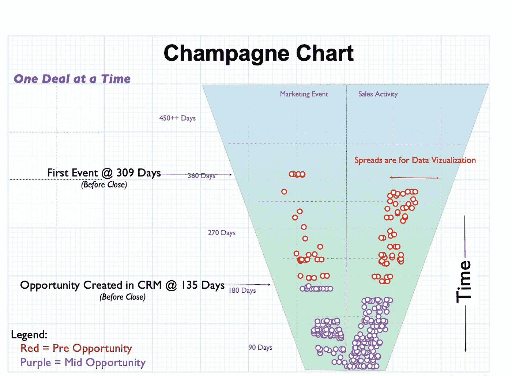
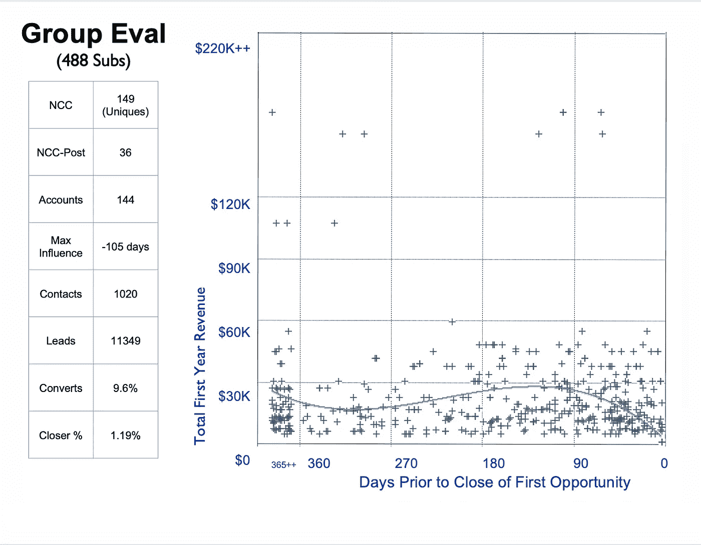

# 使用数据科学进行营销分析

> 原文：<https://towardsdatascience.com/using-data-science-for-marketing-analytics-8fc066c44238?source=collection_archive---------32----------------------->

## B2B 与 B2C 的区别

资料来源:联合国人类住区规划署

“根据 QuanticMind 的数据，97%的领导者认为营销的未来取决于数字营销人员与基于机器学习的工具一起工作的方式。”——[数字营销学院](https://digitalmarketinginstitute.com/blog/how-to-apply-machine-learning-to-your-digital-marketing-strategy)

**与 CRM (B2B)活动合作**

在 B2B 营销中，企业使用客户关系管理(CRM)软件，如 Salesforce、Oracle 和 SugarCRM，来记录在决策和采购中起关键作用的业务合作伙伴的联系人。这些数据可以在带有营销分析软件的机器学习环境中使用，以绘制针对特定市场的广告活动的有效性。

*   销售渠道中包含的个性化事件，如呼出电话和电子邮件简讯，可以记录在图表中，以分析未来购买的结果。
*   商展和促销活动的出席情况在侧重于销售周期的营销分析中以时间戳记录。

B2B 营销中的一大挑战是在销售中确定决策的归属，因为在一次购买中可能会有几个人参与。B2B 营销的个性化可以扩展到每个联系人 100 万个事件，从编程变量生成图表和分析。

**参与电子商务(B2C)活动**

在 B2C 营销分析中，将销售决策归咎于一个人并不困难。在 B2C 营销中，没有相同的机会来跟踪具有特定采购代理的商业组织和公司。以 B2C 为代表的零售消费市场要广阔得多，是由电商平台需求定义的。

*   在线商店通过各种形式的 cookies 跟踪网站和移动应用程序上的消费者销售渠道，其中最大的企业网站通常在其平台上支持 1 亿至 2.5 亿注册用户。
*   这导致了来自由机器学习和数据科学实时驱动的自动化营销分析的电子商务数据的个性化的潜力。
*   企业跟踪与搜索引擎流量、回头客、PPC 广告和直接电子邮件活动相关的变量，以确定广告在销售周期中的有效性。
*   这些可变事件还可以通过营销分析软件绘制限时销售和假日促销的效果图。

**计算营销活动的 ROMI 分析**

营销投资回报率(ROMI)是一个 OPEX 模型，比较非资本支出与收益。该术语由 Guy Powell 于 2002 年创造，用于评估通过投资昂贵的商业广告来建立长期品牌形象、客户忠诚度和商誉的营销活动。 [ROMI](https://en.wikipedia.org/wiki/Return_on_marketing_investment) 是根据与收入、利润和计划支出变化相关的简单公式计算出来的。

*   鲍威尔认出了两种 ROMI，“模糊的”和“清晰的”。
*   模糊 ROMI 试图通过对顾客反馈中定性价值的统计测量来估计品牌忠诚度和商誉。
*   90%的营销分析使用夏普 ROMI 来跟踪商业周期中的总项目支出与新收入。
*   夏普 ROMI 指标通过机器学习和数据科学来评估 B2B 和 B2C 广告的有效性。

“大数据”存储库通过机器学习算法进行过滤，以帮助决策者通过图表分析来辨别模式，从而预测类似的成功。理想情况是创建一个经过培训的实时数据科学模型，根据客户的历史喜好和偏好向客户部署定制内容和显示。说明性和描述性模型都有好处。

**使用描述性模型**

描述性模型从电子商务和 CRM 资源中过滤“大数据”,从后视镜中评估 ROMI，即通过对过去活动的分析。

*   营销分析软件对销售周期中的近期活动进行优先排序，并应每天在数据科学笔记本中进行重新培训。
*   比较信息包括营销活动、结果和成本，作为跨销售渠道成功的变量。

**使用预测模型**

营销分析中的预测模型基于实时反馈，依赖于实时数据。来自客户和顾客的这些信息必须存储在一个可靠、安全和快速的数据库中。

*   营销分析的预测模型有助于决策者辨别如何改变广告活动内容，以符合消费者的口味和趋势。
*   预测模型在 ROMI 阶段开发，通过产品端和客户端推荐引擎优化广告活动。

这些方法可以帮助电商平台和店铺避免购物车被顾客抛弃。在由数据科学驱动的营销分析中，随着时间的推移，你更新模型越多，结果就越智能。

**优化营销分析的成功**

为了通过机器学习在广告活动的营销分析中取得成功，企业必须区分现有客户、新业务和续订。

*   在电子商务中，大多数平台收入来自重复交易，这可以通过向客户推荐产品来创建个性化显示进行优化。
*   在为数据科学中的指标和分析准备数据时，企业需要将客户事件变量收集到单个流中，然后标记每个事件，并为平台大规模聚合信息。

***香槟图可用于确定数据分析中何时出现路径行为。***

来源:作者

***模式拟合显示了人们在购买产品之前是如何消费产品评价的。***

来源:作者

**结论**

1.  **获取数据。**要有耐心；这需要几周时间。获得所有许可以找出所有系统的位置并从那里出发需要很多时间。

*   获得所有系统的访问权限
*   就单一时间戳方法达成一致
*   就“成功”对销售的意义达成一致(时间、内容、地点、实体)
*   查找所有中点系统
*   就组织活动模式达成一致
*   每个人/组织/销售、产品系列/销售活动的单数据流数据

2.**使用云数据库:**不要将数据存储在平面文件或笔记本电脑中。计划规模，即使你只是踢踢轮胎。我真的很喜欢雪花，因为它很快，而且是基于云的。因此，如果你想把一个项目从欧洲转移到美国进行分析，这是可行的。如果它在您的数据中心，那么它穿越海洋的速度可能会慢 50-100 倍。

*   重新组织和规范化数据
*   输入时将其匿名，但留下一个解码系统(当人们钻研“证据”时)
*   规划大规模和长期的全球输入/输出—数据是一场流动的盛宴
*   为将来的“为什么/什么/何时”查询启用—添加一些帮助器列和表
*   将其连接到快速、可扩展的数据科学笔记本电脑

**附加资源**

*   这篇博客摘自 Grover Righter 的网络研讨会“使用数据科学进行营销分析”。[点击此处观看整个网络研讨会](https://youtu.be/UARbLMGf1bE)。
*   Zepl 的**数据科学平台**允许数据科学家和分析师快速构建 Python、R、Scala 和 SQL 模型的原型，为他们的营销分析用例创建丰富的视觉效果。在 www.zepl.com 免费试用
*   雪花通过为所有数据工作负载提供可扩展、灵活且安全的**云数据平台**，帮助营销分析团队从其数据中获取更多商业价值。在 www.snowflake.com[免费试用](http://www.snowflake.com)

**作者**

Grover Righter 是 Zepl 的首席数据科学家。他专注于基于科学的营销项目，并运行着一个衡量电子邮件、搜索引擎优化和社交媒体有效性的分析引擎背板。他曾在各大知名营销自动化平台上工作，包括 Eloqua、Marketo、Pardot、HubSpot 和 Leadformix。

Grover 自 1981 年以来一直在高科技领域工作。他最初是一名数学家和设计工程师，在 RMS 公司、美国电话电报公司公司、Unisys 公司和 Novell 公司的主要技术的设计和开发中发挥了重要作用。但每次格罗弗制造出一个产品，他都会立即被招募去“销售它”，而不管组织内是否存在另一个销售团队。最终，格罗弗用完了他一生中作为一名工程师参加销售会议的机会，转而从事营销工作。