# 利用数据科学分析足球运动员的表现

> 原文：<https://towardsdatascience.com/using-data-science-to-analyse-player-performance-in-football-4dd04e579cfa?source=collection_archive---------9----------------------->

## *最常见事件类型的分解技巧*

由[丹尼尔·诺林](https://unsplash.com/@danielnorin)在 [Unsplash](https://unsplash.com/photos/lBhhnhndpE0) 上拍摄的照片

不足为奇的是，传球是足球(或者对任何感兴趣的美国人来说是英式足球)中最常见的事件。一场好的传球比赛对足球的成功至关重要，因为它能让你通过控球来控制比赛，节省能量，从而给你带来更好的得分机会。传球是指使用良好的技术快速、准确、恰当地传球，同时在正确的时间做出正确的决定。

因此，不应该低估分析该领域中玩家表现的重要性。但是我们如何量化一个球员的传球技术呢？

传统的衡量标准是完成的通过次数。然而，使用传球是否完成的二元标签忽略了球员之间传球风格的巨大差异，也没有考虑到球队的流动。

我们知道这种传球类型的变化是存在的，因为专家和评论员讨论它的方式，“伟大的传球”，“侵略性的传球”，“可怜的球”。

使用二进制标签时，这些描述符会被完全忽略。

这个博客建立了一个预期传递模型来改变这种看法。我使用一个客观变量来衡量连续谱上的传球质量，根据之前的传球数据来分析任何传球所涉及的风险水平。对于那些对完整代码感兴趣的人，(包括所有的可视化)，请随时查看这里的。

# 数据

我用来建立这个预期传球模型的数据是基于 20 支球队，打了 380 场比赛，总共尝试了 358，783 次传球。

初始变量包括:

*   球队、比赛、球员、主场、客场标识符
*   主客场全职比分
*   半，分，秒
*   通过的结果(1 或 0)
*   通行证的起点 x 和 y、终点 x 和 y 的位置标识符
*   如果传球是正常传球，或者是头球、传中、角球、抛球、任意球

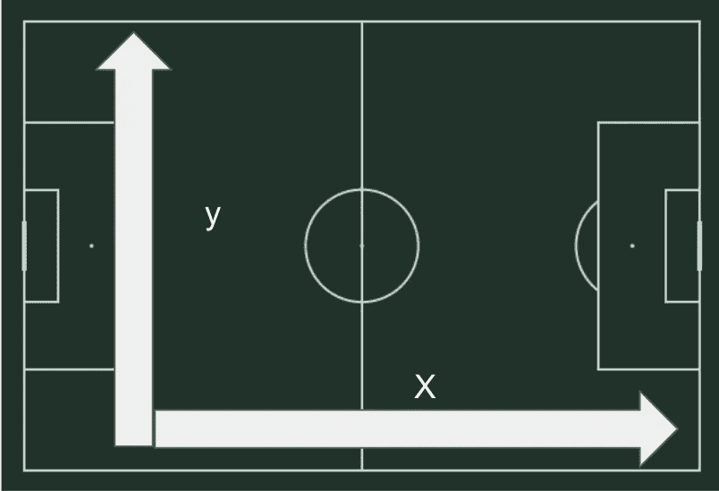

作者图片

坐标假设球场为 105 米 x68 米，并且已经调整，从进攻方的角度来看，X 在进攻方向从 0-105 度，Y 从右到左。例如，从(x，y) = (95，15)开始的传球在对方禁区的右侧开始。

# 新增功能

尽管我们可以将原始数据输入到机器学习中，但特征工程是转换数据以产生与场景、问题和领域相关的特征的过程。在这种情况下，我设计的功能围绕两个要点——球的移动和团队表现:

*   利用毕达哥拉斯定理计算传球距离。
*   每场比赛的主客场位置指标。
*   向前或向后为传球方向。
*   对于目前控球的队伍来说，他们的比赛结果。(赢、平、输)
*   将球场分成 9 个大小相等的方块，标为 1-9

可能会有更多的功能可以被包括在内，所以如果你有任何补充，请随时发送给我！

# 初步探索性数据分析

探索性数据分析是指对数据进行初步调查的过程，以便在汇总统计数据和图表的帮助下发现模式、发现异常并检查假设。

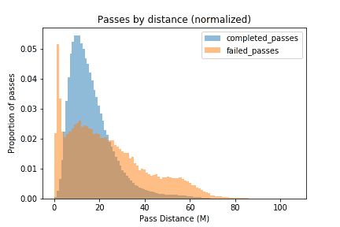

**通过距离完成**(图片作者提供)

该图显示，很大比例的传球在非常低的距离(小于 5 米)处失败。这可能表明在传球的早期阶段被拦截，而不是非受迫性失误。在 15 到 30 米之间，完成的传球比失败的传球多得多，在 30 米之后，完成传球的比例急剧下降，而失败传球开始趋于平稳。

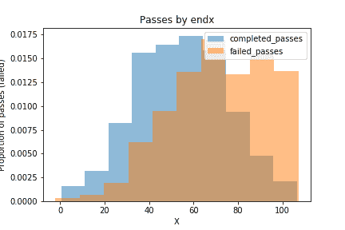

**通过 X 年底完成**(图片由作者提供)

这第二个视觉化显示传球完成也受球场上传球结束位置的影响。随着球进一步向对方球门移动，传球失误的比率会增加。这个柱状图也向我们展示了大部分的传球，完成的或者失败的，都是在中场结束的。

也许有趣的是，当看一遍从哪里开始时，完成率的这种差异并没有延续到相同的数量级。

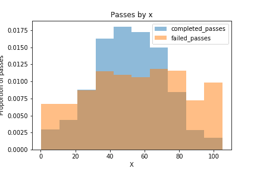

**通过开始完成 X** (图片作者)

大多数“特殊”传球类型，如角球和任意球，完成率比普通传球类型低。

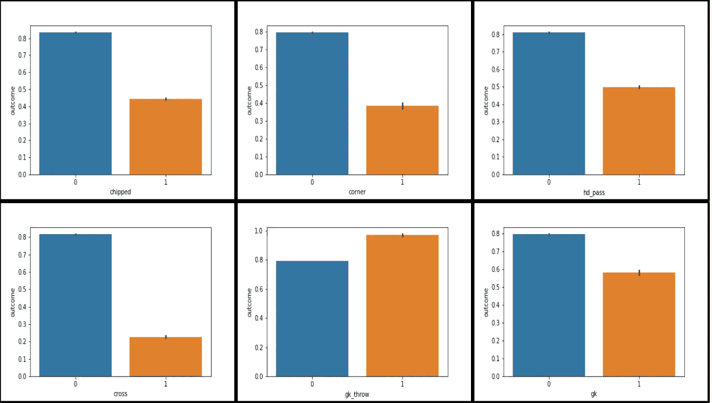

**按传递类型完成传递**(图片由作者提供)

# **无监督学习**

无监督学习是一种机器学习，它在最少人工监督的情况下在数据集中寻找以前未检测到的模式。在这种情况下，我使用它作为一种自组织类型来了解各种不同的传递类型，首先删除传递是否完成，因为我不希望传递类型在成功时聚集，并避免数据在管道中进一步泄漏。

***K- means*** 聚类是我使用的无监督学习算法。它遵循一个简单的程序，将给定的数据集分类成一些集群。与其他集群技术相比，它的伸缩性很好，工作速度也很快。这很容易解释。我选择了 22 个集群，目的是让一个团队中的每个球员都有 2 次传球，虽然它显示了球在球场上的一般运动，但更多的集群将提供关于传球通常如何进行的更详细的视图。下面显示了通过平均起点和终点的集群。

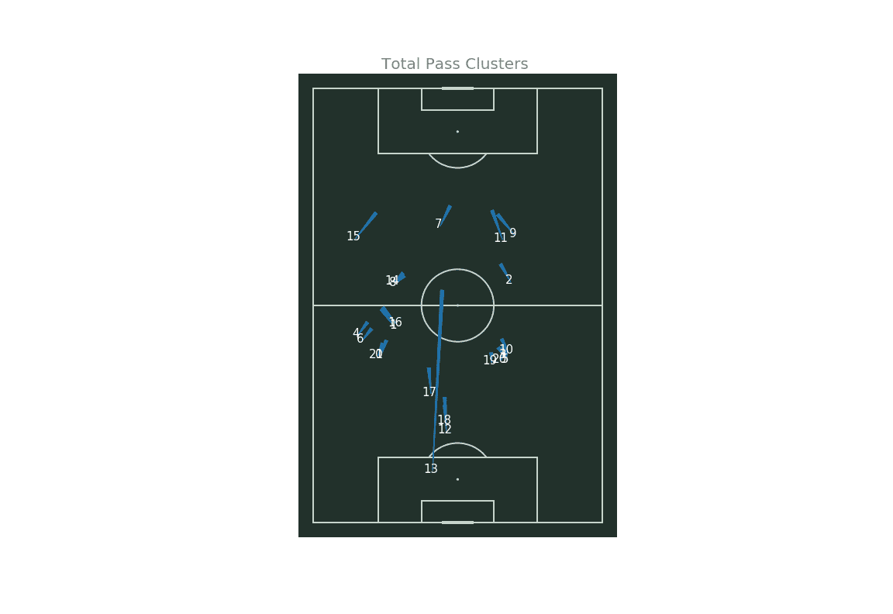

**K 表示使用 22 个聚类进行聚类**(图片由作者提供)

这些聚类类别被用作随后的监督学习算法的预测器。

# **监督学习**

监督学习的定义是使用标记数据集来训练算法，以对数据进行分类或准确预测结果。在这种情况下，我们训练一个机器学习算法，以及训练数据集中是否完成了一次通过，并从测试数据集中删除通过结果，看看它可以预测一次通过是否完成的程度。

为了测试算法的性能，标准的做法是预先生成一个虚拟模型。在这种情况下，虚拟模型只是预测所有通道都将完成。在测试集中，完成了 71，001 次通过，18，695 次失败。每次选择“pass complete ”,精确度为 **79.3%** 。这几乎都是由于高日志丢失造成的噪声。

在尝试了多种不同的方法之后，我选择了 XGBoost。XGBoost 是一种算法，最近一直在结构化数据的应用机器学习和 Kaggle 竞争中占据主导地位。使用超参数调整，产生了以下混淆矩阵:

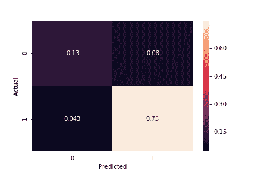

XGBoost 混淆矩阵(图片由作者提供)

它打破了模型的预测和实际发生的事情，彼此并列。在这里，我们可以看到，79.3%的数据集已完成通过。该算法预测 75%已完成通过。

20.7%未通过，模型预测 13%会通过。

该混淆矩阵可用于计算以下指标:

*   准确度得分: **0.88**
*   精度分数: **0.9**
*   召回分数: **0.95**
*   F1 得分: **0.92**
*   测井曲线损失: **0.28**
*   AUC **: 0.92**

所有这些都大大优于基准假人模型。

# 通过风险和玩家分析

找到一个相对可靠的算法来预测是否通过(1 或 0)，我将二进制输出转换为通过的概率，XGBoost 可以为我提供这个概率。

然后，我定义了度量传递风险。如果模型预测传球发生的概率为 0.8，并且完成了，我给球员传球得分加 0.2。如果他们传球没有完成，我给该球员传球得分减 0.8 分。然后，我对球员的传球次数进行平均，以定义平均风险克服分数。这个分数能够比较球员在传球中所冒的风险和克服的风险。

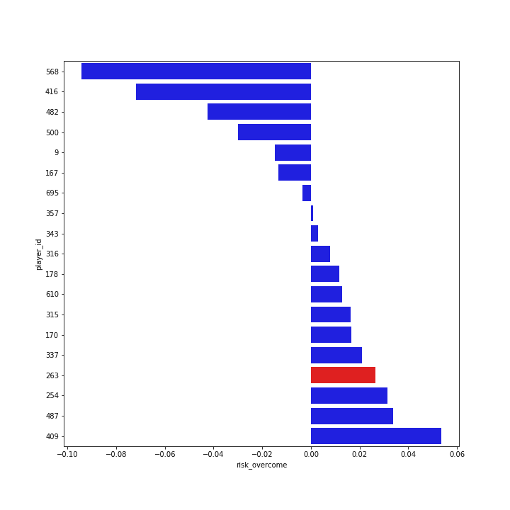

**玩家平均风险战胜**(图片由作者提供)

拥有相似的传球组合的球员，很可能在球场上踢相同或相似的位置。这里我们可以看到，与风格类似的玩家相比，玩家 263 的风险克服得分高于平均水平。

然而，在足球比赛中，我们不仅仅关心平均水平，稳定性也是分析球员表现的关键。

虽然与其他球员相比，球员 263 的传球表现略高于平均水平，但他比其他球员尝试更多的传球。这导致他在与一组类似的同龄人相比时被列为最优秀的传球手之一。像这样观察球员的表现可以让我们寻找其他有价值的替代者。玩家 409 具有非常高的平均风险克服率，但很少传球，他可能被低估或低估。

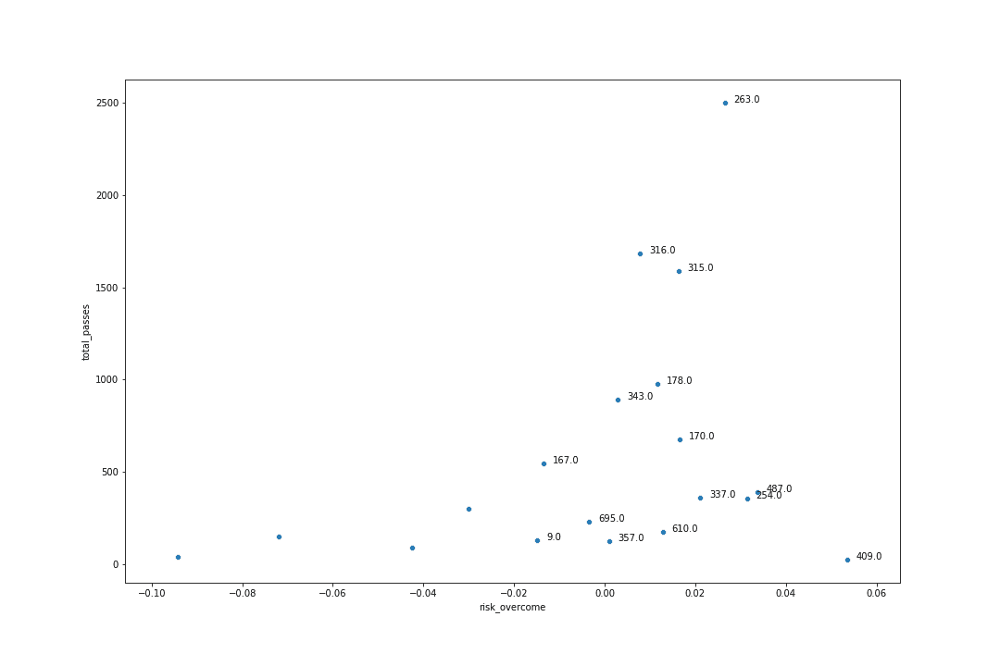

通过风险克服的次数(图片由作者提供)

这为教练提供了建立球队和球员替补席的机会，这些球员在统计上会比他们在转会市场上的价格更好，并识别表现不佳的球员。

考虑到克服风险和传球次数都是考察球员表现时要考虑的重要指标，将它们相乘可以得到一个总传球得分，从而可以进行进一步分析。在这里，我们可以看到 263 号球员在所有排名前 40 的球员中排名第二。

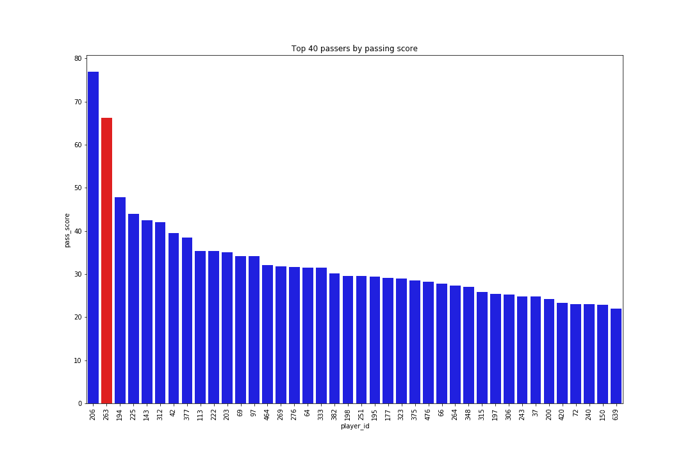

通过总分排名前 40 的选手(图片由作者提供)

这一观点使得进一步的发现成为可能，通过这些发现，教练可以从低水平的球队中识别出高水平的球员。可能被降级的球队，或者陷入财务困境的球队，甚至是其他联赛的顶级球员，都有可能被低价收购。

# 结论

我们可以使用数据科学来分析球员在传球中能够克服多少风险。为足球比赛中发生的所有行为建立类似的衡量标准是可能的——无论是铲球、射门还是控球。这有助于更深入地了解玩家和团队的表现(包括你自己和对手的表现)，有助于提高表现并最终提高游戏成绩。

在团队中使用数据科学和机器学习并不新鲜，事实上，体育界完全充斥着统计数据。了解新的方法和使用新的技术来利用体育界存在的大量数据，可以帮助团队和教练超越他们的对手，不管是什么运动。

# **限制**

上述工作有一个明显的局限性；也就是说，通过按风险克服程度对玩家进行排名，我们假设风险是好的。通行证里没有价值的概念，或者说报酬，所以很难建立风险/报酬模型。传球的价值在于它有可能带来机会或者把球带到对手的地盘，这一点很重要。不幸的是，这个数据集只包括传球结果的细节，然而，有了更多关于射门和进球的详细数据，就有可能开始建立这种模型。

# 进一步的工作

有了这个比较整个联盟球员的用例，一个高层次的模型是有意义的。然而，单个团队和球员可以玩得很不一样。进一步的工作可能包括建立模型来分析单个团队的表现，或者甚至在单个球员层面上进行更精细的分析。这有助于发现你自己球队的弱点，或者提供机会利用对手和特定球员的打法。这一点的开头详述如下。

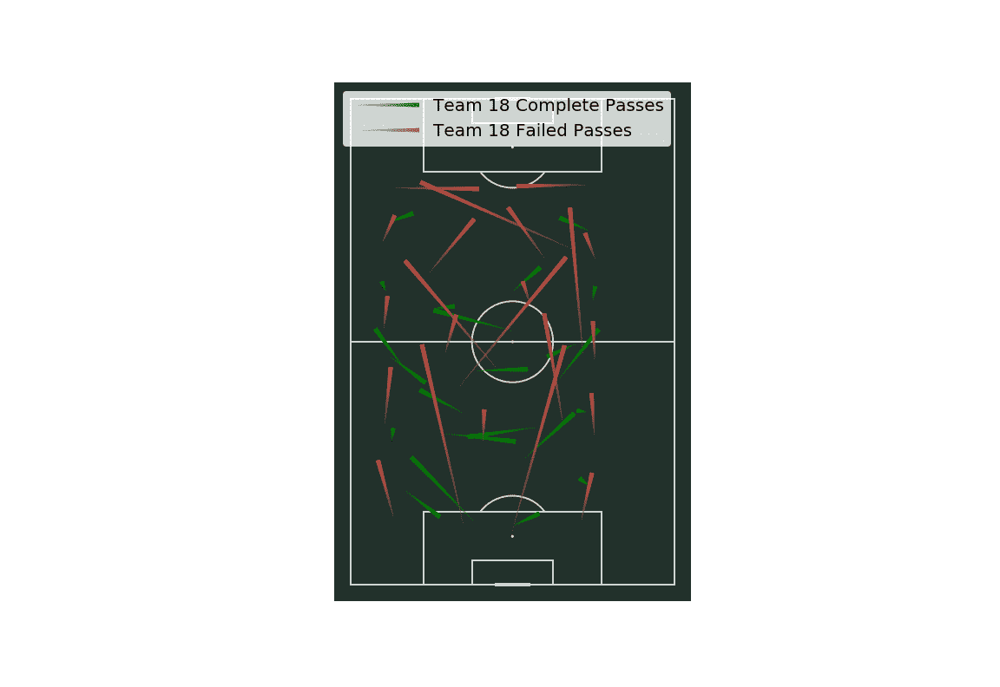

**团队级别的聚类**(图片由作者提供)

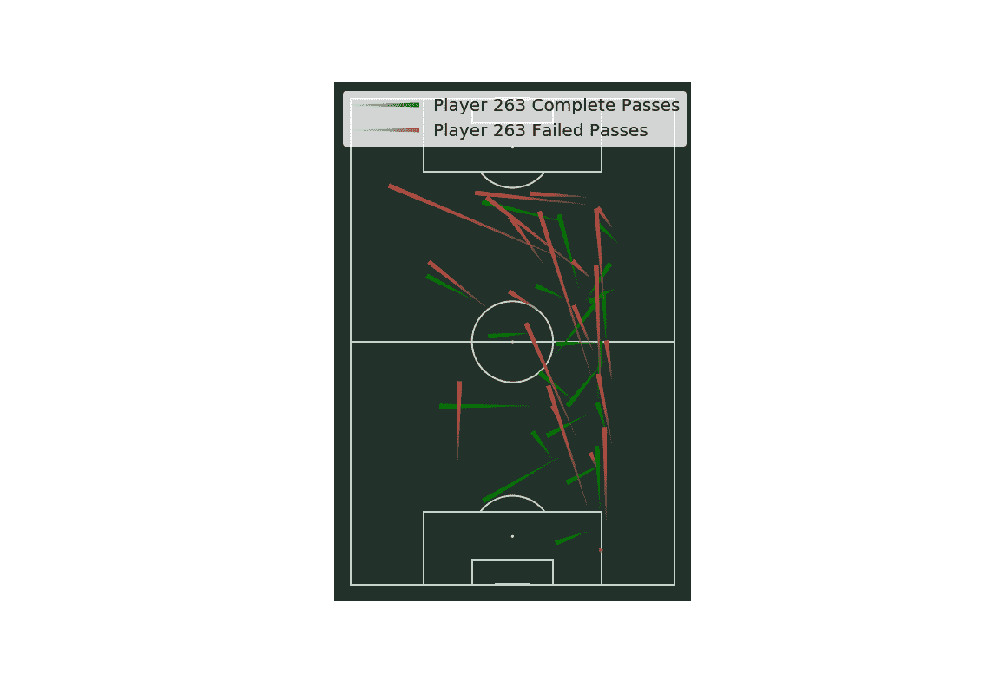

**玩家级别的聚类**(图片由作者提供)

# **关于我**

我希望你喜欢我的作品！我会很感激通过这里对它的任何反馈。我是一名数据科学家，热衷于处理体育数据。作为一名前职业赌徒，我对体育分析和预测有着独特的见解。我目前正在寻找进入体育数据行业，如果你想接触，请前往我的 LinkedIn！

 [## 卡特 B. -数据科学家-自由职业者，个体经营者| LinkedIn

### 随着博客成功地发表了走向数据科学和分析 Vidhya，我目前正在寻找数据科学…

www.linkedin.com](https://www.linkedin.com/in/carterbouley/) 

# **参考文献**

*保罗·鲍尔、赫克托·鲁伊斯、魏新雨和帕特里克·露西。2017.并非所有传球都是平等的:从跟踪数据客观地测量足球传球的风险和回报。《第 23 届 ACM SIGKDD 知识发现和数据挖掘国际会议论文集》(KDD '17)。计算机械协会，纽约，纽约州，美国。DOI:https://DOI . org/10.1145/3097983.3098051*