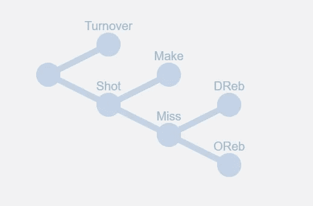
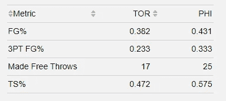
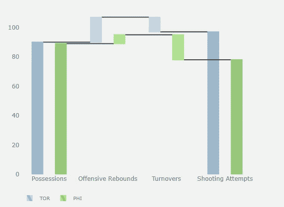
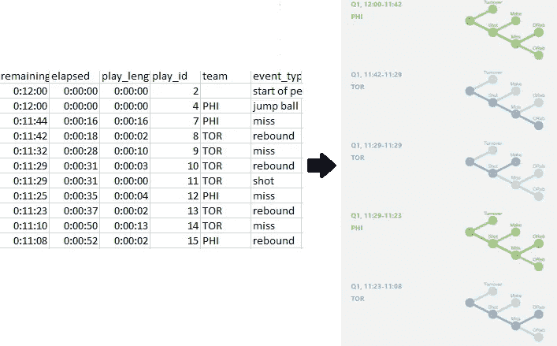
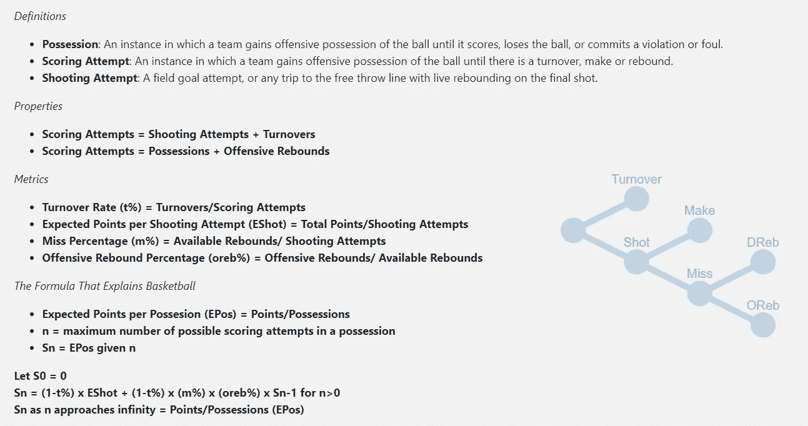
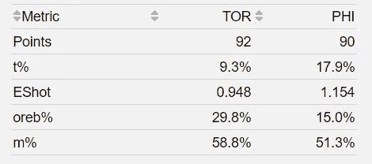
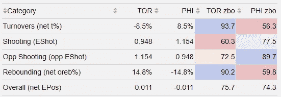

# 用熊猫和 Dash 重新思考篮球比赛

> 原文：<https://towardsdatascience.com/using-data-science-to-determine-basketball-is-32-shooting-32-opponents-shooting-20-turnovers-741f34521f0e?source=collection_archive---------58----------------------->

## *得分尝试树*框架确定 NBA 篮球是 32%投篮，32%对手投篮，20%失误，16%篮板

得分尝试树([全互动写起](https://www.belleville.app/the_formula_that_explains_basketball/))

2019 年 5 月 12 日，猛龙-76 人，第七场，第四节，还剩 4 秒，比赛平手。我想我们都记得接下来发生了什么。现在被称为“一击”。NBA 历史上最重要的季后赛投篮之一。

人们可能不记得的是，那晚投篮对猛龙队不利。

猛龙-76 人投篮对比(2019 . 5 . 12)

总的来说，76 人的投篮明显比猛龙好。但是猛龙队以 92 比 90 赢得了比赛。发生了什么事？在一场财产交替的运动中，猛龙队怎么可能赢得那场比赛？

**猛龙出手比 76 人多**。如果一支球队比他们的对手更频繁地错失第二次机会，或者迫使失误比他们允许的更多，那么他们在导致他们获得超过对手的投篮机会的领域表现良好。利用*评分尝试树*框架，我们能够生成这种可视化。

猛龙-76 人投篮尝试和解(2019 年 5 月 12 日)

那么什么是*评分尝试树*框架呢？它遵循篮球比赛是一系列树的前提。更具体地说，*得分尝试树*，每次出现失误、得分或篮板时都会重置。它比每次控球的观点更深入一些，因为进攻篮板有可能在一次控球中出现多次得分尝试。

利用熊猫，我能够从 2018-2019 赛季的比赛数据中收集比赛数据，以符合这一模型。我从[大数据球](https://www.bigdataball.com/datasets/nba/)中以 csv 格式提取数据。然后，我开始开发一个标准流程，将一个接一个的数据转换到我的模型中。这主要包括删除与我的分析不相关的数据，如记录暂停、替换、犯规、死球篮板的数据，然后开发检查、修复和模型解释的流程。

收集详细数据

该模型的目的是定义投篮、篮板和失误指标，以此来制定每球得分的预期指标。你最终会得到下面的框架。

得分尝试树([链接](https://www.belleville.app/the_formula_that_explains_basketball/))

我能够让 2018-2019 赛季的所有比赛都符合解释篮球的公式。本质上，该模型使用计算出的 *EPos* 和拥有数字*正确地计算出了所有游戏的最终分数。*

回到猛龙-76 人，我们可以看到他们在 *4 得分尝试树指标*中的表现。猛龙队在失误和篮板方面明显优于 76 人队。

猛龙-76 人 4 项指标对比(2019 年 5 月 12 日)

根据这个框架，我们知道每场得分( *EPos* )是 4 个指标的乘积。我注意到，如果我移除了 *m%* ，剩余的指标仍然在线性回归模型中以 0.995 的 R 预测 *EPos* 。为了这个练习的目的，我发现最直观的方法就是将射击视为 *EShot* 。

因为篮球是在两端进行的，所以看一下*净 EPos、*EPos 和 *opp EPos* 的区别(即对手的 EPos)是有意义的。如果你对 *t%* 和 *oreb%* 采取相同的净方法，你会得到代表投篮、对手投篮、失误和篮板的 4 个因素，分别符合*净 EPos* 的 32%、32%、20%和 16%。

四因素回归分析

我将这些因素标准化，使它们在数量上完全相同，这样我们就可以使用加权平均值来计算整体因素。我把这些 zbo 分数叫做 T29，它们本质上就像 2K 等级。我有不同的 *zbo 分数*参数用于游戏内和多游戏累积结果，以允许两个预期数据集以 75 为中心的友好分布。

回到猛龙和 76 人的比赛，我们可以看到两支球队在比赛中各自的表现。

猛龙-76 人比赛中 zbo 得分(2019 年 5 月 12 日)

给你。猛禽队在失误和篮板方面的强劲表现足以推动他们战胜 76 人队，尽管他们的投篮很糟糕。

我运行了整个 2018-2019 常规赛的因素，并为每个球队生成了下面的 *zbo 分数*。

2018–2019 常规赛 zbo 得分

值得注意的是，我的赛季末*净 EPos* 和下面的*总体 zbo* 分别符合 0.998 和 0.995 的实际赛季积分差。

就是这样。我希望下次你考虑一个球队或球员时，你会考虑他们如何影响所有四个类别，然后相应地评估他们的整体价值。

如果您对本文有任何疑问，请随时通过 david@belleville.app 与我联系。同样，在我的文章[中也有更多信息，这里](https://www.belleville.app/the_formula_that_explains_basketball/)也有。