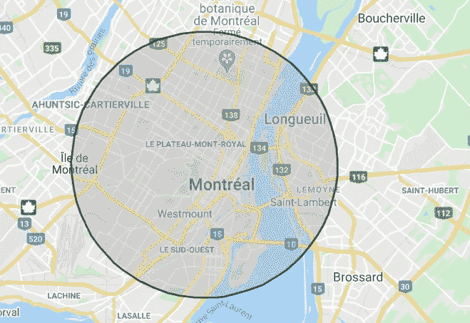
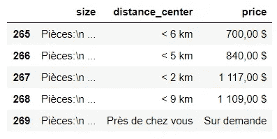
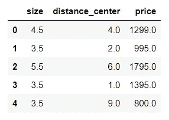
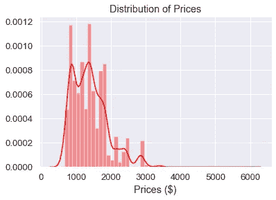
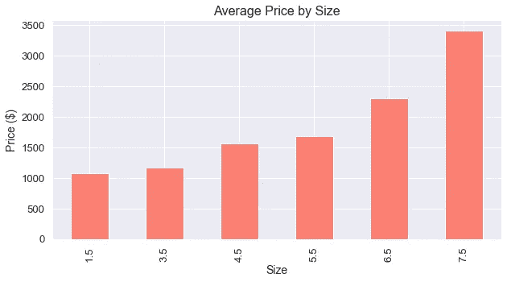
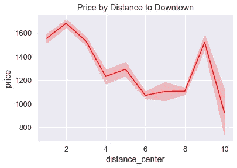
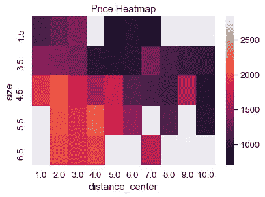

# 蒙特利尔的公寓租赁危机分析

> 原文：<https://towardsdatascience.com/using-data-science-to-look-at-montreals-apartment-rental-crisis-cffea9ee6b00?source=collection_archive---------47----------------------->

## 网页抓取、数据清理、数据可视化等等


[来源](https://unsplash.com/photos/VAxCHgJvZ0g)

在蒙特利尔找一套公寓比以往任何时候都难，当前的危机当然也没有帮助。

2020 年 1 月，《蒙特利尔公报》估计，该市的空置率约为 1.5%(15 年来最低)，租金价格在一年内上涨了约 3.6%。

随着 7 月 1 日(城市正式搬迁日)的到来，我决定看看目前的租赁市场，看看情况到底有多糟糕。

## 获取数据

为了做到这一点，我从寻找蒙特利尔公寓的主要网站 Kijiji 上搜集了(使用 BeautifulSoup)数据。更准确地说，我搜集了大约 3500 份公寓出租清单。对于每一个列表，我提取了价格、公寓的大小和离市中心的距离。我不得不使用离市中心的距离(最多 10 公里),因为大多数公寓的实际地址是不可用的。然而，离市中心的距离应该是一个很好的指标，表明公寓是否在理想的位置。对于熟悉这座城市的人来说，这是一张 10 公里半径的地图:



来源:使用 mapdevelopers.com 制作的地图

下面是用于从 Kijiji 获取数据并创建起始数据帧的代码:

如上所述，只有前 80 页的网站被刮，只有相对较新的清单。此外，睡眠功能用于通过暂停一段时间来控制循环的速率。我这样做是因为向网站发送太多太频繁的请求会导致网站的服务器关闭或网站变得太慢。

这是我此时的数据帧快照:



现在我有了数据，它需要被清理。

## 清理数据

清理数据分为两步。首先，我想只保留必要的信息。这意味着公寓的大小、离市中心的距离和价格是一个简单的数字(不需要其他符号或字符)。

第二，我删除了没有价格的公寓或没有实际价格的公寓(有些列为每月 1 美元，有些列为每月 10，000 美元，等等)。).

下面是用来清理数据帧的代码。

这里有个小提示:对于那些不知道的人，我们在蒙特利尔用一种奇怪的尺度来描述公寓的大小。

**1 1/2** :一个房间，一个独立卫生间。更广为人知的是工作室。

**3 1/2** :包括一个独特的客厅、卧室和厨房。更广为人知的是一居室公寓。

之后每增加一个房间，通常是一间卧室。所以 4 1/2 是两居室的公寓。

这是最终清理后的数据框的快照，它包含了 5 月 28 日在 Kijiji 上搜集的总共 3238 个公寓列表。



## 分析数据

公寓挂牌的平均价格是每月 1394 美元。根据蒙特利尔公报，2019 年该市的平均租金为每月 1080 美元。可租的和已租的之间的巨大差价！这是价格分布图。

```
import seaborn as sns
sns.set(font_scale=1.2)
sns.distplot(df['price'], color="red", axlabel='Prices ($)').set(title='Distribution of Prices')
```



如你所料，在这种类型的部门中，分布是向右倾斜的。绝大多数房源都是价格在 900 美元到 1，600 美元之间的公寓，但也有一些超过每月 3，000 美元。

现在让我们来看看城市里可供出租的公寓类型。


令人震惊的是，97.8%的房源都是一居室、二居室或三居室公寓。这说明了这个城市目前面临的租房危机的一个主要问题。对于买不起房子的 5 口之家来说，找房子真的成了问题。对于那些正在寻找一个工作室并且不想为一个完整的一居室公寓付钱的人来说，这也是一个挑战。

我们按户型来看一下均价。

```
plot1 = df.groupby('size')['price'].mean().plot(kind='bar', figsize= (10,5), color='salmon',title='Average Price by Size')
plot1.set_xlabel("Size",fontsize=14)
plot1.set_ylabel("Price ($)",fontsize=14)
plot1.title.set_size(16)
```



回到我刚刚提出的观点，工作室并不比一居室公寓便宜多少(1070 美元对 1174 美元)。供应不足可能是价格如此之高的原因。对于更大的公寓，我们看到了类似的情况，因为平均 5 间卧室以上的公寓每月 3407 美元，比平均 4 间卧室的公寓高出约 1000 美元。有点让你在生第四个孩子之前想一想！

以下是每种类型公寓每间卧室的价格比率:

*   工作室:1070 美元
*   单卧室公寓:1174 美元
*   双卧室公寓:780 美元
*   三居室公寓:560 美元
*   4 卧室公寓:576 美元
*   5 间卧室以上的公寓:681 美元

最好的价值似乎来自于租一个 3 或 4 卧室的公寓，这对于任何想要和平和安静的人来说显然不是理想的。不过，另一种选择要贵得多(在一套三居室公寓中，一个工作室和一个房间之间的额外租金每年超过 5000 美元)。

面对如此高的价格，人们将不得不搬到离市中心更远的地方，那里的租金应该更便宜。这是根据离市中心的距离列出的平均价格。

```
plots=sns.lineplot(x=df["distance_center"], y=df["price"], color='red').set(title='Price by Distance to Downtown')
```



我们确实看到了一个明显的趋势，离市中心越远，公寓就越便宜，除了 9 公里以外。这可能是因为距离市中心约 9 公里的地方是 Petite-Italie、Villeray 和 Mont-Royal 等社区，都是非常理想的居住场所。

现在让我们把它们放在一起。这是一张热图，按照到市中心的距离和面积显示了公寓的价格。

```
some_flats = df[(df['price']<3000) & (df['size']!= 7.5)]     
heat = some_flats.pivot_table("price", "size", "distance_center")
sns.heatmap(heat).set(title='Price Heatmap')
```



再说一遍，数据很清楚。我们看到大公寓或工作室的供应不足，因为经常在离市中心一定距离的地方找不到一个房源(地图上的白色矩形)。

## 结论

在我看来，从提供的数据中可以得出三个结论:

1.  在蒙特利尔，一居室或两居室的公寓仍然随处可见，价格相对正常(与其他类型的公寓相比)。
2.  小型或大型公寓(工作室和 4 间以上卧室)的供应似乎明显不足，这可能会推动价格上涨，尤其是在靠近市中心的地方。
3.  最好的价值来自于租一个 3 或 4 卧室的公寓，因为小的或大的会更贵。

非常感谢你的阅读！

## 参考

[https://Montreal gazette . com/news/local-news/mayor-addresses-housing-crisis](https://montrealgazette.com/news/local-news/mayor-addresses-housing-crisis)