# 使用数据科学在波士顿 Airbnb 上进行您的下一次旅行

> 原文：<https://towardsdatascience.com/using-data-science-to-make-your-next-trip-on-boston-airbnb-952030cad433?source=collection_archive---------34----------------------->

## 预订 Airbnb 前的三个重要问题——位置、房型和价格

肖恩·帕沃恩在[摄影工作室](https://www.shutterstock.com/image-photo/boston-massachusetts-usa-skyline-516405847)拍摄的照片

# 介绍

奥斯顿是美国马萨诸塞州的首府和人口最多的城市。它的经济、文化、历史和教育每年吸引成千上万的游客。我一直渴望去这个美丽的城市旅行，并最终在今年三月制定了我的计划。然而，一个意想不到的全球性疫情把我锁在纽约，推迟了我的计划。待在家里后，我一直在用数据科学技术计划下一次去 Airbnb 波士顿的旅行。我认为将数据科学融入旅行计划会更科学、更有趣。如果你感兴趣，你也可以把这个博客看作是你下一次波士顿之旅的一个有趣的、或许有见地的指南。

我将使用的开放数据集来自这里的[和 2020 年 6 月 10 日编译的](http://insideairbnb.com/get-the-data.html)。原始数据集包括 3440 个房源，Airbnb 在波士顿 25 个社区的 16 个特征。在本帖中，我将为你提供你会关心的三个主要问题的数据可视化和机器学习解决方案:地点:哪些地区你有更多的选择或者你更有可能留在波士顿 Airbnb？房间类型:什么类型的房间最受欢迎？价格:影响价格的重要特征是什么？你能预测一下波士顿 Airbnb 的价格吗？

# 初步数据可视化

首先，我使用 [seaborn](https://seaborn.pydata.org/) 查看配对关系。它提供了 9 个有用的数字特征的一般信息和模式。

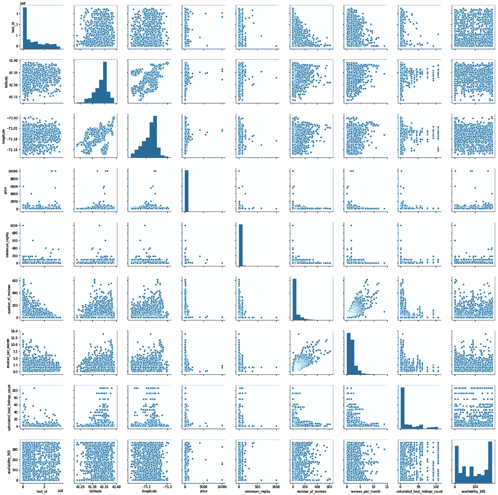

图一。

一些有见地的观点(查看图 1。):

1.  纬度:从南 42.25 到北 42.40，波士顿 Airbnb 的房源数量增加。
2.  经度:从西-71.15 到东-71.00，波士顿 Airbnb 的房源数量增加。
3.  每月的评论数和评论数有正相关关系。

然后我应用了 [Spearman 关联](https://en.wikipedia.org/wiki/Spearman%27s_rank_correlation_coefficient)热图(图 2。)来回顾 9 个特征之间的相关性。

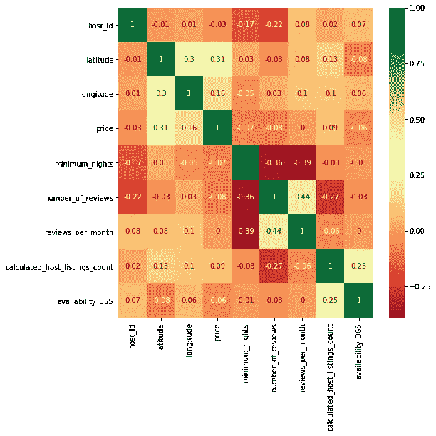

图二。包含 9 个特征的 Spearman 关联热图

一些有见地的观点:

1.  纬度与价格(r=0.31)和经度(r=0.30)正相关。
2.  每月的评论数和评论数呈正相关(r=0.44)。
3.  可用性 365 和计算的主机列表计数正相关(r=0.25)。

此外，为了便于分析，我还处理了异常值，删除了价格高于$500 的行，[虚拟化了房间类型中的特性](https://en.wikipedia.org/wiki/Dummy_variable_(statistics))，并排除了次要的房间类型(图 3。):酒店房间，合租房间。

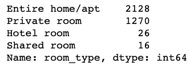

图 3。

因此，新的 Spearman 关联热图具有 11 个特征(图 4。)应该更准确。

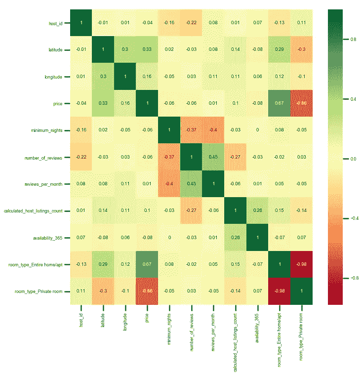

图 4。包含 11 个特征的 Spearman 关联热图

**最后，更重要的一点:**

1.  **价格和住宅类型:整栋住宅/apt 与价格正相关(r=0.67)。包间与价格负相关(r=-0.66)。整个住宅/公寓的平均价格高于私人房间的平均价格(将在后面显示)。**

**2。纬度与价格正相关。随着纬度从南到北的增加，Airbnb 的价格可能会趋于增加。**

**3。每月的评论数和评论数是正相关的。**

**4。每月的点评次数和点评次数与最低夜数(主机要求)负相关。**

# 地点:哪些地区你有更多的选择或者你会更有可能留在波士顿 Airbnb？

图 5。显示波士顿 25 个不同社区的 Airbnb 列表数量。

Airbnb 最多的前 5 个街区是多切斯特、市中心、牙买加平原、罗克斯伯里和 Back Bay。

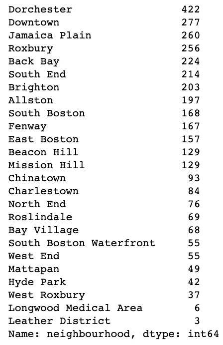

图 5。波士顿不同社区的 Airbnb 房源数量

图 6。显示了波士顿各个社区中 Airbnb 的比例。

看看这个。值得注意的是，与其他社区相比，多切斯特的 Airbnb 比例更高，为 12%。

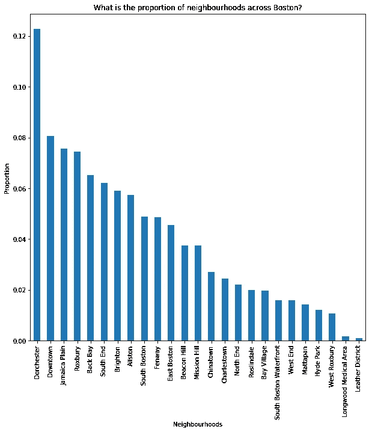

图 6。

图 7。一张[密度图](https://python-graph-gallery.com/2d-density-plot/)显示了 Airbnb 在波士顿的分布。最亮的区域有最多的 Airbnb。你也可以在图 8 中查看波士顿 Airbnb 的实际地图。

我发现波士顿 Airbnb 在经度从西-71.08 到东-71.06 和纬度从南 42.34 到北 42.36 高度密集。

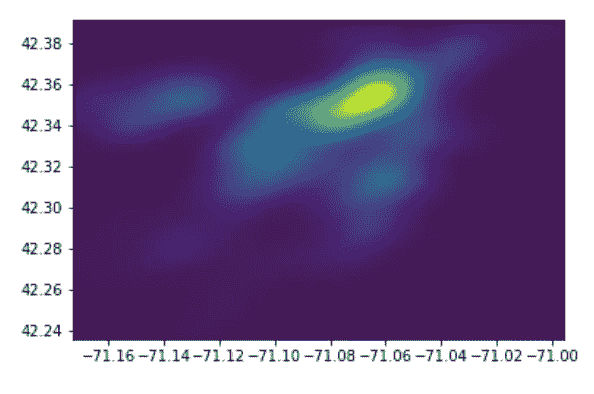

图 7。

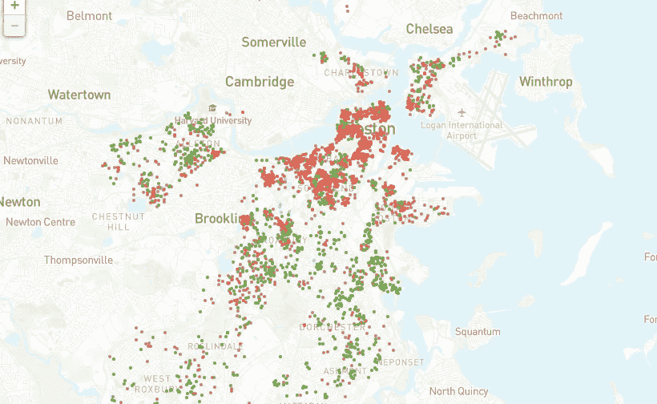

图 8。来自 Airbnb 内部的

在图 9 中仔细观察它们。波士顿 25 个不同社区的 Airbnb 散点图。经度和纬度表示在 x 轴和 y 轴上。

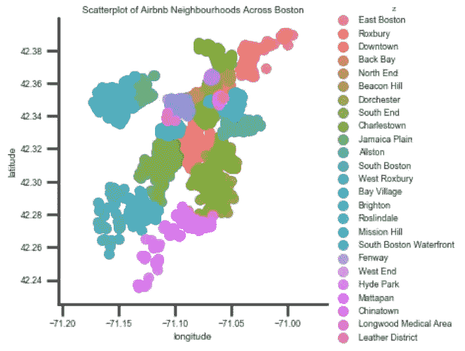

图 9。

如果你想知道哪些社区更有可能找到你的 Airbnb，图 10 显示了前 5 个社区及其位置。会给你的计划提供有用的信息。

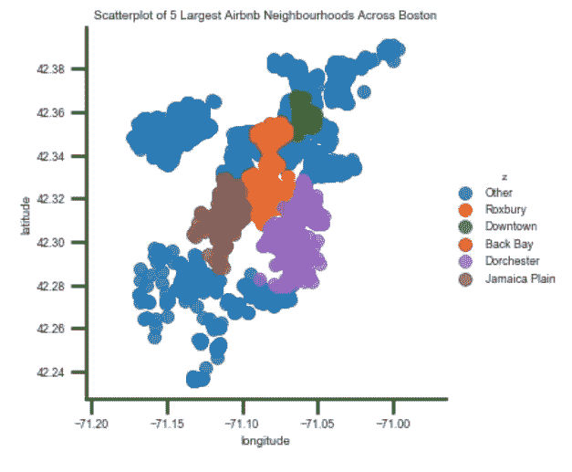

图 10。

# 房间类型:什么类型的房间最受欢迎？

图 11。显示，考虑到房源数量，整个住宅/公寓和私人房间是最适合的房型。

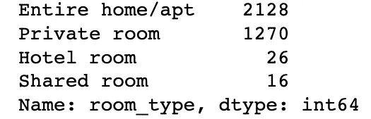

图 11。

如果你考虑最短住宿时间，见图 12。显示 91、1 和 2 的最低夜数(东道主要求)可能会给旅行者更多的选择。

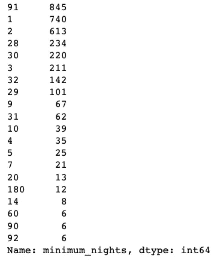

图 12。

如果你看图 13。和图 14。，你会发现有大约 576 个 Airbnb 房源在 365 天内都不可用(要么非常受欢迎，要么永久关闭)。

有趣的是，在所有 365 天中，还有大约 452 个 Airbnb 房源可供选择。

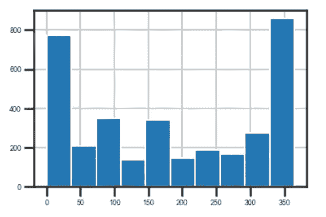

图 13。

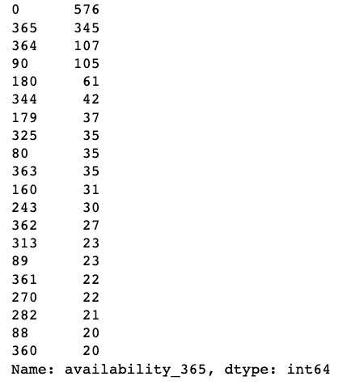

图 14。

> **接下来，让我们回顾一些关于不同房间类型的统计数据**

图 15。显示旅行者倾向于在共享房间比在私人房间和整个家庭/公寓停留更长时间。

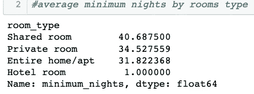

图 15。

图 16。和图 17。两者都证实，私人房间和整个家庭/公寓的平均评论数高于合租房间和酒店房间。

确认可能表明整个家庭/公寓和私人房间是您选择的热门房间类型。

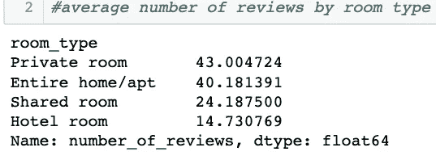

图 16。

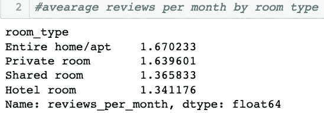

图 17。

最后，如图 18 所示。按房间类型显示一年中的平均可用天数。

共享房间有一个低得多的 131.94 天的可用性。但它只有 16 个列表。因此，数据会有偏差，不应被视为受欢迎程度的决定性因素。

与酒店房间相比，私人房间和整个家庭/公寓在一年中的可用天数较少。尤其是整个家庭/公寓的可用天数比酒店房间少 30 天。所以我们大概可以假设整个 home/apt 更受欢迎。

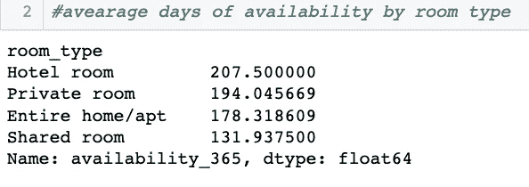

图 18。

# 价格:影响价格的重要特征是什么？你能预测一下波士顿 Airbnb 的价格吗？

在处理了离群值、哑变量、[缺失值](https://www.mastersindatascience.org/resources/how-to-deal-with-missing-data/#:~:text=Instead%20of%20deletion%2C%20data%20scientists,methods%20for%20replacing%20missing%20data.)之后，我利用 3357 个观测值和 11 个变量建立了三个模型:[线性回归](https://en.wikipedia.org/wiki/Linear_regression#:~:text=In%20statistics%2C%20linear%20regression%20is,is%20called%20simple%20linear%20regression.)、[套索回归](https://en.wikipedia.org/wiki/Lasso_(statistics))和[随机森林](https://en.wikipedia.org/wiki/Random_forest#:~:text=Random%20forests%20or%20random%20decision,prediction%20(regression)%20of%20the%20individual)。响应变量是价格。

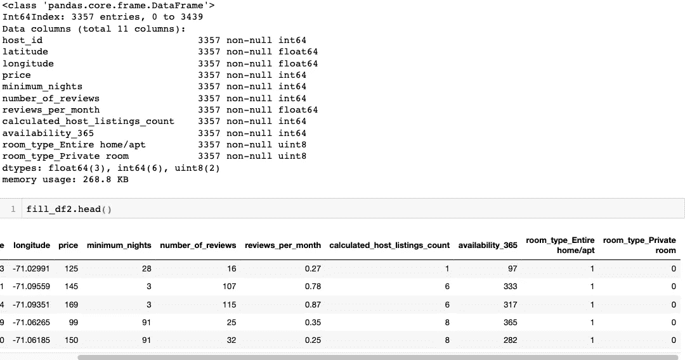

图 19。

同时，我发现包房的平均价格大约是 81.22 美元。整个住宅或公寓的平均价格要高得多，约为 189.38 美元。

从[测试数据集](https://en.wikipedia.org/wiki/Training,_validation,_and_test_sets#:~:text=A%20test%20dataset%20is%20a,place%20(see%20figure%20below).)来看，波士顿 Airbnb 的实际平均价格约为 147.85 美元。根据测试数据集，波士顿 Airbnb 的预测平均价格约为 149.53 美元。同时，预测是建立在随机森林之上的。此外，您还可以在图 20 中查看波士顿 Airbnb 的实际价格与预测价格的分布。

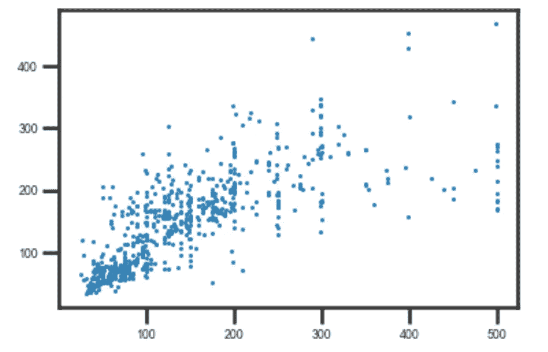

图 20。实际价格与预测价格

> **模特表演**

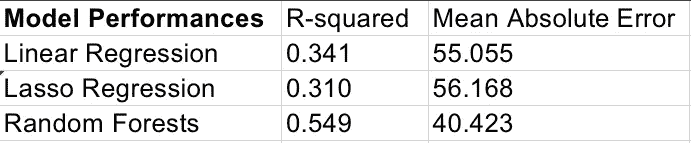

图 21。

0.549 的 [R 平方(R )](https://www.datasciencecentral.com/profiles/blogs/regression-analysis-how-do-i-interpret-r-squared-and-assess-the#:~:text=R%2Dsquared%20is%20a%20statistical,multiple%20determination%20for%20multiple%20regression.&text=0%25%20indicates%20that%20the%20model,response%20data%20around%20its%20mean.) 表示随机森林模型最好地解释了响应数据的可变性。40.423 处的[平均绝对误差(MAE)](https://medium.com/human-in-a-machine-world/mae-and-rmse-which-metric-is-better-e60ac3bde13d#:~:text=Mean%20Absolute%20Error%20(MAE)%3A,individual%20differences%20have%20equal%20weight.) 表示随机森林模型在预测和实际观测之间具有较低的绝对差异。这意味着它具有较低的预测误差。显然，随机森林是三种模型中最好的。

> **特征解释:回归模型系数，** [**树型特征重要性方法**](https://blog.datadive.net/selecting-good-features-part-iii-random-forests/#:~:text=Random%20forest%20feature%20importance,impurity%20and%20mean%20decrease%20accuracy.) **，** [**Shapley 值**](https://christophm.github.io/interpretable-ml-book/shapley.html)

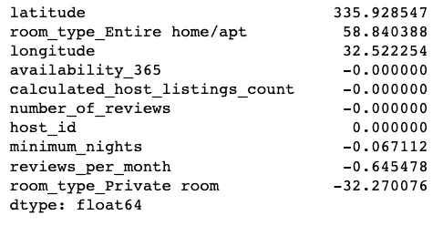

图 22。

图 22。显示了套索回归中的系数( [alpha=0.1](https://chrisalbon.com/machine_learning/linear_regression/effect_of_alpha_on_lasso_regression/) )。显然，随着纬度、房型、经度的增加，反应变量价格也会增加。反之，房型包间的增加会导致价格的下降。系数的结果也符合我的预期，即位置和房间类型是价格的重要影响因素。

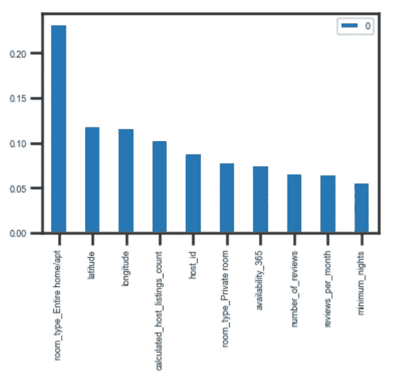

图 23。

图 23。显示了随机森林模型中的要素重要性排名图。房型全屋/apt，经纬度依然是预测价格最重要的特征。有趣的是，在随机森林中，计算出的主机列表计数和主机 id 是更大的影响因素。

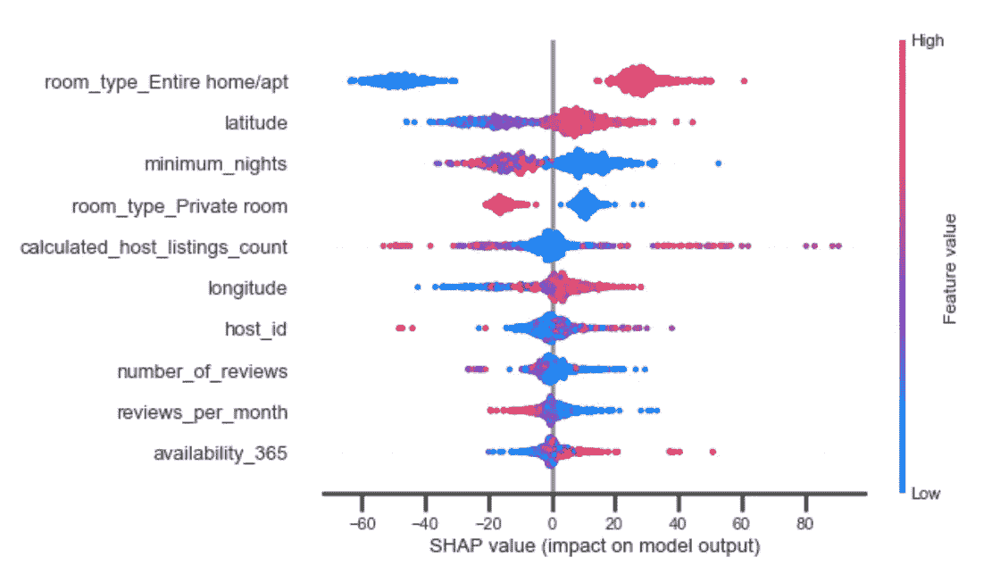

图 24。

我还使用 Shapley 值来分析和解释随机森林中预测 Airbnb 价格的预测。

如图 24 所示，Shapley 值图可以进一步显示预测值与目标变量价格的正负关系[1]。

*   *特征重要性:*变量按降序排列。
*   *影响:*水平位置显示该值*的影响是否与更高或更低的预测*相关联。
*   *原始值:*颜色显示该变量在观察中是高(红色)还是低(蓝色)。
*   *相关性:*一个*高*水平的“房型整体家居/ apt”含量对价格有一个高*和正*的影响。“高”来自红色，而“积极的”影响显示在 X 轴上。同样，“最少住宿天数”与目标可变价格负相关。

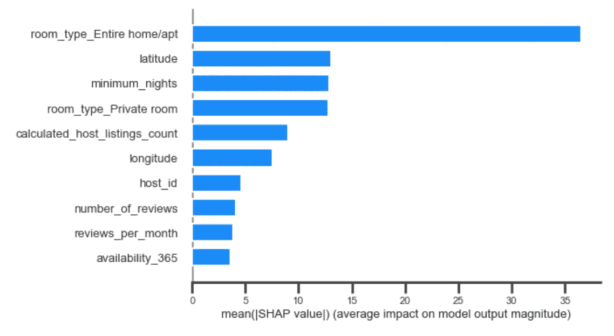

图 25。

图 25。是 Shapley 值的简单版本，以降序显示每个变量对模型输出价格的平均影响，并忽略价格的正/负预测。当然，Shapley 值可以用来神奇地解释更复杂的模型，如深度学习。下一次，你可以使用这个算法向你的观众解释你的深度学习模型的黑盒。

# 结论:

使用数据科学不仅可以帮助做出商业决策，还可以使生活更加有趣和科学。到目前为止，在波士顿 Airbnb 的数据科学中，我将把这些指导应用到下一次波士顿之旅中:

1.  地点:哪些地区你有更多的选择或者你更有可能留在波士顿 Airbnb？

让你做决定的前 5 个街区是多切斯特、市中心、牙买加平原、罗克斯伯里和后湾。从地理角度来说，您希望定位波士顿的经度在-71.08°和-71.06°之间，纬度在 42.25°和 42.40°之间。

2.房间类型:什么类型的房间最受欢迎？

***一般来说，在房间类型为全屋/公寓和私人房间的情况下，您找到 Airbnb 的几率会更高。将两者进行比较，whole home/apt 在列表和每月平均评论方面的数字更高。《私人房间》在平均最少住宿天数、平均点评次数和 365 天的平均可用天数方面有更高的数字。***

3.价格:影响价格的重要特征是什么？你能预测一下波士顿 Airbnb 的价格吗？

***Lasso Regression 和 Random Forests 都同意位置(经度&纬度)和房间类型(整个家/apt &私人房间)对预测波士顿 Airbnb 的价格很重要。***

***很有意思，随机森林中的特征重要性函数和 Shapley 值都表明计算的主机列表数很重要，而在 Lasso 回归中就系数而言贡献为零。***

如果你在乎价格，你可能会为你的下一次旅行选择一个包间。否则，从西南到东北，波士顿 Airbnb 的价格往往会增加。

这是我在 Medium 上的第一篇帖子。希望有帮助！我欢迎反馈和建设性的批评。你可以在 LinkedIn 上联系我:[https://www.linkedin.com/in/lanxiao12](https://www.linkedin.com/in/lanxiao12)。

在你走之前，可以在我的 [GitHub](https://github.com/Codfish-LX/Project-1) 这里找到代码。快乐编码，快乐生活！

特别感谢 Menoua Keshishian。

参考:

[1]Data man 博士，[用数据科学的 SHAP 价值观](/explain-your-model-with-the-shap-values-bc36aac4de3d) (2019)解释您的模型