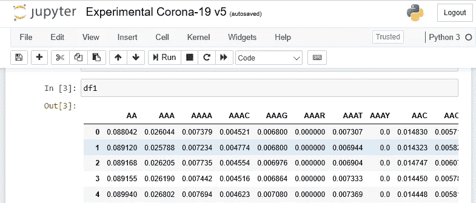

# 利用数据科学从公共基因组数据预测新型冠状病毒冠状病毒的起源

> 原文：<https://towardsdatascience.com/using-data-science-to-predict-the-origin-of-sars-cov-2-coronavirus-from-public-genome-data-a-3e0a00eaca0f?source=collection_archive---------17----------------------->

## 关于科学家如何发现蝙蝠可能是冠状病毒疾病 2019(新冠肺炎)的起源的演练。


电子显微镜下显示人体细胞中的新型冠状病毒病毒(黄色)

新型冠状病毒冠状病毒来自哪里？专家认为蝙蝠是病毒的源头。他们是如何得出这样的结论的？

传统上，大多数医学科学家将使用传统的生物信息学工具，如 BLAST 序列比对。然而，在这篇文章中，我将展示我们如何从数据科学的角度分析冠状病毒基因组。具体来说，我们将使用数据科学方法，通过将其基因组序列与感染其他动物(如鸡、牛、鸭和蝙蝠)的其他冠状病毒进行比较，来预测新冠肺炎的起源。基于我们的分析，我们将展示蝙蝠是如何与其他动物相比具有最高的基因组序列相似性的。

**数据集**

2019 年冠状病毒的基因组序列通过美国国家医学图书馆网站向公众开放(【https://www.ncbi.nlm.nih.gov/】T2 实验室/病毒)。事实上，有一个**“更新”**提醒，当你访问网页时，它会立即出现在顶部。


新型 2019 病毒在这里被称为新型严重急性呼吸综合征冠状病毒 2 基因组

你会注意到有两种主要类型的病毒基因组序列:**核苷酸 a** 和**蛋白质**。这里，我们将具体分析 4 种动物的核苷酸序列，即**鸡、蝙蝠、牛和鸭**。我们将它们与从感染者身上收集的 2019 年冠状病毒核苷酸序列进行比较。你也可以用这里学到的方法来分析蛋白质序列。

**数据收集**

这项分析的主要目标是确定病毒的可能来源。在实践中，我们需要扫描新冠肺炎冠状病毒的基因组和所有在动物中传播的病毒。然而，由于计算资源有限，我们将只分析从鸡、蝙蝠、牛和鸭传播的冠状病毒。

首先，让我们从 NCBI 病毒网页点击**核苷酸**链接，下载新冠肺炎冠状病毒的核苷酸序列。


点击核苷酸链接下载新冠肺炎冠状病毒的核苷酸序列

该网页是自我探索性的使用。你可以观察到在**精炼结果**过滤器的**病毒**部分下自动选择了“严重急性呼吸综合征冠状病毒 2”。此外，还有两种不同的序列类型:*完成*或*引用序列*。对于本演练，从**核苷酸序列类型**部分选择**完整的**序列类型。接下来，点击页面右上角的**下载**蓝色按钮。基因组序列将作为**下载到您的机器上。fasta** 文件格式。


一个可以下载冠状病毒基因组序列的网页。选择完整的核苷酸序列类型，并点击下载蓝色按钮下载基因组序列。


点击下一步，选择选项**向下所有记录**并选择**默认选项**用于 FASTA 定义行

一旦你下载了序列数据，让我们在你最喜欢的文本编辑器上打开它，看看基因组序列是什么样子的。


> > MN908947 |严重急性呼吸综合征冠状病毒 2 型分离株 Wuhan-Hu-1|全基因组
> attaaaggttatatcttcccaggtaacaaaccaaccaactttcgatcttgtagatct
> gttctaaacgaactttaaaatcttaaatctgtgtggctgtcgttcactcggctgcatgcttagtgcact
> cacgcagtataattatataatactataatactatattactcgtctattc
> 
> >

您可以观察到第一行以 **' > '** 开头，表示对病毒的单行描述。在撰写本文时，NCBI 病毒数据库中有 34 个新冠肺炎冠状病毒样本。

接下来，让我们下载四种动物(即鸡、牛、鸭和蝙蝠)的冠状病毒核苷酸序列。

为此，从**细化结果**的**病毒**部分移除新冠肺炎冠状病毒选项(即严重急性呼吸综合征冠状病毒 2)，并改为搜索**冠状病毒**。冠状病毒是所有在动物中传播的冠状病毒的学名。选择此选项将为您提供医学科学家过去收集的所有类型冠状病毒家族的核苷酸序列样本列表。有趣的是，你可以从搜索结果中看到，第一次收集到冠状病毒的基因组样本是在 1983 年！

你可以先从收集鸡的核苷酸基因组序列开始。鸡的学名是 *gallus gallus* 。进入**提炼结果**的**主机**部分，搜索 **Gallus gallus (chicken)** 。选择该选项后，搜索结果列表将会更新，您可以再次点击**下载**按钮下载鸡的完整核苷酸序列。

对剩下的 3 种动物重复这些步骤:1)牛(牛)，2)鸭(鸭科)，3)蝙蝠(翼手目)。

**数据转换**

我们的第一项任务是从序列数据 fasta 文件中读取新冠肺炎和其他四种动物的基因组序列，并将它们放到熊猫的数据框架中。为了实现这一点，我们将只需要提取序列字符(例如，*attaag*)，并忽略所有以“>”开头的单行描述。以下代码通过'>'识别每个核苷酸序列，并提取两个'>'符号之间的序列字符。提取的序列字符随后被顺序附加到列表中。该列表包含每种动物基因组的整个字符串。

```
from nltk.corpus import stopwords  
from sklearn.feature_extraction.text import CountVectorizer
import pandas as pddef process_file(filename,target_val):
    f = open(filename) #'datasets\\corona-nucleo-chicken-complete.fasta')
    lines = ""
    s1 = list()
    step = 0
    term = 0for line in f:
        line = ''.join(line.split())
        if line.startswith(">") and step==0:
            line = line.split('>',1)[0].strip()
            step = step + 1if line.startswith(">") and step>=1: #and step>=1:
            line = line.split('>',1)[0].strip()
            s1.append(lines)
            lines = ""
            step = step + 1
            term = 0
        lines = lines + line
```

**序列的数字表示**

接下来，我们需要从包含序列字符的字符串中生成特征。由于序列被表示为一系列字母字符，我们需要将序列字符分割成小的记号。例如，只有 2 个字符的令牌、只有 3 个字符的令牌、只有 4 个字符的令牌等等。此外，我们需要将标记转换成数字表示格式，以便我们可以将它们输入到机器学习算法中进行预测。一种常见的方法是应用**单词包**数据表示，计算每个令牌的频率/出现次数。它跟踪两个重要信息:序列字符的词汇表和每个标记出现的次数。

为了同时应用 n-grams 和词袋，我们可以使用来自 **scikit-learn** 机器学习库的**计数矢量器** API。

```
count_vect = CountVectorizer(lowercase=False, ngram_range=(2,4),analyzer=’char’)
 X1 = count_vect.fit_transform(s1)
```

在本演练中，我们将只设置最小的 n 元文法来开始从 2 到 4 序列的令牌的**。例如，2-gram 最多包含 2 个字符(例如 at)、3-gram(例如 ACG)和 4-gram(例如 ACTT)。**

```
def generate_ngrams(s1):
    count_vect = CountVectorizer(lowercase=False, ngram_range=(2,4),analyzer='char')
    X1 = count_vect.fit_transform(s1)

    lcount = list()
    lcount = []
    for i in s1:
        count = len(i)
        #print(count)
        lcount.append(count)count_vect_df = pd.DataFrame(X1.todense(), columns=count_vect.get_feature_names())

    count_vect_df=count_vect_df.apply(lambda x: x / lcount[x.name] ,axis=1)

    return count_vect_df
```

## 数据标记

一旦数据被转换成数字值作为特征，我们将需要为它们添加标签以进行预测。

```
df1 = process_file(‘datasets\\corona-seq-chicken.fasta’,”chicken”)
df2 = process_file(‘datasets\\corona-seq-duck.fasta’,”duck”)
df3 = process_file(‘datasets\\corona-seq-cattle.fasta’,”cattle”)
df4 = process_file(‘datasets\\corona-seq-bat.fasta’,”bat”)
```

在这里，您可以看到每个 fasta 序列文件都被分配了自己的标签(即鸡、鸭、牛和蝙蝠)。标注在数据转换过程结束时完成。

```
def generate_ngrams(s1):.....
count_vect_df = generate_ngrams(s1) 
count_vect_df[‘target’] = target_val
return count_vect_df
```

如果您做的一切都正确，您应该能够以 pandas dataframe 格式的数值查看所有的特性。



来自鸡核苷酸序列的样本特征

**探索性分析**

有了以数据帧格式表示的所有序列，我们可以探索我们的冠状病毒数据集的%分布。我们可以观察到，我们的数据集的 64%是鸡的核苷酸序列，31%来自蝙蝠，剩下的 4%和 1%分别来自牛和鸭。

```
import matplotlib.pyplot as plt
plot_size = plt.rcParams[“figure.figsize”]
plot_size[0] = 8
plot_size[1] = 6
plt.rcParams[“figure.figsize”] = plot_sizedf7[‘target’].value_counts().plot(kind=’pie’, autopct=’%1.0f%%’)
```


**建立预测模型**

我们现在准备通过将我们标记的核苷酸数据集应用于机器学习算法来建立预测模型。在这种情况下，我们将使用 XGBoost 梯度增强算法来构建我们的预测模型。

```
from sklearn.model_selection import train_test_split from xgboost import XGBClassifier
from xgboost import plot_importance
import xgboost# create a train/test split
X_train, X_test, y_train, y_test = train_test_split(X, y, test_size=0.2, random_state=7, shuffle=True)model = XGBClassifier()
model.fit(X_train, y_train)
```

使用我们建立的模型，我们可以进一步分析，以确定核苷酸序列的哪些区域对确定哪些序列属于哪些动物具有最大的影响因素。我们可以观察到“CWG”、“AAAY”和“AAC”是区分 4 种动物基因组的前 3 个序列区域。


**新冠肺炎冠状病毒的数据转换和文本表示**

接下来，我们需要将新冠肺炎核苷酸序列文件加载到我们的程序中，以便进行预测。

与动物冠状病毒序列相似，我们需要对新冠肺炎冠状病毒进行数据转换和数值表示。n-gram 和词袋算法都需要应用，但附加步骤也是必要的。我们将详细解释这些步骤。

首先，我们将从 Fasta 文件中加载新冠肺炎冠状病毒的核苷酸。

```
cov = process_file(‘datasets\\corona-covid-19.fasta’,“COVID-19”)
cov
```


我们可以看到有 34 个新冠肺炎样本和 409 个特征。但是，请注意，特征的数量与训练特征不匹配。

因为我们要做预测(而不是建立模型)，所以我们可以去掉目标标签

```
cov = cov.drop(‘target’, axis=1)
```

不幸的是，新冠肺炎产生的特征不会与我们动物的其他冠状病毒 100%相同。我们可以观察到新冠肺炎冠状病毒的特征数量是 409，这与动物冠状病毒的 1786 个特征相比要少得多。由于这种不匹配，在数据集与我们的预测模型完全兼容之前，我们需要执行另外两种类型的数据转换。

1.  动物冠状病毒中有哪些特征是新冠肺炎冠状病毒所没有的？

这意味着发现动物核苷酸序列中的特征，但它们不存在于新冠肺炎冠状病毒中**。一旦我们发现这样的特征，我们将需要在预测数据集中将其填充为“未知”。**

```
mc = X_train.columns.difference(cov.columns)
mc
```

我们可以看到，“AAAM”、“AAR”和“AAAY”是我们在冠状病毒中发现的一些特征，但它们不存在于新冠肺炎冠状病毒中。

> 索引(['AAAM '，' AAAR '，' AAAY '，' AACK '，' AACM '，' AACR '，' AAGK '，' AAGR '，' AAGW '，' AAGY '，… 'YTWC '，' YW '，' YWA '，' YWAT '，' YY '，' YYC '，' YYCT '，' YYT ']，dtype='object '，length=1392)

需要添加这些功能，以便与我们的训练数据集相匹配。因此，我们可以将值填充为**未知**。由于特性必须是数字形式，我们将使用“-999”数值来表示“未知”。

```
for newcol in mc: cov[newcol]=-999
```

**2。新冠肺炎有哪些其他类型动物冠状病毒从未有过的新特征？**

最重要的是，我们还需要找到存在于新冠肺炎但不存在于训练数据集中的特征。一旦我们发现这样的特征，我们将需要移除这些特征，以使它们与我们的训练数据集相匹配。

```
rf = cov.columns.difference(X_train.columns)cov = cov.drop(rf, axis=1)
```

我们可以看到，“AWGC”、“CS”、“CST”和“CSTG”是新冠肺炎病毒的一些新的核苷酸区域，这些区域以前在四种动物的冠状病毒中从未存在过。

> 索引(['AWGC '，' CS '，' CST '，' CSTG '，' GCS '，' GCST '，' GGAW '，' STG '，' STGG '，' TGCS '，' TRCC '，' TTYA '，' TYAC '，' WGCT']，dtype='object ')

在从预测数据集中移除所有这些特征之后，我们的预测数据集最终与我们的训练数据集相匹配。


现在，我们预测的数据集有 1786 个特征与训练数据集完全匹配

**关键时刻**

我们现在可以预测新冠肺炎冠状病毒的可能来源了！下一步是预测我们收集的 34 份新冠肺炎冠状病毒样本的可能来源。使用 XGBoost predict API 可以很容易地做到这一点。

```
model.predict(cov)
```

> 数组(['bat '，' bat '，' bat '，' bat '，' bat '，' T12 '，' bat '，' bat '，' bat '，' bat '，' bat '，' bat '，' bat '，' bat '，' bat '，' bat '，' bat '，' bat '，' bat '，' bat '，' bat '，' bat '，' bat '，' bat '，' bat '，' T14 '，' bat '，' bat '，' bat '，' bat '，' bat '，' bat '，' bat '，' bat '，' bat '，

基于预测值，我们可以看到，我们的模型预测**所有**36 个样本为**蝙蝠**。甚至没有一个样本被预测为其他动物。为了进一步分析这一点，我们将使用 XGBoost 的 **predict_proba** API 来获得每个预测的概率。

```
print(model.classes_)
similarities = model.predict_proba(cov)
np.round(similarities, 3)[‘bat’ ‘cattle’ ‘chicken’ ‘duck’]
array([[0.957, 0.001, 0.001, 0.041], 
[0.957, 0.001, 0.001, 0.041], 
[0.957, 0.001, 0.001, 0.041], 
[0.957, 0.001, 0.001, 0.041], 
[0.957, 0.001, 0.001, 0.041], 
[0.957, 0.001, 0.001, 0.041], 
[0.957, 0.001, 0.001, 0.041], 
[0.957, 0.001, 0.001, 0.041], 
[0.957, 0.001, 0.001, 0.041], 
[0.957, 0.001, 0.001, 0.041], 
[0.957, 0.001, 0.001, 0.041], 
[0.957, 0.001, 0.001, 0.041], 
[0.957, 0.001, 0.001, 0.041], 
[0.957, 0.001, 0.001, 0.041], 
[0.957, 0.001, 0.001, 0.041], 
[0.957, 0.001, 0.001, 0.041], 
[0.957, 0.001, 0.001, 0.041], 
[0.957, 0.001, 0.001, 0.041], 
[0.957, 0.001, 0.001, 0.041], 
[0.957, 0.001, 0.001, 0.041], 
[0.957, 0.001, 0.001, 0.041], 
[0.957, 0.001, 0.001, 0.041], 
[0.957, 0.001, 0.001, 0.041], 
[0.957, 0.001, 0.001, 0.041], 
[0.957, 0.001, 0.001, 0.041], 
[0.957, 0.001, 0.001, 0.041],
[0.957, 0.001, 0.001, 0.041], 
[0.957, 0.001, 0.001, 0.041], 
[0.957, 0.001, 0.001, 0.041], 
[0.957, 0.001, 0.001, 0.041], 
[0.957, 0.001, 0.001, 0.041], 
[0.957, 0.001, 0.001, 0.041], 
[0.957, 0.001, 0.001, 0.041], 
[0.957, 0.001, 0.001, 0.041]], dtype=float32)
```

基于预测概率，我们可以清楚地看到，bat 的预测概率极高，预测值为 0.957。这意味着新冠肺炎病毒有 95.7%的可能性来自蝙蝠，而只有 4.1%的可能性来自鸭子。病毒来自牛或鸡的概率只有 0.1%。因此，我们可以有力地得出结论，蝙蝠是 2019 年新型冠状病毒的**可能起源**。

**将我们的结果与 BLAST 进行比较**

正如本文开头提到的，BLAST(基本局部比对搜索工具)[1]是典型的标准方法，允许科学家比较核苷酸或蛋白质序列的差异。这个节目在这里公开:[https://blast.ncbi.nlm.nih.gov/](https://blast.ncbi.nlm.nih.gov/)。从网站上，你可以上传你的新型冠状病毒序列为 FASTA 格式，该程序将根据其数据库查询你的序列，以找到任何与你的查询匹配的相似序列。与我们的方法不同，BLAST 没有对特征应用任何预测模型，而是使用启发式搜索算法。我们的预测方法的一个主要好处是，它可以发现更多的洞察力，并且可以发现标准启发式搜索通常无法发现的隐藏模式。

**参考**

[1] R. M .凯西(2005 年)。[“BLAST 序列有助于基因组学和蛋白质组学”](http://www.b-eye-network.com/view/1730)。商业智能网络。