# 利用数据科学研究美国的经济不平等

> 原文：<https://towardsdatascience.com/using-data-science-to-study-economic-inequality-in-the-united-states-1101e9350c3d?source=collection_archive---------62----------------------->

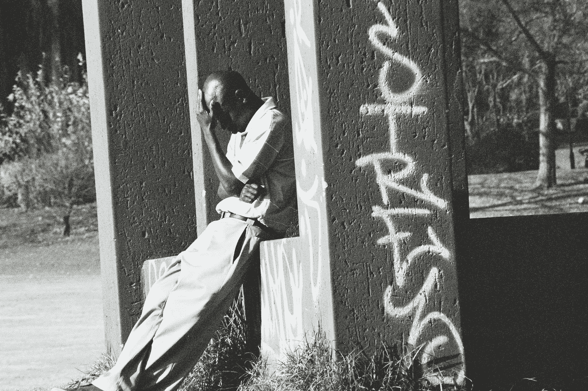

亨妮·斯坦德在 [Unsplash](/s/photos/unemployment?utm_source=unsplash&utm_medium=referral&utm_content=creditCopyText) 上的照片

## 数据新闻

## 我们如何利用公共数据来分析和理解美国黑人社区面临的挑战？

在我的上一篇文章中，我使用 BLS 和美国的人口普查数据创建了一个仪表板，以快速分析每个县按种族和行业划分的美国失业情况。本文将继续这个话题，研究一些受新冠肺炎影响最严重的县，并试图描绘出一幅围绕这些社区的更好的画面。

**我的目标**是找出主要是经济困难的黑人县，并找出他们之间的共性(或差异)。

## 我将这个过程分为四个步骤:

1.  查找感兴趣的县进行比较(使用[美国数据仪表板](https://usa-data-dashboard.herokuapp.com/))
2.  通过媒体和政策(通过网络搜集和 NLP)将各县联系起来
3.  量化问题(使用开放数据源)
4.  承认方法中的偏差和改进

## 查找感兴趣的县进行比较:

我首先查看了失业率最高的县。看起来密歇根州是受灾最严重的，内华达州和加利福尼亚州的部分地区，然后是南部的部分地区。

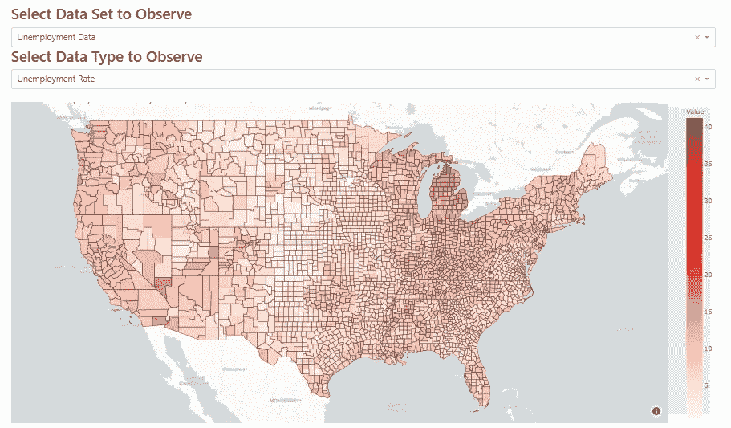

BLS 报告的截至 4 月底的失业率

利用人口普查数据，我们可以得出以下黑人人口最多的地区。

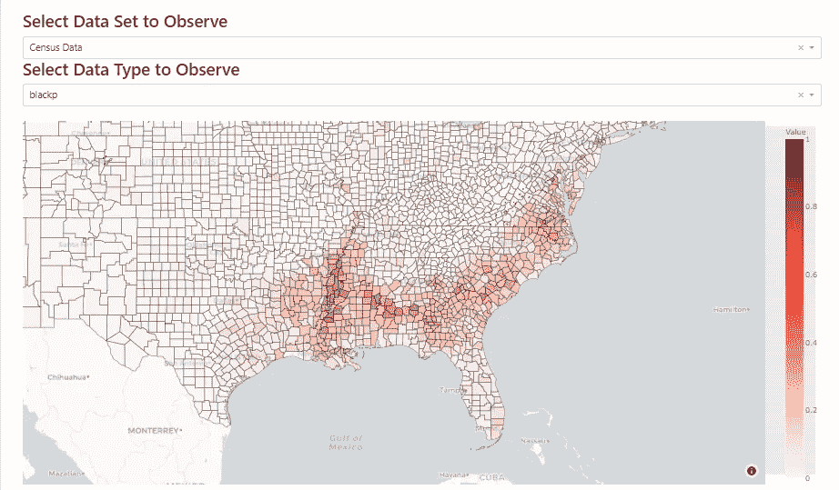

比例是美国人口普查局报告的各县黑人人口的%

对比了这两张图表后，下面是我选定的县的列表:

1.  密西西比州图尼卡——31.7%的失业率
2.  密西西比州霍姆斯——28.9%的失业率
3.  密西西比州奇克索——31.4%的失业率
4.  阿拉巴马州达拉斯——20.9%的失业率
5.  阿拉巴马州威尔科克斯——22.8%的失业率
6.  阿拉巴马州朗兹——26%的失业率

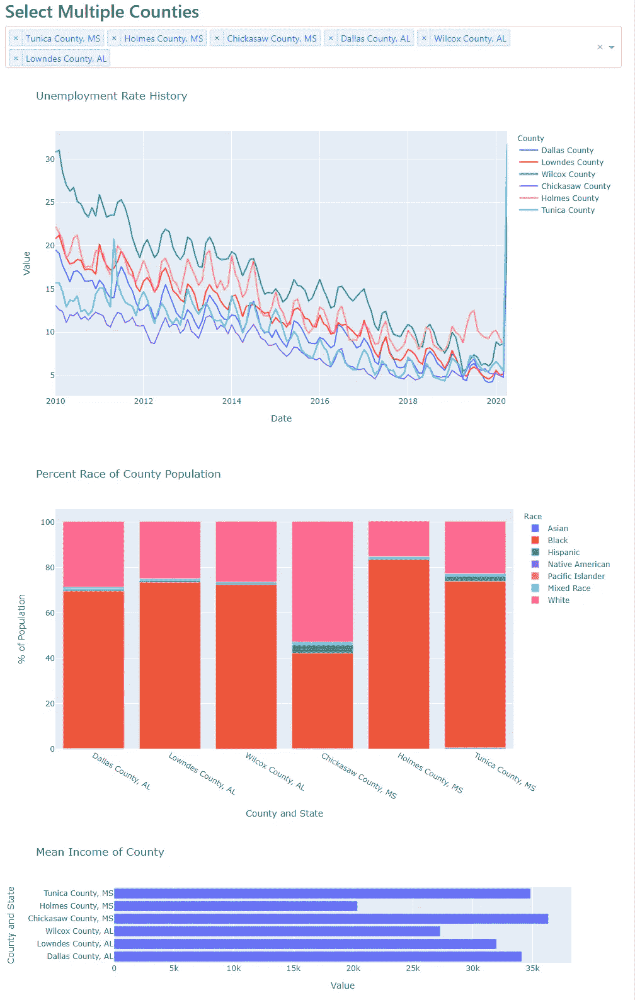

自上次衰退以来，威尔科克斯和霍姆斯的失业率一直很高(即使全国失业率降至 3.9%)，平均收入也是六人中最低的。下图显示了各州各行业的就业依赖情况。

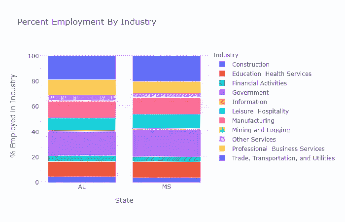

澄清一下，最上面的蓝色是贸易、运输和公用事业。

对于这两个州来说，政府部门和贸易/运输/公用事业部门在这个州占据了更高的比例。

## 通过媒体和政策将各县联系起来

现在，我们已经对各县的经济状况有了一个大致的了解，让我们看看还能收集到哪些其他数据源。了解我们正在研究的国家的历史/背景很重要，所以让我们从了解该地区的媒体报道和公共政策开始。为了实现前者，我依赖于典型的 NLP 预处理/可视化方法。我使用谷歌新闻查询格式(`[https://news.google.com/rss/search?q={](https://news.google.com/rss/search?q={)}`)从搜索“county _ name+‘economy’”中搜集了 100 篇文章，然后使用 TF-IDF ( `Scikit-learn`)对每篇文章中的单词进行分词(使用`nltk`删除停用词和词条)。

然后，我对所有的文章进行了主成分分析(`Scikit-learn`)，并用 600 篇文章绘制了前两个组成部分。对于那些不熟悉 PCA 的人来说，可以把它看作是文章中单词/主题的变化。对于所有的交互链接，你必须下载 html 文件。

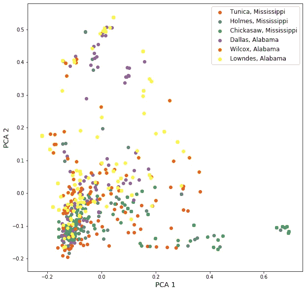

你可以在这里观看这个剧情[的互动版本。](https://drive.google.com/file/d/1-NKjN8JURShiQTwT59FZoFErCrcujg25/view?usp=sharing)

看起来一般的经济报道都很相似，但是奇克索在第一部分有更多的变化。主要的分类集中在“疫情”和“失业”上。

我在另一个时间段(2008 年至 2019 年)进行了同样的分析，得到了以下更分散的结果:

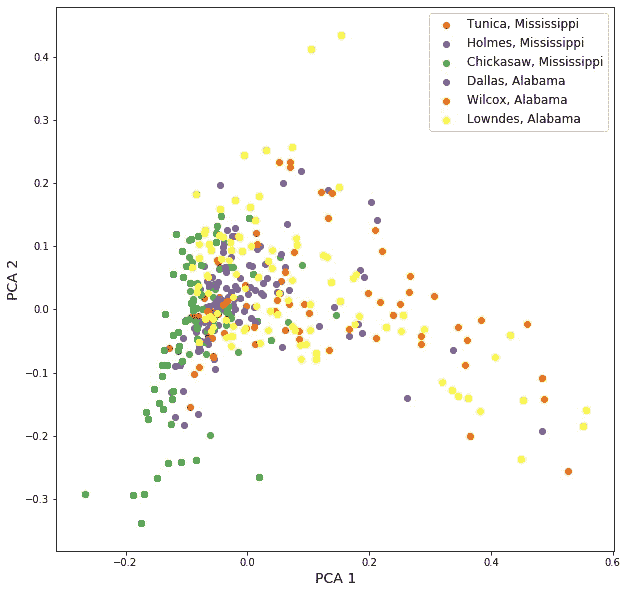

奇克索去了左边，其他人大多居中或右边

然后我在 PCA 组件上也做了 TSNE。TSNE 很难简洁地解释，但可以把它想象成在高维空间中展开复杂的非线性关系(就像展开一个水果卷，但你可以在某种程度上根据颜色撕开并重新排列)。如果你有超过 50 个功能，TSNE 就不能很好地工作。

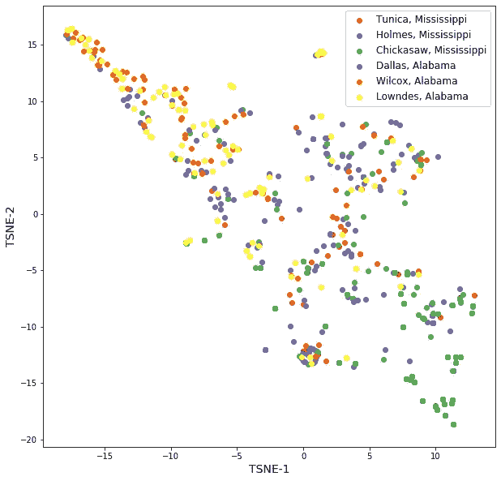

在这种情况下，类似于五氯苯甲醚的结果，链接[此处](https://drive.google.com/file/d/15Ts6UAvvy7UucufKDbnB6Subbn5Igd2m/view)

从互动情节的快速扫描来看，集群集中在“赌场”、“农业”、“贸易交易”、“移民”和“民权”。

TSNE 的左上方是关于黑带、无家可归者和学生的文章。中间是内战以来的民权和财富/不平等。右下角是主要涉及特朗普、贸易和工厂的文章。

通过对其中一些文章的后续阅读，我发现阿拉巴马州的三个县是黑带的一部分，这意味着它拥有该地区丰富的黑色表土。该地区也有阿拉巴马州一半的奴隶人口集中在那里的历史。1965 年有一次从塞尔玛到蒙哥马利的历史性游行。塞尔玛在达拉斯县，蒙哥马利(阿拉巴马州的首府)就在朗兹县的外面。

对于公共政策，我首先研究了选民分布和公共问题。在最近的选举中，我使用了 B [allotpedia](https://ballotpedia.org/Pivot_Counties_in_Mississippi) 和 P [olitico](https://www.politico.com/election-results/2018/alabama/) :朗兹、达拉斯、威尔科克斯、图尼卡和霍姆斯是民主党人，奇克索是一个关键县(倾向共和党)。我想知道这是否解释了为什么奇克索媒体集群如此偏离正轨。

在我们深入研究之前，先快速概述一下美国的立法系统:正如每个州都有两名参议员和多名众议员代表美国参众两院一样，每个区都有一名参议员和众议员代表州参众两院。

为了找出这六个县所面临的问题，我去了地区立法者发起的议案。阿拉巴马州和密西西比州的选区划分如下:

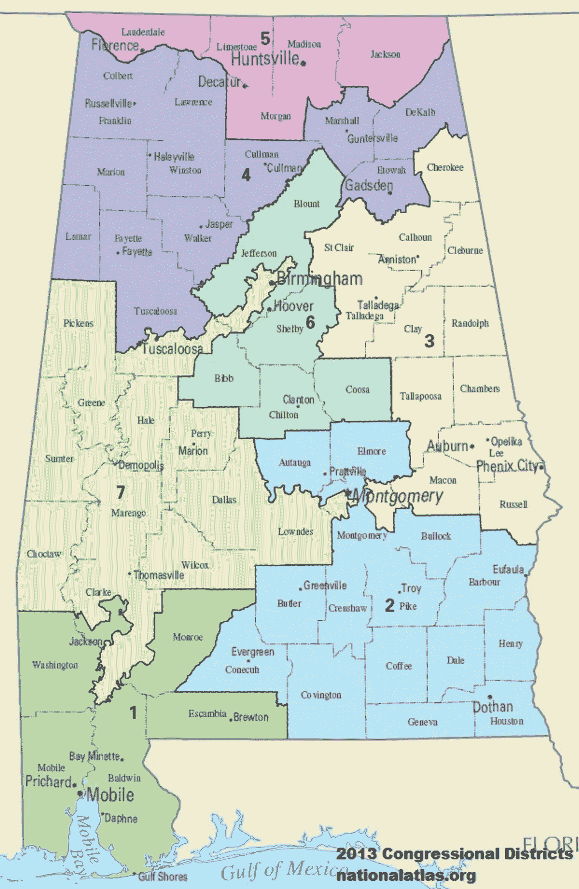

亚拉巴马州

朗兹、达拉斯和威尔科克斯都是第七区的一部分。Proncey Robertson(共和党)是这个区的代表，Sam Givhan(共和党)是参议员。

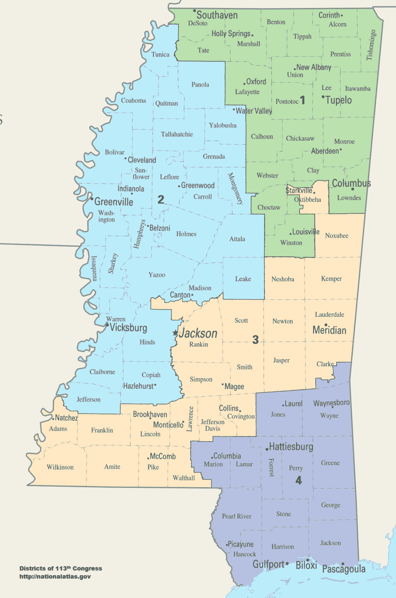

密西西比河

图尼察和霍姆斯是第二区的一部分，奇克索来自第一区。2 区代表是尼克·贝恩(共和党)，参议员是迈克尔·麦克伦登(共和党)，1 区代表是莱斯特·卡彭特(共和党)，参议员是大卫·l·帕克(共和党)。

我使用 [billtrack50](https://www.billtrack50.com/LegislatorDetail/23037) 来查看他们如何在州议会中发起法案，并使用与前面的[法案摘要](https://www.billtrack50.com/BillDetail/1183093)相同的 NLP 方法对它们进行聚类。总共有 140 个提案。

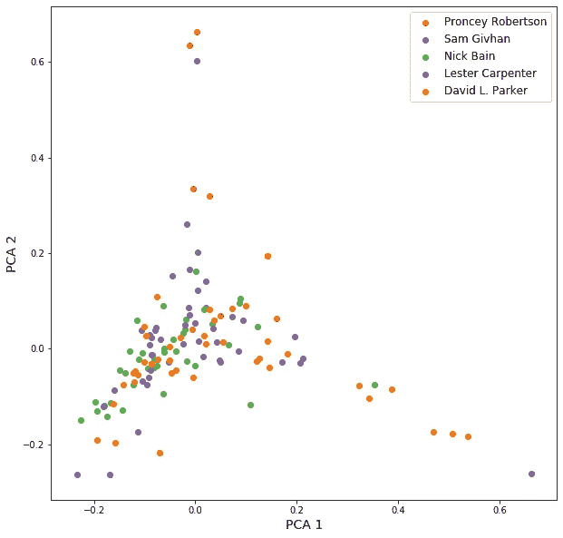

互动剧情[此处](https://drive.google.com/file/d/1gLuKTzoGqorrGajVyGgfKIpQqAx_LK8b/view?usp=sharing)

我没有发现 TSNE 特别有用，但如果你喜欢，你可以在这里查看一下。账单摘要上的 Gensim 关键字按出现次数为我们提供:

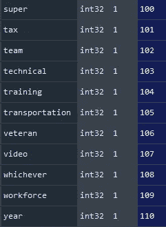

此外，各州的赞助法案似乎有些分歧:

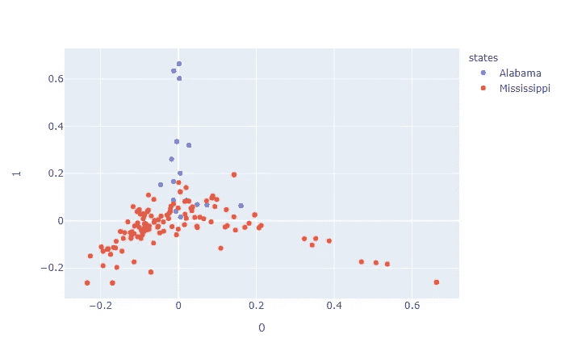

互动剧情[这里](https://drive.google.com/file/d/1yhrsKMoaHXTljdBcYKfG2bqmj0rTpmu9/view?usp=sharing)

阿拉巴马州的议案主要集中在枪支和犯罪上。下面是按地区(7 是阿拉巴马州，1 和 2 是密西西比州):

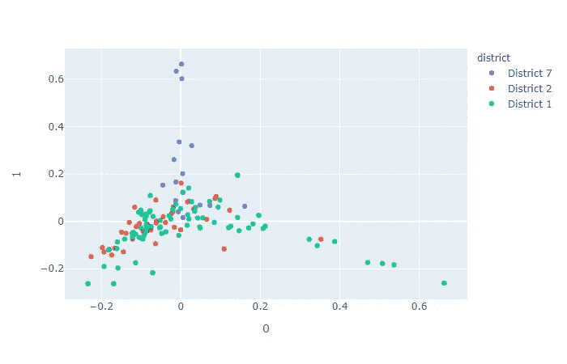

我对(0，0)中心附近的账单最感兴趣，因为这是我们在各区(县)之间最具共性的地方。

**中心的主题:**围绕消防员和其他基础设施、对许多选民的医疗/健康援助(在校学生的免疫接种、向不孕不育者提供怀孕补助等。).

**第 2 区(图尼卡，霍姆斯):**大多倾向于左派，涉及许多儿童问题，如送孩子、收养、儿童抚养、给年轻人发色情短信，以及烟草和尼古丁方面的毒品问题。

**第 1 区(Chickasaw):** 有各种各样的政策，左侧的主题非常相似(以及一些共同赞助法案的重复)，但增加了一些道路/驾驶员法案(驾照/DUI 法案/高速公路和州际公路)。在中心，有一些关于教育的法案(教师收入，阅读障碍，利益冲突和税收条款)。扩散到右侧的都是表彰或祝贺运动队和教练赢得各种奖项和比赛并将其记入官方记录的法案。

**第 7 区(达拉斯、朗兹、威尔科克斯):**有很多关于枪支(特别是在校园内非法燃放枪支、隐蔽携带)和犯罪(添加到受管制物质清单中，使向警察撒谎成为犯罪)的法案。但靠近中心的法案大多是围绕州长、市政当局、董事会和司法部门的修正案(修改权限、条款、文件等)。还有一些税收和投资法案。

我们现在有了媒体讨论和公共政策关注的背景。我也想访问市政厅和地区会议记录，看看社区提出了什么问题，但是这些问题不容易找到。

我们的最后一步是看看我们是否能发现这些问题实际上是如何使用开放数据源来解决的。

## 量化问题:

美国的每个州通常都有指定的机会区，有些州还进一步发展了评分系统。伯克利已经在加州的一个地区(比一个县还小)做了一个很好的例子，见下图:

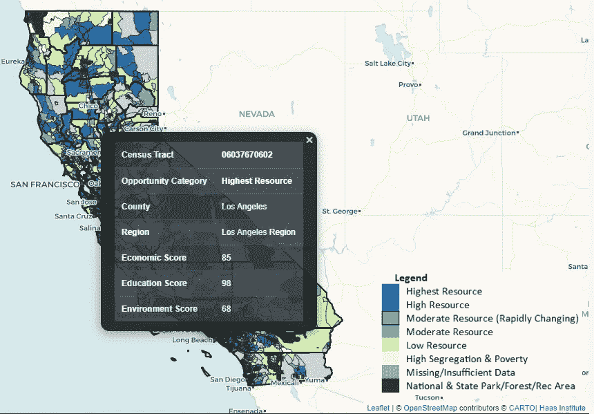

[https://belonging.berkeley.edu/tcac-2020-preview](https://belonging.berkeley.edu/tcac-2020-preview)

使用 [OpportunityDb](https://opportunitydb.com/location/alabama/) 我发现阿拉巴马州有 158 个机会区，密西西比州有 100 个。每个县有 0 或 1 个区，都属于“低收入社区”类别。我喜欢伯克利大学给他们的研究打分，所以我仔细研究了他们的方法，以了解我可以把什么转移到这些县。这里就不细说了，这些是他们用的指标:

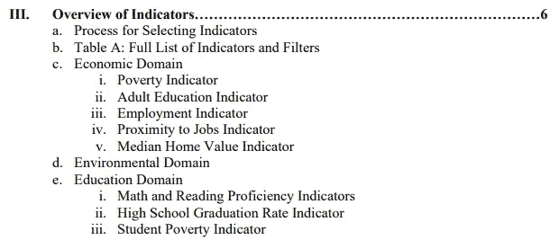

2020 年机会映射方法

他们使用的一些有趣的数据点是“成人教育”、“工作接近度”和“学生贫困率”。他们还使用了一种叫做“CalEnviroScreen 3.0 指标”的东西，这也是一个有趣的研究。

[密西西比州的](https://opendata.gis.ms.gov/)公开数据主要集中于 GIS，而[阿拉巴马州的](http://open.alabama.gov/)则集中于州支出。他们的 web 界面不同于旧金山、芝加哥和纽约等地，这些地方似乎都有相同的 web 模板和相似的数据集。

对于密西西比州，我寻找了年龄分布和任何与学校/孩子相关的数据。他们从门户网站上得不到任何真正有用的东西，所以我只能依靠 census.gov。它已经过时了，但却是一个起点。看起来人口大多是中年家庭。

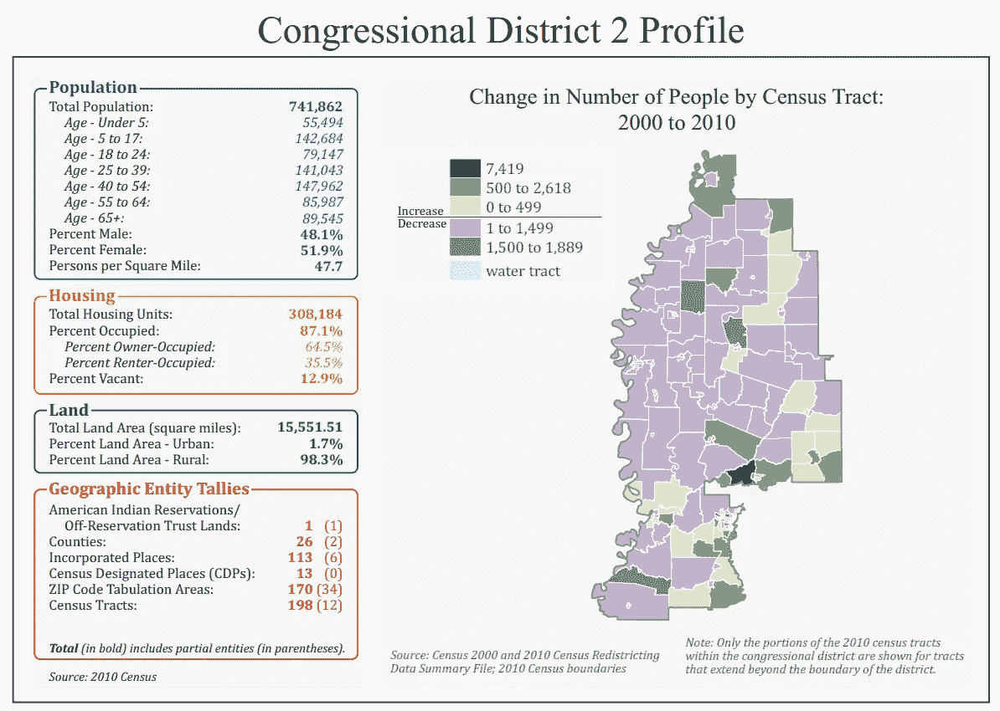

[https://www2 . census . gov/geo/maps/cong _ dist/CD 113/CD _ based/ST28/CD 113 _ ms02 . pdf](https://www2.census.gov/geo/maps/cong_dist/cd113/cd_based/ST28/CD113_MS02.pdf)

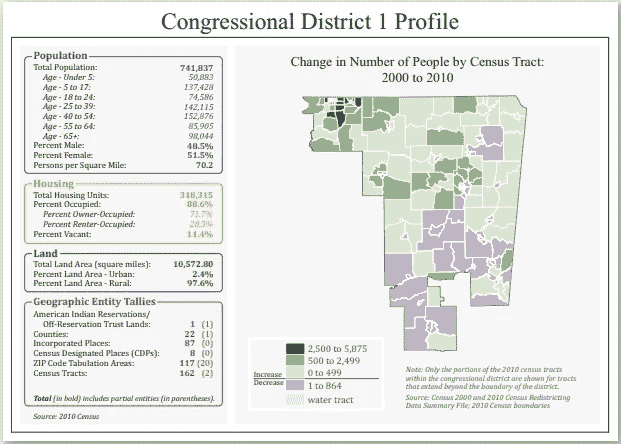

[https://www2 . census . gov/geo/maps/cong _ dist/CD 113/CD _ based/ST28/CD 113 _ ms01 . pdf](https://www2.census.gov/geo/maps/cong_dist/cd113/cd_based/ST28/CD113_MS01.pdf)

我还发现第二区和第一区的高中毕业率分别为 77.6%和 81.2%，而全国平均水平为 88%。

学区数据很有用，因为它能让孩子和他们的父母一起了解情况。首先，媒体对学校的报道(covid 之前)使用与之前相同的方法:

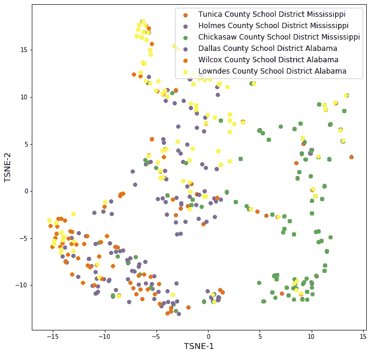

互动[这里](https://drive.google.com/file/d/16FOAlGvaEHtCOFqyPHd3MLqwE1jWgAT4/view?usp=sharing)

左下方的聚类包括犯罪、盗窃和枪击。中间/顶部集群涵盖了贫困、失败和隔离，右侧涵盖了儿童殴打/引诱和儿童死亡(也是一系列根据标题看似与学校无关的犯罪)。

我利用国家教育统计中心(NCES)来尝试了解当地学区面临的挑战。您可以在此找到图尼察县学区[，并搜索其他学区。我开始使用 bs4 和 Selenium 收集美国最大的 100 个学区以及我们的 6 个县学区的数据。清理完就剩下 70 个学区的数据(](https://nces.ed.gov/Programs/Edge/ACSDashboard/2804290) [csv 链接此处](https://drive.google.com/file/d/1EeY-nztefxjXYE7_4-kRncIqkFq5pm1H/view?usp=sharing))。

这是我收集的变量的`df.hist()`图:

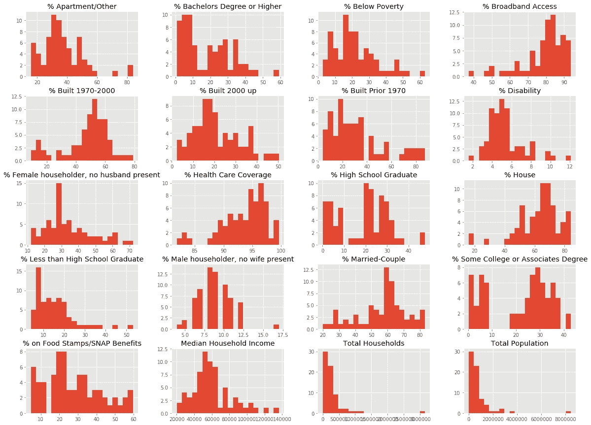

这是只有%变量的`plotly`箱线图。在交互式版本中，你可以将鼠标放在圆点上来查看学区名称。

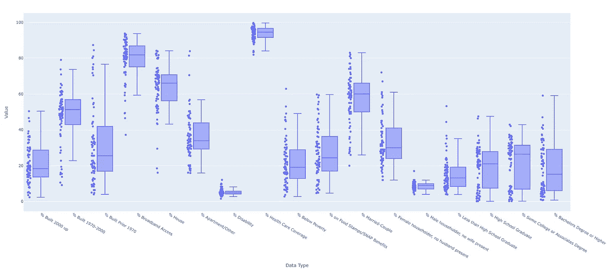

互动[此处](https://drive.google.com/file/d/1R2gu1Rs4jc8OTOYFfMUDBIBcL6sOvKdJ/view?usp=sharing)

密西西比州的三个区都有 97%以上的医疗保险覆盖率，这最初让我感到惊讶。然而，一些统计数据引起了我的注意，这里是这些箱线图的放大图:

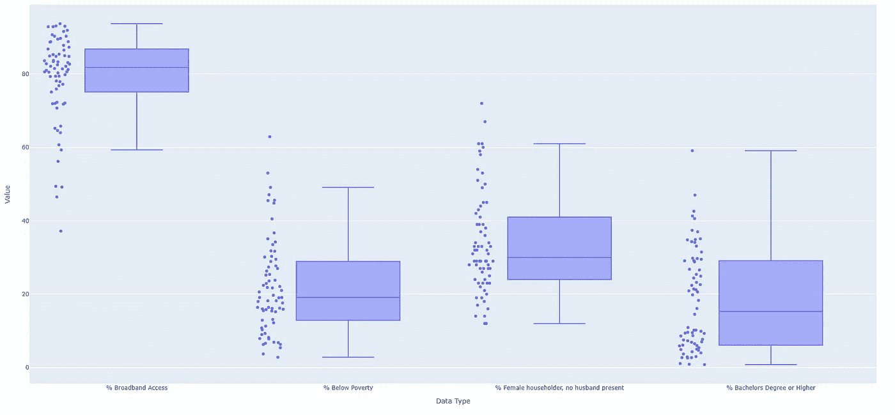

*   “拥有宽带互联网的家庭”:图尼察 64.6%，霍姆斯 37.2%，奇克索 45.9%。
*   "女户主，无丈夫在场":图尼察为 53%，霍姆斯为 72%，奇克索为 36%。
*   "学士以上学位":图尼察父母中有 9.3%，霍姆斯父母中有 9.6%，奇克索父母中有 4%。
*   图尼察 34.2%，霍姆斯 53%，奇克索 49.1%

作为参考，你可以将这些统计数据与加州这个非常富裕的县进行比较。92.3%上网，88%已婚夫妇，27.2%英语说得很好，79.9%父母本科以上学历。

在县一级很难找到儿童虐待/忽视/药物使用，所以我不能在那里找到任何东西。

**对于阿拉巴马**，我寻找犯罪和学校安全方面的数据。他们的开放数据库专注于国家支出，像这样划分(在 2019 年 10 月至 2020 年 6 月期间)。有大量的点击和页面标签，考虑到所有的数据都应该放在一个 excel 表中(如果你排除了所有收款人的支付日期)，这真的很难处理。

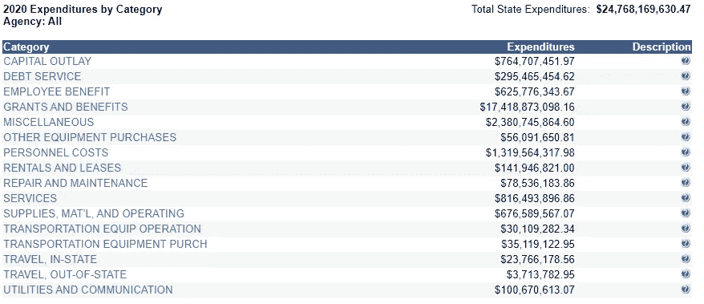

[http://open.alabama.gov/Checkbook/Category/](http://open.alabama.gov/Checkbook/Category/)

大部分支出是“补助和福利”，如果我们点击进入，我们会看到一些顶级类别:

1.  医疗福利 65.41 亿美元
2.  市/县学校系统 37.82 亿美元
3.  退休和养老金福利 24.64 亿美元
4.  拨款 13.36 亿美元
5.  个人福利 10.13 亿美元

然后我查看了 37.82 亿美元中有多少拨给了达拉斯、朗兹和威尔科克斯学区。

*   达拉斯 2050 万美元
*   朗兹 980 万美元
*   威尔科克斯 1000 万美元

我要指出的是，这些并不真正与学区预算的规模成比例，这就是数据定义如此重要的原因。如果任何人知道更多关于学区预算和国家资助，请与我联系！但是在浏览达拉斯地区[2020-2021](https://www.dallasisd.org/cms/lib/TX01001475/Centricity/Domain/78/FY_2020-2021_Proposed_Budget_June_FINAL.pdf)的预算提案时，我发现

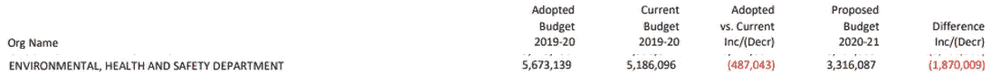

我想知道预算的减少是否与学校安全法案有关——尽管从外部来看这很难做出结论。阿拉巴马州似乎没有像[和这个来自 NYPD 的](https://data.cityofnewyork.us/Public-Safety/NYPD-Complaint-Data-Historic/qgea-i56i)这样的投诉或逮捕数据。

让我们将这些学区与密西西比州的学区进行比较。这是总体分布，所以你不用向上滚动:

*   “拥有宽带互联网的家庭”:达拉斯 64%，朗兹 49.4%，威尔科克斯 49.2%。
*   “女性户主，无丈夫在场”:达拉斯为 44%，朗兹为 67%，威尔科克斯为 58%。
*   “学士以上学位”:达拉斯有 14.5%的家长，朗兹有 5.9%的家长，威尔科克斯有 6.5%的家长
*   " %贫困线以下":达拉斯 31.8%，朗兹 45.6%，威尔科克斯 44.8%

## 承认方法中的偏差和改进

我能够深入了解这些以黑人为主的县的社区所面临的一些问题，但不幸的是，我无法将这些问题与失业直接联系起来，或者如何利用支出来解决这些问题。因此，我不会试图做出任何结论。

我在这里的目的是使用典型的数据科学库，提供一组分散的数据集背后的故事，便于我们理解。有几项我想提一下:

1.  我们正在研究的很多东西都是相互关联的，即使有看似“直觉”的解释，这也可能是危险的。
2.  有大量的定量数据，但其中大部分过于分散或更新不一致(即使是在开放的数据库中)，无法快速收集和使用。这在粒度级别上也变得更加难以处理。
3.  一个更全面的研究媒体的方法可能是找到关于每个国家历史的顶级书籍，然后运行 gensim 对它们进行总结(或者找到 100 本这样的书并进行 NLP 聚类)。这个过程只有和它的来源一样好。
4.  研究黑人占少数且失业率高的县也是值得的，尽管数据越细越难找到。农村 vs 城市也是一个很好的细分来研究。
5.  我们观察到的一切都在动态变化，使用收集到的数据时间越长，做出假设和决策的可靠性就越低。
6.  我在这里没有太多的比较分析(例如，一些对照组/基线，或像加州研究那样的规模)。下一步可能是深入到我们研究和比较的县附近，但这需要更深入的城市规划和立法知识，因为我们开始处理的不可见变量会成倍增加。
7.  下一次，我可能会更多地关注每个县就业所依赖的行业，而不是社区，因为这些数据更新得更加频繁和可靠。这是更标准的方法，所以这次我不想采用。

数据科学是各种模型的强大工具，但同样的技能集在提供更清晰的问题和数据描述方面也非常强大。没有固定的方法来做到这一点，这就是为什么我的方法与你习惯阅读的相比可能感觉粗糙。但至少，这是一种在 Kaggle 竞赛和预制 Jupyter 笔记本之外练习技能和学习的方式！

这里表达的所有观点都是我个人的，并不代表我所属的那些人的观点。