# 使用数据科学来了解和应对冠状病毒和其他流行病。

> 原文：<https://towardsdatascience.com/using-data-science-to-understand-and-attack-the-coronavirus-and-other-epidemics-41019c6b0c86?source=collection_archive---------28----------------------->

## 流行病危机的理解、行动和预防策略。

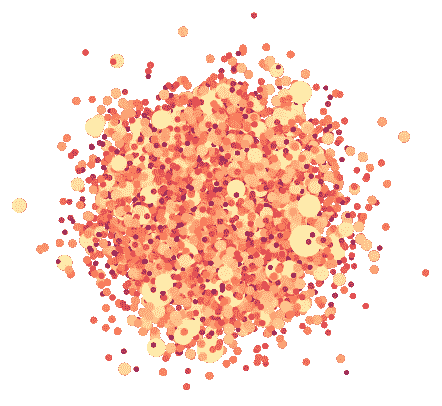

在 2019 年的最后一天，中华人民共和国政府向国际卫生当局通报了中国武汉市的一系列不明疾病病例。七天后，中国当局确认该病毒是一种属于普通流感家族的**冠状病毒**，SARS 和 MERS。国际科学界将这种病毒命名为新冠肺炎，根据流行病学标准，这种病毒已经从流行病变成了**疫情**，因为迄今为止它已经在全球传播到了 75 个国家。

截至 2020 年 3 月 4 日，**已有 3062 人死于该病毒**(最后一天为 162 人)，报告的病例总数达 92860 多例，其中大部分来自 mainland China ( [原始数据](https://github.com/CSSEGISandData/COVID-19))。

世界卫生组织([世卫组织](https://www.who.int/csr/don/12-january-2020-novel-coronavirus-china/es/))对这种病毒的一些症状描述如下:

> 临床症状和体征主要是发热，在某些情况下，呼吸困难和胸部 x 光检查可见双肺浸润性肺炎。

目前已知该病毒的**致死率**没有其他类似疫情高(约 2%的感染以死亡告终，类似 SARS 和 MERS 的病毒约为 60%)。众所周知，**传播**的容易程度相对较高，病毒通常需要大约 10 到 15 天才能无症状地潜伏**。正因如此，被感染的人往往会在这段时间内传染他人，而自己并不知道自己生病了。这可能会给卫生系统带来风险，因为没有足够的医院床位来处理大量受感染的病人。**

矛盾的是，这种病毒的低致死率恰恰是它如此危险的原因，因为无法遏制它有可能大规模传播传染病，并且它的“低致死率”比近几十年来任何类似的病毒都要夺去更多的生命。

然而，在全球化时代，这种疾病和其他呼吸系统疾病爆发的大规模性质表明了大规模的战斗战略，其中**协调和信息交流**成为理解、遏制并最终解决流行病的基本支柱。

这就是**数据科学**发挥作用的地方；被描述为大规模计算机数据分析工具，以及**人工智能(AI)和机器学习(ML)** 技术，以更强的理解能力处理这种规模的问题。

在 2020 年中期，我们离不开这些技术，在这一层面，成功战略的决策和规划必须由数据驱动**。**

数据科学有大量的方法，其有效性由**统计的严格性**来保证，然而，由于该领域的持续发展，以及数据科学家参与的不断创新过程，它们的实施可能变得更像一门艺术而不是科学:没有完美的配方。

在本文中， [**deep_dive**](https://dive.ai) 的团队试图提出一些数据科学的想法和应用，这些想法和应用可能会通过以下工作流程对正确处理这场危机产生影响:

1.  理解这一现象
2.  行动
3.  预防

在第一阶段，我们将通过提取尽可能多的关于病毒的信息，并使用 GIS(地理信息系统)技术和图形分析从数据可视化中理解病毒，来寻求理解这种现象。这些信息将作为**行动阶段**中模型的训练和部署的基本输入，在此阶段，我们提出了使用时空聚类、基因组数据和一些风险模型的具体应用。最后，在**预防阶段**，我们将探索数据架构问题，为解决未来类似性质的问题打下更坚实的基础。

# 理解这一现象

理解流行病学现象的一个关键问题是正确诊断发现该现象的阶段。

**疫情**在哪里？**传染**是如何发生的？有多少人生病了？**传播**有多快？有多少人处于危险中，谁最容易受到影响？**诊断**最好的方法是什么？

让我们试着用一个典型的工作流来回答这些问题，这个工作流从探索性分析开始。

这一阶段包括提取原始数据可能提供给我们的信息，我们提出以下列表作为起点:

*   数据可视化。
*   地理热点(GIS)
*   网络分析。

## 数据可视化。

数据可视化是提取现象潜在模式的最有效的工具之一；在分析的初始阶段，正确地查看数据允许我们生成第一个假设。

当谈到一种流行病时，看到图表的用处会立即浮现在我们脑海中，这些图表可以让我们了解病毒的**传播和致命性**中的**时空**演变。

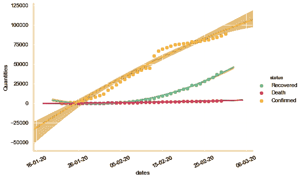

自 2010 年 4 月 3 日起新冠肺炎病例的演变

这一时间序列可以直观地显示所报告的病毒病例的全球演变情况。我们可以通过**二次模型的拟合来想象数据的趋势。**

正如我们所见，二次模型似乎不是拟合数据的最佳方式；然而，这种模型的动画可以让我们更好地理解问题的维度及其潜在规模。

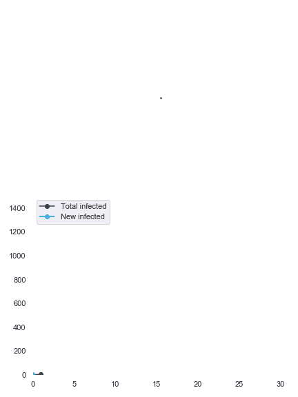

新的每日感染呈线性增长(总是恒定)的模型意味着总感染是二次的。

通常情况下，流行病学中使用的模型具有指数增长，其发展可以很快超过像这样的二次模型。

## **地理热点**

众所周知，该疾病的首次爆发发生在中国，这就是为什么我们的地理分析将分为两个区域:中国和世界其他地区。首先，让我们想象一下每个地区确诊病例的演变情况。

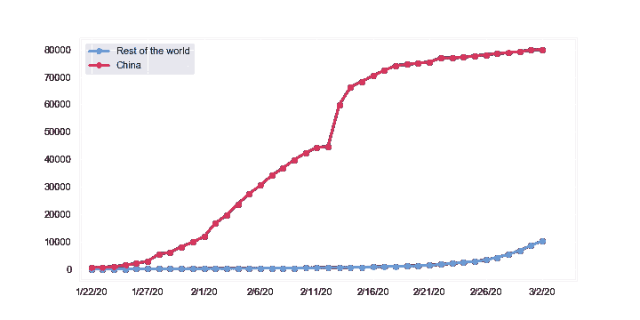

很明显，中国是疫情的焦点，然而，鉴于全球化世界的相互关联性，在世界其他地区出现同等规模的疫情是可行的。此外，世界其他地区 3 月 3 日确诊的新增病例总数似乎超过了中国。让我们更详细地看一下每个地区:

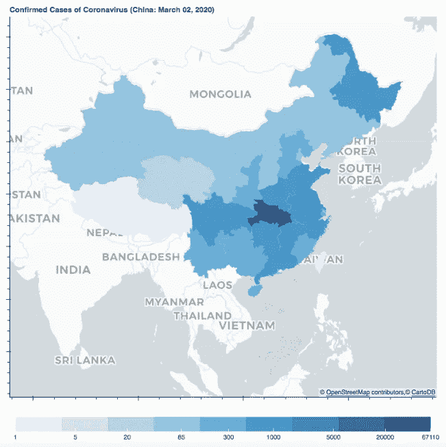

武汉市位于中国中部的湖北地区，是迄今为止发现确诊病例最多的地方。

目前，**中国有 80304 例报告病例**，因此在下图中，病例数对应的颜色超出了建议的比例。

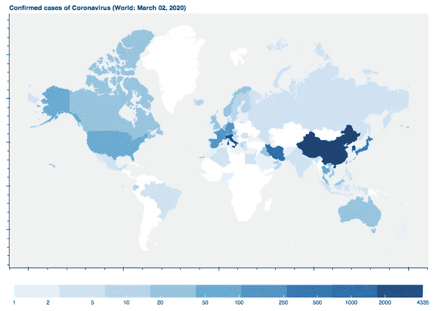

这张地图令人担忧的是跨境感染的增长率和各类国家新疫情的出现。**截至 3 月 4 日，已有 75 个国家确诊病例。**

现在让我们看看中国和世界其他地方报道的死亡案例。

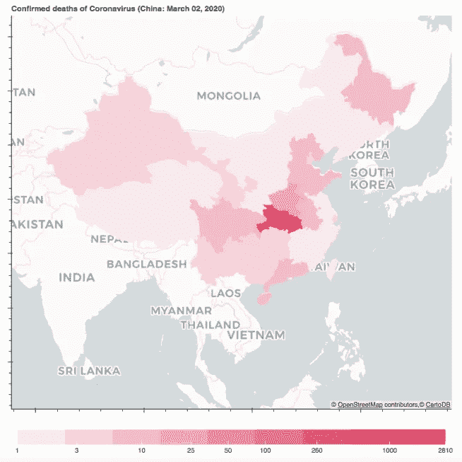

截至 3 月 3 日，已有 3112 人死于该病毒。

显然，来自新冠肺炎的最大数量的死亡发生在病毒感染源附近，这再次将中国置于全球比较范围之外，在 3112 例死亡中有 2946 例。

探究意大利、伊朗和韩国的案例很有趣，这些国家的致死率似乎高于其他国家:一个有趣的假设可能是发现传染病例的有效性很低，低估了目前传染病例的数量。

## 网络分析。

鉴于病毒携带者(人类和一些动物)的离散性，从网络角度研究传播和传染是很方便的。在这些网络中，每个**节点**意味着一个人，而**边**(节点间的连接)意味着传染。鉴于传染病是随时间变化的进化过程，这种现象的建模变得极其复杂。

为了更好地理解这个案例，让我们把我们的分析从**全球蔓延抽象到本地**，例如，在墨西哥城地铁(CDMX)设施内。

假设一节地铁车厢 2 米* 40 米，每节车厢有 7 节。这产生了一个 560 𝑚的空间，传染可能发生。如果车满了，让我们假设每个𝑚有 9 个人，交互的数量会变得巨大。

𝑚的相互作用总数是 C(9，2)=36 的二项式系数，即 36 个相互作用。现在让我们假设在中心的人被感染了，并假设给定人口密度的感染率，然后我们可以模拟感染。

例如，假设在 15 分钟的互动中，与感染者一起乘坐地铁的每个人都有 30%的机会被感染。根据这些参数，在大约 2 小时内，8 名邻近乘客将已经被感染，这也是假设新感染者不会立即感染其他人(重要的是要注意，这 30%是一个说明性的例子，巨大的流行病学努力必须集中在尽可能估计这些比率上，在此链接中您可以找到更多信息)。

下图让您看到在几次模拟后，这个平均值如何收敛到 120 秒。

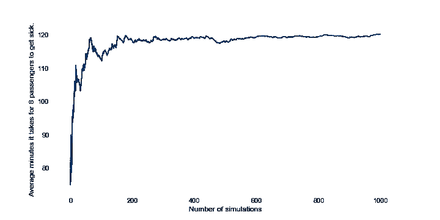

很明显，这些参数不能轻易假设，每个参数都必须以尽可能好的方式进行估计。基于这种简单推理的更复杂的模型可以在下面的[链接](https://en.wikipedia.org/wiki/Compartmental_models_in_epidemiology)中更详细地查阅。

# 行动

对这些现象采取行动自然是最复杂的部分。在这一阶段，所阐述的解决方案涉及大规模的后勤和行动部署、巨大的资源支出和非凡的政治能力，更不用说适当的规程、训练有素的卫生专业人员和深思熟虑的解决方案。如果不知道我们面临的是什么，不知道提议的解决方案是否是根据探索阶段发现的相关方面设计的，所有这些都不可能正确执行。

模型部署中的可扩展性变得至关重要，因为一个对大规模现象(如流行病)做出响应的系统必须能够处理高水平的**并发**，而不会在任何时候损害响应的**有效性**和**速度**。

本节概述了医学流行病学应用的可能模型部署，以及每个模型必须考虑的事项。

## 基因组展示。

由于医学科学的进步，冠状病毒的基因组序列很快被确定，现在是开源的。下图是测序的 **DNA** 的前 100 个含氮碱基的图片:

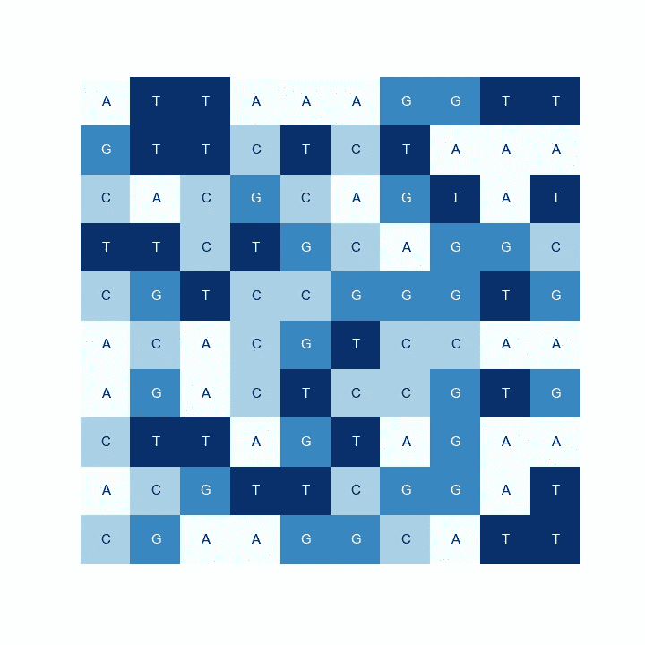

从这个视觉序列中，我们可以确认一些生物学的基本知识，例如任何生物的 DNA 都是只有四个含氮碱基(A、C、G、T)的序列。

完整的图像可以从完整的原始信息以及其他相关的基因组信息发展而来，这些信息可以在[这里](https://www.ncbi.nlm.nih.gov/nuccore/30271926?fbclid=IwAR0lghEXf0T188vj6TmE_aVrp0xZ2f_G3-WoO2tz-KeqzCkxntebXsX1DJA)找到。

这个数字可能在美学上很吸引人，然而，很少有**见解**能为我们对这一现象的分析增加价值。

从这个庞大的序列中提取信息并不是本文的重点，然而，使用主成分分析(PCA)等技术**或其他维度缩减技术，我们可以帮助实现不同病毒株之间的相似性度量，这可以指导我们创建有效的疫苗。另一方面，遗传树让我们能够可视化突变的进化。**冠状病毒**的进化可以在这里查阅[。](https://nextstrain.org/ncov)**

## **时空聚类**

**除了识别**热点**之外，另一种时空检测方法是基线的**使用。**这些让我们能够根据历史信息确定我们在正常范围内会考虑什么。通过这种方式，我们可以有效地检测对典型或历史行为的异常感染的聚集(集群)。**

**作为该技术的应用示例，我们将使用 2018 年明尼苏达州接种疫苗的学生人数的公共数据集。**

**我们发现该地区(集群)接种疫苗的幼儿园人数(约 85%)明显低于该州其他地区的百分比(95%)。值得注意的是，检测到的组并不对应于明尼阿波利斯市人口密度最高的区域，因为所实施的算法使用了考虑到人口的基线，因此我们可以检测地理上对于形成有效策略不明显的情况。**

**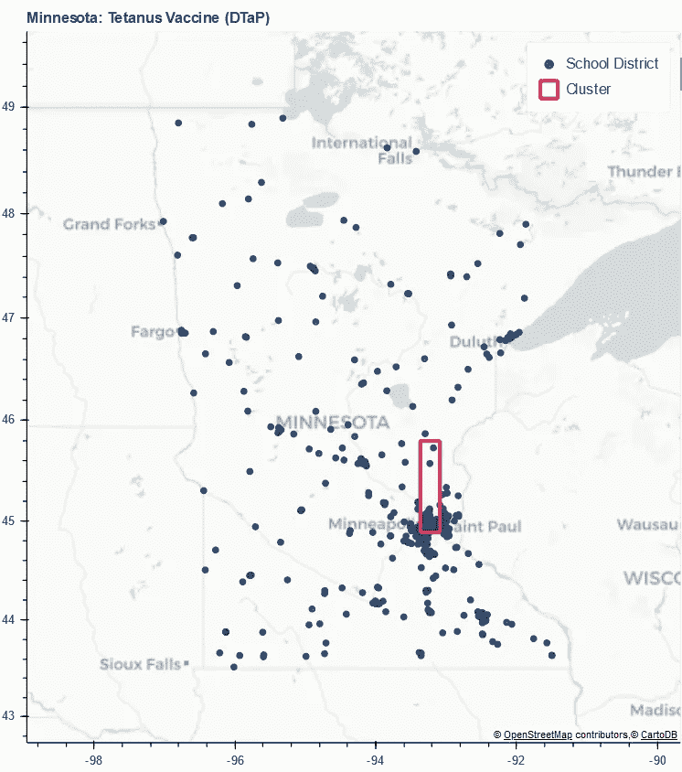**

**2018-2019 学年明尼苏达州接种疫苗的学生人数的公共数据集。**

**这种分析方法可用于多种流行病学应用。一方面，我们可以发现病例数明显高于其他地区的地区。类似地，如果新冠肺炎冠状病毒疫苗可用，我们可以使用该数据集来识别高风险区域。**

**从这里，我们将冠状病毒感染和疫苗接种率相关联，以便在感染开始不受控制地传播之前，更好地将资源分配给传播感染的最高风险地区，避免这样做可能是**的疏忽。****

## **风险模型**

**流行病风险模型可以预测某种疾病的感染演变，以及这将如何影响所涉及的其他参与者。**

**这些模型非常复杂，因为它们依赖于许多特定于每种病毒环境的相互作用。冠状病毒的规模使得风险模型的设计成为一项强制性任务，因为只有这样才能衡量所涉及的成本:确定城市宵禁、关闭市场或拥挤的空间、移民和机场措施等。**

**有了足够的航班信息，就可以估计来自被归类为“风险”区域的客流，并在此基础上对采取**强制性预防措施**进行成本效益分析，例如对每个到达的乘客进行诊断，并在检测到的情况下启动健康协议，以避免通过这种方式传染。**

**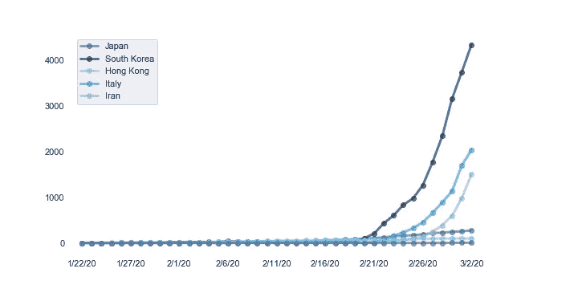**

**只有跟踪在一些国家检测到的感染趋势，以及可用的医疗护理能力，才有可能估算出达到饱和的距离。**

**以意大利为例，该国的医疗保健能力目前为每 1000 名居民 3.4 张病床。穿越这个国家冠状病毒病例的趋势，我们观察以下模型。**

**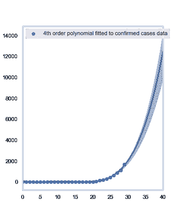****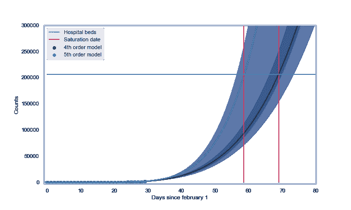**

**值得一提的是，最符合流行病学趋势的模型不是多项式模型，而是指数模型。也有适合当地特点的模型来调查地区发展。**

**考虑到对病例发现趋势和可用床位数量的调整(考虑到之前没有工作)，在 36 至 49 天内，意大利医院将没有一张床位可用于治疗新冠肺炎患者。重要的是要考虑到该模型认为所有患者都患有严重疾病，因此需要床位，这不会在包含更多变量的更专业的模型中减少一点趋势。获得一个世界或地区地图来可视化饱和的**距离**和一些其他风险地图是一个悬而未决的任务，应该很快进行。在这个[环节](http://deim.urv.cat/~alephsys/COVID-19/spain/es/index.html)，有一些传播图的例子。**

**如果我们将这些模型用于全球战略，我们将不得不考虑大规模模型的部署。只有通过像 Google Cloud、Amazon Web Services 或任何其他形式的互联网托管这样的云服务，才能完成如此重大的任务。每个模型都是不同的，因为其不同的体系结构和功能最适合每种情况，并且取决于每个模型的计算、内存和可用性要求。**

# **预防**

**如果我们能有效地控制疫情，我们就不能停下来。了解最新的最佳实践非常重要，因为只有这样，我们才能为这种性质的危机做好准备。本节讨论数据科学的一个非常重要的部分，它与数据基础设施有关，在数据工程中比在数据分析中更常见。**

## **卫生部门的隐私**

**保护使用 ML 模型的个人隐私是一个相关的伦理问题，尤其是在使用的数据可能包含敏感信息的情况下，如卫生部门。**

**我们感谢**约翰·霍普金斯大学**提供关于这一发展的每日更新，可以在他们的 [github 知识库](https://github.com/CSSEGISandData/COVID-19)中查阅。**

**此外，这一主题在未来可能会变得越来越与使用个人数据的组织相关，因为他们将必须遵守保护此类数据流通的新法规，例如[通用数据保护法规(GDPR)。](https://es.wikipedia.org/wiki/Reglamento_General_de_Protección_de_Datos)**

**幸运的是，今天已经开发出了(并且仍在开发中)工具，为这种问题提供了技术解决方案，这在本质上是相当法律和政治的。这方面最著名的工具是**联合学习、差分隐私和安全多方计算(SMPC)** 。总之，这些工具可以为开发预测模型提供一个框架，同时对数据和模型进行加密，从而保护用户隐私。**

**例如，联合学习中的一个范式转变意味着学习不再是集中式的(左)，而是分布式的(右)。也就是说，**模型移动到数据所在的地方，而不是相反。****

******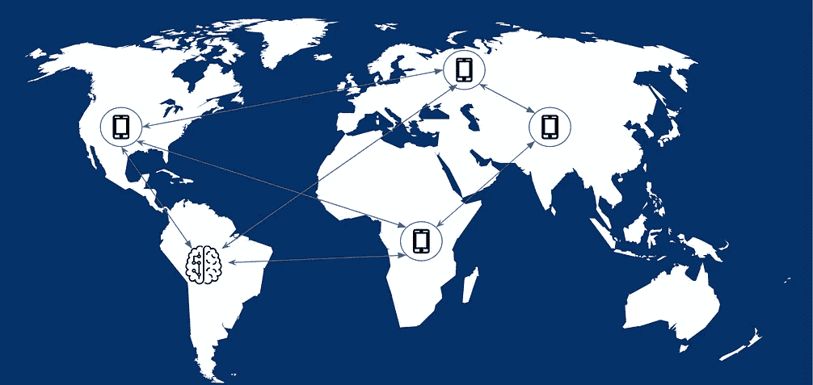**

**集中式和分布式学习**

**想象一下，开发了一种工具，它可以成功地使用生物数据、地理定位和搜索引擎查询(如 Google)的组合来预测流行病的动态。在这种情况下，这些数据可能被用来对用户、他们的日常习惯以及他们的健康状况进行敏感的观察，而这些观察可能会被用于不利的方面。否则，用户可能甚至不愿意提供这些数据，从而使开发这样一个模型变得困难。这就造成了一个道德困境:能够对流行病做出预测会带来直接的社会利益，但这意味着个人隐私会被削弱。这里提到的工具可以促进有效模型的开发，从而克服这一困境。**

**要了解这个主题的更多信息，我们建议研究一下 [OpenMined](https://www.openmined.org) 和 [Dropout Labs 的工作。](https://dropoutlabs.com)**

# **结论**

**尽管国际科学界的反应比以往任何时候都更加敏捷，关于该病毒的信息已在各研究中心共享，并且国际卫生当局已在足够大的范围内及时启动了相关协议，**该病毒尚未得到遏制，预计短期内也不会得到遏制。****

**认为这种病毒的低死亡率是不保持最严格措施的理由将是一个严重的错误。看看冠状病毒的传播模式，很容易想象如何在几周内整个国家的卫生系统可能完全崩溃，进一步危及容易死于这种病毒的人，从而每天增加死于新冠肺炎的人数。**

**活跃在人工智能模型开发领域的科学界(deep _ dive 的团队是其中的一员)的贡献，提供了有价值的分析和预测方法来缓解这种和其他性质的危机。**

**我们感谢所有参与这项工作的人，以及那些合作完成这篇文章的人。**

**[*曼努埃尔·阿拉贡内斯*](https://twitter.com/manuelaragones)*[*杰罗姆·阿兰达*](https://twitter.com/jeroaranda)*[*哈维尔·科尔斯*](https://twitter.com/Javiercors)*[*卡蜜拉·布朗内斯*](https://twitter.com/CBlanesG)*[*阿图罗·马尔克斯*](https://twitter.com/arturomf94) *和杰罗姆·马蒂*******