# 用数据寻找最残忍的食人尸歌

> 原文：<https://towardsdatascience.com/using-data-to-find-the-most-brutal-cannibal-corpse-song-bf318d0b3ef4?source=collection_archive---------17----------------------->

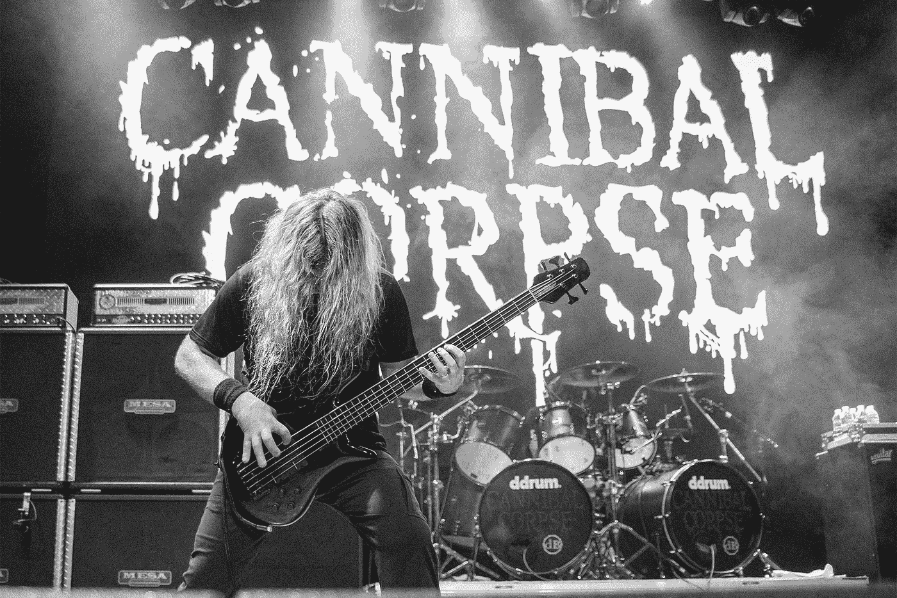

(来源:瑞安·哈维尔拍摄的照片)

## **我们能依靠数据来确定有史以来最残忍的食人尸宋吗？—但是，首先，什么是“野蛮行为”？我们真的可以用一首歌来衡量它吗？—是的，我们可以。算是吧。**

活跃了三十多年的[食人尸](https://en.wikipedia.org/wiki/Cannibal_Corpse)是有史以来最重要的死亡金属乐队之一。我仍然记得当他们的第一张专辑“被吃回生命”在 1990 年发行时(那时我十二岁):它在金属界引起了震动。以前从来没有一支乐队在音乐、歌词和视觉方式上表现出如此极端的“残忍”(专辑封面上的“僵尸吃自己的内脏”完美地概括了这一切)。

在这种背景下，受埃文·奥本海默(Evan Oppenheimer)的博客文章的启发，我开始着手用数据驱动的方法寻找最残忍的食人尸体歌曲。

## 项目简介

这个项目可能看起来有点傻，但它实际上是应用分析的一个很好的练习和展示。当我们不仅缺乏有标签的数据(我们实际上从一开始就没有任何数据——我的唱片架上的食人唱片帮不上什么忙…),而且——更糟糕的是——我们甚至还没有一个清晰的、可衡量的目标值定义时，这是一个不那么微不足道的情况。

所以，最初的问题是:

*   残忍的定义是什么？
*   如何衡量一首歌的残暴程度？
*   我们能获得什么数据来构建这样一个“残暴指数”？

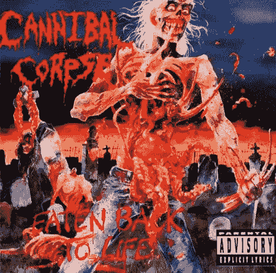

**食人尸首张专辑的美术作品。30 年过去了，考虑到随后两张唱片的封面艺术，它现在看起来实际上是无害的。但是有一件事你绝对应该认真对待:“父母忠告”贴纸！(来源:文森特·洛克的作品**

**数据&代码**:用 Python 进行分析。从 Spotify API 请求音频相关功能(使用 *spotipy* 库)和从 genius 网站抓取歌词(使用 API 请求和 web 抓取与 *beautifulsoup4* 库的混合方法)。如果你想更深入地研究或编码:所有代码，包括一些额外的数据探索、推理和解释(以及一些额外的声音剪辑)，都可以在这个 [GitHub repo](https://github.com/rbuerki/most-brutal-cannibal-corpse) 中找到。

# **定义“总残暴指数”**

根据《免费词典》，[残暴](https://www.thefreedictionary.com/brutality)被定义为:*“无情、残酷、苛刻或无情的状态或品质。”*

对我来说，在一首歌里有两种表达方式:

1.  到了*声音特征*(比如音乐本身的能量和效价)
2.  歌词(一个充满‘苛刻而残酷’的词汇)

所以，为了定义一个'**总残暴指数** ' ( **TBI** )我们必须首先计算然后结合这两个元素。我将把第一个称为'*声波野蛮指数* ' ( *sbi* )，第二个称为'*抒情野蛮指数* ' ( *lbi* )。为了构建 **TBI** ，我们可以取它们的平均值(算术平均值):

> **总残暴指数，TBI=**
> 
> **(0.5 *声波残暴指数，sbi) +**
> 
> **(0.5 *抒情兽性指数，lbi)**

因为我将确保 sbi 和 lbi 都在相同的范围内，从 0 到 1，所以将权重设置为 0.5 意味着歌曲中的总残忍程度由歌曲的歌词和音乐决定。(对我来说没问题，但是当然，如果需要，可以通过设置不同的权重来改变比例。)

# **野蛮音乐:计算‘声波野蛮指数’**

为了确定一首歌曲的声音残忍程度，我依赖于 Spotify 为他们网站上的每首歌曲提供的两个音频功能。你可以通过它们的 API 来访问它们(详见 [GitHub repo](https://github.com/rbuerki/most-brutal-cannibal-corpse) 中的第一个笔记本)。

许多提供的音频功能不符合我们的特殊目的，但有两个特别有趣。第一个是“*价*”。据 Spotify 称:

*   ***价*** *是一个从 0.0 到 1.0 的量度，描述一个音轨所传达的音乐积极性。高价曲目听起来更积极(例如，快乐、愉快、欣快)，而低价曲目听起来更消极(例如，悲伤、沮丧、愤怒)。*

好吧，我们当然希望一首残酷的歌曲大部分是负面的(也就是低价)，但我们不希望它是悲伤或沮丧的，所以我们需要结合高价和高能来抵消这一点。幸运的是，Spotify 也为我们提供了这一功能(甚至在描述中提到了死亡金属——罢工！):

*   ***能量*** *是从 0.0 到 1.0 的度量，代表强度和活动的感知度量。通常，高能轨道感觉起来很快，很响，很嘈杂。例如，死亡金属具有高能量，而巴赫前奏曲在音阶上得分较低。对该属性有贡献的感知特征包括动态范围、感知响度、音色、开始速率和一般熵。*

因此，让我们来看看从 Spotify 数据库中搜集的 164 首食人尸体歌曲的*价*和*能*的分布，每首歌曲的评分范围为 0 到 1:

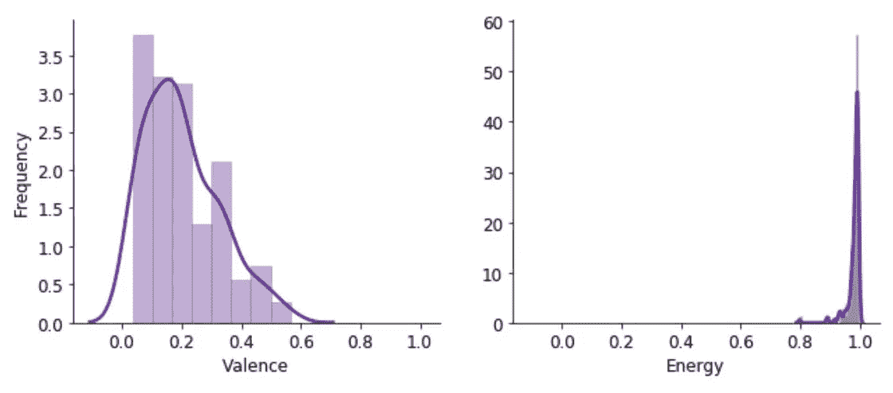

**化合价和能量分数分布图**。“距离图”显示了歌曲在相应特征的范围频谱上的分布情况。

是的，这些歌曲确实倾向于消极的一面(低价)——但是，见鬼，看看那种能量分布……都被挤在最大值附近！相当激烈的东西，然后…

通过计算*能量*和 *1-化合价*(从 1 中减去化合价，这样更高的值意味着它更“负”)的平均值，我们可以创建一个“声波残暴指数”(sbi)的方程。这样一来，最残酷的歌曲将是那些既高能又低价，同时又对两者同等重视的歌曲:

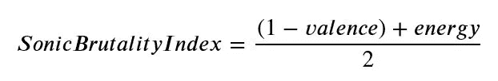

计算所有歌曲的 sbi 导致以下结果:通常所有歌曲的范围在 0.7 和 1 之间。音乐上最残酷歌曲的竞争非常非常激烈。以 2014 年专辑《一个骨骼领域》中的歌曲*高速撞击飞溅*险胜。(在这里听一段 30 秒的声音样本[。不错吧，嗯？)](https://p.scdn.co/mp3-preview/5c8d9c416d2f43696ce70afa3dde9cb8fecf1868?cid=4a73009f43b84a8f88e6a857c198ad8f)

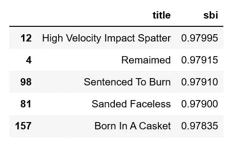

sbi 评分排名前五的歌曲。前十几首歌左右超级接近。

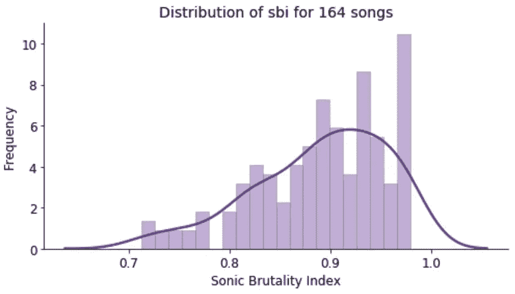

**所有歌曲的 sbi 分数的频率分布**。总的范围是 0 到 1，但是没有一首歌的分数低于 0.7。有很多歌真的很接近 max 值。

因为得分最高的歌曲的得分如此接近，我们不得不希望“抒情暴力指数”能够做出更明确的区分。

(而且，可以这么说，会的……)

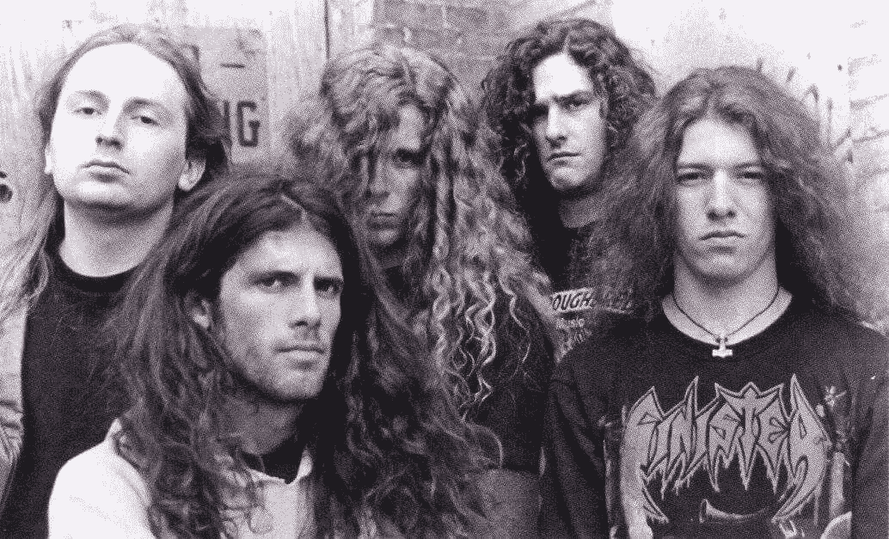

(非常)早期的食人尸体队列，可能在 1990 年左右。从一些旧金属杂志上扫描下来的。(来源: [Pinterest](https://i.pinimg.com/originals/07/d5/4c/07d54cb97872da71ac5cd9567ea54007.jpg) )

# **残忍的歌词:计算“歌词残忍指数”**

这是更棘手的部分，不仅仅是因为我觉得必须以某种免责声明开始:食人尸的歌词很恶心。真的。这是他们应该做的。但是他们音乐的一个好处是你实际上无法理解他们在说什么。；-)

(顺便说一下:1995 年，当时的参议员鲍勃·多尔指责该乐队“破坏了美国的国民性”。在德国，前三张专辑的销售和现场演出直到 2006 年才被禁止。)

尽管如此，我还是从 genius.com 搜集了所有食人僵尸歌曲的歌词。但是如何确定他们的残暴程度呢？

为了帮助我，我找到了 NRC(加拿大国家研究委员会)提供的“[化合价、唤醒和支配词汇](http://saifmohammad.com/WebPages/nrc-vad.html)”。它包括一个超过 20，000 个英语单词及其效价，唤醒和优势分数的列表，范围从 0(最低 V/A/D)到 1(最高 V/A/D)。

而一家独大对我们帮助不大，*价*(再来！)和*唤起*正是我要找的。根据核管制委员会:

*   **价**是积极—消极或愉快—不愉快的维度
*   **唤醒**是兴奋——平静还是主动——被动维度

那就让我们选择低价、高唤醒度的词汇组合吧！这可能是最接近残酷的。引起强烈负面情绪的东西。是的，从 20，000 个词条的整个词典中筛选出具有最高低价高唤醒分数组合的单词(我称之为 *wbi* ，‘*单词残暴指数*’)会返回我们正在寻找的结果:

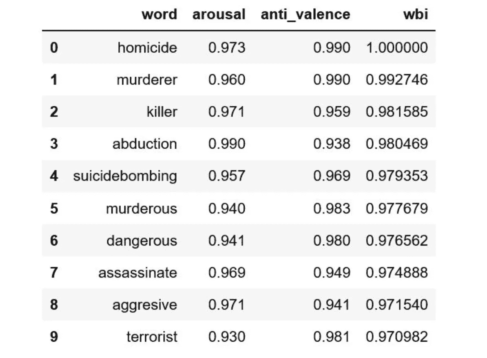

**根据“单词残暴指数”在 VAD 词典中排名前 10 的单词**。请注意，为了方便起见，我将(1 价)转换成了‘反价’特性。通过简单地取‘唤醒’和‘反价’的平均值，然后将它们全部归一化到从 0 到 1 的范围，为词典中的每个单词计算 wbi。

那么，如何利用这个“野蛮得分”的词汇呢？最简单的解决方案可能是根据每首歌出现的所有单词来计算平均 wbi 值。但是凭直觉，我不认为这是最好的方法，因为我对包含(必要但不重要)“非残酷”单词的分数和分布不感兴趣。

我在寻找一个乐谱

1.  考虑到*在一首歌中使用了多少次*野蛮的词语，

2.他们在总字数中所占的比例是多少

*3.这就带来了与歌曲持续时间相关的所有这些*。(因为，当然，我们不仅仅想要许多残酷的话语，我们想要一个*高密度的残酷话语*，意味着每分钟尽可能多的残酷话语。)**

**所以，我最终选择的 *lbi* 是:**

**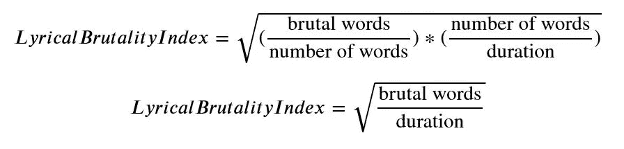**

**(可以看出，残暴词的字数/道具在最终等式中被数学抵消了。)**

**好吧，但这让我们解决最后一个问题:*如何将一个词归类为残暴？*通过“单词残暴指数”，我们对每个单词都有一个从 0 到 1 的连续评分，现在必须将其转换为“残暴”/“非残暴”的硬二进制分类。**

**经过一些测试后，我(尽管有些武断)决定这样做:取词典中 20，000 个单词的总体 wbi 分布，并将其中具有最高 wbi 分数的 5%归类为“野蛮”。其余 95%的单词被归类为“非野蛮”——所以总体来说，20 个单词中有 1 个被认为是“野蛮的”:**

**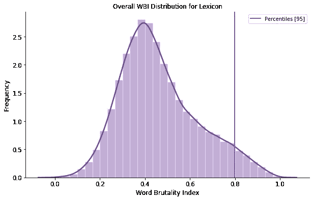**

****灰线标志着“野蛮”词语的界限**。所有单词中有 5%的 wbi 阈值为> 0.797。他们被归类为“野蛮人”。其余的不是。(顺便说一句:我试验了不同的阈值，对最终结果的影响很小，得分最高的歌曲从未改变。)**

**是时候通过一个基本的 NLP 管道来输入所有这些食人尸体歌曲的粗糙歌词了(对它们进行清理、标记和词条化，然后删除所谓的“停用词”，这些词通常没有什么隐含意义(如果有的话)。结果:每首歌曲的单个内容单词的干净列表，然后使用词典进行 wbi 评分和分类。wbi_score >大于阈值(0.797)的所有单词都被标记为“野蛮”。**

**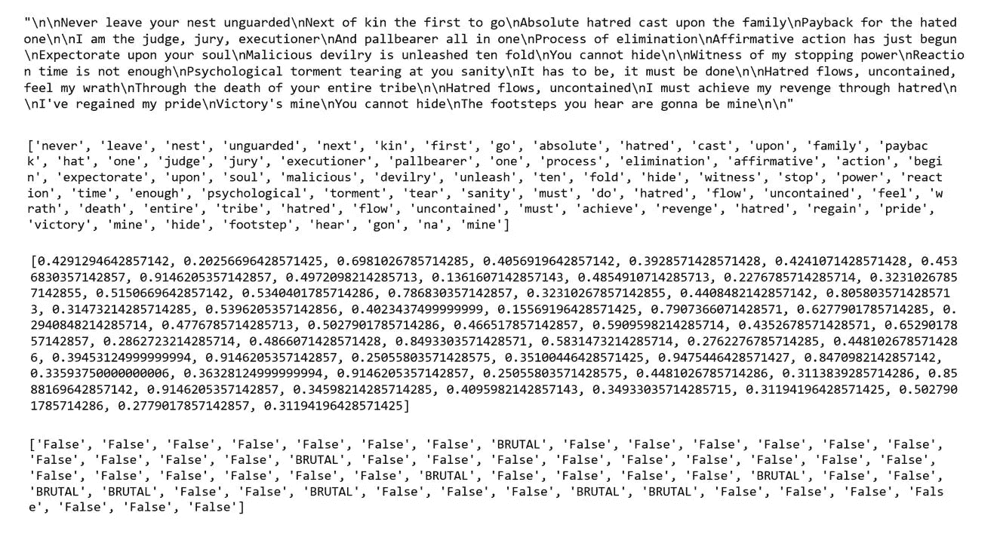**

****歌曲文本通过预处理管道的旅程**。从字符串到词汇化的标记，到 wbi 分数，再到最终的单词分类。**

**因此，在根据上面定义的公式计算所有歌曲的“*抒情暴力指数*”后(歌曲的持续时间是从 Spotify 单独刮出的)，我们可以查看最终的分布和具有最高“抒情暴力指数”分数的 5 首歌曲:**

**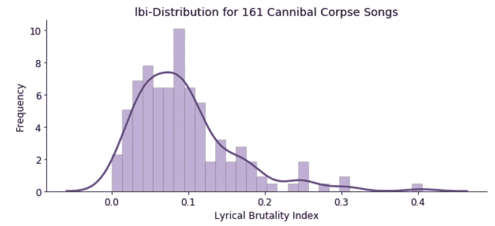**

****lbi-分配**。请记住，履行机构没有产生一个明确的赢家。这里我们有一些明显的“异常值”在上端！它们是:**

**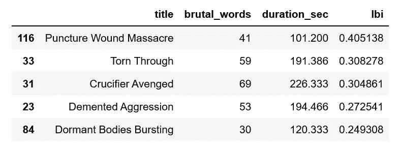**

****lbi-score 排名前五的歌曲。****

**结果很明显。《刺伤惨案》是目前为止“*抒情残暴指数*评分最高的歌曲。这首歌只有短短的 1 分 41 秒，这无疑是一个很大的帮助。食人者尸体成功地在这么短的时间内包装了许多残忍的词语……(我真的不想深入抒情的细节，但文本以多次重复短语“刺、砍、砍、杀”开始——相信我，这是迄今为止最精彩的部分……)**

**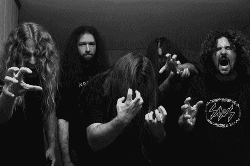**

**食人尸体后来排队，表现正常的宣传片拍摄。([来源](http://3.bp.blogspot.com/_zTEqw3zYptQ/TVDLA3QzbrI/AAAAAAAAADE/urjWgp8RxFc/s1600/Cannibal%252BCorpse.jpg)**

# **将所有这些放在一起:计算 TBI**

**一个人不需要更高的数学学位来决定哪首歌将是最终的赢家，但是，无论如何，让我们把所有东西都汇集在'**总暴行指数'** (TBI):**

****

**哦，我们几乎得到了一个漂亮的钟形正态分布！标准化并组合 sbi 和 lbi 后，我们仍然可以看到上面已经检测到的异常值。**

**所以，最后…他们来了…有史以来最残忍的 5 首食人尸体歌曲！(据我 TBI。)**

**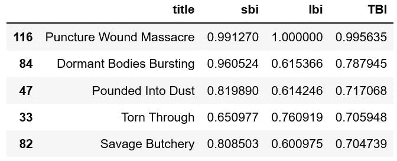**

**他们来了。注意“穿刺伤大屠杀”有多突出！**

**就是这样:《穿刺伤屠杀》是迄今为止最残忍的食人尸歌。所以，现在，如果你敢，请点击[这里](https://www.youtube.com/watch?v=ylewcNn2ej0)来听一听。**

***(如果你想看到更多的分析，比如大麻尸体在音乐上是否与食人尸体一样残忍，或者基督·巴恩斯或乔治·费舍尔是否是更残忍的歌手，而且——真的很有趣——食人尸体似乎在将 TBI 调小一些时处于最佳状态，那么看看 GitHub* *上笔记本* [*中的附录部分。)*](https://github.com/rbuerki/most-brutal-cannibal-corpse)**

## ***资源/大大感谢:***

*   ***埃文·奥本海默用他的* [*博文《寻找最愤怒的死亡之握》激励了我*](/angriest-death-grips-data-anger-502168c1c2f0)**
*   ****查理·汤普逊用这首* [*关于寻找悲伤的电台司令歌曲的博文*](https://www.rcharlie.com/post/fitter-happier/) *(也在 R)****
*   ***赛义夫·穆罕默德为出版*[*NRC 价、唤醒和优势词汇*](http://saifmohammad.com/WebPages/nrc-vad.html)**
*   ***大家投稿* [*spotipy 库*](https://spotipy.readthedocs.io/en/latest/)**
*   ***克里斯·海兰对于这个真的很有帮助* [*博文上刮的歌词*](https://chrishyland.github.io/scraping-from-genius/)**
*   ***Spotify 提供了一个非常有据可查和完整的* [*Web API*](https://developer.spotify.com/documentation/web-api/reference/)**
*   ***天才提供一个好听的*[*Web API*](https://docs.genius.com/#/getting-started-h1)*太***
*   ***所有上传歌词给 Genius.com 的书呆子们(请少打错别字；-))***

# ***奖金***

**如果你喜欢(或想喜欢)死亡金属——这些是 2019 年我的唱盘上旋转次数最高的唱片
(它们都是:K-I-L-L-E-R):**

****1)** **石化——掏空空洞 LP****

****2)女巫的呕吐物——深埋在无底的坟墓里 LP****

****3)爬山虎—索诺兰恶化 LP****

****4)弱侧—向前进入黑暗 LP****

****5)骨骼残骸——注定悲惨 LP****