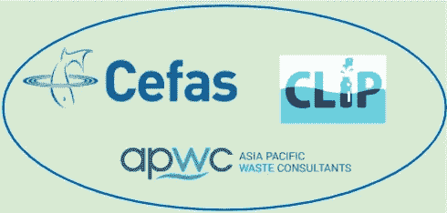
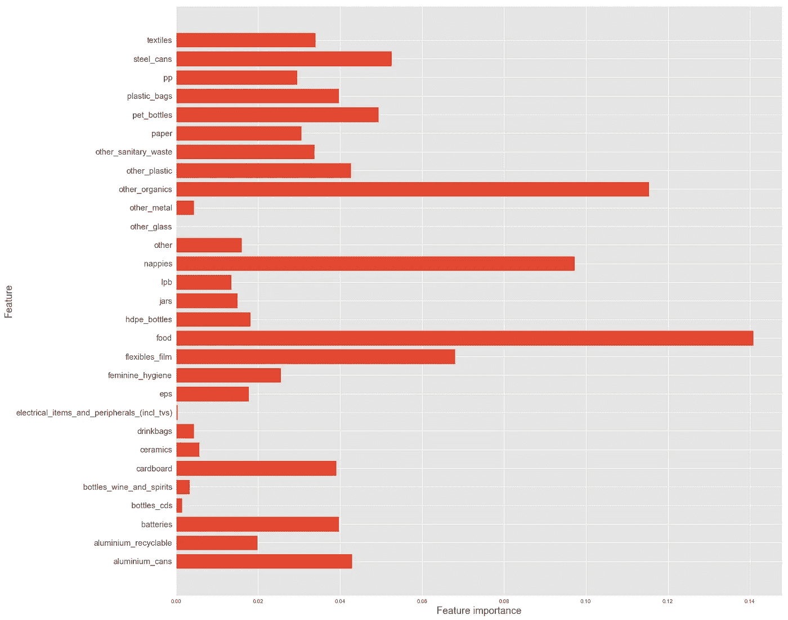
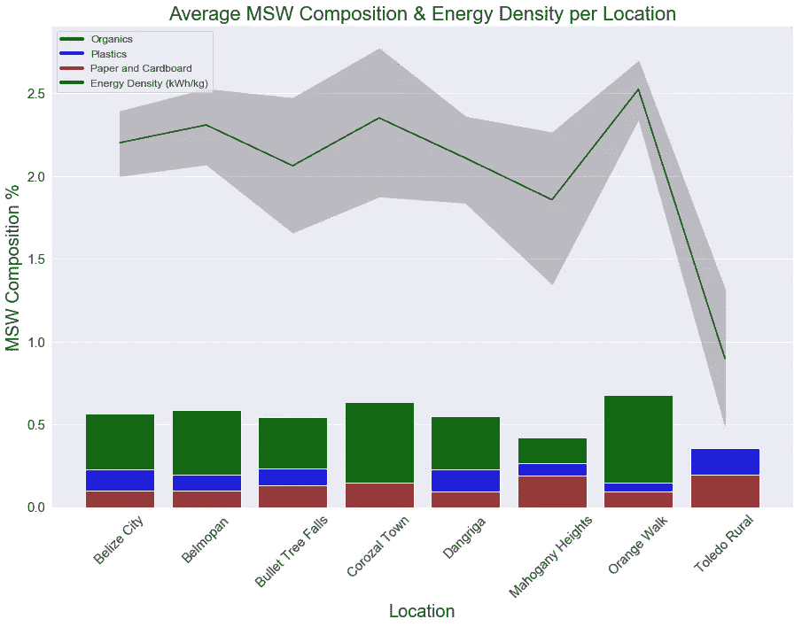
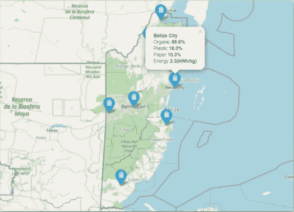
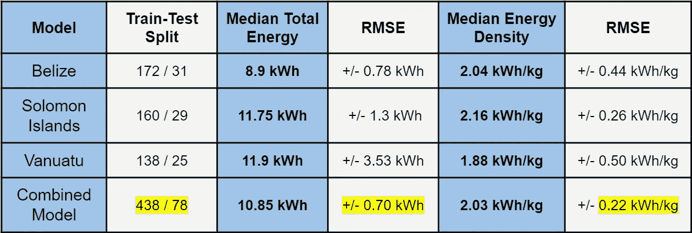

# 从垃圾箱到灯泡:将家庭垃圾转化为本地清洁能源

> 原文：<https://towardsdatascience.com/using-data-to-help-turn-household-waste-into-local-clean-energy-cb06aaddad8e?source=collection_archive---------28----------------------->

## 在这里查看我的项目:[https://github . com/tcastanley/MSW-to-Energy-feed-Analysis](https://github.com/tcastanley/MSW-to-Energy-Feedstock-Analysis)！

由[格伦·凯莉](https://unsplash.com/@glencarrie?utm_source=medium&utm_medium=referral)在 [Unsplash](https://unsplash.com?utm_source=medium&utm_medium=referral) 拍摄的照片

对于我在 ***熨斗学校的沉浸式数据科学项目*** *，*中的最后一个顶点项目，我决定测试我的新技能，并继续推进我对**数据、浪费和能源之间关系的个人调查**。最近，我一直在学习更多关于城市固体废物转化为能源的各种方法。迄今为止，我遇到的最有前途和最有效的技术是**等离子弧气化**。在我的研究中，我发现了解用作原料的城市固体废物的具体组成细节是设计等离子气化设备的许多关键步骤之一。我开始为我的顶点项目做的是，看看我是否能找到一些 MSW 收集数据集并进行**原料分析**，目的是计算每个样品的特定 ***废物类型成分*** *、* ***能量密度(kWh/kg*** *)* 和 ***总能量(kWh)*** 。

# 等离子气化

在我们进入计算近似城市固体垃圾能量值所需的数据分析之前，让我们多谈一点关于范式转换技术，等离子气化。

> *“在缺氧环境中将含碳物质转化为气体产品，以生产能源产品和副产品。”*城市固体废物到能源的转化过程”，Gary C. Young，2010 年

上面的技术定义是不言而喻的，尽管可以通过将这一过程视为能够获取地球上几乎任何材料(除了金属和玻璃)并将其转化为基本分子成分来进一步简化。这种产品叫做 ***【合成气】*** ，主要由**一氧化碳**和**氢气【H2】**组成。合成气可以进一步加工成许多不同的有价值的化学产品，尽管这取决于设备的用途和设计。我有兴趣了解如何从城市垃圾发电。

气化设施的提案需要收入预测，就像大多数商业企业一样。这些预测取决于对用作气化过程原料的燃料中的能量的理解。这就是通过原料分析确定能量密度发挥作用的地方。**我想建立一个模型，它可以接收特定的废物样本，根据一系列物品的重量进行测量，并预测其能量密度。**

这一过程的另一个副产品是玻璃化炉渣或生物炭，它们是气化过程的结果。根据城市固体废物原料的具体成分，这种产品的收入存在不同的市场。

总而言之，使用这项技术作为解决全球日益增长的城市垃圾问题的一部分是显而易见的。洗涤技术安装在整个气化过程中，以确保空气排放符合当地健康和安全法规。当人们将此与室外厌氧消化的替代长期解决方案进行比较时，会向大气中释放无数吨有害甲烷，等离子体气化就变成了一个商业问题，以及如何使这一解决方案可持续并为所有利益相关者带来利润。

# 数据清理和建模

*作者图片*

本项目的原料分析测量从伯利兹、所罗门群岛和瓦努阿图收集的**城市固体废物**样本数据中的**能量密度(kWh/kg)** 和**家庭固体废物总能量(kWh)** 。

这些数据是由亚太水资源顾问公司 (APWC)委托 [**英联邦垃圾项目**](https://www.cefas.co.uk/clip/) (CLiP)在 [**环境渔业和水产养殖科学中心**](https://www.cefas.co.uk/) (CEFAS)的支持下收集的。收集这些数据的最初目的是支持地方政府制定更好的海洋废物管理战略。

每个国家的每个数据集都有超过 95，000 行需要清理和重新格式化。数据集中有许多重复的项目，因为每个 MSW 样品都是用 3 种不同的方法测量的:重量、计数和体积。为了计算能量密度，我只需要查看重量值(kg ),对此进行过滤可以大大减少每个数据集中的行数。在删除了所有多余的和不必要的值，并重塑数据集后，我准备建模。用于两个顶级模型的数据集的最终形状是(438，29)，代表 438 个不同的家庭生活垃圾样本，每个样本具有 29 个项目特征的特定组合。这些来自 3 个不同国家的数据，被用来训练和测试我的项目中表现最好的模型。

作为过程的一部分，我经历了许多不同的模型类型。我使用 **Statsmodels** 和 **Sci-kit Learn** 从一些基本的**线性回归**模型开始，这两种模型都不理想，因为它们大量地过度拟合了数据。从那以后，我继续研究**决策树、随机森林和 XGBoost** 模型，它们都比基本的线性回归模型表现得更好。最后，我用我最喜欢的架构结束了我的建模工作，这是一个**多层感知器(MLP)** ，或者最近被称为**神经网络**。

图一。XGBoost 模型特征重要性— *作者提供的家庭生活垃圾总能量(kWh)图像*

我想强调的一个值得注意的建模特性是**特性重要性**方法，它是 **XGBoost** 模型的标准。我直观地绘制了这些信息(*图 1* )，这些信息代表了模型中每个特定特征的重要性或相对影响。

正如上面清楚显示的那样，我们看到前 3 个重要特性的顺序是:

1.  **食物**
2.  **其他有机物**
3.  **尿布**

那么这意味着什么呢？既然这个模型已经过训练和测试，可以预测代表以 kWh 为单位的*总能量的因变量，我们应该可以看到那些对每个家庭的总能量值影响最大的项目。碰巧的是，这三种物质本质上都是有机物，这意味着它们都含有相对较高的碳含量。因此，我们可以得出结论，这个模型在捕捉和评估碳含量较高的项目方面比碳含量较低的项目做得好。*

图二。伯利兹模型——左图:每个地点的平均垃圾成分和能量密度(千瓦时/千克),右图:收集地点，每个地点都有垃圾详情。*作者图片*

现在应该指出的是，这就是像这样的数据科学分析中偏见蔓延的危险所在。标记这些数据所需的计算的本质是使用预定的科学公式(参见 [*净热值维基*](https://en.wikipedia.org/wiki/Heat_of_combustion) )来完成的，根据定义，这些公式将高含碳材料的相对重要性插入到数据中。这是一个很好的迹象，模型反映了这一点，因为这是一个科学事实，碳浓度越高的材料越富含能源。然而，记住这样的偏差总是存在于数据中仍然是至关重要的，记住不断地欣赏和反思这一事实对于理解每个生成的模型的尽可能多的细微差别是至关重要的。

# 结果

下面是我对每个国家的顶级模型的快照比较，以及综合了所有 3 个国家数据的最终模型。**训练-测试分割**是模型被训练和测试的数据实例的数量。对于每个因变量，我显示每个数据集的中值，与每个模型各自的**均方根误差(RMSE)进行比较。**在描述这类回归问题的模型预测准确性时，RMSE 是一个被广泛接受的主要指标。基本上，这意味着我的模型预期它的预测会偏离真实值的平均值{\\ F3 。}

图三。顶级模型比较—最佳模型是组合模型，通过增加数据来吹捧最准确的指标！*作者图片*

如上所述，最终的**组合型号**是所有型号中性能最好的型号，远远超过其他 3 种型号。

家庭生活垃圾总能量(kWh) r 平方: **0.9943**

能量密度(千瓦时/千克)r 平方: **0.9575**

这一结果并不令人惊讶，因为有更多数据进行训练的模型能够看到更多独特的特征组合，因此在进行未来预测时可以更好地解释它们。不管怎样，看到现实沿着预期的轨迹发展，我还是很放心的，我对我的最终模型非常满意。

# 那又怎样？结论和未来工作

你可能会问自己，那又怎样？这到底意味着什么？哪里来的精力！？嗯，从这个项目的结果中可以得出一些不同的见解。

**城市固体废物成分:**了解每个家庭以及特定地区的平均城市固体废物成分，可以帮助参与城市固体废物管理的所有利益相关者做出决策。从垃圾收集机构到家庭用户，更好地了解垃圾成分可以提供行为洞察以及潜在的社会经济洞察。然而，这些见解需要更多的定性数据分析，因为这超出了我的项目范围。

**模式 1 -家庭生活垃圾总能量(kWh):** 我认为，改变人们处理垃圾的方式的关键一步是改变思维方式。我希望这个模型能够成为用户应用的基础，通过它，有适当激励的房主可以输入关于他们自己的城市生活垃圾的数据，并获得潜在的能源输出(也许有一天还会有能源信用)。像这样的想法有发展的途径，我相信在城市固体垃圾和电力公司之间存在一个三角洲，在那里用户可以开始把他们的*【废物】*视为一种能源。我相信，为对垃圾更负责任的用户开发和整合更好的激励计划，将有助于提醒人们我们星球的循环性质，记住他们的垃圾可以在以后被更好或更坏地利用，而不是简单地被扔掉和遗忘。

**模型 2 -能量密度(kWh/kg):** 该模型可以为所有城市固体废物管理利益相关者提供许多与模型 1 相同的见解。然而，最大的区别在于能量密度作为一种度量标准的更普遍的性质。该模型使用每种废物的相对重量来确定一个样品的含量，而不是试图预测总共存在多少能量。这是一个更有价值的衡量标准，尤其是对那些投资于城市固体废物转化为能源的企业而言。我希望将这个模型发展到这样一个程度，即可以建立一个精细管理的城市生活垃圾项目列表作为模型的特征。在此基础上，可以轻松完成潜在设施的原料分析，并可靠地得出每个地区的准确能源密度分数。

我从这个项目中获得了很多乐趣，我也越来越习惯写这些博客了！对于那些走到这一步的人，非常感谢！我计划很快开始一个新的博客系列，以帮助我的数据科学修订和未来的学习，请继续关注！如果任何人有任何问题，评论，或者只是想聊天，请随时给我发电子邮件@ tcastanley@gmail.com！干杯！