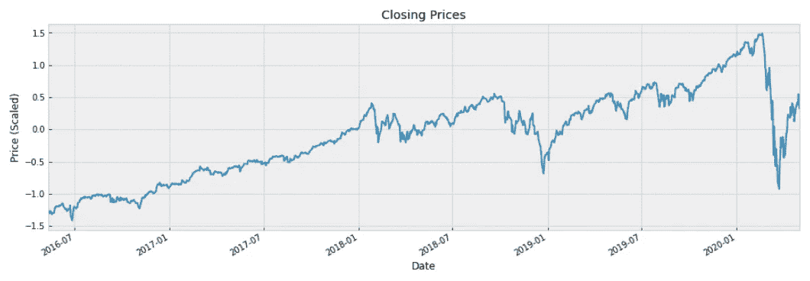
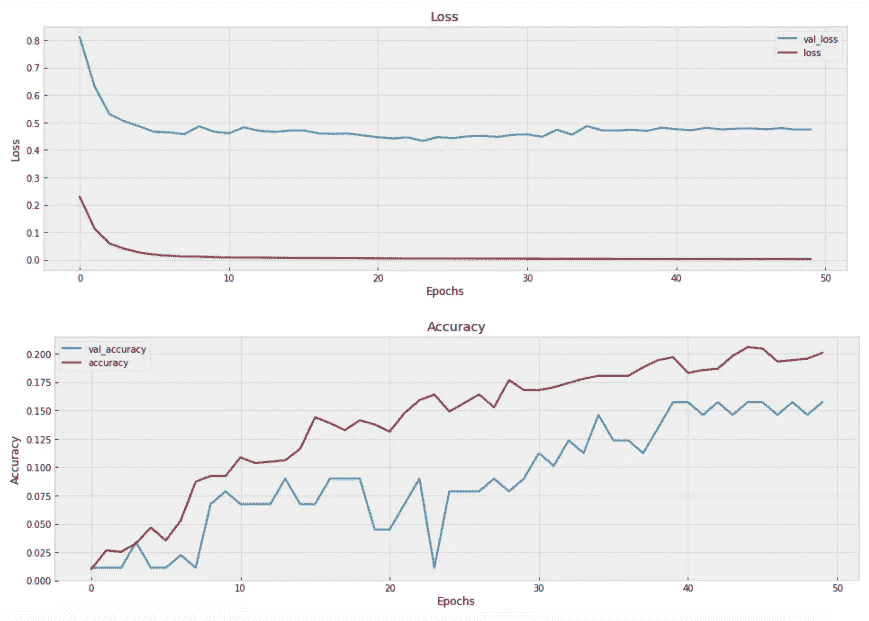
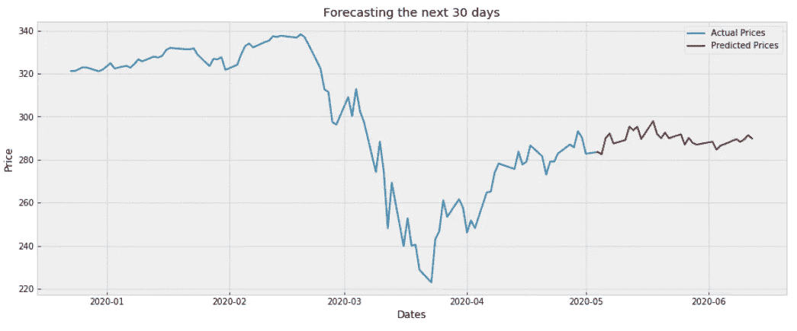

# 我尝试用深度学习来预测股市

> 原文：<https://towardsdatascience.com/using-deep-learning-ai-to-predict-the-stock-market-9399cf15a312?source=collection_archive---------0----------------------->

## 用神经网络预测股票价格


Vladimir Solomyani 在 [Unsplash](https://unsplash.com?utm_source=medium&utm_medium=referral) 上的照片

我想象一下，如果你能够知道一只股票下周是涨是跌，然后用你剩余的现金，你会把所有的钱投资或做空这只股票。玩了股票市场之后，知道了股票会升值还是贬值，你可能会成为百万富翁！

可惜这是不可能的，因为没有人能知道未来。然而，我们*可以*根据我们现在和过去对任何股票的信息做出估计和明智的预测。根据股票价格过去的走势和模式做出的估计称为 [**技术分析**](https://www.investopedia.com/terms/t/technicalanalysis.asp) 。我们可以使用技术分析( *TA* )来预测一只股票的价格方向，然而，这并不是 100%准确的。事实上，一些交易者批评 TA，并说它在预测未来方面和占星术一样有效。但是也有其他交易者相信它，并且建立了长期成功的交易生涯。

在我们的例子中，我们将使用的神经网络将利用 TA 来帮助它做出明智的预测。我们将实现的特定神经网络被称为 [**递归神经网络——LSTM**](https://pathmind.com/wiki/lstm)。之前我们利用 RNN 来预测比特币价格(*见下面的文章*):

[](/predicting-bitcoin-prices-with-deep-learning-438bc3cf9a6f) [## 我尝试了深度学习模型来预测比特币价格

### 使用神经网络预测比特币价格

towardsdatascience.com](/predicting-bitcoin-prices-with-deep-learning-438bc3cf9a6f) 

在文章中，我们探索了 LSTM 预测比特币价格的用法。我们稍微研究了一下 LSTM 模型的背景，并给出了如何编程来预测 BTC 价格的说明。然而，我们将输入数据限制在比特币自身的价格历史上，不包括其他变量，如成交量或移动平均线等技术指标。

## 多变量输入

由于我们构建的最后一个 RNN 只能接受一个序列(过去的收盘价)来预测未来，我们想看看是否有可能向神经网络添加更多的数据。也许这些其他数据可以提高我们的价格预测？也许通过在我们的数据集中添加 TA 指标，神经网络可能能够做出更准确的预测？—这正是我们想要在这里完成的。

在接下来的几个部分中，我们将构建一个新的*递归神经网络*，它能够以*技术指标*的形式接收多条信息，从而预测股票市场的未来价格。

> [在这里注册一个中级会员，可以无限制地访问和支持像我这样的内容！在你的支持下，我赚了一小部分会费。谢谢！](https://marco-santos.medium.com/membership)

# 价格历史和技术指标

为了使用神经网络来预测股票市场，我们将利用来自***&【p500】***的价格。这将使我们对股票市场有一个总体的了解，通过使用 RNN，我们也许能够判断出市场的走向。

## 下载价格历史记录

要为我们的神经网络检索正确的数据，你需要去雅虎财经 [*下载间谍*](https://finance.yahoo.com/quote/SPY/history?p=SPY) 的价格。我们将为 SPY 下载五年的价格历史，作为一个方便的`.csv`文件。

另一种选择是使用财务数据 API，如 [**EOD 历史数据**](https://eodhistoricaldata.com/r/?ref=31CX3ILN) 。注册是免费的，你可以访问大量的数据集。*披露:我通过上面的链接从任何购买中赚取一小笔佣金。*

## 技术指标

在我们下载了 SPY 的价格历史之后，我们可以应用技术分析 Python 库来生成技术指标值。此处更深入地介绍了我们能够从中检索指标值的流程:

[](/technical-indicators-on-bitcoin-using-python-c392b4a33810) [## 我是如何为比特币的技术指标编码的

### 使用 Python 创建比特币的技术指标

towardsdatascience.com](/technical-indicators-on-bitcoin-using-python-c392b4a33810) 

上面的文章详细介绍了我们为了检索 SPY 的指标值而使用的确切的 TA Python 库。

# 编码神经网络

## 导入库

让我们通过首先导入一些库来开始编码我们的神经网络:

首先，我们导入了一些常用的 Python 库( *numpy、pandas 等*)。接下来，我们导入了之前用来创建 BTC 技术指标的技术分析库(上文中的提到了*)。然后，我们从[**tensor flow Keras**](https://www.tensorflow.org/guide/keras)导入神经网络库。导入必要的库后，我们将加载从雅虎财经下载的文件。*

# 预处理数据

## 日期时间转换

加载数据后，我们需要执行一些预处理，以便为神经网络准备数据，我们需要做的第一件事是将数据帧的索引转换为日期时间格式。然后，我们将数据中的`Date`列设置为 DF 的索引。

## 创建技术指标

接下来，我们将使用`ta`库创建一些技术指标。为了涵盖尽可能多的技术分析，我们将使用*库中所有可用的指标。然后，从数据集中删除除了*指标*和*收盘* *价格*之外的所有数据。*

## 最近的数据

一旦我们创建了技术指标值，我们就可以从原始数据集中删除一些行。我们将只包括最后 1000 行数据，以便更准确地反映当前的市场环境。

## 缩放数据

当缩放我们的数据时，有多种方法可以确保我们的数据仍然被准确地表示。试验不同的缩放器以查看它们对模型性能的影响可能是有用的。

在我们的例子中，我们将利用`RobustScaler`来扩展我们的数据。这样做是为了使极端的异常值几乎没有影响，并有望改善训练时间和整体模型性能。



使用强大的缩放器缩放收盘价

# 助手功能

在我们开始构建神经网络之前，让我们创建一些辅助函数来更好地优化这个过程。我们将详细解释每个功能。

1.  `split_sequence` —此函数分割多元时间序列。在我们的例子中，输入值将是股票的*收盘价*和*指标*。这将把这些值拆分成我们的 ***X*** 和 ***y*** 变量。 ***X*** 值将包含过去的收盘价和技术指标。 ***y*** 值将包含我们的目标值(仅*未来收盘价*)。
2.  `visualize_training_results` —这个函数将帮助我们评估刚刚创建的神经网络。我们在评估我们的 NN 时要寻找的东西是 ***收敛*** 。随着训练的进行，**损失**和**准确度**的验证值和常规值必须开始与*对齐*。如果它们不收敛，那么这可能是过度拟合/欠拟合的迹象。我们必须回过头来修改神经网络的结构，这意味着改变层/节点的数量，改变优化函数等。
3.  `layer_maker` —这个函数构造了我们的神经网络的主体。在这里，我们可以自定义层数和节点数。它还有一个正则化选项，可以在必要时添加漏失层，以防止过拟合/欠拟合。
4.  `validater` —该函数使用特定日期范围的预测值创建 DF。这个范围随着每个循环向前滚动。范围的间隔是可定制的。我们使用这个 DF 来评估模型的预测，稍后将它们与实际值进行比较。
5.  `val_rmse` —该函数将返回模型预测值与实际值相比的均方根误差( *RMSE* )。返回值代表我们的模型预测的平均偏差。总体目标是降低我们模型预测的 RMSE。

# 拆分数据

为了适当地格式化我们的数据，我们需要将数据分成两个序列。这些序列的长度可以修改，但我们将使用过去 90 天的值来预测未来 30 天的价格。然后，`split_sequence`函数会将我们的数据格式化成适当的 ***X*** 和 ***y*** 变量，其中 ***X*** 包含过去 90 天的收盘价*和*指标，而 ***y*** 包含未来 30 天的收盘价。

```
# How many periods looking back to learn
n_per_in  = 90# How many periods to predict
n_per_out = 30# Features 
n_features = df.shape[1]# Splitting the data into appropriate sequences
X, y = split_sequence(df.to_numpy(), n_per_in, n_per_out)
```

我们的神经网络将对这些信息做的是*了解*过去 90 天的收盘价和技术指标值*如何影响*未来 30 天的收盘价。

# 神经网络建模

现在我们可以开始构建我们的神经网络了！下面的代码是我们如何用自定义层和节点构建神经网络的。

这是我们开始试验以下参数的地方:

*   层数
*   节点数量
*   不同的激活功能
*   不同的优化器
*   时期数和批量大小

我们为这些参数中的每一个输入的值都必须被探究，因为每一个值都会对整个模型的质量产生显著的影响。可能有一些方法可以找到每个参数的最佳值。对于我们的例子，我们主观地测试了每个参数的不同值，我们发现的最佳值可以在上面的代码片段中看到。

如果你希望了解更多关于这些变量背后的推理和概念，那么建议你阅读我们之前的 [*关于深度学习和比特币*](/predicting-bitcoin-prices-with-deep-learning-438bc3cf9a6f) 的文章。

## 可视化损失和准确性

训练后，我们将使用自定义助手函数来可视化神经网络的进展:

```
visualize_training_results(res)
```



随着我们的网络训练，我们可以看到损失减少和准确性增加。一般来说，随着历元数量的增加，我们会寻找两条线 ***汇聚或*** 对齐。如果他们没有，那么这是一个迹象，表明该模型是不充分的，我们将需要回去，改变一些参数。

## 模型验证

我们评估模型预测质量的另一种方法是对照实际值进行测试，并使用我们的自定义帮助函数`val_rmse`计算 RMSE。


在这里，我们将预测值与实际值绘制在一起，看看比较的效果如何。如果预测值的曲线非常偏离实际值，那么我们知道我们的模型是有缺陷的。但是，如果这些值看起来非常接近，并且 RMSE 非常低，那么我们可以得出结论，我们的模型是可以接受的。

我们的模型似乎在开始做得很好，但它不能捕捉或模拟价格的剧烈波动。这可能是为什么最后三个预测看起来非常遥远。也许通过更多的训练和实验，我们的模型可以预测这些运动。

# 预测未来

一旦我们对模型的表现感到满意，我们就可以用它来预测未来的值。这一部分相对于我们已经做的事情来说相当简单。

这里我们只是从下载的`.csv`文件中预测出最近的值。运行代码后，我们将看到以下预测:



下个月间谍价格预测

我们做到了！—间谍的预测价格。用这些知识做你想做的事情，但是记住一件事:*股票市场是不可预测的*。这里预测的值是*而不是*确定的。它们可能比随机猜测要好，因为这些值是基于过去的技术指标和价格模式的有根据的猜测。

# 关闭

我们能够成功地构建一个 LSTM 层的递归神经网络，它能够接受多个输入而不是一个。模型的质量可能因人而异，取决于他们希望在模型上花费多少时间。即使预测未来是不可能的，但这些预测对于那些希望了解股票未来价格走势的人来说非常有用。但是，它很可能认为这种方式比随机猜测要好。

*在 eodhistoricaldata.com 另外出版*

***来自《走向数据科学》编辑的注释:*** *虽然我们允许独立作者根据我们的* [*规则和指南*](/questions-96667b06af5) *发表文章，但我们并不认可每个作者的贡献。你不应该在没有寻求专业建议的情况下依赖一个作者的作品。详见我们的* [*读者术语*](/readers-terms-b5d780a700a4) *。*

## 资源

[](https://github.com/marcosan93/Price-Forecaster) [## Marcos an 93/价格预测者

### 使用时间序列模型:萨里玛和 FB 先知预测比特币价格:使用递归神经网络:LSTM…

github.com](https://github.com/marcosan93/Price-Forecaster) [](/predicting-bitcoin-prices-with-deep-learning-438bc3cf9a6f) [## 我尝试了深度学习模型来预测比特币价格

### 使用神经网络预测比特币价格

towardsdatascience.com](/predicting-bitcoin-prices-with-deep-learning-438bc3cf9a6f) [](/technical-indicators-on-bitcoin-using-python-c392b4a33810) [## 我是如何为比特币的技术指标编码的

### 使用 Python 创建比特币的技术指标

towardsdatascience.com](/technical-indicators-on-bitcoin-using-python-c392b4a33810) [](https://machinelearningmastery.com/how-to-develop-lstm-models-for-time-series-forecasting/) [## 如何开发用于时间序列预测的 LSTM 模型-机器学习掌握

### 长短期记忆网络，简称 LSTMs，可用于时间序列预测。有很多种…

machinelearningmastery.com](https://machinelearningmastery.com/how-to-develop-lstm-models-for-time-series-forecasting/)