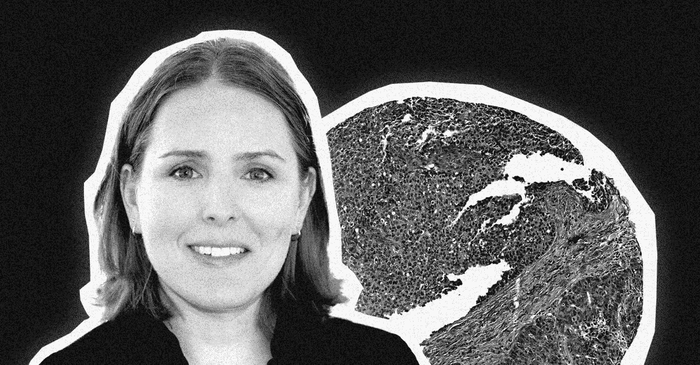
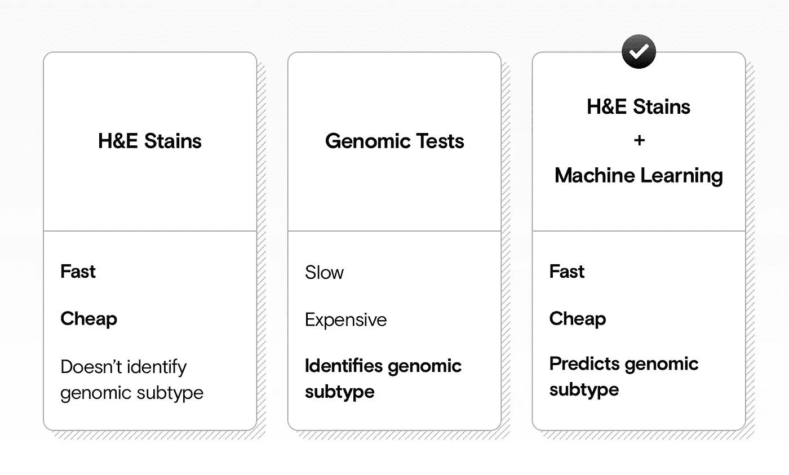

# 使用组织学载玻片上的深度学习来筛选癌症生物标志物

> 原文：<https://towardsdatascience.com/using-deep-learning-on-histology-slides-to-screen-for-cancer-biomarkers-4c595e93c3dc?source=collection_archive---------53----------------------->

## 深度学习能从基本的 H&E 染色中提取新的见解吗？

来源:作者

我们采访了来自 [Pixel Scientia Labs](http://pixelscientia.com) 的 [Heather Couture](https://www.linkedin.com/in/hdcouture/) ，她分享了她最近关于在 H & E 载玻片上使用深度学习来筛选癌症生物标志物的研究见解。

# 基因组分析和 H&E 染色简介

传统上，科学家分析疾病，如癌症，集中于单个基因(基因测试)。但今天，他们越来越多地使用基因组分析来研究构成癌症的所有不同基因，并提供该疾病的全面概况。

虽然这种基因组分析可以提供准确、具体的见解，通过识别正确的癌症亚型来帮助治疗疾病，但它也是缓慢而昂贵的。

相比之下，分析 [H & E 污渍](https://en.wikipedia.org/wiki/H%26E_stain)要简单得多，也便宜得多。这包括在标准显微镜下观察染色的组织或细胞样本。H & E 将细胞核变成蓝色，细胞质变成粉红色，这样病理学家可以更容易地解读载玻片。但是它提供了不同于基因组分析的信息。

Heather 利用深度学习，开发了基于 H&E 图像预测癌细胞的一些基因组属性的过程。这意味着病理学家可以更快、更经济地识别癌症生物标志物。

机器学习与快速、廉价的 H&E 染色相结合，可以实现更昂贵的个性化医学基因组测试的一些好处。图片来源:作者

希瑟为我们描述了这一过程:

> *“对于乳腺癌分析，我们预测肿瘤的分子特性。这可以用于个性化治疗。如果你知道肿瘤的确切亚型，这可能意味着一种特定的药物比另一种更可能有效。*
> 
> *通常，这些评估是通过基因组数据完成的。我们在北卡罗来纳大学的团队发现，我们可以从 H & E 组织切片——在显微镜下染色和成像的切片——预测其中一些特性。这不是一个完美的结果，但在投入时间和金钱进行完整的基因组测试之前，它可以作为一个筛选过程。”*

[ [注册我们的时事通讯](https://datarevenue.com/signup)，了解研究人员如何将机器学习应用于他们的分析管道。]

# 机器学习可以做出医生做不到的预测

这不仅仅是因为机器通常效率更高，能够处理更大的数据集。基于容易获得的 H&E 载玻片预测分子性质根本不是人类可以做到的。正如希瑟所说:

> 病理学家可以使用一种不同类型的染色，并能够获得蛋白质生物标记。有很多方法可以做到这一点，这是实验室的标准，但不是来自 H & E，这是最常见的染色诊断方法。”

这并不意味着算法会取代人类。希瑟预言了一个人类和机器携手工作的世界。但正如她指出的那样，只有时间才能告诉我们这种伙伴关系将如何运作:

> *“这大概不应该是艾对病理学家吧。应该是 AI 和病理学家联合。他们是如何合作的？是不是 AI 先看图像，找到病理学家应该看的区域？AI 会检查病理学家的回答来寻找错误吗？或者他们做不同的任务:人工智能可以做一些平凡的事情——比如计数细胞，寻找细胞分裂，或者类似的一些小事——然后病理学家接管。”*

这是一个快速发展的研究领域，所以希望我们能很快找到这些问题的答案。希瑟报道了最近的兴趣激增:

> *“一篇又一篇论文展示了使用机器学习进行生物标记分析的各种方法。仅在上周，《自然》杂志就有两篇论文对几种癌症的概念进行了测试。本周还有另一个也在使用机器学习来预测分子特性。因此，这一特殊领域似乎终于突然起飞了。”*

# 深度学习如何推进 H&E 幻灯片的自动化分析

使用机器学习来自动化分析的想法并不新鲜，但深度学习的最新进展给该领域带来了新的生命。具体来说，深度学习最近彻底改变了**图像分析**领域，允许机器识别图像中的模式——包括 H & E 污渍。

Heather 描述了深度学习如何使团队从手工制作机器学习功能(一个缓慢、不准确的过程)过渡到将完整图像输入深度学习算法，然后自动识别有意义的片段:

> *“我们之前在皮肤癌上使用了手工制作的特征。我们将分割单个的细胞和细胞核，描述它们的形状、结构、排列等等。我们用它来试图预测不同的样本是否有突变——但我们做不到。我们根本没有得到有统计学意义的结果。*
> 
> *深度学习已经出现，但工具包还没有出现。没有张量流；没有 PyTorch。根据我的经验，从手工制作的功能到深度学习是造成差异的原因。我猜其他队也是如此。”*

# 让人工智能模型进入临床:三大挑战

尽管这些进步令人兴奋，但仍有许多挑战需要克服。Heather 提醒我们，她的 H&E 研究可能还需要数年时间才能被临床采用:

> “使用深度学习来预测分子生物标志物在很大程度上仍处于研究领域。离临床使用还差得远。这需要做更多的工作。”

任何进步都可能是一步一步来的。希瑟认为第一个真正的用例可能是一个简单的筛选工具，以建议人类病理学家下一步该做什么:

> *“结果可能是，‘这很可能是 x 亚型，没有 y 突变。’由此，病理学家可以决定进行更详细的筛查，或者支付基因组测试的费用。”*

Heather 概述了在 H&E 幻灯片上的深度学习被广泛应用于临床之前仍然需要克服的一些主要障碍。

# 挑战 1:使用不同的实验室设备获得稳定的结果

鲁棒性——以可预测的方式跨不同设置执行的能力——通常是机器学习管道的一个挑战。对于 H&E 载玻片来说尤其如此，因为用于创建数据的设备是高度敏感的，并且不总是在不同的实验室之间标准化。

任何在真实世界环境中对 H&E 幻灯片使用深度学习的解决方案都需要能够处理这些差异。目前，如果不同实验室的测量结果不一致，那么根据一套设备的数据训练的模型将无法理解不同实验室的数据。正如希瑟所解释的:

> *“算法需要是健壮的。它需要推广到不同的扫描仪、不同的显微镜和不同的染色技术。H & E 染色的一个问题是，如果由不同的实验室进行，染色的强度可能会略有不同。*
> 
> 随着时间的推移，污渍可能会褪色，如果用不同的扫描仪扫描，效果会有所不同。应对这些挑战是需要解决的事情，但这是一个不小的问题。”

# 挑战 2:在小数据集上使用深度学习算法

与 Heather 研究的气候变化数据集相比，H&E 数据集通常很小。这对机器学习来说是一个问题，机器学习通常依赖于庞大的数据集(数十万个样本)来找到可概括的模式。正如希瑟所说:

> *“我们正在处理更小的数据集。在某些情况下，数百名患者可能被视为“大型”数据集。1000 是可以的，但有时我们只能得到 1000。这与机器学习的其他应用领域截然不同。”*

样本数量往往很少，每个单独的样本也很“广”(包含大量信息)，这给构建可靠的深度学习算法的挑战增加了额外的一层复杂性。然而，希瑟对克服这一挑战持乐观态度:

> *“你可以用不同的算法。这些图像很大，所以我们在每个图像中有更多的图像块。对于训练一个* [*CNN*](https://en.wikipedia.org/wiki/Convolutional_neural_network) *，其实很棒。有些事情我们需要以不同的方式来做——比如我们不能一次将整个图像通过 GPU。我们需要将它分成更小的块，有时需要二级分类器来整合来自更小块的预测或特征。*
> 
> 但是有解决方案，这是一个活跃的研究领域。”

# 挑战 3:建立具有所需专业知识的团队

使用机器学习和 H&E 幻灯片需要几个领域的深厚和广泛的专业知识。作为一名顾问，希瑟经常发现自己在填补空白，做从咨询工作到编码机器学习模型的一切事情。她描述了她所做的各种工作:

> “一方面，我的角色可能纯粹是一名顾问。我每周会见我的客户一次，帮助他们解决他们的问题，提出建议，或者给他们指出已经存在的图书馆和研究。
> 
> 或者我可能会替他们编码:实现一个概念证明或者帮助他们调试一些东西。或者在另一端，我可能会领导他们的机器学习工作。我可能是他们团队中第一个机器学习的人，让他们起来运行，帮助他们建立一个团队。”

希瑟专门帮助公司建立概念证明——他们的目标是最终解决方案的精简版本。然后，她将这些交给机器学习工程师团队，他们可以将它们转化为生产化的解决方案。她说，一个常见的挑战是，公司从学术界雇佣的人可能没有使用过真实世界的数据集:

> *“作为课程的一部分，他们在学习时使用了学术基准数据集，但他们通常没有真正处理过真实数据的挑战。真实数据是有噪声的。不平衡。标签可能是错误的；地面真理可能是错误的。”*

寻找具有重叠经验的多学科专家是一项挑战。但正如希瑟所说，这是必要的:

> *“构建这些解决方案需要来自许多不同领域的人:不仅仅是机器学习，还有病理学、遗传学、统计学，根据你正在做的事情，可能还有许多其他领域。”*