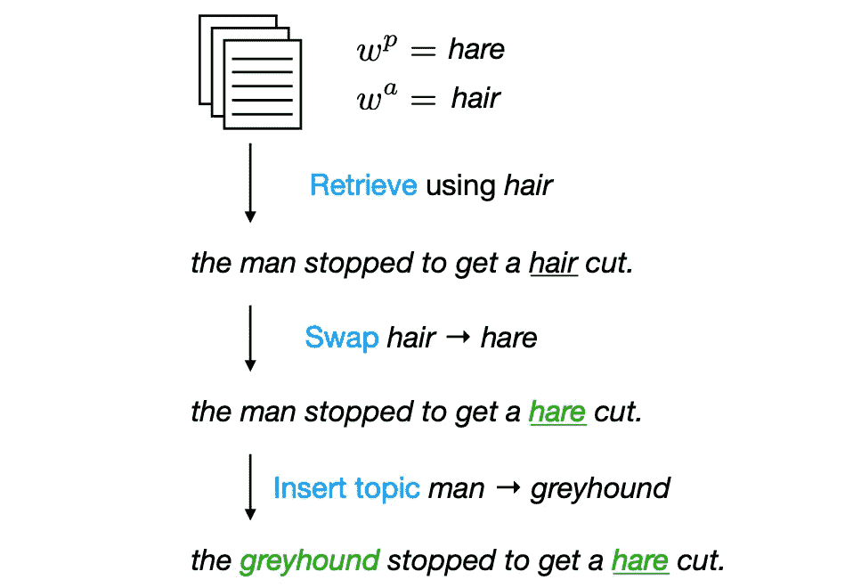

# 使用深度学习来…生成双关语？

> 原文：<https://towardsdatascience.com/using-deep-learning-to-generate-puns-f000c76026c9?source=collection_archive---------39----------------------->

## 自然语言处理中最新方法的有趣应用，展示了该领域的发展历程。

自然语言处理(NLP)作为一个领域已经有了前所未有的发展(尤其是在过去两年中，由于 BERT 的出版)。虽然许多研究都集中在具有巨大影响的任务上(例如，问答、文本摘要)，但我们应该始终记住，自然语言处理研究也有一些有趣的应用。比如生成双关语。

让我们深入研究一下何等人[最近的一篇论文。这为双关语的生成提供了一个非常强大的模型。附言:如果你只是想看看这个模型最终产生的一些双关语，我已经在帖子的结尾包括了作者给出的双关语。](https://arxiv.org/pdf/1904.06828.pdf)

照片由[皮埃特罗·詹](https://unsplash.com/@pietrozj?utm_source=medium&utm_medium=referral)在 [Unsplash](https://unsplash.com?utm_source=medium&utm_medium=referral) 上拍摄

**数据集。**首先要做的事情。像任何深度学习问题一样，生成双关语显然需要一个不小的数据集。现在，就我个人而言，我甚至不认为双关语的数据集存在。无论如何，作者发现了一个很好的双关语集合:[来自 2017 年 SemEval task](http://alt.qcri.org/semeval2017/task7/) 的双关语数据集，包含 1099 个不同的双关语。尽管这只是数据集的一小部分，但它足以训练出一个性能可接受的模型。

> 昨天我吞下了一些食用色素。医生说我没事，但是我感觉我好像里面染了一点。(“染”vs“死”)

**如何生成双关语？因此，对于这项任务，作者决定将重点放在同音字双关上(上面给出的例子)。在同音双关语中，目标是用发音相同但意义不同的替代词(“染色”)来替换双关语(在本例中为“死亡”)。为了产生这些双关语，作者提出了 3 个主要步骤:**

1.  给定一个双关语，从预先存在的句子语料库中找到包含该词的句子。对于这一步，它就像通过 [BookCorpus](https://github.com/soskek/bookcorpus) 进行基本搜索一样简单，这是一个流行的数据库，里面有成千上万本书的内容。从包含双关语的句子列表中，该模型选择双关语最接近句尾的句子(这是基于作者的假设，即如果双关语“惊喜”出现得更晚，双关语会更好)。
2.  用同音异义词替换双关语(这样就产生了双关语)。下一步也是关键的一步是用同音词替换双关语。例如，这里有一些作者在他们的论文中给出的谐音:“和平”和“块”，“面粉”和“花”，“等待”和“重量”。
3.  **从第一个单词中选择一个，用另一个能让双关语有意义的单词替换它。**这可能是最重要的一步，因为双关语需要铺垫。以上面给出的例子为例:如果双关语是“昨天我吞下了一些鸡肉”,那就不好笑了。医生说我没事，但是我感觉好像里面染了一点。”如果没有早期提到的“食用色素”，这个双关语就没有什么意义，这也是这一步要解决的问题。通过包含早期的主题词，提供了一些上下文，这将设置后期双关词的揭示。为了做到这一点，作者使用了一个跳格模型来寻找与同音词相关的单词(例如，“屠夫”和“肉”，“船”和“费用”)。

下面是作者给出的这些步骤的示例演练:

产生双关语的主要步骤。注意，在这个例子中，“hare”是原始单词“hair”的同音字替换。图片来源于论文作者何等。

所以在这个例子中，第一步是找到一个包含单词“hair”的句子。该模型识别句子“该男子停下来理发。”接下来，原来的双关语(“头发”)被同音字(“野兔”)取代，产生了更新后的句子“那个人停下来剪了一只野兔。”但是这还没有意义，所以进入第三步。通过将“man”改为“greyhound”插入主题，并给出完整的双关语:

> "灰狗停下来剪野兔."'

LOL 好双关。

**结果呢？为了了解他们的模型是多么的微不足道，作者召集了土耳其机械工人。对于 150 个不同的双关语对(一个来自人类，一个来自他们的模型)，每个双关语要求五个工人从三个方面对双关语进行评级:**

*   成功(是或否)。基本上不管给定的双关语实际上是不是一个双关语。
*   有趣(从 1 到 5 分)。不言自明:衡量一个双关语有多好笑。在这方面，如果双关语没有任何意义，员工可以表示“不适用”。
*   语法(从 1 到 5 分)。衡量一个双关语的语法程度。必须确保双关语语法正确！

事实证明，他们的模型相当不错——该模型在 10.7%的双关语的搞笑方面和 8%的双关语的语法方面超过了人类。考虑到生成双关语是一项相当困难的任务，我实际上对计算机能比人更好地生成一个双关语印象深刻，更不用说百分之十了。但无论如何，让我们看看模型错过了点。

模型所犯错误的分类。图片鸣谢论文原作者何等人。

该死，模特把双关语搞砸了！因此，基于作者的模型所犯错误的饼状图，看起来模型所犯的错误很大一部分来自于选择一个糟糕的双关语或不能选择一个相关的主题词来提供双关语的上下文。考虑到这些都是相当困难的问题(让我当场想出一个双关语，我可能会绞尽脑汁)，对我来说，模型在这些问题上遇到麻烦是有道理的。

**结论。**因此，作者做了大量工作，提出了一个相对强大的生成双关语的模型。他们专注于通过用一个给定的句子替换两个单词来产生同音词双关语，其中一个是双关语/同音词，另一个是为双关语提供上下文。他们的结果非常好，并且在展示 NLP 方法的强大方面确实令人鼓舞。

展望未来，我相信研究人员将继续为他们的高性能算法寻找新的有趣的应用！

延伸阅读:

*   【何等原创论文】
*   [这项工作的 GitHub 库](https://github. com/hhexiy/pungen.)
*   [又一篇关于双关语生成的好论文。](https://www.aclweb.org/anthology/P18-1153/)
*   什么让双关语变得有趣？

额外有趣的东西(报纸上的双关语列表)。[模型]表明作者明确提到双关语是由模型产生的。[人类]表明作者明确提到双关语是由人类产生的。否则我不确定是模型生成的双关语还是人为生成的双关语。

> 昨天我不小心吞下了一些食用色素。医生说我没事，但是我感觉我内心有点染(死)了。
> 
> 老屠夫永远不会死，他们只会面对命运。
> 
> 谈判者只是一个试图恢复正常生活的女人。
> 
> 嗯，美食家做到了，他想，这最好是正确的。[型号]
> 
> 为什么牛奶场会搅动？说得越少越好……[人类]
> 
> 那是因为谈判者和平地把我的车还给了我。[型号]
> 
> 生活是一个谜；在这里寻找遗失的和平(片)。[人类]
> 
> 黄油想知道这两位姑娘是谁，圣粉(花)的新成员。[型号]
> 
> 贝蒂·克罗克是一个面粉(花)孩子。[人类]
> 
> 即使从外面看，我也能看出他已经瘦了一些。[型号]
> 
> 耐心是一种等待的美德。[人类]