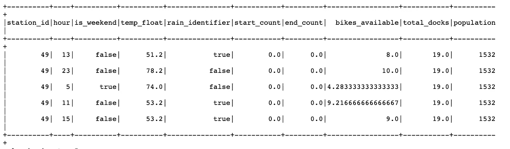

# 使用分布式机器学习对大数据进行高效建模

> 原文：<https://towardsdatascience.com/using-distributed-machine-learning-to-model-big-data-efficiently-546491aec11e?source=collection_archive---------39----------------------->

图像[来源](https://yurongfan.wordpress.com/2017/01/10/sparkml-demo-car-classification-using-sparkml-pysparkpython-api/)

随着分布式计算成为数据科学家越来越受欢迎的技能，在 AWS EMR 集群上运行 Apache Spark 逐渐成为业内处理大数据的常用方式。

PySpark API 允许我们轻松地用 Python 编写 Spark，同时让 Spark 在后台并行计算数据。在本文中，我们将使用来自 [Kaggle](https://www.kaggle.com/benhamner/sf-bay-area-bike-share) 的 4g 旧金山自行车共享数据集来实时模拟共享自行车的可用性。

这篇文章将涵盖:

1.  AWS EMR 或本地环境上的火花初始化
2.  用 Spark 和 Plotly 进行探索性数据分析
3.  使用 Spark SQL 对数据进行预处理
4.  建模:在 Spark ML 中使用随机 Fores 回归器
5.  为优化运行时间配置您的 AWS EMR 集群

# 1.AWS EMR 或本地环境上的火花初始化

要使用 spark，我们可以在 AWS EMR 集群上运行它，或者如果您只是想试用它，也可以在您本地的 Jupiter 笔记本上运行它。有很多关于如何在 AWS EMR 上设置你的笔记本以使用 PySpark 的文章，比如[这篇](/getting-started-with-pyspark-on-amazon-emr-c85154b6b921)。EMR 集群配置也将在很大程度上影响您的运行时，我将在最后一部分提到这一点。

# **2。探索性数据分析**

为了预处理数据，我将使用 Spark RDD 操作来执行探索性的数据分析和可视化。

温度对订户的影响比对非订户的影响小

其余的 Spark [预处理代码](https://github.com/estheryl/sf_bike_share_spark/blob/master/EDA_preprocessing.ipynb)和 [Plotly 可视化代码](https://github.com/estheryl/sf_bike_share_spark/blob/master/EDA_visulization.ipynb)可以在 Github repo 上找到，但这里是我们最初探索性分析的图表。

用户倾向于在工作日更频繁地使用共享自行车。

非订户每次出行使用自行车的时间要长得多，这可能是因为订户大多是通勤者，而不是游客。

用户的行程持续时间范围较小，集中在 10 分钟左右。

显然，你可以把共享单车带上火车

最常见的出行路线是通勤者在办公室和地铁站之间使用它。

# **3。使用 Spark SQL 对数据进行预处理**

正如我们在步骤 2 中看到的，使用火花 RDD 进行数据预处理可能很难理解或可视化。这里，我们将使用 Spark SQL，它允许我们从 RDD 创建数据帧。

为此，我们首先创建一个模式，并用列名、数据类型和 nullable 定义 StructField。或者，您也可以在 RDD 上使用 *toDF()* 让 Spark 推断模式。

weather_df(显示在 Jupyter 笔记本中)

然后，我们可以使用像 **select()、agg()、join()** 这样的函数来操作 Spark SQL 数据帧，就像处理熊猫数据帧一样。

经过更多的数据预处理后，我们为机器学习模型准备好了数据框架。我们希望通过以下功能预测特定时间内给定站点的可用自行车数量:

○车站信息

○天气状况

○一天的类型

○一天中的某个小时

○该地区的人口

# **4。建模:使用 Spark ML 中的随机森林回归器**

**a)特征工程**

PySpark 支持许多常用函数来做[特性工程](https://spark.apache.org/docs/latest/ml-features)，我们将使用 **StringIndexer()** 来对我们的分类变量 rain_identifier 执行标签编码。

在将特性转换成数字类型后，我们可以使用 **VectorAssembler()** 将所有特性组合成一个向量列。这对于训练 ML 模型很有用，因为您将在后面的 **RandomForestRegressor** 中看到，它只接受一个 *inputCol* 参数。

现在，DataFrame 将我们所有的特征转换成一个向量，还有我们的目标变量:可用自行车的数量。

**b)创建模型和模型评估**

创建训练和测试集时，调用**。cache()** 将数据帧缓存到内存中以加速训练过程。(这里有一个关于什么时候在 Spark 中使用缓存的更全面的阅读。)

**c)模型调整**

Spark ML 还支持使用 **CrossValidator()** 和 **ParamGridBuilder()** 进行交叉验证和超参数调优。

我也在全笔记本里玩过 Spark ML 的梯度提升回归器，决策树，线性回归，但是随机森林回归器在这些模型中表现最好。

# **5。**配置您的 AWS EMR 集群以获得最佳运行时间

选择集群节点的实例类型和节点数量可能很棘手，这取决于数据的大小和代码所需的计算能力。根据 AWS 的[文档](https://docs.aws.amazon.com/emr/latest/ManagementGuide/emr-plan-instances-guidelines.html)，

> 计算密集型集群可能受益于在高 CPU 实例上运行，这些实例的 CPU 比 RAM 多。数据库和内存缓存应用程序可能会受益于在高内存实例上运行。
> 
> 规划集群实例的一种方法是用一组有代表性的样本数据运行一个测试集群，并监视集群中节点的利用率。

为了进行简单的比较，我运行了同一个 jupyter 笔记本，其中包括这四个不同 EMR 集群的所有预处理和 ML 建模代码。

我们可以看到，增加节点数量(每个节点代表 EMR 集群下的一个 EC2 实例)并不一定意味着内存优化实例的运行时间更短。

# 摘要

希望本文对您使用 Spark 处理 Python 中的大数据和大规模运行机器学习模型有所帮助。Spark SQL 和基于数据帧的 Spark ML API 也省去了我们处理 Spark RDD 的麻烦，因为我们可以将数据存储在数据帧中。

如果你对 SF 共享自行车可用性建模的预测结果和关键发现感兴趣，这里有 [Github repo](https://github.com/estheryl/sf_bike_share_spark) 。也可以在 [LinkedIn](https://www.linkedin.com/in/esther-yihui-liu/) 上给我发消息。

这是三藩市大学 MSDS 697 与黛安·伍德布里奇教授的一个小组项目。小组成员是阿坎卡莎。、刘品言、孙清怡和林海洋。