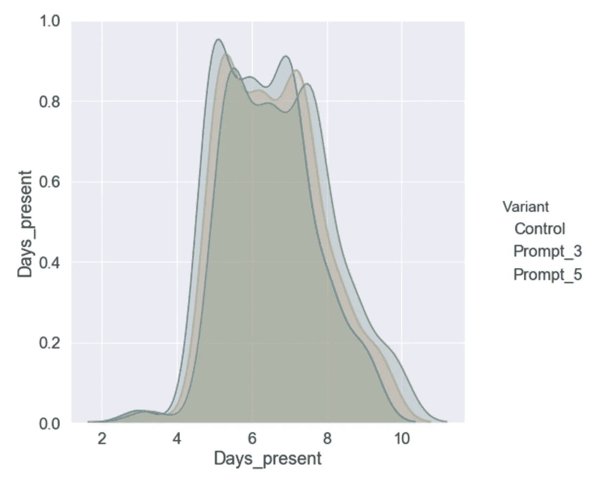
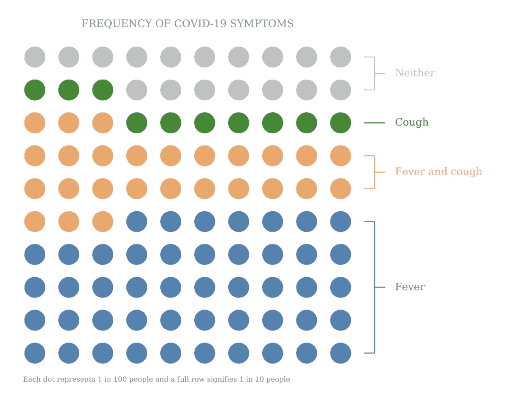

# 使用实验数据的点状图

> 原文：<https://towardsdatascience.com/using-dot-plots-with-experimentation-data-d588a820235?source=collection_archive---------58----------------------->

## 这篇文章将展示如何用点状图以一种通俗易懂的方式来解释你的实验发现


数字实验一直是科学领域的事情。尽管实验分析师可能会花大量时间充实假设，并与利益相关者一起构思，但正确地完成实验需要对显著性测试有一个核心和基本的理解。此外，实验的结果必须以一种不会使我们合作的利益相关者困惑——并随之脱离——的方式进行翻译。这时，适当设计的数据可视化是必不可少的。

当我们试图接受或拒绝一个使用多个成功指标的假设时，事情会变得混乱。在我们的实验中，对于给定的变体，我们可能有几个想要评估的参数，但是由于缩放和/或标准化问题，将这些参数呈现在同一个图上可能会有问题。此外，我们可能设计出来的东西可能只有数据人能够理解，而当我们希望在一个组织中向具有不同技术能力的人分享发现时，这远不是更好的选择。一个很好的例子是直方图，它显示了给定指标下我们的实验桶的重叠分布。对我来说，这是一种很好的方式来说明独立集团之间的差异，但我被告知，它们对股东并不友好:



使用这种可视化的另一个缺点是，它将只代表一个度量的分布，当我们可能试图用多个性能测量的结果来评估我们的假设时。当然，我们可以应用一个方面并显示多个发行版，但是这会变得很混乱，这不是我们想要传播给大众的格式。

幸运的是，我在 BBC 的 [**数据科学团队的一位同事一直在研究一些易于解释的点状图，这些点状图以直观(我认为非常简洁)的方式分解了我们实验变体的性能！(图 1)这些图是用 Python 开发的，最初用于以一种方式说明新冠肺炎的比例症状，这种方式可以让你说“100 个冠状病毒感染者中有 47 个只表现出发烧症状，而不是咳嗽”:**](https://medium.com/@DrMattCrooks/e9e9daae9124)



图一。马特·克鲁克的新冠肺炎症状分析的点状图

现在，虽然这些图是在考虑 Covid 的情况下设计的，但在对最近结束的实验进行事后分析时，它们具有很好的实用性。当一个实验暂停时，您可能希望确定在给定的桶中有多少比例的用户触发了某些事件，并在实验条件之间比较这些比例。这些点状图是向利益相关者展示这些信息一种很好的方式。我将分解下面的过程，但在此之前，你需要克隆 [**中型点阴谋 Github**](https://github.com/mattcrooksphd/Medium-Dot-Plot) 回购。如果你创建一个新的 Jupyter 笔记本，你可以使用下面的代码；确保您已经将它保存在与克隆的存储库相同的工作目录中。

首先导入必要的包进行分析:

```
%load_ext autoreload
%autoreload 2import pandas as pd
import os
```

现在创建一个字典，其中包含您要查看的事件的类，对于这个示例，我们将使用:' signed_in_page_view '，' signed_out_page_view '，' page_view '和' not _ fire '。字典将以类名作为键，并记录触发这些事件的人数。请注意，在激发的事件和事件量方面，您的实验将与此示例不同。以下数据是我们实验的变体 A(对照)的数据:

```
event_dict_control = {}event_dict_control['signed_in_page_view'] = 2000

event_dict_control['signed_out_page_view'] = 45000

event_dict_control['page_view'] = 45000

event_dict_control['didnt_fire'] = 8000
```

对变量数据执行相同的操作:

```
event_dict_variant = {}event_dict_variant['signed_in_page_view'] = 8000

event_dict_variant['signed_out_page_view'] = 35000

event_dict_variant['page_view'] = 75000

event_dict_variant['didnt_fire'] = 10000
```

查看两个词典:

```
event_dict_control>>> {'signed_in_page_view': 2000,
 'signed_out_page_view': 45000,
 'page_view': 45000,
 'didnt_fire': 8000}event_dict_variant>>> {'signed_in_page_view': 8000,
 'signed_out_page_view': 35000,
 'page_view': 75000,
 'didnt_fire': 5000}
```

对课程进行排序:

```
class_labels = [‘signed_in_page_view’, ‘signed_out_page_view’, 
 ‘page_view’, ‘didnt_fire’]
```

从 Github 文件夹中的相对路径位置导入点图包:

```
cwd = os.getcwd()
os.chdir('../src')
from dot_plot_code import create_dot_plot
os.chdir(cwd)
```

我们现在将渲染我们的标记点图，用于两个对照:

```
color_dict = {
 ‘signed_in_page_view’: ‘purple’,
 ‘signed_out_page_view’: ‘lightblue’,
 ‘didnt_fire’: ‘pink’,
 ‘page_view’: ‘grey’}dotplot_figure = create_dot_plot(
 class_labels=class_labels,
 data_dict=event_dict_control,
 color_dict=color_dict,
 reversed_rows=[0],
 ignore_labels=False)
```


和变体:

```
color_dict = {
 ‘signed_in_page_view’: ‘purple’,
 ‘signed_out_page_view’: ‘lightblue’,
 ‘didnt_fire’: ‘pink’,
 ‘page_view’: ‘grey’}dotplot_figure = create_dot_plot(
 class_labels=class_labels,
 data_dict=event_dict_variant,
 color_dict=color_dict,
 reversed_rows=[0],
 ignore_labels=False)
```


现在，我们已经成功地绘制了两种实验条件下每 100 人的事件分布图。由此我们可以总结如下:


在控制条件下，每 100 人中触发某个事件的用户数量。


在实验条件下，每 100 人中触发某个事件的用户数量。

可以看出，尽管相同比例的用户根本不触发事件，但在我们的实验条件下(变体)，更多的人触发了页面视图事件，这表明我们的变体之间存在变化。类似地，在登录页面视图中有一个明显的差异，这表明我们的实验条件导致更多的用户在整个实验中登录。

当然，这些图表和汇总统计数据不能用来替代显著性检验或其他方法，它们只是一种向利益相关者解释我们实验条件差异的可翻译的方法。理想的情况是结合/在执行方差分析或任何相关的实验显著性测试之后使用这些点状图。此外，通过一个简单的图表，我们可以查看一个存储桶在多个事件中的表现，当考虑多个成功指标时，这为我们提供了一个更加综合的实验功效视图。