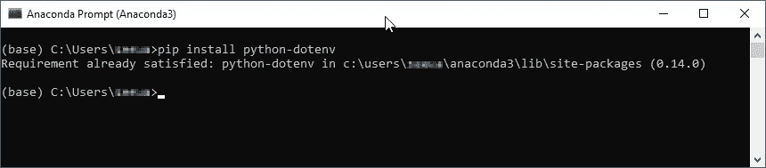
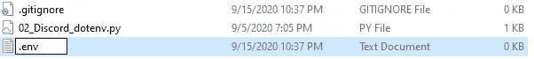
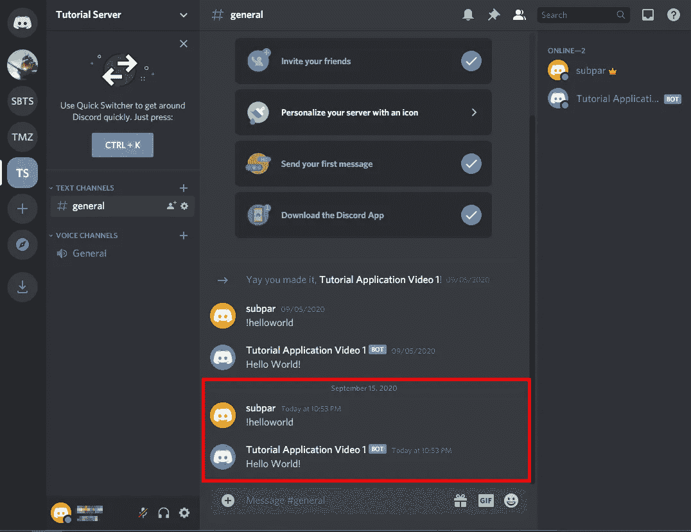

# 用 dotenv 隐藏 Python 中的敏感信息

> 原文：<https://towardsdatascience.com/using-dotenv-to-hide-sensitive-information-in-python-77ab9dfdaac8?source=collection_archive---------14----------------------->

## 教程| Python | dotenv

## 隐藏您的密码和 API 令牌，使您的代码更加安全


一只藏起来的猫，就像你的证件一样！|照片由[托马斯·博曼斯](https://unsplash.com/@thomasbormans?utm_source=medium&utm_medium=referral)在 [Unsplash](https://unsplash.com?utm_source=medium&utm_medium=referral) 拍摄

在之前的帖子中，我在脚本中留下了一个不和谐令牌。这不是理想的编码方式，尤其是如果我不想每次共享代码时都重新生成令牌的话。在您的数据科学和编程项目中使用凭证和 API 令牌是不可避免的，但是暴露它们是可以避免的。使用`dotenv` python 模块可以帮助保护这些敏感信息免受窥探。

> 在之前的一篇文章中，我使用 python 中的 Discord.py 创建了一个 Discord 机器人。这个例子将在这里继续，但同样的想法可以用在任何使用敏感凭证或 API 令牌的代码中

[](https://medium.com/python-in-plain-english/hello-world-how-to-make-a-simple-discord-bot-using-discord-py-c532611681ba) [## 你好世界！如何使用 Discord.py 制作一个简单的不和谐机器人

### 使用 Python 在短短 30 分钟内运行您自己的不和谐机器人！

medium.com](https://medium.com/python-in-plain-english/hello-world-how-to-make-a-simple-discord-bot-using-discord-py-c532611681ba) 

# 问题是

您已经完成了全新的 Discord bot，并希望与全世界分享您的代码。很自然，你把它上传到 GitHub，然后把链接发出去。很快机器人停止工作。为什么？您在代码中留下了 API 令牌，有人接管了您的 bot。

> 您将 API 令牌留在了代码中，有人接管了您的 bot

API 令牌为控制应用程序提供了巨大的能力。对于某些 API，使用情况会受到监控，甚至会对您的使用进行计费！幸运的是，Discord 不会向您收费，但是在您的编码项目中使用凭据时，您仍然需要保证它们的安全。

# 解决方案

输入环境变量。Jim Medlock 在他的[环境变量介绍和如何使用它们](https://medium.com/chingu/an-introduction-to-environment-variables-and-how-to-use-them-f602f66d15fa)中对它们有很好的解释。在那篇文章中，他说:

> [*环境变量*](https://en.wikipedia.org/wiki/Environment_variable) 是一个变量，其值在程序外部设置，通常通过操作系统或微服务内置的功能来设置。环境变量由一个名称/值对组成，可以创建任意数量的名称/值对，并在某个时间点提供引用。

我们将使用它们在 GitHub 提交中安全地保留我们的不和谐令牌。同样的过程也可以用于添加到 bot 中的任何其他敏感信息，甚至是您正在处理的其他项目。例如，如果你把你的用户名和密码放在机器人的代码中进行网页抓取，你会想用`dotenv`来保证它的安全。

## 装置

让我们从安装模块开始。我们可以使用 python 的[包安装程序来完成这项工作，通常称为 pip。](https://pip.pypa.io/en/stable/)

```
$ pip install python-dotenv
```



我已经装了，就是这么好！

## 。环境设置

现在让我们设置我们的`.env`文件。该文件应始终位于项目文件夹的顶层文件夹或根目录中。在那个位置创建一个新的文本文件，将其重命名为`.env`。Windows 将要求您确认是否要更改文件类型。单击是。



如果 Windows 不让你命名。env，改为命名为 discord.env

接下来，用文本编辑器打开`.env`文件。我更喜欢 [Atom](https://atom.io/) 或者 [Notepad++](https://notepad-plus-plus.org/) ，但是 [Notepad](https://www.microsoft.com/en-us/p/windows-notepad/9msmlrh6lzf3?activetab=pivot:overviewtab) 也可以。按照[约定](https://google.github.io/styleguide/shellguide.html#s7.3-constants-and-environment-variable-names)，**环境变量全部大写，单词之间用下划线**隔开。我们可以将我们的命名为 **TUTORIAL_BOT_TOKEN** 并粘贴我们的令牌。保存并关闭文件。

```
TUTORIAL_BOT_TOKEN=NzUzNzU3Mjg0NTI1NTM5MzQ4.X1q1LA.4xD7lSQrN0EqJivrrogLUScNdfY
```

## 添加到。gitignore

现在我的假设是你正在使用 [GitHub](https://github.com/) 作为你的数据科学项目的版本控制。如果你不是，你应该是！如果出现问题，这是回滚代码更改的好方法。GitHub 还支持与其他人的协作。你不希望他们也有你的令牌，所以我们有一些工作要做。如果您没有为项目设置存储库或者不知道如何设置，不要担心，我将在另一篇文章中讨论这个问题。您可以安全地进入下一部分。

GitHub 将保存对代码的所有修改，但是我们需要排除`.env`文件，因为它包含了我们的令牌。为了确保`.env`文件没有被提交到存储库中，打开项目文件夹中的`.gitignore`文件并添加下面一行。

```
*.env
```

添加这一行将忽略我们之前创建的`.env`文件。通过使用星号(*)，我们排除了顶级文件夹或根目录中扩展名为`.env`的所有文件提交到存储库。

## 加载环境变量

现在我们有了包含我们敏感信息的`.env`文件，它不会被提交到您的存储库中，我们需要在我们的 python 脚本中实际使用它。

首先我们需要加载`dotenv`和`os`模块。对于这个例子，我们可以将它们添加到我的 [Hello World Discord.py 教程](https://medium.com/python-in-plain-english/hello-world-how-to-make-a-simple-discord-bot-using-discord-py-c532611681ba)的脚本中。

```
# Imports
from dotenv import load_dotenv
import os
```

`load_dotenv`将用于将`.env`文件加载到环境变量中。`os`将用于引用代码中的那些变量。先说`load_dotenv`。这将加载。环境文件。

```
# Credentials
load_dotenv('.env')
```

要使用环境变量，我们可以在 bot 脚本末尾的`client.run`命令中使用`os.getenv`。

```
client.run(os.getenv('TUTORIAL_BOT_TOKEN'))
```

## 测试代码

现在一切都设置好了，在命令行中导航到 bot 脚本位置，运行脚本来启动 bot。

```
$ cd path\to\bot
$ python 02_Discord_dotenv.py
```

您将看到机器人名称和 ID 打印到控制台上。为了彻底起见，请使用 bot 进入服务器并测试！helloworld 命令，应该可以完美运行！



不出所料，该命令工作正常！

# 结束语

`dotenv`模块是隐藏敏感信息的好方法。它不必局限于与不和谐机器人一起使用。任何代码使用登录凭证、数据库连接信息、API 令牌或任何您不想与外界共享的东西的地方，请将其放在您的。环境文件。

要了解更多关于`dotenv` python 模块的信息，请查看 [GitHub 知识库](https://github.com/theskumar/python-dotenv)，其中包含更多关于该模块的文档。

# 寻找更多的项目创意？

看看我的另一篇文章，帮助你产生一些想法，在那里你可以应用这里讨论的概念。让您的项目在 GitHub 上脱颖而出，同时保证您的证书安全！

[](/6-ways-to-make-your-data-science-projects-stand-out-1eca46f5f76f) [## 让您的数据科学项目脱颖而出的 6 种方法

### 提高您的数据科学项目并获得关注的简单步骤

towardsdatascience.com](/6-ways-to-make-your-data-science-projects-stand-out-1eca46f5f76f) [](https://realdrewdata.medium.com/membership) [## 通过我的推荐链接加入 Medium-Drew Seewald

### 作为一个媒体会员，你的会员费的一部分会给你阅读的作家，你可以完全接触到每一个故事…

realdrewdata.medium.com](https://realdrewdata.medium.com/membership)