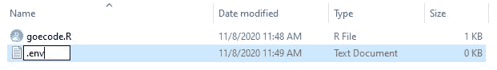

# 用 dotenv 隐藏 R 中的敏感信息

> 原文：<https://towardsdatascience.com/using-dotenv-to-hide-sensitive-information-in-r-8b878fa72020?source=collection_archive---------33----------------------->

## 教程| R | dotenv

## 隐藏您的密码和 API 令牌，使您的共享代码更加安全


一只藏起来的猫，就像你的证件一样！|图片由 [Thomas Bormans](https://unsplash.com/@thomasbormans?utm_source=medium&utm_medium=referral) 在 [Unsplash](https://unsplash.com?utm_source=medium&utm_medium=referral) 上拍摄

通常，当学习一个新的包或测试一些代码时，我会发现自己在代码中用纯文本编写了我的凭证和 API 令牌。这不是理想的编码方式，尤其是如果我不想每次共享代码时都重新生成令牌和更改密码。在您的数据科学和编程项目中使用凭证和 API 令牌是不可避免的，但是暴露它们是可以避免的。在 R 中使用`dotenv`包是保护这些敏感信息免受窥探的一种方式。

# 问题是

在之前的一个项目中，我使用了`[mapsapi](https://cran.rstudio.com/web/packages/mapsapi/vignettes/intro.html)`包来访问[谷歌地图 API](https://developers.google.com/maps/documentation/geocoding/overview) 。我有一个包含兴趣点、城市、州和国家的数据框，我想对其进行地理编码，或者获取其经度和纬度。为了从 Google Maps API 获取这些信息，我需要一个 [API 令牌](https://stackoverflow.com/a/17785474)。这个 API 令牌是特定于我的，对于更高数量的 API 调用，您需要付费。

因此，假设您创建了一个类似的项目，并将其上传到 [GitHub](https://github.com/) 。你很快就会看到你的信用卡上有一大笔费用。为什么？您将 API 令牌留在了代码中，有人滥用了您对 API 的访问，并对您的帐户收取了高额费用。

> 您将 API 令牌留在了代码中，有人对您的帐户收取了高额费用

API 令牌为控制应用程序提供了巨大的能力。对于某些 API，使用情况会受到监控，您将为您的使用付费！记住这一点，在您的编码项目中使用凭据时，确保它们的安全是非常重要的。

# 一个解决方案

输入环境变量。 [Jim Medlock](https://medium.com/@jdmedlock) 在他的[环境变量介绍和如何使用它们](https://medium.com/chingu/an-introduction-to-environment-variables-and-how-to-use-them-f602f66d15fa)中对它们有很好的解释。在那篇文章中，他说:

> *一个* [*环境变量*](https://en.wikipedia.org/wiki/Environment_variable) *是一个变量，它的值是在程序之外设置的，通常是通过操作系统或微服务内置的功能来设置的。环境变量由一个名称/值对组成，可以创建任意数量的名称/值对，并在某个时间点提供引用。*

在这里，我将使用它们来使我的 Google Maps API 令牌安全地远离我的 GitHub 提交。同样的过程也可以用于添加到代码中的任何其他敏感信息。例如，如果您需要使用您的用户名或密码来访问一个数据库，您会想要使用类似于`dotenv`包的东西来保证它的安全。

> 注意:我说*解决方案*是因为做任何事情都有多种方法。这是我发现对我的项目简单而有用的一个

## 在开始之前

在我们开始之前，先快速浏览一下我们将使用环境变量改进的代码片段。它加载所需的包，以纯文本的形式定义 API 键，并向 API 发送一个针对`places`字符向量中每个位置的请求。

```
library(mapsapi)G_API_KEY <- "XXXXXXXXXXXXXXXXXXXXXXXXXXXX"geo_obs <- mp_geocode(places, key=G_API_KEY)
```

我们的目标是消除在这个脚本中保留令牌的需要，但是仍然能够在我们的代码中使用它。

## 装置

让我们从安装包开始。我们可以使用`install.packages()`功能来实现。

```
> install.packages("dotenv")
```

## 。环境设置

现在让我们设置我们的`.env`文件。该文件应始终位于项目的顶层文件夹或根目录中。在那个位置创建一个新的文本文件，将其重命名为`.env`。Windows 将要求您确认是否要更改文件类型。单击是。



如果 Windows 不让你命名。env，将其命名为 cred.env，类似于

接下来，用文本编辑器打开`.env`文件。我更喜欢 [Atom](https://atom.io/) 或者 [Notepad++](https://notepad-plus-plus.org/) ，但是 [Notepad](https://www.microsoft.com/en-us/p/windows-notepad/9msmlrh6lzf3?activetab=pivot:overviewtab) 也可以。按照[惯例](https://google.github.io/styleguide/shellguide.html#s7.3-constants-and-environment-variable-names)，**环境变量都是大写的，单词之间用下划线**隔开。我们可以将我们的命名为 **GOOGLE_MAPS_API** 并粘贴我们的令牌。保存并关闭文件。

```
GOOGLE_MAPS_API=XXXXXXXXXXXXXXXXXXXXXXXXXXXX 
```

> 注意:确保在这个文件的末尾创建一个空行，否则 R 在处理这个文件时会有问题

## 添加到。gitignore

现在这里的假设是，您在数据科学项目中使用 [GitHub](https://github.com/) 进行版本控制。如果你不是，你应该是！如果出现问题，这是回滚代码更改的好方法。GitHub 还支持与其他人的协作。你不希望他们也有你的令牌，所以我们有一些工作要做。如果您没有为项目设置存储库或者不知道如何设置，不要担心，我将在另一篇文章中讨论这个问题。您可以安全地进入下一部分。

GitHub 将保存对代码的所有更改，但是我们需要排除`.env`文件，因为它包含我们的令牌。为了确保`.env`文件没有被提交到存储库中，打开项目文件夹中的`.gitignore`文件并添加下面一行。

```
*.env
```

添加这一行将忽略我们之前创建的`.env`文件。通过使用星号(*)，我们排除了顶级文件夹或根目录中扩展名为`.env`的所有文件提交到存储库。

## 加载环境变量

现在我们有了包含敏感信息的`.env`文件，它不会被提交到我们的存储库中，我们需要在 R 脚本中实际使用它。

首先我们需要加载`dotenv`包。将此添加到示例脚本中。

```
library(dotenv)
```

`load_dot_env()`函数将用于将`.env`文件加载到环境变量中。该函数将在[当前工作目录](https://stat.ethz.ch/R-manual/R-devel/library/base/html/getwd.html)中寻找`.env`文件。

```
load_dot_env()
```

如果您必须将文件命名为除`.env`之外的名称，函数调用应该如下所示，用您的文件名替换`cred.env`。

```
load_dot_env("cred.env")
```

为了在我们的脚本中使用环境变量，我们可以在我们的`mp_geocode()`函数中使用`Sys.getenv()`函数(或者在任何使用环境变量的地方)。

```
geo_obs <- mp_geocode(places, key=Sys.getenv("GOOGLE_MAPS_API"))
```

最后要做的事情是删除具有纯文本 API 键的行。之后，最终的脚本将如下所示:

```
library(mapsapi)
library(dotenv)load_dot_env()geo_obs <- mp_geocode(places, key=Sys.getenv("GOOGLE_MAPS_API"))
```

# 结束语

这个包是隐藏敏感信息的好方法。它不必局限于与 Google Maps API 一起使用。任何代码使用登录凭证、数据库连接信息、API 令牌或任何您不想与外界共享的东西的地方，将其放在您的`.env`文件中。

关于`dotenv` R 包的更多信息，请查看该包的 [GitHub 库](https://github.com/gaborcsardi/dotenv)。它包含了更多关于这个包的文档。

[](https://realdrewdata.medium.com/membership) [## 通过我的推荐链接加入 Medium-Drew Seewald

### 作为一个媒体会员，你的会员费的一部分会给你阅读的作家，你可以完全接触到每一个故事…

realdrewdata.medium.com](https://realdrewdata.medium.com/membership)