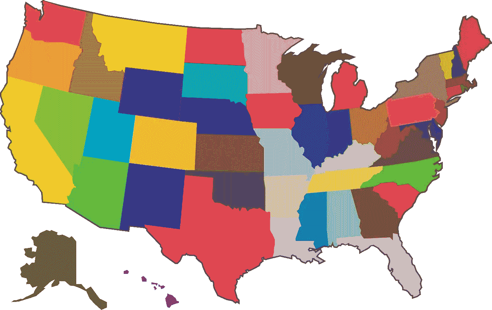
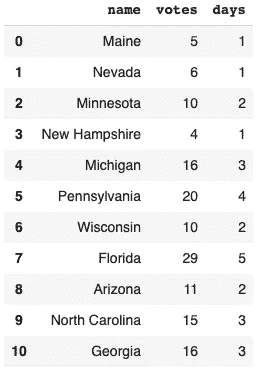
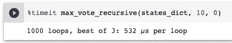
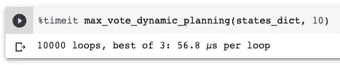

# 利用动态规划帮助特朗普赢得选举

> 原文：<https://towardsdatascience.com/using-dynamic-planning-to-help-trump-win-the-elections-7b5b34f63961?source=collection_archive---------24----------------------->



由 [Pixabay](https://pixabay.com/vectors/maps-country-america-states-land-812736/#) 上的 [fajarbudi86](https://pixabay.com/users/fajarbudi86-1126901/) 拍摄的照片

## Python 中优化选举宣传的动态规划

> 说明:2020 年美国大选在本文中仅作为背景。这个故事意在向你展示计算机编程中的这种思维方式。我既不是在表达我的政治观点，也不是在用任何观点进行说服。本文中使用的所有数据都是由假设构成的，无论如何都不一定反映事实。

在我写这篇文章的时候，乔·拜登已经稳操胜券了。我既不是美国人，也没有在美国生活，所以我不会在政治上对此发表评论，尽管我认为大多数阅读我文章的人可能会支持拜登。我哪里知道？就看看加州吧:)

好的。现在我们想象一下，我们被聘为特朗普选举团队的一员。假设离投票开始还有 10 天。大家都知道，最重要的是争取摇摆州。我不太喜欢政治，所以我对这方面的知识有限，但幸运的是，我从维基百科上得到了被认为是 2020 年美国大选摇摆州的 11 个州。



我们就随便编个数据，把所有的州，他们的选举人票数量，以及在这个州推广需要的天数一起放在一个字典里。

```
states_dict = [
    {'name': 'Maine', 'votes': 5, 'days': 1},
    {'name': 'Nevada', 'votes': 6, 'days': 1},
    {'name': 'Minnesota', 'votes': 10, 'days': 2},
    {'name': 'New Hampshire', 'votes': 4, 'days': 1},
    {'name': 'Michigan', 'votes': 16, 'days': 3},
    {'name': 'Pennsylvania', 'votes': 20, 'days': 4},
    {'name': 'Wisconsin', 'votes': 10, 'days': 2},
    {'name': 'Florida', 'votes': 29, 'days': 5},
    {'name': 'Arizona', 'votes': 11, 'days': 2},
    {'name': 'North Carolina', 'votes': 15, 'days': 3},
    {'name': 'Georgia', 'votes': 16, 'days': 3},
]
```

假设是，如果我们在相应的州度过该天数，我们将赢得该州。

问题是川普在最后 10 天能拿到多少选举人票**最多**？所以，如果我们把所有红色州的选票加起来，我们就能估计出特朗普最终会有多少张选举人票。

有几种方法可以解决这个问题。最直观的方式大概就是递归函数了。然而，它绝对不是最好的解决方案。

在本文中，我将提供递归解决方案和动态规划解决方案。将给出解释来说明为什么动态规划比前者更先进。

# 递归解


由 [Pixabay](https://pixabay.com/photos/stairway-spiral-stairs-architecture-5551641/) 上的 [tkirkgoz](https://pixabay.com/users/tkirkgoz-16692474/) 拍摄的照片

递归解决方案的思想相对简单。也就是说，对于每个州，我们有两个选择——去或不去。

因此，函数将是关于

> 在接下来的几天里从其他州获得最多的选举人票

如果我们选择去这个州，我们将在剩下的几天里得到选举人票+其他州的最高选举人票。否则，我们应该在接下来的几天里从其他州退回最多的选举人票。

代码如下:

为了防止 gist 有时不能很好地工作，我也将代码简单地发布如下:

```
def max_vote_recursive(states, days_left, index):
    # Terminating conditions
    if len(states) == 0 or index >= len(states) or days_left <= 0:
        return 0# If we have enough days, go to this state
    votes_if_go = 0
    if states[index]['days'] <= days_left:
        votes_if_go = states[index]['votes'] + max_vote_recursive(states, days_left - states[index]['days'], index + 1)# If we don't go to this state
    votes_if_not_go = max_vote_recursive(states, days_left, index + 1) return max(votes_if_go, votes_if_not_go)
```

如果我们运行函数为`max_vote_recursive(states_dict, 10, 0)`，我们应该得到 56 张选举人票的结果。

为什么我说这个递归函数不够高效？我可以直观地展示给你看。

我所做的是将最后一个返回语句`return max(votes_if_go, votes_if_not_go)`改为下面的代码片段。

```
if votes_if_go > votes_if_not_go:
        print(f'There are {days_left} days left. We should go to {states[index]["name"]}')
        return votes_if_go
    else:
        print(f'There are {days_left} days left. We should not go to {states[index]["name"]}')
        return votes_if_not_go
```

因此，递归的每一步都将输出还剩多少天以及当前状态。更改之后，通过再次运行该函数，我们将得到如下所示的大量输出日志。

```
There are 2 days left. We should not go to Georgia
There are 2 days left. We should not go to North Carolina
There are 2 days left. We should go to Arizona
There are 2 days left. We should not go to Florida
There are 2 days left. We should not go to Wisconsin
There are 2 days left. We should not go to Pennsylvania
There are 1 days left. We should not go to Georgia
There are 1 days left. We should not go to North Carolina
There are 1 days left. We should not go to Arizona
There are 1 days left. We should not go to Florida
There are 1 days left. We should not go to Wisconsin
There are 1 days left. We should not go to Georgia
There are 1 days left. We should not go to North Carolina
...
```

请注意，在最初的几行中，我们已经可以找到一个重复的输出`There are 1 days left. We should not go to Georgia`。我所做的是将输出放入一个数组，然后计算有多少重复的输出。排序后的结果如下:

```
('There are 1 days left. We should not go to Georgia', 74),
('There are 2 days left. We should not go to Georgia', 63),
('There are 3 days left. We should go to Georgia', 51),
('There are 1 days left. We should not go to North Carolina', 45),
('There are 2 days left. We should not go to North Carolina', 41),
('There are 4 days left. We should go to Georgia', 40),
('There are 3 days left. We should not go to North Carolina', 35),
('There are 4 days left. We should not go to North Carolina', 29),
('There are 5 days left. We should go to Georgia', 28),
('There are 1 days left. We should not go to Arizona', 24),
('There are 2 days left. We should go to Arizona', 23),
('There are 5 days left. We should not go to North Carolina', 22),
('There are 3 days left. We should not go to Arizona', 21),
('There are 6 days left. We should go to Georgia', 19),
('There are 4 days left. We should not go to Arizona', 18),
('There are 3 days left. We should not go to Florida', 16),
('There are 6 days left. We should go to North Carolina', 16),
('There are 2 days left. We should not go to Florida', 15),
('There are 4 days left. We should not go to Florida', 15),
('There are 5 days left. We should go to Arizona', 14),
('There are 1 days left. We should not go to Florida', 13),
('There are 5 days left. We should go to Florida', 13),
('There are 7 days left. We should go to Georgia', 12),
('There are 6 days left. We should not go to Arizona', 11),
('There are 6 days left. We should not go to Florida', 11),
('There are 7 days left. We should go to North Carolina', 11),
...
```

请注意，更多的行被截断，但仍然非常明显的是，一些“子问题”重复了很多次。比如下面的子问题，被“计算”了 74 次。

> 我们还有一天时间，我们应该/可以去乔治亚州吗？

幸运的是，我们只有 11 个摇摆州。如果将这类问题转移到另一个领域，我们可能会有数量巨大的节点。递归函数的缺点是重复计算子问题，这可能使问题在合理的硬件资源下无法解决。

# 动态规划解决方案


照片由[史蒂夫布](https://pixabay.com/users/stevepb-282134/)在 [Pixabay](https://pixabay.com/photos/checkmate-chess-resignation-1511866/) 拍摄

您可能已经意识到递归函数实际上是一种“自顶向下”的解决方案。相反，动态规划指的是以“自下而上”的结构解决问题的方式。它具有以下特点:

*   要解决的问题必须分成子问题。
*   在自下而上的推理过程中，我们必须确保每一步(子问题)在给定的条件下都是全局最优的。

我们先来看看代码。

万一要点加载有问题，这里是明码。请将它复制粘贴到您的文本编辑器中，以便进行漂亮的缩进。

```
def max_vote_dynamic_planning(states, total_days):
    dp_matrix = [[0 for days_left in range(total_days + 1)] for index in range(len(states) + 1)]for index in range(1, len(states) + 1):
        for days_left in range(1, total_days + 1):
            if states[index-1]['days'] <= days_left:  # If we have enough days left
                votes_if_go = dp_matrix[index-1][days_left - states[index-1]['days']] + states[index-1]['votes']
                votes_if_not_go = dp_matrix[index-1][days_left]
                # Save the maximum votes into cache
                dp_matrix[index][days_left] = max(votes_if_go, votes_if_not_go)
            else:  # We don't have any days left
                dp_matrix[index][days_left] = dp_matrix[index-1][days_left]

    return dp_matrix[-1][-1]max_vote_dynamic_planning(states_dict, 10)
```

然后矩阵计算如下，我们能得到的最大选举人票就是最后一个值——56。

```
[[0, 0, 0, 0, 0, 0, 0, 0, 0, 0, 0],
 [0, 5, 5, 5, 5, 5, 5, 5, 5, 5, 5],
 [0, 6, 11, 11, 11, 11, 11, 11, 11, 11, 11],
 [0, 6, 11, 16, 21, 21, 21, 21, 21, 21, 21],
 [0, 6, 11, 16, 21, 25, 25, 25, 25, 25, 25],
 [0, 6, 11, 16, 22, 27, 32, 37, 41, 41, 41],
 [0, 6, 11, 16, 22, 27, 32, 37, 42, 47, 52],
 [0, 6, 11, 16, 22, 27, 32, 37, 42, 47, 52],
 [0, 6, 11, 16, 22, 29, 35, 40, 45, 51, 56],
 [0, 6, 11, 17, 22, 29, 35, 40, 46, 51, 56],
 [0, 6, 11, 17, 22, 29, 35, 40, 46, 51, 56],
 [0, 6, 11, 17, 22, 29, 35, 40, 46, 51, 56]]
```

在这里，想法如下:

*   初始化一个二维矩阵，使用状态数作为行，天数作为列。
*   从第一个状态(索引= 1)开始，剩余天数为 1。
*   如果我们去目前的州，我们应该把这个州的选举人票和剩下的日子里我们能得到的最大票数加起来。剩余天数应该是当前剩余天数减去我们在当前状态下需要提升的天数。

对于这一点，让我们假设我们正在计算第二个州，内华达州，还有 **2** 天(见`dp_matrix[2][2]`)。如果我们选择去内华达州，我们会得到 **6** 张选举人票，但我们会用 1 天时间来得到它们。所以，我们还有 1 天时间。因为我们还剩 1 天，我们可以从前一个州缅因州得到的最多票数是 **5** 。因此，该步骤的优化结果是 **11** 票。

*   如果我们选择不去当前状态，那么我们应该只使用我们已经为先前状态优化的最大票数。

你迷惑了吗？:)我举个例子，动态规划是怎么知道什么时候不应该去状态的。

假设我们正在计算明尼苏达州，还有 **2** 天(`dp_matrix[3][2]`)。如果我们选择去明尼苏达州，我们会得到**10**16】张选票。然而，在那之后，我们还剩下**2–2 = 0**天。另一方面，如果我们选择不去明尼苏达州，我们还有 **2** 天，我们可以从前两个州获得的最高票数是 **11** 。

因此，随着 for 循环的进行，对于每一个单独的循环，我们可以确保它是到目前为止优化的。这也是为什么你可以看到矩阵是水平和垂直排序的。因此，全局优化数应该在右下角，即 56。

# 简单的比较


由[在](https://pixabay.com/users/free-photos-242387/) [Pixabay](https://pixabay.com/photos/highway-drive-driving-road-travel-1209547/) 上的免费照片拍摄的照片

我不应该只谈论动态规划有多有效。让我展示一些证据。

这是递归函数的运行时间。



这是一个动态规划解决方案。



在这种特殊情况下，动态规划大约快 10 倍。如果我们有更多的节点和可能性的问题，差异将是巨大的。

# 摘要


由 [cocoparisienne](https://pixabay.com/users/cocoparisienne-127419/) 在 [Pixabay](https://pixabay.com/photos/texture-handwriting-s%C3%BCtterlin-1362879/) 上拍摄的照片

在这篇文章中，我提出了一个在有限的几天内优化选举宣传的问题。我们可以很轻松的用递归函数解决问题，但是事实证明效率不高，因为有太多的子问题被计算了多次。

不是使用“自上而下”的方法(递归)，而是使用“自下而上”的方法解决问题的动态规划。它从最小的子问题开始，并确保每一步都在当前条件下给出优化结果，因此下一步将建立在当前步骤的基础上。因此，它没有重复计算，算法复杂度小得多。

在给定的问题中，表明动态规划解比递归函数解快 10 倍。

# 一个小笑话


照片由 [www_slon_pics](https://pixabay.com/users/www_slon_pics-5203613/) 在 [Pixabay](https://pixabay.com/photos/darth-trump-darth-vader-vader-3830731/) 上拍摄

当你告诉特朗普我们可以用 10 天时间拿到 56 张选举人票的时候，他好像挺开心的。

> 他问你:“好。那么，我们的行程是什么？哪些是我们应该去的州。”
> 
> 你:“嗯，我暂时没有那个信息。让我调整一下我的代码……”
> 
> 特朗普:“不，让我来。相信我。没有人比我更了解 Python！”

:)

[](https://medium.com/@qiuyujx/membership) [## 通过我的推荐链接加入 Medium 克里斯托弗·陶

### 作为一个媒体会员，你的会员费的一部分会给你阅读的作家，你可以完全接触到每一个故事…

medium.com](https://medium.com/@qiuyujx/membership) 

**如果你觉得我的文章有帮助，请考虑加入灵媒会员来支持我和成千上万的其他作家！(点击上面的链接)**