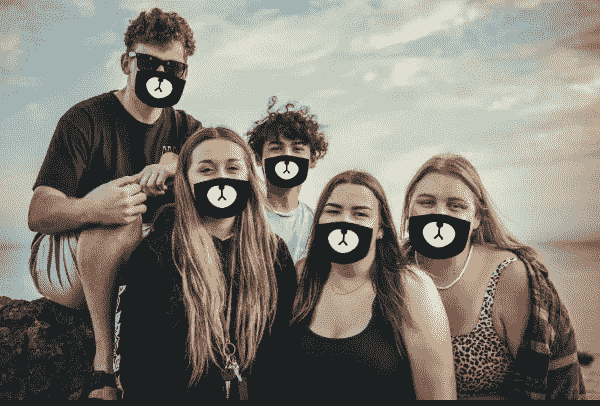
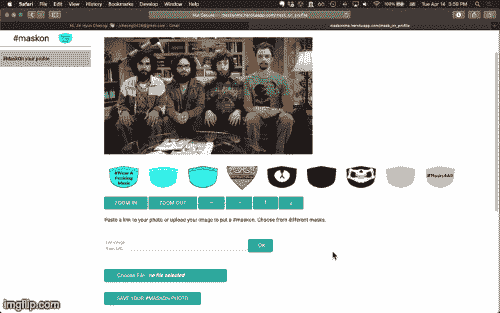
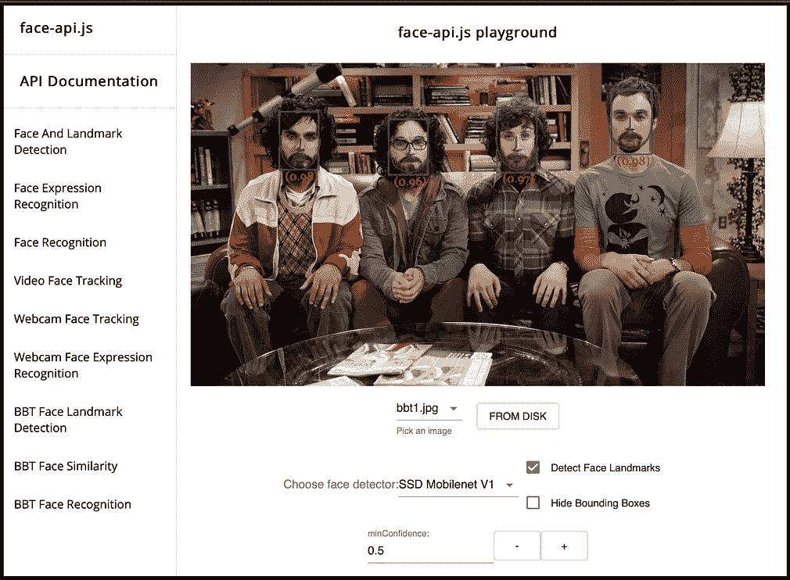
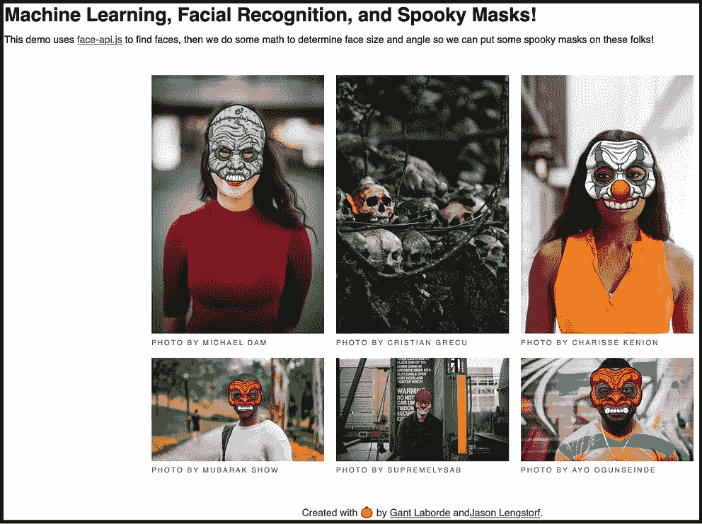
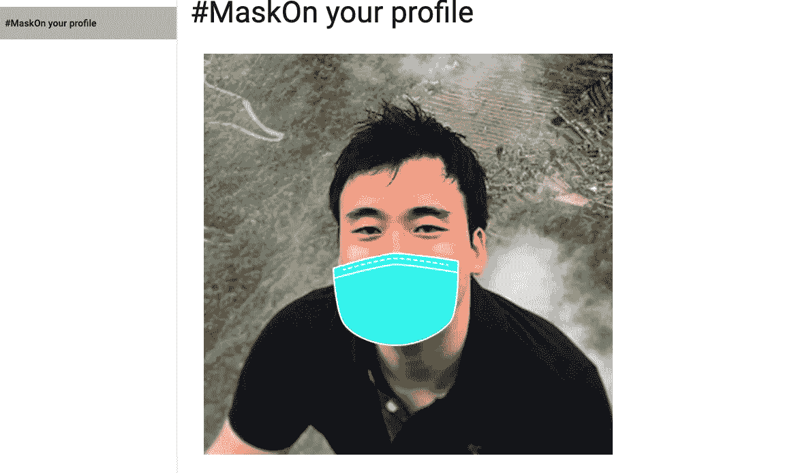
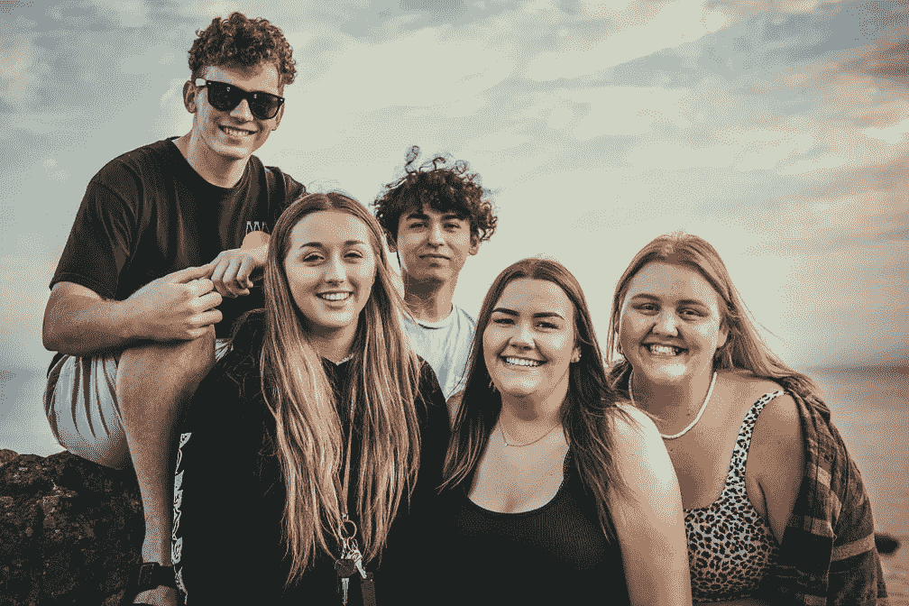

# 使用 face-api.js 构建一个在人脸图像上叠加一个遮罩的应用程序

> 原文：<https://towardsdatascience.com/using-face-api-js-to-build-an-app-that-overlays-a-mask-on-face-images-9de9b4848c09?source=collection_archive---------31----------------------->

## 构建应用程序教程

## 下面是我如何制作一个应用程序，自动为你的个人资料照片添加遮罩。#马斯肯



来自 Pexels 的蒂姆·莫斯霍尔德的照片

你听说了吗？ [CDC](https://www.cdc.gov/coronavirus/2019-ncov/prevent-getting-sick/cloth-face-cover.html) 和[医务总监](https://twitter.com/Surgeon_General/status/1264166726230573057?s=20)现在建议并鼓励每个人在公共场合外出时戴口罩。不幸的是，戴口罩仍然会带来很多耻辱。“如果人们认为我生病了怎么办？”“如果他们冲我大喊大叫让我呆在家里怎么办？”这些想法会阻止一个人戴上面具，即使这有助于保护自己和他人。为了帮助宣传戴面具是明智和正确的事情，并让它变得足够普遍，从而成为一种新的社会规范，我决定制作一个应用程序，自动为你的个人资料照片添加面具。我是这样做的。



https://maskonme.herokuapp.com/[待建 app 截图](https://maskonme.herokuapp.com/)

# 首先，计划

我首先想到了应用程序的核心功能。这包括:

1.  用户上传自己的照片或粘贴照片链接
2.  网站检测照片中的人脸及其地标
3.  网站在鼻子、嘴和下巴区域覆盖了一个面具
4.  用户下载最终图像。

在谷歌了一番之后，我有了两个选择:1)使用 Flask & OpenCV 用 Python 开发一个应用，或者 2)使用 [face-api.js](https://github.com/justadudewhohacks/face-api.js/) 用 JavaScript 开发一个独立的应用。尽管我更喜欢 Python，但我还是决定使用 face-api.js & JavaScript，因为它可以在现代浏览器上运行，不需要后端服务器来承担繁重的工作。另外， [Vincent Mühler](https://itnext.io/@muehler.v) 已经有了一个很棒的[人脸和地标检测的例子](https://justadudewhohacks.github.io/face-api.js/face_and_landmark_detection/)，可以轻松覆盖步骤 1 和 2。



左)face-api.js 的人脸&地标检测 app 右)幽灵面具

接下来，我做了一个快速搜索，看看是否有任何在脸上覆盖面具的例子，并找到了使用 face-api.js 的[https://ghost-masks . netlify . app](https://spooky-masks.netlify.app)，我认为只需要一些调整就可以完成第 3 步。

# 把所有的放在一起

在 [faceLandmarkDetection 演示](https://github.com/justadudewhohacks/face-api.js/blob/master/examples/examples-browser/views/faceLandmarkDetection.html)中，我花了一些时间来理解 face-api.js 是如何工作的。一些基础工作包括用`<script src=”face-api.js”></script>`在 head 部分加载 face-api.js，并找到加载输入图像和绘图覆盖的部分。

```
<div style="position: relative" class="margin">      
          
    <canvas id="overlay" />    
</div>
```

此外，这里是调用`faceapi`来检测输入图像`inputImgEl`中的人脸并保存结果的部分。

```
async function **updateResults()** {
...
const results = await **faceapi.detectAllFaces**(inputImgEl, options).withFaceLandmarks()
...
}
```

我还在《幽灵面具》教程的 [maskify.js](https://github.com/jlengstorf/spooky-masks-facial-recognition/blob/master/src/util/maskify.js) 中指出了面具是如何被操纵和调整以放置在人脸之上的。它使用 face-api.js 中的方法来获取地标的坐标。例如，要得到鼻子，你可以运行`const nose = landmarks.getNose();`或者使用`const jawline = landmarks.getJawOutline();.` [得到下颌线，见这里的原始代码。利用这个，我能够快速制作出一个原型，它将检测人脸，并用一个面具覆盖它。点击这里查看完整代码！](https://github.com/jlengstorf/spooky-masks-facial-recognition/blob/master/src/util/maskify.js)

[](https://github.com/jcheong0428/maskon) [## jcheong0428/maskon

### 这个应用程序把一个面具放在你的脸上。申请可从 https://maskonme.herokuapp.com face-API . js 获得…

github.com](https://github.com/jcheong0428/maskon) 

不幸的是，我很快意识到这个自动覆盖的面具不会是完美的。面部轻微的旋转和歪斜会导致稍微不准确的下颌线，这会使面具向某个方向倾斜太多。因此，我决定添加一些控件来移动遮罩。



还不错，但肯定可以使用一点手动调整。下颌线的估计并不是 100%准确。

事实证明，手动调整无论如何都是必要的，因为地标可能不会总是检测到下巴的整个轮廓。

因此，我决定添加按钮，这将改变小增量的面具的位置。

例如，我添加了一个向右移动蒙版的按钮

```
<button class=”waves-effect waves-light btn” onclick=”moveright_mask();”>Zoom In</button>
```

由函数定义

```
function moveright_mask() {
    const myNode = document.getElementById("maskdiv").children;
    for (var i = 0; i < myNode.length; i++) {
      var tableChild = myNode[i];
      // Do stuff
      var left = parseFloat(tableChild.style.left)+2;
      tableChild.style.left = `${left}px`;
    };
  }
```

这将更新`maskdiv.`中的掩码

[亲自尝试一下](https://maskonme.herokuapp.com/)或观看视频:

# 后续步骤

这是一个非常有趣的项目，可以在疫情开始的时候分散我的注意力。当我建造这个的时候，我最终也找到了 https://socialdistancing.works/的[号](https://socialdistancing.works/)，它实际上做了同样的事情，除了它纯粹是手动调整。 [MaskOnMe](http://maskonme.herokuapp.com) 的另一个很好的功能是它还可以同时检测多张脸，这样你就可以发布和每个戴面具的人的合影了！



当我有时间的时候，我的下一步是在一个 AR 版本上工作，其中一个将覆盖一个来自网络摄像头的面具！感谢您的阅读，如果您想了解更多关于人脸图像处理的内容，请随时查看我的其他帖子。

[](/how-to-extract-facial-expressions-head-pose-and-gaze-from-any-youtube-video-2aa6590c2bb6) [## 如何从任何 Youtube 视频中提取面部表情、头部姿势和凝视

### 使用 Google Colab & OpenFace 从 Youtube 视频中提取面部特征的教程，无需安装一个…

towardsdatascience.com](/how-to-extract-facial-expressions-head-pose-and-gaze-from-any-youtube-video-2aa6590c2bb6) [](/four-ways-to-quantify-synchrony-between-time-series-data-b99136c4a9c9) [## 量化时间序列数据之间同步性的四种方法

### 用于计算同步指标的样本代码和数据，包括皮尔逊相关、时滞交叉相关…

towardsdatascience.com](/four-ways-to-quantify-synchrony-between-time-series-data-b99136c4a9c9) [](https://jinhyuncheong.medium.com/membership) [## 通过我的推荐链接加入 Medium 金贤昌博士

### 作为一个媒体会员，你的会员费的一部分会给你阅读的作家，你可以完全接触到每一个故事…

jinhyuncheong.medium.com](https://jinhyuncheong.medium.com/membership)