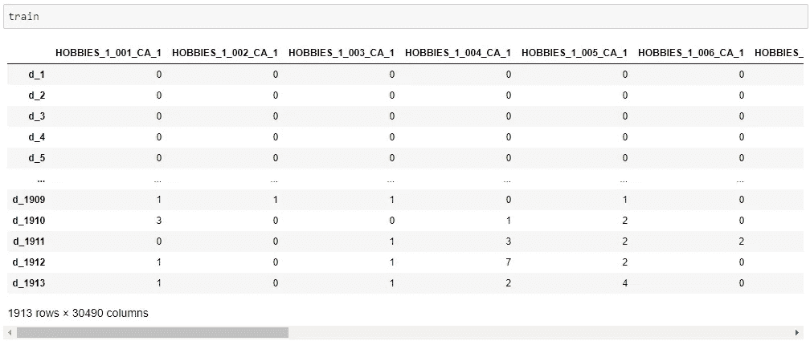
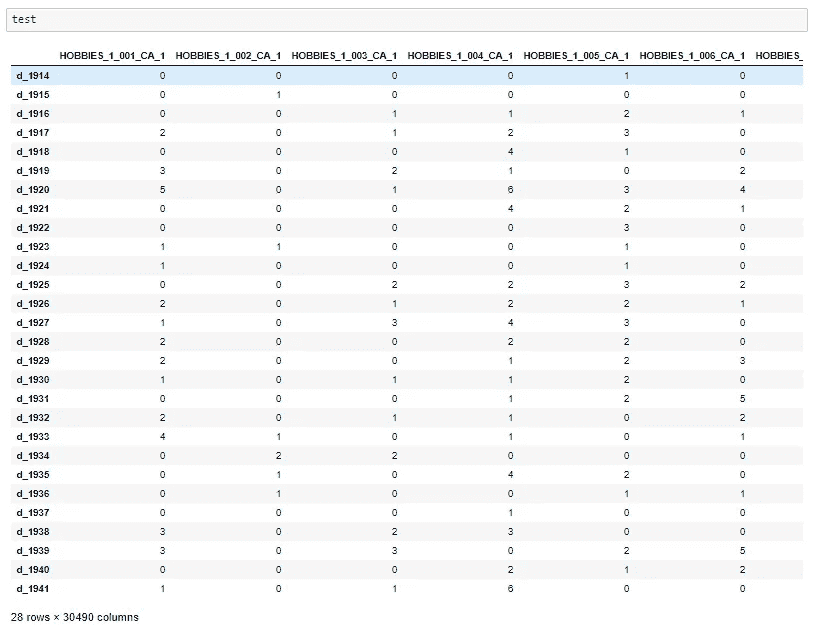
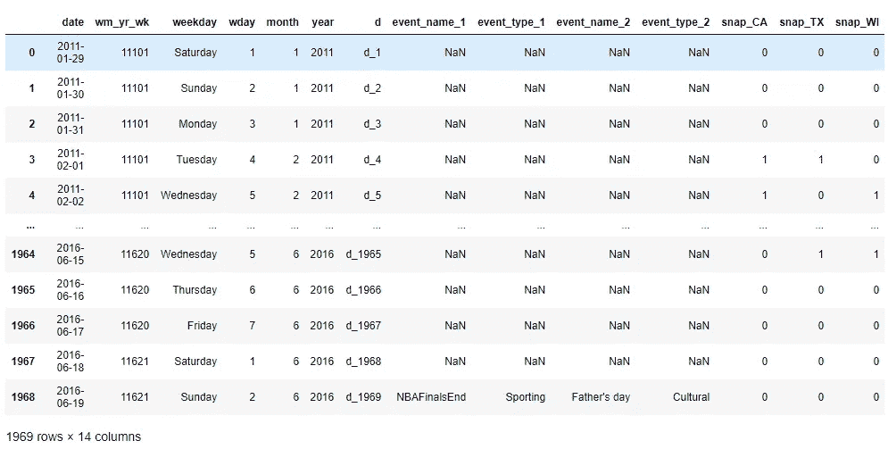

# 利用脸书的预言家预测超过 30000 件沃尔玛产品的销售(Kaggle 铜牌)

> 原文：<https://towardsdatascience.com/using-facebooks-prophet-to-forecast-sales-of-over-30000-wallmart-products-kaggle-bronze-medal-c47aba5a5bc2?source=collection_archive---------31----------------------->

用脸书预言家预测沃尔玛的销售。亨特·哈里特在 [Unsplash](https://unsplash.com/s/photos/data?utm_source=unsplash&utm_medium=referral&utm_content=creditCopyText) 上的照片

在这篇文章中，我将解释我是如何使用脸书的开源预测模型 Prophet 在 T4 M5 预测大赛上获得铜牌的。

# 什么是脸书先知？

很久以前我就想尝试一下脸书的先知。引用脸书的文档:*“Prophet 是一种基于加法模型预测时间序列数据的程序，其中非线性趋势符合每年、每周和每天的季节性，加上假日效应。它最适用于具有强烈季节效应的时间序列和几个季节的历史数据。Prophet 对缺失数据和趋势变化具有稳健性，通常能很好地处理异常值。*

简而言之，它是一个自动化的时间序列生成器。由于在这场 Kaggle 比赛中有超过 30，000 个时间序列，这个自动化方面真的很棒:数据太大了，无法单独查看每个时间序列。

如果您想跟随完整的笔记本，这里有两个链接:

*   *[*先知笔记本带有默认的*](https://jooskorstanje.com/prophet-with-defaults.html) 和*
*   *[*先知笔记本带超参数调*](https://jooskorstanje.com/prophet-with-hyperparameter-tuning.html) *。**

# *卡格尔竞赛和数据*

*M5 预测竞赛为我们提供了沃尔玛的分层销售数据。目标是预测美国三个州(加利福尼亚州、德克萨斯州和威斯康星州)商店未来 28 天的日销售额。数据包括项目级别、部门、产品类别和商店详细信息。此外，我们还有解释变量，如价格、促销、星期几和特殊事件。*

## *销售数据*

*我将销售数据放在每列一个产品和每行一天的格式中。*

*训练数据包含每个产品/商店组合的 30490 列，行是日期:*

**

*测试数据的格式与列车数据相同，但包含连续的 28 天:*

**

## *在 Prophet 中添加假日和事件数据*

*我准备了假期和事件数据，以符合 Prophet 的*假期*论点。格式必须是固定列*假日*和 *ds* 的数据帧。在 ds 中，你给出了这个假期发生的日期的列表，包括过去和将来(直到你的预测发生)。*

*假日的 Kaggle 数据看起来像这样，每天一天的格式。*

**

*为了将该数据传递给 Prophet，必须对其进行重新格式化，以仅包含节假日，并为每个节假日列出该节假日发生的日期:*

## *在 Prophet 中添加更多独立变量*

*还提供了价格数据。我没有把它包括在内，尽管在 Prophet 中添加更多数据是可能的。我相信它可以取得更好的结果，但由于时间限制，我没有尝试*

# *脸书先知超参数*

*我用不同的方法对超参数做了两次尝试:第一次尝试使用默认的超参数，第二次尝试使用小的优化。我很想用更大的优化做第三次尝试，但是我没有计算时间来运行 30，000 次。*

## *1.具有所有默认超参数的 Prophet*

*用 Prophet 运行 30，000 个时间序列花了我大量的时间(我有 6 个 Kaggle 笔记本，每个运行 5000 个时间序列，仍然花了我几个小时)。第一次提交使用了 Prophet 的所有默认设置。*

***如何使用 Prophet 的基础知识:***

*   *使用假期数据(以准备好的形式)初始化 Prophet*
*   *让先知适应训练数据*
*   *制作一个未来的数据框架*
*   *使用 Prophet 对未来数据框架进行预测*

*然后，我们可以将此应用于所有超过 30000 个时间序列，其中包括使用 imap，如下所示:*

*第一次提交给我的分数是 0.83(加权均方根误差)。虽然它在排行榜上是最差的 30%，但我对它的第一个结果很满意。*

## *2.具有超参数调谐的 Prophet*

*我使用超参数调整进行了第二次提交。已经花了几个小时来运行默认值，并且有许多超参数和设置可以在 Prophet 中修复。*

## *要在 Prophet 中调谐的超参数*

*经过一些尝试后，以下超参数似乎有所不同:*

*   *每周季节性的傅立叶顺序*
*   *月度季节性的傅立叶顺序*
*   *年度季节性的傅立叶顺序*
*   *季节性 _ 先验 _ 标度*
*   *假日 _ 先验 _ 标度*
*   *变点 _ 先验 _ 标度*

*对所有这些进行调优会使代码太慢。作为一个解决方案，我通过网格搜索只对 4 种不同的组合进行了调整，如下所示:*

## *Prophet 中的交叉验证*

*Prophet 中有一种交叉验证的方法。然而，我更喜欢使用如下的列车验证测试方法:*

*   *拟合训练数据的所有超参数组合*
*   *测量验证数据的误差并选择最佳模型*
*   *使用最佳模型的超参数对添加到验证数据的训练数据重新拟合模型*
*   *使用此模型对测试数据进行预测*

*使用超参数构建一个模型的代码:*

*在一列上进行预测的代码，包括训练-验证-测试方法:*

*然后我使用和上面写的一样的 imap 方法来拟合所有的预测。*

# *结论*

*网格搜索法让我有了显著的提高，新的分数是 0.68。这种方法用相对少的时间让我在比赛中获得了铜牌(5558 名中的第 501 名)。*

*记得看一下完整的笔记本:*带默认值的* [*先知笔记本*](https://jooskorstanje.com/prophet-with-defaults.html) 和带超参数调优的 [*先知笔记本*](https://jooskorstanje.com/prophet-with-hyperparameter-tuning.html) *。**

*当然还有改进的空间，但我已经很乐意分享我所能做到的。希望这对你也有用。感谢阅读，不要犹豫，继续关注更多！*