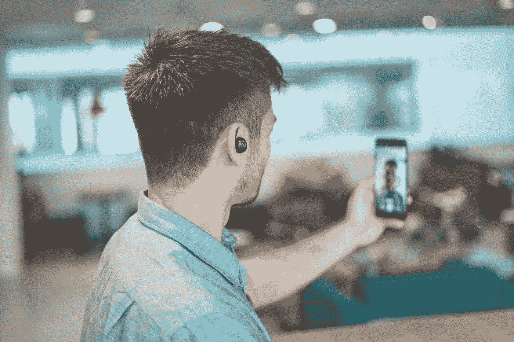
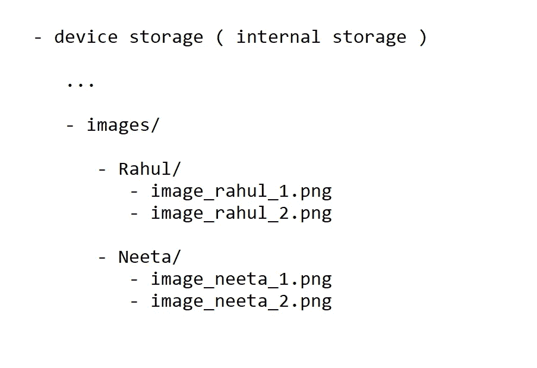
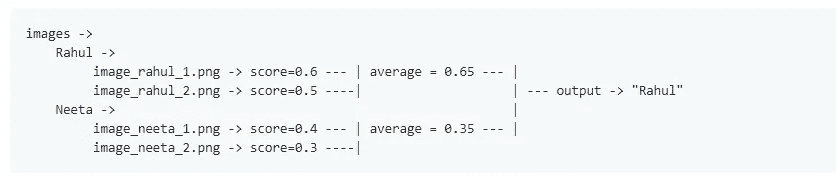
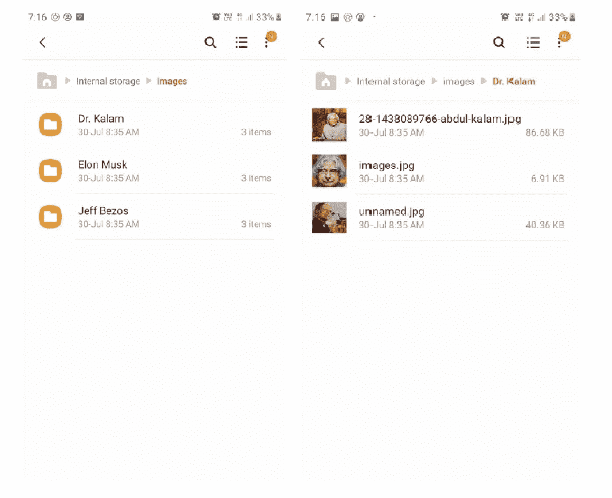

# 使用 FaceNet 在 Android 设备上进行人脸识别

> 原文：<https://towardsdatascience.com/using-facenet-for-on-device-face-recognition-with-android-f84e36e19761?source=collection_archive---------7----------------------->

## 📱[移动机器学习](https://equipintelligence.medium.com/list/stories-on-mobile-ml-with-kotlin-and-tf-lite-3ebee822c87b)

## 利用 Android 的 FaceNet 和 Firebase MLKit 的强大功能。

由[哈里·坎宁安](https://unsplash.com/@harrycunnningham1?utm_source=medium&utm_medium=referral)在 [Unsplash](https://unsplash.com?utm_source=medium&utm_medium=referral) 上拍摄的照片

随着对许多人进行即时识别和分类的需求增加，对人脸识别系统的需求与日俱增。无论是办公室的考勤系统，还是手机摄像头中的简单人脸检测器，人脸检测系统无处不在。对于边缘设备，这种需求甚至更大，因为它们有许多用途，如监控人群、机场乘客、公交车站等。

今天，我们将创建一个类似的人脸识别应用程序，完全从零开始。但是等等，有些特别的东西！

> 想象一下，你正在办公室里使用人脸检测系统。对于你办公室的 10 名员工来说，这个系统运行得非常好。但是，现在你的一个朋友来到了你的办公室。该系统可能无法识别您的朋友，因为它没有被编程这样做。所以，对于每一个新员工，你都需要修改系统并重新编程。

如果，

> 你不需要重新训练系统！为什么你不能保存这 10 名员工和你朋友的照片，而应用程序也能立即识别你的朋友呢？无需重新编写应用程序或任何其他系统，一切都可以在 Android 上运行！当你有新员工时，继续在单独的文件夹中添加他们的图像，应用程序就可以识别他们了。

直到故事结束，我们将创建这样一个应用程序！

GitHub 项目->

 [## Shu bham 0204/face recognition _ With _ FaceNet _ Android

### 存储你想认识的人的图像，应用程序将使用这些图像对这些人进行分类。我们…

github.com](https://github.com/shubham0204/FaceRecognition_With_FaceNet_Android) 

作者的项目/博客。

# 先决条件

在我们的应用程序中，我们将使用 CameraX、Firebase MLKit 和 TensorFlow Lite。如果你以前没有使用过这些库，一定要看看它们。

*   CameraX:官方代码实验室
*   [Firebase MLKit:在 Android 上用 MLKit 检测人脸](https://firebase.google.com/docs/ml-kit/android/detect-faces)
*   [Android 上的 tensor flow Lite](https://blog.tensorflow.org/2018/03/using-tensorflow-lite-on-android.html)

## FaceNet 上的一点

*   [FaceNet:人脸识别和聚类的统一嵌入](https://arxiv.org/abs/1503.03832)
*   [FaceNet —使用面部识别系统](https://www.geeksforgeeks.org/facenet-using-facial-recognition-system/)

# 1.将 Keras 模型转换为 TFLite 模型

FaceNet Keras 型号在[*n yoki-MTL/Keras-FaceNet*](https://github.com/nyoki-mtl/keras-facenet)回购上有售。下载完`.h5`模型后，我们将使用`tf.lite.TFLiteConverter` API 将我们的 Keras 模型转换成 TFLite 模型。

将 Keras 模型转换为 TFLite。

# 2.使用 CameraX 设置预览和 ImageAnalyser

为了实现一个实时的摄像机提要，我们使用 CameraX。我使用了[官方文件](https://codelabs.developers.google.com/codelabs/camerax-getting-started/#0)中的代码。接下来，我们创建一个实现了`ImageAnalysis`类的`FrameAnalyser`类，它将帮助我们检索相机帧并对它们进行推理。

正在设置 FrameAnalyser 类。

我们所有的分类代码都将来自于`analyze`方法。首先，使用 Firebase MLKit，我们将得到相机帧中所有面的边界框(一个`Bitmap`对象)。我们将创建一个`FirebaseVisionFaceDetector`，它在一个`FirebaseVisionInputImage`对象上运行人脸检测模型。

实现 FirebaseVisionFaceDetector。

# 3.使用 FaceNet 生成人脸嵌入并进行比较。

首先，我们将使用我们的 FaceNet 模型生成人脸嵌入。在此之前，我们将创建一个助手类来处理 FaceNet 模型。这个助手类将，

1.  使用我们从 Firebase MLKit 获得的边界框(如`Rect`)裁剪给定的相机帧。
2.  使用标准化的像素值将此裁剪图像从`Bitmap`转换为`ByteBuffer`。
3.  最后，使用 TF Lite Android 库提供的`Interpreter`类将`ByteBuffer`提供给我们的 FaceNet 模型。

在下面的代码片段中，可以看到封装了上述所有步骤的`getFaceEmbedding()`方法。

为 FaceNet 实现一个助手类

现在，我们有了一个类，它将返回给定图像中所有人脸的 128 维嵌入。我们回到一个`FrameAnalyser`的`analyze()`方法。使用刚刚创建的 helper 类，我们将生成人脸嵌入，并将它们与我们已经拥有的一组嵌入进行比较。

在此之前，我们需要获得一组预定义的嵌入，对吗？这些嵌入指的是我们需要认识的人。因此，该应用程序将读取用户设备内部存储中的`images`文件夹。如果用户想要识别两个用户，即 *Rahul* 和 *Neeta* ，那么他/她需要在`images`文件夹中创建两个单独的目录。然后，他/她必须将 *Rahul* 和 *Neeta* 的图像放在各自的子目录中。

我们的目的是读取这些图像，并产生一个`HashMap<String,FloatArray>`对象，其中键(`String`)将主题的名字像*拉胡尔*或*尼塔*和值(`FloatArray`)将相应的脸嵌入。通过查看下面的代码，您将对这个过程有所了解。

读取和生成设备存储器中存在的图像的嵌入。

下一步是将嵌入与合适的度量进行比较。我们可以使用 L2 范数或余弦相似性度量。使用`metricToBeUsed`变量选择 L2 范数或余弦相似度。我们计算每张图片的分数。然后我们计算每个用户的平均分数。平均分最好的用户就是我们的产出。

来自 [README.md](https://github.com/shubham0204/FaceRecognition_With_FaceNet_Android/blob/master/README.md) 的快照。

然后将`predictions`数组提供给`boundingBoxOverlay`类，该类绘制边界框并显示标签。在`BoundingBoxOverlay.kt`班。这里，我们使用两个`Matrix`来转换输出并显示在屏幕上。对于前置摄像头，我们必须翻转边界框的坐标，否则我们将在覆盖图中看到边界框的镜像。

显示边界框和标签。

# 结果呢

我试着用这个应用程序识别杰夫·贝索斯和埃隆·马斯克的脸，

应用程序的运行。

而且，我已经把图像存储在我的内部存储器中，

文件结构

# 更多资源

# 结束了

我希望你喜欢这个故事。感谢阅读！