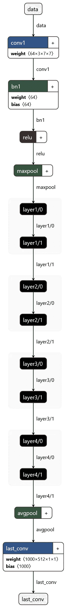
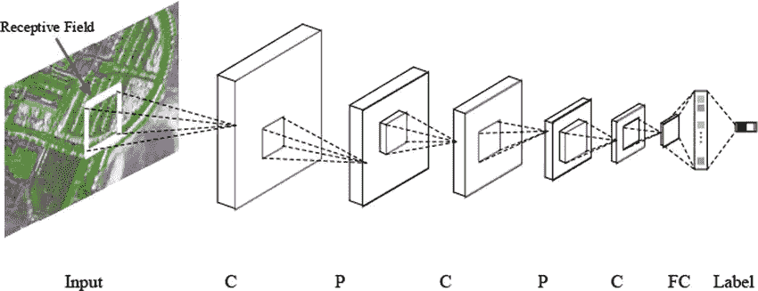
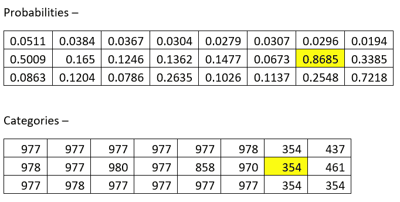
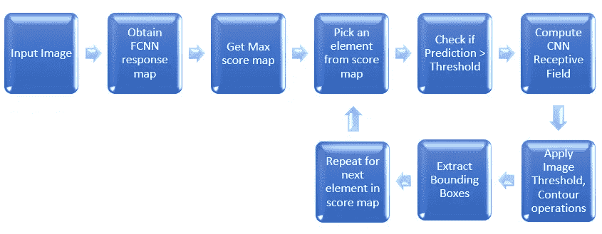
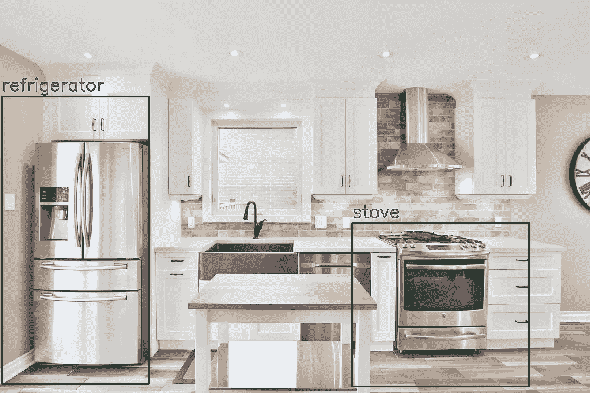
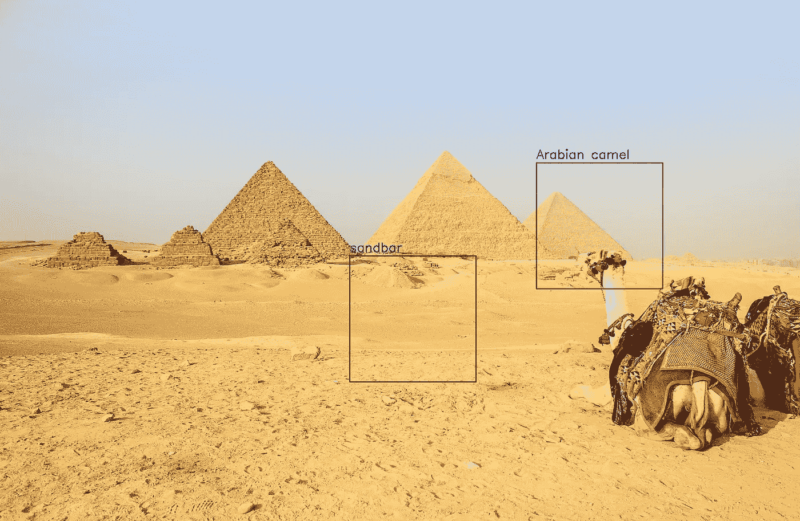
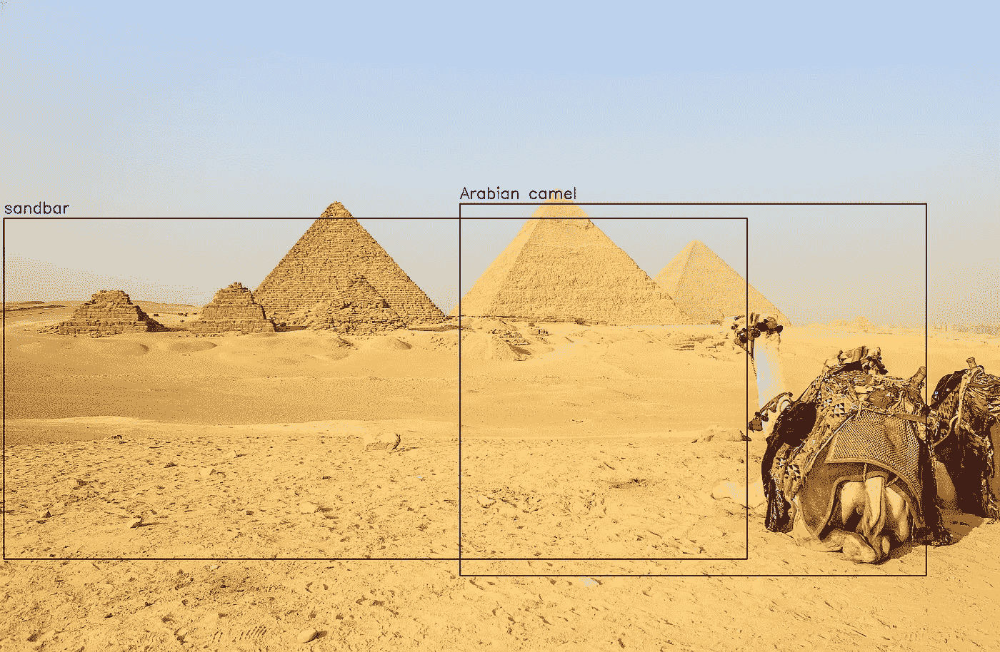
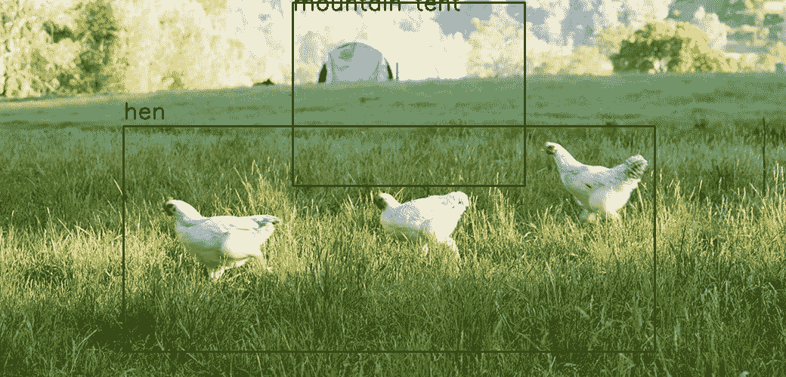

# 使用 FCNN 感受野进行物体检测

> 原文：<https://towardsdatascience.com/using-fcnn-receptive-fields-for-object-detection-8101d7acecff?source=collection_archive---------44----------------------->

## 从 PyTorch 中预先训练好的**图像分类器**中创建一个**物体检测器**

**目标检测**的任务是检测和空间识别(使用边界框等)。)图像中的各种对象，而**图像分类**告诉图像是否包含某些对象，而不知道它们的确切位置。

在这篇文章中，我描述了一种在 PyTorch 中从预训练的**图像分类**模型创建**对象检测**模型的方法。

尽管物体检测和图像分类是计算机视觉的两个不同类别，它们的训练方法也完全不同，但我们将在这篇文章中看到，它们的功能有一些重叠，我们可以利用它们来达到我们的目的。

这篇文章中提出的想法和实现是使用 **CNN 感受域**、**反向传播**和**全卷积网络**的概念构建的。

如果你对上面的一些术语不确定，我推荐你去看看下面的**LearnOpenCV.com**的博客，其中**T21 很好地介绍了这些概念。**

[任意大小图像上的全卷积图像分类](https://www.learnopencv.com/fully-convolutional-image-classification-on-arbitrary-sized-image/)

[使用反向投影的 CNN 感受野计算](https://www.learnopencv.com/cnn-receptive-field-computation-using-backprop/)

事实上，即使您已经非常熟悉这些术语，我仍然强烈建议您浏览一下上面的帖子，因为我所展示的实现扩展了上面的引用，并且为了简洁起见，我没有捕捉已经有了更好解释的细节。

虽然你可能会发现使用这种方法的结果不太匹配流行的对象检测器的性能，如 **YOLO** ，但是，这个练习的目的是描述一种方法，其中预训练的图像分类器可以用来创建对象检测器，而无需对带注释的边界框进行任何显式训练。

设定期望后，让我们开始吧。

# 一点背景

在这个练习中，我使用了 PyTorch 中提供的经过预训练的 **Resnet-18** 模型的稍微修改的版本。

具体来说，使用的模型是 Resnet-18 的变体，其中模型的最终(也是唯一的)全连接(或线性)层被 2D 卷积层取代，从而将模型转换为全卷积神经网络(FCNN)。

**全卷积 Resnet18** 模型架构如下所示:

FCNN Resnet-18(图片由作者使用 [Netron](https://lutzroeder.github.io/netron/) 获得)

作为前面提到的博客中提出的概念的快速回顾，FCNN 将任意大小的图像作为输入，并将包含模型对图像中检测到的对象的预测的激活/响应图作为输出。

使用反向传播算法，我们计算该响应图的感受野，并找出被检测物体在原始图像中的位置。

正如你现在所知道的，神经网络中特征图(或层)中像素的感受野代表影响其值的来自先前特征图的所有像素。这是一个有用的调试工具，可以了解网络在给出某个预测时在输入图像中实际看到了什么。

下图说明了这一概念

CNN 感受野(图片由[【洪诗】杜](https://www.researchgate.net/profile/Shihong_Du)转自[本文](https://www.researchgate.net/figure/Conventional-CNN-framework-interspersed-with-convolutional-layers-and-max-pooling-layers_fig3_300081672))

在以前的帖子中，我们只关注具有最大得分/概率的结果类别(我们毕竟只是想要一个图像分类器)，这次我们将更深入地提取所有模型的预测，并计算每个相应的感受域，这将为我们提供边界框。

# 我们开始吧

我们的程序开始于我们获得 FCNN Resnet-18 模型在输入图像上预测的反应图之后，使用的是我在本文开头提到的[这篇博客](https://www.learnopencv.com/cnn-receptive-field-computation-using-backprop/)中捕获的步骤。我不会在这篇文章中重复这些步骤，因为这将是重复的努力，而且没有必要让这篇文章变得更长。

您应该记得，FCNN 的响应图形状为[1 x 1000 x n x m]，其中 n 和 m 取决于输入图像和网络本身的宽度和高度。1000 对应于为 Resnet18 定型的 ImageNet 数据库的 1000 个类。

使用该响应图上的最大运算，我们从模型中获得顶部[n×m]预测或**得分图**，其可以被解释为在通过大小为 224×224(原始网络的输入图像大小)的滑动窗口获得的图像上的[n×m]个位置上执行的推断。

对于**得分图**中的每一个预测，我们都有概率(由 Softmax 层给出)和类别(来自 ImageNet)。

以下是形状[3 x 8]的分数图示例，其中突出显示了顶部预测:

得分图示例(图片由作者提供)

我们现在将检查这些[n×m]预测中的每一个，如果它的概率高于预定的阈值，则使用反向传播来计算它的感受野。

在这些感受野的每一个上，我们将应用 OpenCV 图像阈值和轮廓操作来获得边界框。

整个管道总结如下图所示:

FCNN 物体探测管道(图片由作者提供)

下面是实现的一个片段。从这里下载完整代码[。](https://github.com/DebalB/Python_public/tree/master/fcnn_object_detector_pytorch)

以下是我们取得的成果示例:

样品结果(图片由 [Sidekix 媒体](https://unsplash.com/@sidekix?utm_source=unsplash&utm_medium=referral&utm_content=creditCopyText)在 [Unsplash](https://unsplash.com/s/photos/kitchen?utm_source=unsplash&utm_medium=referral&utm_content=creditCopyText) 上拍摄)

# 处理重叠边界框

需要注意的重要一点是，网络可能会多次检测到同一个对象(概率各不相同)。这导致重叠边界框的问题，即使在标准对象检测算法中这也是典型的。

为了解决这个问题，我们使用了非极大值抑制方法。我用过 [**imutils**](https://github.com/jrosebr1/imutils) 包提供的函数*object _ detection . non _ max _ suppression()*。然而，可以使用实现相同目的的任何其他方法。

# 感受野计算选项

现在我想谈谈一个有趣的设计选择。

对于任何检测到的对象类别，其相应的感受野可以使用以下任一方法计算:

-最大激活像素

-净预测

不用说，根据我们上面的选择，最终的边界框会有很大的不同。

同样，相应的细节很好解释[本博客](https://www.learnopencv.com/cnn-receptive-field-computation-using-backprop/)。

但是，我将对它们进行简要总结，并对这两种方法产生的结果进行比较。

**选项-1:** 为类别的最大激活像素计算的感受野，仅查看响应图中的一个像素，并提供原始图像中最大化该像素的区域的边界框。

在某些图像(例如低分辨率图像)上，该选项很好地隔离了类别的每个单独实例，如下图所示:

适当的分割(*图片来源:Emmer &公司*)

但是，在某些图像(例如高分辨率图像)中，这可能会返回一个边界框，该边界框仅包围对象的一部分，而不是整个对象，例如，参见下图:

不完全检测(由[安德烈斯·达利蒙提](https://unsplash.com/@dallimonti?utm_source=unsplash&utm_medium=referral&utm_content=creditCopyText)在 [Unsplash](https://unsplash.com/s/photos/pyramids-and-camel?utm_source=unsplash&utm_medium=referral&utm_content=creditCopyText) 上拍摄)

**选项-2:** 为净预测计算的感受野考虑了类别的相应响应图中的每个[n×m]像素，并提供了原始图像中使该类别的净预测最大化的区域的边界框。

和以前一样，这种方法的结果随着所用图像的不同而不同。

对于某些图像，它返回整齐地包围整个对象的边界框，如下图所示:

正确检测边界框(照片由 [Andrés Dallimonti](https://unsplash.com/@dallimonti?utm_source=unsplash&utm_medium=referral&utm_content=creditCopyText) 在 [Unsplash](https://unsplash.com/s/photos/pyramids-and-camel?utm_source=unsplash&utm_medium=referral&utm_content=creditCopyText) 上拍摄)

但是，在某些图像上，获得的边界框可能会将类别的几个实例封闭在一起，如下所示:

分割不当(*图片来源:Emmer & Co.* )

# 结论是什么？

如您所见，对于两个选项中哪一个会产生更好的结果，并没有明确的结论。

我建议读者使用他们自己的图像数据集进行进一步的实验，并获得更广泛的想法，了解什么对他们有效，什么对他们无效。

正如我最初提到的，这篇文章的目的不是介绍一种鲁棒的对象检测方法，而是探索如何使用一个特定的模型来达到另一个目的。

在机器学习中，模型的创建者发现他们的创造即使在从未被训练过的任务中也表现良好，这并不罕见。

带着这样的想法，我想结束这个博客。

我希望你喜欢它，我很高兴听到你可能遇到的任何进一步的想法和发现。

从这里下载完整的代码。