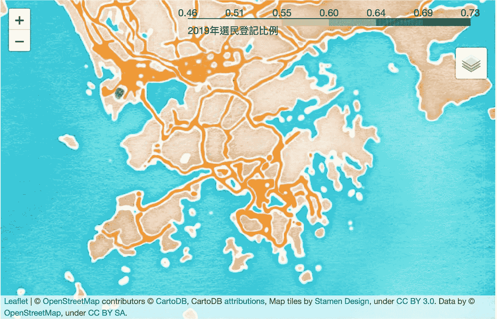

# 使用 leav 生成带有自定义工具提示的 Choropleth 地图(Python)

> 原文：<https://towardsdatascience.com/using-folium-to-generate-choropleth-map-with-customised-tooltips-12e4cec42af2?source=collection_archive---------10----------------------->

## 用数据标签在地图上显示香港选民和人口数据


由 [cyda](https://cydalytics.blogspot.com/) 拍摄

Folium 是在交互式地图上可视化数据的一个非常好的软件包。在这个演示中，使用了香港[选民统计](https://www.voterregistration.gov.hk/chi/statistic2019.html)和[人口数据](https://www.censtatd.gov.hk/hkstat/sub/sp150.jsp?productCode=B1130301)。数据经过预处理后存储在 [Consolidated Data.xlsx](https://github.com/cydalytics/HK_Voters_Distribution/blob/master/Consolidated%20Data.xlsx) 中。随意摆弄数据集=)

可以直接从[我的 Github repo](https://github.com/cydalytics/HK_Voters_Distribution) 中克隆文件。

# 包裹

薄层

# 功能

`folium`建立在 Python 生态系统的数据优势和`leaflet.js`库的映射优势之上。用 Python 处理你的数据，然后通过`folium`在活页地图上可视化。

# 示范

1.  用不同的图块生成简单的地图
2.  准备定制的数据标签并在悬停时显示在地图上

# 数据

Consolidated Data.xlsx


照片由 [cyda](https://cydalytics.blogspot.com/) 拍摄

**任务 1:用不同的图块生成简单的地图**

```
hk_geo = r’hkg_adm1.geojson’
voter_proportion = data[['Eng_name','Proportion']]map1 = folium.Map([22.38, 114.15], tiles='cartodbpositron', zoom_start=10)tiles = ['stamenwatercolor', 'cartodbpositron', 'openstreetmap', 'stamenterrain']for tile in tiles:
    folium.TileLayer(tile).add_to(map1)

choropleth = folium.Choropleth(
    geo_data = hk_geo,
    name = 'choropleth',
    data = voter_proportion,
    columns = ['Eng_name', 'Proportion'],
    key_on = 'feature.properties.name_1',
    fill_color = 'YlGn',
    fill_opacity = 0.7,
    line_opacity = 0.2,
    legend_name = '2019 年選民登記比例', # Voter Proportion (%) in 2019
    highlight = True
).add_to(map1)folium.LayerControl().add_to(map1)# Display Region Label
choropleth.geojson.add_child(
    folium.features.GeoJsonTooltip(['name_1'], labels=False)
)map1
```

逐步解释:

```
hk_geo = r’hkg_adm1.geojson’
```

要在地图上绘制数据，需要一个地图 json 文件来定位位置。本演示中使用的 json 文件是从[这个站点](https://abhijeet.carto.com/tables/hkg_adm1/public)下载的。


这定义了底图的初始设置。

```
tiles = ['stamenwatercolor', 'cartodbpositron', 'openstreetmap', 'stamenterrain']for tile in tiles:
    folium.TileLayer(tile).add_to(map1)
```

Folium 支持在同一个地图中显示不同的地图框，下面是一些常见的地图框。您可以在每张图片的标题中找到瓷砖类型。

```
folium.LayerControl().add_to(map1)
```

此代码将图层选择按钮(显示在右上角)添加到地图，如果此代码丢失，地图将显示最后添加的图块，并且图块样式不能更改。


tiles = ' cartodbpositron '，照片由 [cyda](https://cydalytics.blogspot.com/) 拍摄



tiles=“雄蕊水彩”，照片由 [cyda](https://cydalytics.blogspot.com/) 拍摄


tiles='openstreetmap '，照片由 [cyda](https://cydalytics.blogspot.com/) 拍摄


tiles='stamenterrain '，照片由 [cyda](https://cydalytics.blogspot.com/) 拍摄

```
choropleth = folium.Choropleth(
    geo_data = hk_geo,
    name = 'choropleth',
    data = voter_proportion,
    columns = ['Eng_name', 'Proportion'],
    key_on = 'feature.properties.name_1',
    fill_color = 'YlGn',
    fill_opacity = 0.7,
    line_opacity = 0.2,
    legend_name = '2019 年選民登記比例', # Voter Proportion (%) in 2019
    highlight = True
).add_to(map1)
```

*叶。Choropleth* 根据数据“比例”将彩色层添加到地图中。“Eng_name”是要与 geojson 文件的位置进行映射的数据的关键字。请确保 json 文件中位置名称的拼写与数据中的关键字相同。


照片由 [cyda](https://cydalytics.blogspot.com/) 拍摄

**任务 2:准备定制的数据标签并在悬停时显示在地图上**

要向地图添加自定义数据标签，使用*follow . features . geojsontooltip*。通过使用此代码，带标签的值将被追加到 geojson 文件中。


照片由 [cyda](https://cydalytics.blogspot.com/)

首先，您需要研究 json 文件的结构，并将工具提示数据添加到“属性”中。上面的脚本还允许您找出要在*leav 的 *key_on* 中使用的映射键。Choropleth* 。

```
key_on='feature.properties.name_1',
```

在工具提示中，我想用中文显示地区名称和数据值。运行代码后，您将看到附加的工具提示数据。

```
# prepare the customised text
tooltip_text = []
for idx in range(len(data2)):
 tooltip_text.append(data2[‘Chi_name’][idx]+’ ‘+ 
 str(int(round(data2[‘18–35 (Proportion in 2019)’][idx]*100)))+’%’)
tooltip_text# Append a tooltip column with customised text
for idx in range(len(tooltip_text)):
    map_data['features'][idx]['properties']['tooltip1'] = tooltip_text[idx]
```

预期产出:


照片由 [cyda](https://cydalytics.blogspot.com/)

```
hk_geo = map_data
voter_proportion = data2[['Eng_name','18-35 (Proportion in 2019)']]map2 = folium.Map([22.38, 114.15], tiles='cartodbpositron', zoom_start=10)choropleth = folium.Choropleth(
    geo_data=hk_geo,
    name='選民比例',
    data=voter_proportion,
    columns=['Eng_name','18-35 (Proportion in 2019)'],
    key_on='feature.properties.name_1',
    fill_color='YlOrBr', # ‘BuGn’, ‘BuPu’, ‘GnBu’, ‘OrRd’, ‘PuBu’, ‘PuBuGn’, ‘PuRd’, ‘RdPu’, ‘YlGn’, ‘YlGnBu’, ‘YlOrBr’, and ‘YlOrRd’.
    fill_opacity=0.7,
    line_opacity=0.2,
    legend_name='2019 年 18-35 歲選民 vs 18-35 歲人口比例',
    highlight=True
).add_to(map2)folium.LayerControl().add_to(map2)
choropleth.geojson.add_child(
    folium.features.GeoJsonTooltip(['tooltip1'], labels=False)
)map2.save('map2.html')
IFrame('map2.html', width=700, height=450)
```

绘图脚本类似于任务 1 中显示的脚本。在*leav . features . geojsontooltip*中，请选择您存储工具提示数据的变量名称。在我的例子中，它是“tooltip1”。 *labels = False* 隐藏变量名(即‘tool tip 1’)不与数据标签一起显示。


cyda 拍摄的照片


cyda 拍摄的照片

也有一些替代方法将数据标签添加到绘图中，但我发现这种方法更方便。如果你知道添加标签的其他方法，请随意评论。希望你喜欢我的文章=)

要了解更多关于使用 leav 的信息，请前往[官方 Github 资源库](https://github.com/python-visualization/folium)。

如果你觉得我的文章有用，请在我的 linkedIn 页面上为我的技能背书，鼓励我写更多的文章。

原载于[cydalytics.blogspot.com](https://cydalytics.blogspot.com)