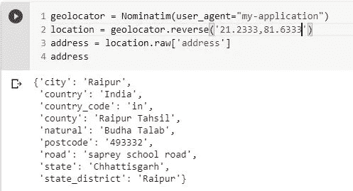

# 使用免费 API 从公共 IP 地址获取地理位置信息

> 原文：<https://towardsdatascience.com/using-free-api-to-get-geolocation-information-from-public-ip-address-8fe23a88df9b?source=collection_archive---------36----------------------->


## 为娱乐而创作的项目

这篇文章演示了我使用免费 API 创建的一个项目。最初，目的是理解和学习更多关于 API 调用的知识。我在一家从事地理空间信息的公司实习。我在那里工作时得到了灵感。我将尝试简单地解释我使用的代码和方法，并从潜在的商业角度进行解释。同样，这是免费的，不需要额外的验证。我们开始吧！

这个项目的商业视角是确定人们访问网站的区域，基本上是受众细分。例如，一个电子商务网站想知道纽约有多少人在浏览他们的网站。因此，假设我是那家电子商务公司的老板，我在网上销售游戏设备，我想知道大概有多少人从城市或世界各地访问我的网站。我只有消费者的公开 IP 地址。现在，我想知道我的消费者来自哪个州和国家。[这个](https://freegeoip.app/) API 将从我的消费者的公共 IP 地址给我经纬度。从那里，我可以使用 [geopy](https://pypi.org/project/geopy/) (名字)来获得地址，使用派生纬度和经度。很简单，对吧。既然思考和识别资源的工作已经完成，让我们开始学习一些 python 代码吧！

等一下，我没有所有消费者的公共 IP 地址，我只是在想象拥有一个游戏小工具公司。不用担心，Python 可以支持我的想象力，我们看看如何。

```
*import* random*import* socket*import* structsocket.inet_ntoa(struct.pack('>I', random.randint(1, 0xffffffff)))
```

如果您在一个 Jupiter 笔记本中运行上面的行，您将看到下面的输出。


好的，所有这些都很好，但是一次查找一个用户将会很耗时并且很困难，让我们制作一个自动化的 python 脚本，它将生成 100 个像这样的随机 IP 地址，查找它们的位置并将结果保存在一个 CSV 文件中。我在开发这个项目时使用了 VScode，但为了简单和易用，我将在最后提供一个包含源代码的 colab 笔记本。另外，我也会在最后给出 GitHub 的链接。

为此，我需要导入以下库。请求，json 是 API 调用所需要的，global_land_mask 用于验证纬度和经度(后面会讨论)。

```
import requestsimport pandas as pdimport numpy as npimport jsonimport randomimport socketimport structfrom geopy.geocoders import Nominatimimport osfrom global_land_mask import globe
```

如果您在导入库时遇到任何错误，只需在终端中使用以下命令。

```
pip install <library>  #(pip install global-land-mask)
or
conda install <library>
```

下面是生成 100 个随机 IP 地址的函数。

```
def getting_ip_address():
    """This function returns a list of random IP address"""
    new, explored=[],[]
    i=0
    while i<100:
        ip = socket.inet_ntoa(struct.pack('>I', random.randint(1, 0xffffffff)))
        if ip in explored:
            continue
        else:
            new.append(ip)
        i+=1
    new = pd.DataFrame(new, columns=['ip'])
    return new
```

我还创建了一个存储生成的 IP 地址的列表，该列表稍后将用于检查该 IP 地址之前是否已经创建过。我已经把最终的名单转换成了熊猫的数据框架，因为和熊猫一起工作我会更舒服。现在，下一步将是识别和获取他们的纬度和经度信息。

```
def getting_ip(row):
    """This function calls the api and return the response"""
    url = f"[https://freegeoip.app/json/{row](https://freegeoip.app/json/{row)}"       # getting records from getting ip address
    headers = {
        'accept': "application/json",
        'content-type': "application/json"
        }
    response = requests.request("GET", url, headers=headers)
    respond = json.loads(response.text)
    return respond
```

这个函数获取每个 IP 地址，并向 API 发送请求，以获取经度和纬度信息以及其他信息。下面给出了一个位置的输出示例。


输出是 JSON 格式的，保存为 pandas 数据报中的一列。之后，从该列中可以推导出纬度、经度和时区等信息，如下所示:

```
def get_information():
    """This function calls both api and add information to the pandas dataframe column"""
    new = getting_ip_address()
    new['info'] = new['ip'].apply(lambda row: getting_ip(row))
    new['time_zone'] = new['info'].apply(lambda row: row['time_zone'])
    new['latitude'] = new['info'].apply(lambda row: row['latitude'])
    new['longitude'] = new['info'].apply(lambda row: row['longitude'])
    new['on_land'] = new.apply(lambda row: globe.is_land(row['latitude'],row['longitude']),axis=1)
    new = new[new['latitude']!=0]
    new = new[new['on_land']==True]
    new['address'] = new.apply(lambda row: getting_city_nominatim(row),axis=1)
    return new
```

这是主要的信息提取函数，它调用两个 API 并处理它们的信息。首先，记住上面显示的生成 100 个随机 IP 地址的函数，调用该函数并返回一个包含 IP 地址的数据帧。之后，使用 lambda 函数为每个 IP 地址调用 API，并将结果存储在名为“info”的列中。之后，从该列中为每个 IP 地址导出时区、纬度和经度。现在，它涉及到之前提到的 global_land_mask 库。我想检查一下纬度和经度是属于陆地还是海洋。这个 globe.is_land(latitude，longitude)为保存在另一个名为 on_land 的列中的每一行返回布尔值 True 或 False，稍后在 dataframe 上进行一个简单的过滤，以删除任何纬度是否正好为 0 以及纬度和经度是否在海洋中。然后调用 geopy Nominatim API 来获得更深的地址。调用 geopy API 的函数如下所示:

```
def getting_city_nominatim(row):
    """This function calls the geopy api and return the json address output"""
    try:
        lat = row['latitude']
        lon = row['longitude']
        geolocator = Nominatim(user_agent="my-application")
        location = geolocator.reverse(f"""{lat,lon}""")
        address = location.raw['address']
        return address
    except:
        print('timeout')
```

该函数使用从早期 API 调用中获得的纬度和经度来调用 geopy Nominatim。在“192.168.10.111”返回纬度和经度之前，相同的 IP 地址显示为一个示例，下图显示了一个使用该纬度和经度的示例 nominatim 调用。



现在，我已经准备好了所有的构建模块，我需要将结果保存在 CSV 中。其功能如下所示:

```
def append_to_existing_df(new):
    """This function appends the new ip addresses to the dataframe"""
    if os.path.isfile(f'{os.path.abspath("")}\location_of_ip_address.csv'):
        new.to_csv('location_of_ip_address.csv', mode='a', header=False,index=False)
    else:
        new.to_csv('location_of_ip_address.csv', mode='w', header=True,\
                   columns=['ip','info','time_zone','latitude','longitude','address'],index=False)def deleting_duplicate_entries():
    """This function makes sure there are no duplicate ip addresses saved in the csv file"""
    df = pd.read_csv('location_of_ip_address.csv')
    df.sort_values('ip',inplace=True)
    df.drop_duplicates(subset='ip',keep='first',inplace=True)
    df.to_csv('location_of_ip_address.csv',index=False)
```

上面的第一个函数查找是否存在 CSV 文件，如果该文件存在，则将结果追加到现有文件中，如果该文件不存在于该目录中，则创建一个新的 CSV 文件。os.path.abspath(" ")返回 python 文件所在的当前目录的路径。和 os.path.isfile()检查文件是否存在。在保存它们并多次运行程序后，我注意到几个 IP 地址包含相同的内容，因为最初的重复检查只针对 100 个随机生成的 IP 地址。但是现在，我已经运行该程序多次，同一个 IP 地址在多个地方被发现。为了消除这种情况，后来添加了一个 add on 函数，该函数读取 pandas 数据帧中的整个 CSV 并删除重复值，然后将文件保存回来。

现在，我们已经准备好了所有的函数，下面的代码块显示了调用之前创建的所有函数的主函数。

```
def main():
    """main function"""
    new = get_information()
    append_to_existing_df(new)
    deleting_duplicate_entries()if __name__ == '__main__':
    main()
```

运行后，这会创建一个 CSV，其结果如下所示:


这是我创建的项目。我只是概述了我是如何想出这个主意，创造材料，以及自动化一个过程的。我没有深究太多的技术细节。我打算为此单独写一篇文章。这可以进一步改进和修改，例如，进一步自动化该过程，以便它在每天的特定时间运行。这里显示的源代码在 [colab](https://colab.research.google.com/drive/1mJdfqk9ZH7EleRkJGilNaw3iPZqbaA5T?usp=sharing) 中给出。另外，在 [GitHub](https://github.com/aesutsha/Finding_location_using_random_ip_address) 中也有。

非常感谢您阅读这篇文章。这是我第一次为媒体写作，我会努力提高我的写作水平，并经常发表一些项目和想法。