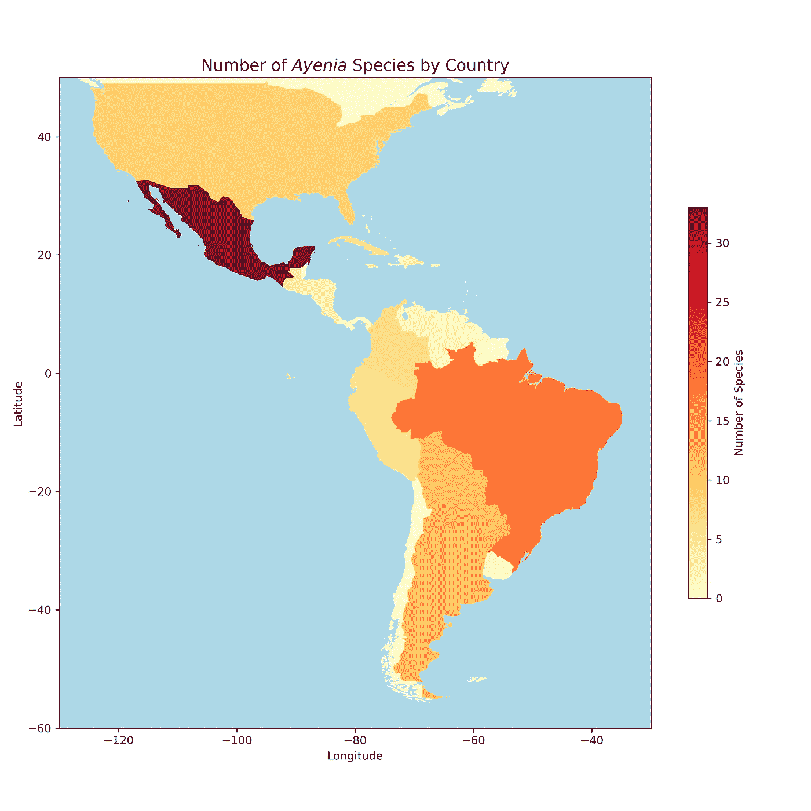
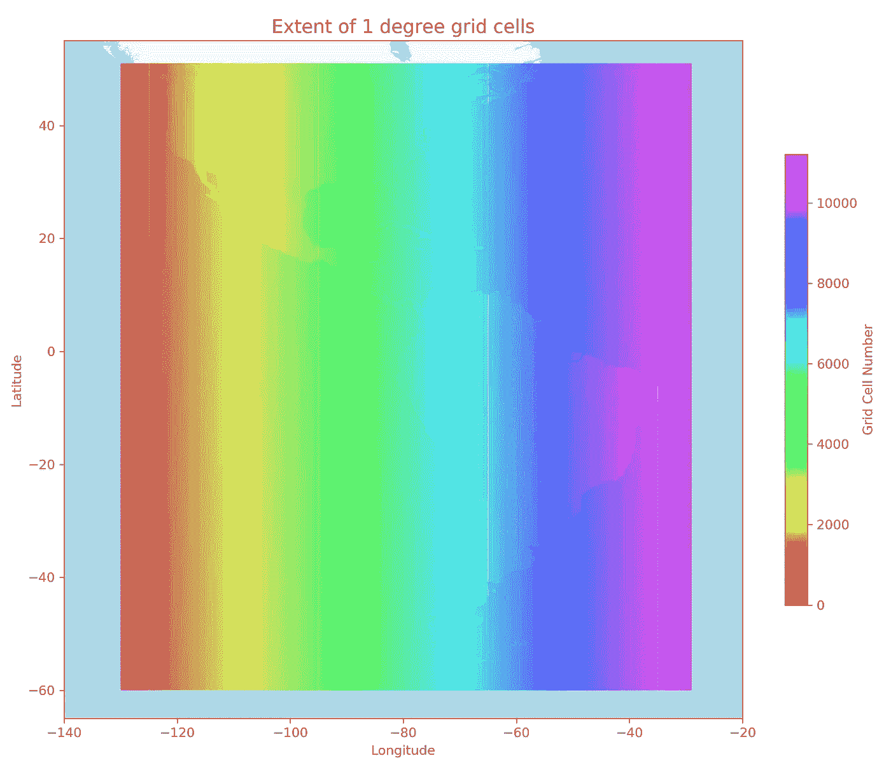
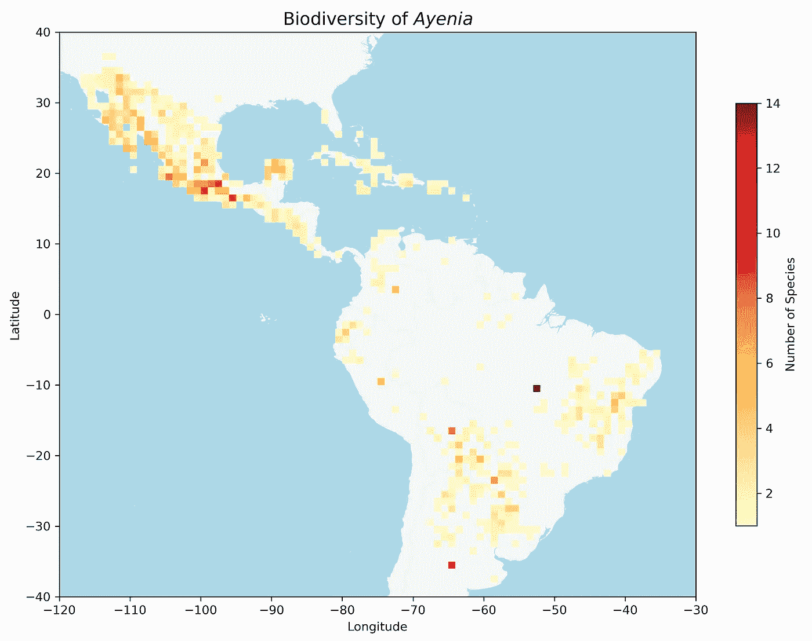

# 利用 GBIF 数据和 GeoPandas 绘制生物多样性趋势图

> 原文：<https://towardsdatascience.com/using-gbif-data-and-geopandas-to-plot-biodiversity-trends-6325ab6632ee?source=collection_archive---------42----------------------->

## 基于 Python 的生物多样性数据热图

我在[的上一篇文章](https://medium.com/@wvsharber/introduction-to-gbif-the-global-biodiversity-information-facility-8a0ab65aae34)中介绍了 GBIF 以及如何使用 Python 代码通过 API 访问这一优秀的生物多样性数据源，在这篇文章中，我将展示几种不同的方法来绘制之前下载的生物多样性数据。这将是一篇代码量很大的文章，主要使用 GeoPandas，并以复制我在论文中使用的图形而告终。然而，我使用了 R 和 ArcGIS 的组合来创建该图，现在我只使用 Python！希望这将是一个关于 GeoPandas 制图的有用教程，geo pandas 是处理地理空间数据的一个很好的工具！

如果您对不同地区之间的生物多样性变化感兴趣，地图是可视化空间差异的一种很好的方式。在进化生物学中，知道不同的生物多样性“热点”在哪里，也就是相对高生物多样性的区域，通常是很有趣的。这些热点可以代表高物种形成率的区域，或者如果你正在观察一个单一的生物群体，它们*可能*代表它们的起源区域。良好的生物多样性可视化对生物学家非常有用！

创建高质量的地图是复杂的，当我作为一名研究生第一次处理这个问题时，我非常依赖于预先存在的软件和图书馆中非常有用的 GIS 帮助台。现在我有了更多的编程技能，用 Python 重做这个问题真的很有趣。在 Python 中，有一些很好的处理地理空间数据的包。如果你正在处理栅格数据(基于像素的数据)，一定要看看[栅格](https://rasterio.readthedocs.io/en/latest/)。不过在这个问题中，我发现使用包 [GeoPandas](https://geopandas.org/index.html) 更容易，它是基于非常有用的 Pandas DataFrame 构建的，但是使用 shapely 库合并了一个几何特性。就像 Pandas 中有数据框和系列一样，GeoPandas 中有地理数据框和地理系列，允许您将其他要素与地理数据相关联。几乎任何可以用熊猫做的事情都可以用地质公园来做。

绘制生物多样性地图的一种方法是通过一些现有的地理划界，如国家。这些被称为 choropleth 地图，有一些不同的软件包可以制作它们。这在 GeoPandas 中非常容易，它基于 matplotlib 进行绘图。这是我们首先要做的。

**通过全国范围的物种计数绘制地图(Choropleth 地图)**

从物种数据、原产国和地理坐标的数据框架开始，获得每个国家的物种数量是一个简单的聚合函数。我建议在你的数据集中添加一列，使用三个字母的 ISO A3 代码来代表每个国家，这样在以后加入数据框时事情会简单得多。你可以查看我的 GitHub(这篇文章底部的链接)来了解细节。

除了物种数据框之外，您还需要一个地理数据框作为底图进行绘制。我使用了来自 [NaturalEarth](https://www.naturalearthdata.com/downloads/50m-cultural-vectors/) 的中等分辨率的乡村形状文件。在下面的代码中，我展示了如何合并两个数据帧，然后绘制 choropleth 图(图 1)。

```
import pandas as pd
import matplotlib.pyplot as plt
import geopandas as gpd*#Read back in csv file*
df = pd.read_csv("../data/Ayenia_cleaned_dataframe.csv")*#Create a new dataframe with just number of species per country and #the country code*
df_plot = pd.DataFrame(df.groupby('country')['species'].nunique().sort_values(ascending=False))*#Load a country map*
countries = gpd.read_file("../data/ne_50m_admin_0_countries/ne_50m_admin_0_countries.shp", encoding = 'UTF-8')*#Only keep the relevant columns* countries = countries[['NAME', 'ISO_A3', 'CONTINENT', 'geometry']]*#Restrict countries to only North and South America*
countries = countries[(countries['CONTINENT'] == 'North America') | (countries['CONTINENT'] == 'South America')]*#Join with the species count dataframe*
countries = countries.merge(df_plot, 
                            how = 'outer', 
                            left_on = 'ISO_A3', 
                            right_on = 'code')*#Drop the ISO code column we merged on*
countries.drop('code', axis = 1, inplace = True)#*Fill species count with 0 for countries that weren't in the species #count dataframe*
countries['species'].fillna(value = 0, inplace = True)#*Drop any remaining NaN (one small island country wasn't in the #basemap file, not a big deal here)*
countries.dropna(inplace = True)#*Now plot the choropleth with GeoPandas and matplotlib*fig, ax = plt.subplots(1, 1, figsize= (10, 10))countries.plot(column='species',
               ax = ax, 
               legend = True,
               cmap = 'YlOrRd',
               legend_kwds={'label': "Number of Species", 
                            'shrink': 0.5}) ax.set_facecolor("lightblue")
plt.xlim((-130, -30))
plt.ylim((-60, 50))
plt.xlabel('Longitude')
plt.ylabel('Latitude')
plt.title(r"Number of $Ayenia$ Species by Country", 
          fontdict = {'fontsize': 'x-large'})
plt.tight_layout()
```



图一。每个国家的*叶蝉物种数量分布图。*

虽然 choropleth 显示了物种多样性在 Ayenia 的位置，但它还不够具体。其中一些国家非常大(如巴西、美国)，因此了解这些物种在这些国家的什么地方会更有意思。此外，通过给整个国家着色，地图可能会产生误导。例如，在南美洲的阿根廷， *Ayenia* 只限于该国北部地区(零下 30 度以上)，而在美国， *Ayenia* 只出现在该国最南部地区。我想更真实地展示这些植物是在哪里发现的。

**通过网格单元绘制生物多样性图**

对于下一张地图，我想计算地图上每 1 个方格中可以找到的物种数量。这将绘制一张更详细的地图，显示艾叶尼亚的生物多样性。为了做到这一点，我必须完成以下步骤:

1.  使用 GeoPandas 将物种数据框中的坐标更改为 shapely 对象
2.  在我们感兴趣的区域内创建 1 格网像元的地理数据框架
3.  计算每个网格单元内有多少物种
4.  绘制网格

下面是我为每个步骤编写的代码:

```
#*1\. Import species data into a GeoDataFrame*
species_gdf = gpd.GeoDataFrame(df, 
              geometry=gpd.points_from_xy(df['decimalLongitude'], 
                                          df['decimalLatitude']),  
              crs = "EPSG:4326")*#2\. Create GeoDataFrame with 1 degree grid cells
#Make list of 1 degree grid cells with shapely polygons* from shapely.geometry import Polygonlong_range = list(range(-130, -29))
lat_range = list(range(-60, 51))poly_list = []for x in long_range:
    for y in lat_range:
        new_poly = Polygon([(x, y), 
                            (x + 0.99999, y), 
                            (x + 0.99999, y + 0.99999), 
                            (x, y + 0.99999)])
        poly_list.append(new_poly)#*Make GeoDataFrame from list of polygons, making sure that the #coordinate reference system aligns with your data points DF*
grid_df_1d = gpd.GeoDataFrame(geometry = poly_list, 
                              crs = species_gdf.crs)#*Add a column of cell numbers for visualization purposes*
grid_df_1d['cell_no'] = list(range(0, len(grid_df_1d)))
```

此时，我们有了一个包含感兴趣范围内非重叠 1 格网单元的地理数据框架(图 2)。您可以轻松地修改此代码，使其具有更小或更大的网格单元大小(比如 0.5 或 10)，并根据您的需要覆盖更大或更小范围的地球部分。我建议让它尽可能的小，因为这下一步不是很有效率，在我的笔记本电脑上运行需要 30 多分钟。



图二。研究区域内 1 格网单元的范围。为了说明的目的，示出了单元号。

```
#*3\. Calculate the number of species in each grid cell* #*Make a dictionary to store a list of each grid cell's species*grid_species = {}for x in list(range(0, len(grid_df_1d))):
    grid_species[f'{x}'] = []#*For each species in the species dataframe, determine whether or not #it's within the bounds of the polygons in the grid dataframe. If it #is, add that species to the list in the grid_species dict (This step is very slow and inefficient! Does anyone know of a better way??)*for ind_s, val_s in species_gdf.iterrows():
    for ind_g, val_g in grid_df_1d.iterrows(): 
        if val_s['geometry'].within(val_g['geometry']):
            grid_species[f"{val_g['cell_no']}"].append(val_s['species'])#*Now count the number of unique species in each list and save in a #new dictionary and then add data to the grid dataframe*import numpy as np
grid_counts = {}for k, v in grid_species.items():
    grid_counts[k] = len(np.unique(v))grid_df_1d['species_count'] = np.zeros(len(grid_df_1d))
for k, v in grid_counts.items():
    grid_df_1d.loc[int(k) ,'species_count'] = v#*Drop cells that don't have any species in them*
grid_df_1d_nozero = grid_df_1d.drop(grid_df_1d[grid_df_1d['species_count'] == 0].index, axis = 0)#*4\. Plot the grid*fig, ax = plt.subplots(1, 1, figsize = (10, 10))
countries.plot(ax = ax, color = 'whitesmoke')
grid_df_1d_nozero.plot(column = 'species_count', 
                       ax = ax, 
                       legend = True, 
                       cmap = 'YlOrRd',
                       legend_kwds={'label': "Number of Species", 
                                    'shrink': 0.5})
ax.set_facecolor('lightblue')
plt.xlabel('Longitude')
plt.ylabel('Latitude')
plt.title(r"Biodiversity of $Ayenia$", 
          fontdict = {'fontsize': 'x-large'})
plt.xlim((-120, -30))
plt.ylim((-40, 40))
plt.tight_layout()
```



图 3。横跨北美和南美的每 1 个网格单元中的叶虫种类数。

现在，我们有了一个更好的表现，可以看出艾叶尼亚在哪里生长，在哪里不生长，哪里有更多的物种，哪里有更少的物种。在图 3 中，你可以看到墨西哥，尤其是墨西哥南部，是 T2 艾尼亚多样性的热点。在巴西南部以及巴拉圭、玻利维亚和阿根廷北部附近地区，还有几个热点。这些地区都有相似的栖息地，包括季节性干燥的热带森林或稀树草原。在巴西和阿根廷的中部有几个网格单元，它们的物种数量非常高，但这些可能不是真实的，因为我们数据中的一些标本具有模糊的位置数据，并且在该国中部给出了 GIS 坐标。以后我得用手移除它们。

我希望这些代码对学习如何绘制生物多样性地图有用。如果任何人有兴趣将其应用于他们自己的有机体群体，并需要帮助来运行它，我很乐意帮助你！

[这是我在 Jupyter 笔记本上的 GitHub 页面](https://github.com/wvsharber/gbif-occurences)的链接。