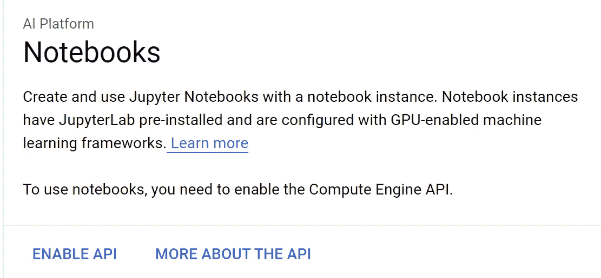
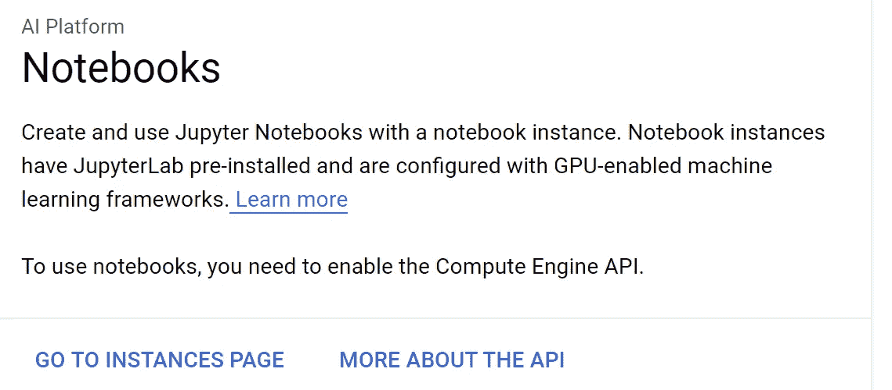
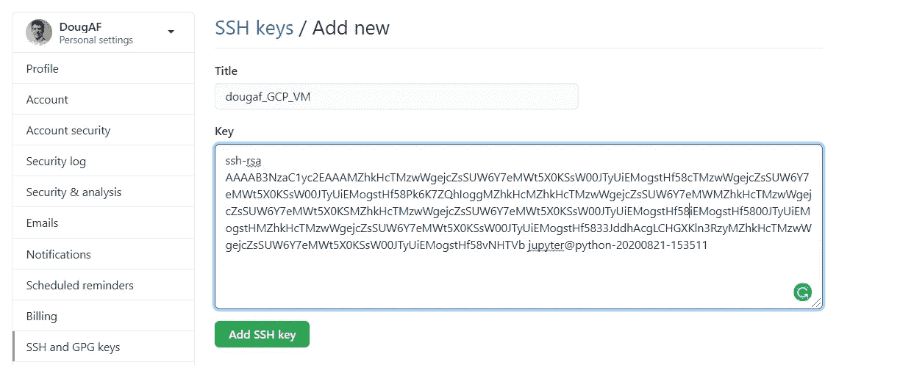

# 使用 GCP 人工智能平台笔记本作为可复制的数据科学环境

> 原文：<https://towardsdatascience.com/using-gcp-ai-platform-notebooks-as-reproducible-data-science-environments-964cba32737?source=collection_archive---------43----------------------->

## 使用预配置的云托管虚拟机解决 Python 和 Jupyter 笔记本电脑的再现性问题。

作者:[爱德华·克鲁格](https://www.linkedin.com/in/edkrueger/)和[道格拉斯·富兰克林](https://www.linkedin.com/in/douglas-franklin-1a3a2aa3/)。

照片由 Michael Dziedzic 在 Unsplash 上拍摄

在本文中，我们将介绍如何设置一个云计算实例，以便在有或没有 Jupyter Notebook 的情况下运行 Python。然后，我们展示如何将该实例连接到 Github，以实现流畅的云工作流。

我们利用云计算实例来获得灵活的 Python 和 Jupyter 环境，同时保持企业数据科学平台的可再现性。

这些人工智能平台笔记本电脑配置了许多数据科学和分析包，包括 NumPy、Pandas、Scikit-learn 和 TensorFlow。通常，我们不鼓励使用臃肿的虚拟机。然而，我们的分析机器上的包膨胀不是一个大问题，因为我们只保存结果(模型、数据、报告)供以后使用。只需要这个结果和运行我们的模型所需的几个包就可以让我们忽略 VM 上的大量包。

例如，在这篇中型文章中，我们将 NLP 模式推送到云中，而不必担心依赖性。

 [## 使用 Docker、GCP 云运行和 Flask 部署 Scikit-Learn NLP 模型

### 构建一个服务于自然语言处理模型的应用程序，将其容器化并部署的简要指南。

towardsdatascience.com](/deploy-a-scikit-learn-nlp-model-with-docker-gcp-cloud-run-and-flask-ba958733997a) 

请注意，AI 平台笔记本已经安装了 GCP 服务的所有客户端包，并且已经过认证，可以轻松访问同一个 GCP 项目中的任何内容。此外，这个平台不仅为我们提供了对 Jupyter 笔记本的访问，还提供了 Python 控制台和 CLI，我们可以在其中运行 BASH 命令。

# 获得 GCP 账户

谷歌的人工智能平台笔记本电脑为数据科学家和机器学习开发人员提供了一个 JupyterLab 和 Python 环境，用于实验、开发和将模型部署到生产中。用户可以创建运行 JupyterLab 的实例，这些实例预装了常见的软件包。

在我们可以建立一个人工智能平台笔记本之前，我们必须建立一个帐户和账单，不要担心新用户会获得 300 美元的免费积分！

访问 [GCP 人工智能平台](https://cloud.google.com/ai-platform-notebooks)，点击“转到控制台”

请务必单击下面的“启用 API”来访问笔记本。

启用 API

一旦我们有帐单设置，我们可以开始一个项目。

# 启动您的第一个 GCP 人工智能平台笔记本实例

现在我们需要选择运行虚拟机的硬件。如果您要进行测试，请确保设置尽可能便宜的机器！

启用 API 后，弹出选项将变为如下所示，单击“转到实例页面”开始。

单击转到实例页

“实例”页面可能会让您在其他时间选择“启用 API”，请务必这样做。然后点击“新建实例”按钮，选择“Python 2 和 3”

笔记本实例

这将打开一个选项菜单，您可以在其中输入您想要使用的区域。请注意，不同的地区可能有不同的定价。一旦您选择了一个区域，您将需要单击“定制”并选择具有最少 RAM 的机器以获得最低的成本。在我们的示例中，它是具有 3.75GB 内存的“n1-standard-1”虚拟机。

这个实例只会在运行时产生费用，并且可以随时轻松暂停！如果需要，您可以在实例暂停时使用下面的下拉菜单更换硬件。

选择低成本的机器

现在我们可以使用 SSH 将我们的 VM 连接到 GitHub，这样我们就可以轻松地将`push`和`pull`连接到我们的存储库。

# 设置 SSH

请注意，每个实例只需这样做一次。

## 用 ssh 连接到 GitHub

1.  通过运行`ssh-keygen`生成一个 ssh 密钥，并通过将它们留空并按回车键来接受默认值。该命令在`~/.ssh/id_rsa`生成文件，您需要将这些文件输入 GitHub。

ssh-keygen

2.将您的公钥复制到剪贴板。一种方法是通过运行`cat ~/.ssh/id_rsa.pub`将公钥文本返回到您的控制台，显示其内容，然后用鼠标和键盘进行复制。

用猫拿到我们的钥匙

3.前往 github.com 并登录。

4.点击右上角的个人资料图片，然后点击“设置”

5.在左侧，点按“SSH 和 GPG 密钥”

6.在右上角，单击“新建 SSH 密钥”

7.标题随便你怎么定。“标题”是您的选择，但它将帮助您识别该授权授权的计算机。将复制的密钥粘贴到“密钥”栏，然后按“添加 SSH 密钥”

8.回到您的计算机，运行`eval `ssh-agent -` s `来启动您的 ssh 验证代理。

步骤 8 和 9 添加我们的 ssh-key

9.运行`ssh-add`添加您的私钥，以便代理可以验证公钥。

10.设置您的 git 配置，以便 GitHub 通过运行`git config --global user.email you@email.com`和`git config --global user.name username`知道您是谁，其中电子邮件和用户名是您的 GitHub 帐户附带的。

现在，您可以`git clone`任何您有权访问的存储库到虚拟机上，对代码进行更改，并将它们推回存储库！

## 结论

我们已经讨论了如何设置一个云计算实例来运行 Python、BASH 和 Jupyter 笔记本，以及如何将该实例连接到 Github 来实现一个简单而安全的云工作流。

这个工作流程非常棒，因为它是如此的可复制！像这样使用虚拟机的团队将会遇到更少的“它在我的机器上工作”的错误。使用 ssh 连接云虚拟机和我们的远程存储库提供了一个安全的连接来保护您的数据。此外，如果您想在昂贵的硬件上运行代码，您不必购买硬件！相反，运行您需要的东西并暂停您的实例以节省成本。

我们希望这份指南对你有所帮助，并且你的编码技能和我们一样高！