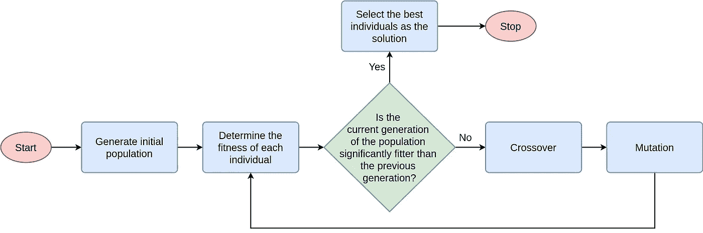
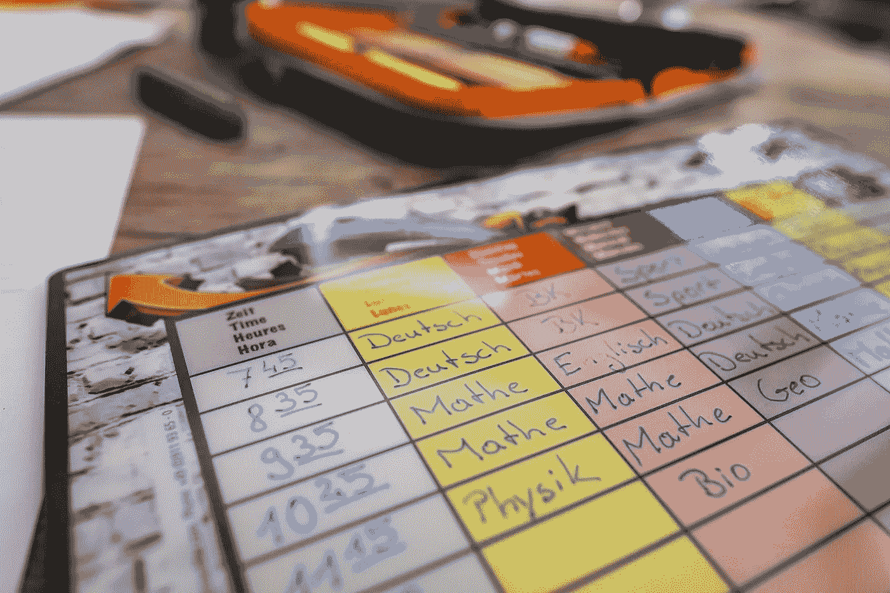

# 使用遗传算法来安排时间表

> 原文：<https://towardsdatascience.com/using-genetic-algorithms-to-schedule-timetables-27f132c9e280?source=collection_archive---------5----------------------->

## 遗传算法如何应用于解决时间表问题

遗传算法是一种受自然选择过程启发的进化算法。我在之前的文章 [**遗传算法介绍中已经介绍过遗传算法——包括示例代码**](/introduction-to-genetic-algorithms-including-example-code-e396e98d8bf3) 。如果你还没看过，就去看看吧！

[](/introduction-to-genetic-algorithms-including-example-code-e396e98d8bf3) [## 遗传算法简介—包括示例代码

### 遗传算法是一种受查尔斯·达尔文的自然进化理论启发的搜索启发式算法。这个…

towardsdatascience.com](/introduction-to-genetic-algorithms-including-example-code-e396e98d8bf3) 

最近我注意到，我留下的一个关于[使用遗传算法](https://medium.com/@vijinimallawaarachchi/time-table-scheduling-2207ca593b4d)安排时间表的回复对很多人真的很有用。因此，我想把这个回复扩展成一篇文章，这样对读者会更有用。让我们开始吧。

# 什么是遗传算法？

引用我以前的文章，

> 遗传算法是一种受查尔斯·达尔文的自然进化理论启发的启发式搜索。这种算法反映了自然选择的过程，即选择最适合的个体进行繁殖，以产生下一代的后代。

如果你想了解更多关于遗传算法的知识，你可以阅读我的文章 [**遗传算法简介—包括示例代码**](/introduction-to-genetic-algorithms-including-example-code-e396e98d8bf3) 在这里我用示例解释了每个阶段。

总而言之，遗传算法的 5 个主要阶段是:

1.  原始群体
2.  适应度函数
3.  选择
4.  交叉
5.  变化

下图显示了一般遗传算法的工作流程图。



通用遗传算法如何工作的流程图(图片由作者提供)

# 制定时间表

在**时间表**中，我们必须为我们计划的活动分配时间，并有序地协调资源，以便我们可以在不违反任何约束的情况下获得预期的结果。例如，*学校时间表*将协调学生、教师、教室、科目和时间段。一个*考试时间表*将协调学生、监考人员、科目、考场和时间段。公共交通时刻表将协调交通方式(公共汽车、火车等)。)、路线、到达时间和离开时间，以便乘客计划行程。

遗传算法可以应用的一个非常流行的场景是在安排时间表的过程中。


图片由[Bruno/德国](https://pixabay.com/users/Bru-nO-1161770/?utm_source=link-attribution&utm_medium=referral&utm_campaign=image&utm_content=3665090)来自 [Pixabay](https://pixabay.com/?utm_source=link-attribution&utm_medium=referral&utm_campaign=image&utm_content=3665090)

# 示例场景

假设你正试图为一所大学的不同学生群体制定一份每周课程表。我们必须安排课程，制定时间表，这样课程之间就不会有冲突。在这里，我们的任务是寻找最佳的时间表安排。

## 创造染色体

一个个体由一组被称为**基因**的参数(变量)来表征。基因连成一串形成**染色体**(解)。我们将我们的解决方案建模为染色体。

在我们的示例场景中，对于学习不同模块的学生，染色体将是不同的 ***讲座*** 。考虑到我们必须协调学生小组、模块、演讲厅、一周中的日期和时间。你可以把一节课描述成，

```
**<Module, Student Group, Day, Location, Lecture Time>**
```

您可以将讲座作为二进制模式编码到染色体**中。**

您可以为每个实体中的每个值指定二进制值。您可以随意更改编码模式。下面给出了一个你可以对讲座进行编码的例子。

获取模块列表并分配二进制值。

```
Data Mining - 0000,
Machine Learning - 0001,
Biology - 0010,
...
```

获取学生组列表，并给出二进制值。

```
STG0 - 00000, 
STG1 - 00001, 
STG2 - 00010, 
STG3 - 00011,...
```

类似地，你可以在讲座中为每个实体提出编码方案。

下面给出了一个讲座的示例编码。

```
**<Data Mining, STG3, Monday, Hall D, 8.00AM>**Data Mining - 0000
STG3 - 00011
Monday - 000
Hall D - 1010
8.00AM - 1000Chromosome - **00000001100010101000**
```

单个的位被称为基因。这条染色体有 20 个基因。

## 创建初始群体

不同的学生群体在一周内上不同的课。因此，你必须想出不同的类组合，并创建初始种群。你可以决定人口数量(班级数量)。

```
**<Data Mining, STG3, Monday, Hall A, 8.00AM>
<Machine Learning, STG2, Tuesday, Hall B, 8.00AM>
<Computational Biology, STG8, Tuesday, Hall A, 10.00AM>
...**
```

如前所述，你必须将这些类别编码到染色体中。

## 提出一个评估函数

例如，您可以将**评估函数**公式化为学生组 的 ***班级冲突数的倒数。冲突的数量越少，讲座就越合适。你可以选择一个合适的评价函数。***

现在，您可以执行交叉和变异操作，以最大化每个讲座的适应值。

## 结束

当群体达到最大适应值时，您可以终止该过程。在我们的例子中，这是讲座冲突最少的时候。



图片由[Bruno/德国](https://pixabay.com/users/Bru-nO-1161770/?utm_source=link-attribution&utm_medium=referral&utm_campaign=image&utm_content=3665089)来自 [Pixabay](https://pixabay.com/?utm_source=link-attribution&utm_medium=referral&utm_campaign=image&utm_content=3665089)

# 最后的想法

我在这篇文章中描述的方法是非常基本的，这样你就可以大致了解如何对时间表问题建模。如果你想阅读更多，你可以阅读许多[的研究文章](https://scholar.google.com.au/scholar?q=timetable+scheduling+genetic+algorithms&hl=en&as_sdt=0%2C5&as_ylo=2010&as_yhi=)，其中提出了新的和改进的方法来使用遗传算法解决时间表问题。我看到的一些文章列举如下。

*   [使用采用引导变异的遗传算法的时间表调度](https://ieeexplore.ieee.org/abstract/document/5705788)
*   [带模糊时间窗的高中课表编排的改进遗传算法](https://ieeexplore.ieee.org/abstract/document/8304115)
*   [利用遗传算法通过新的染色体表示解决时间表调度问题](https://ieeexplore.ieee.org/abstract/document/7159319)
*   [遗传算法分析利用图着色法求解大学课程表问题](https://www.sciencedirect.com/science/article/pii/S1877050918313024)
*   [求解柔性作业车间调度问题的改进遗传算法](https://ieeexplore.ieee.org/abstract/document/7120576)
*   [一种基于递归遗传算法的新型教育课程表解决方案](https://ieeexplore.ieee.org/abstract/document/7435955)

遗传算法并不是我们解决课程表问题的唯一方法。还有许多进化算法，如基于种群的搜索算法**蚂蚁算法**和**蜜蜂算法**。

希望你对现实世界的问题有了一个基本的概念，我们可以用遗传算法来解决它。请在回复部分告诉我你的想法。

不要忘记看看这个令人敬畏的遗传算法的实现，在[**【https://github.com/memento/GeneticAlgorithm】**](https://github.com/memento/GeneticAlgorithm)由 [mem ento](https://medium.com/u/93477f57305f?source=post_page-----27f132c9e280--------------------------------) 制作的每一代基因库的可视化。

[](https://github.com/memento/GeneticAlgorithm) [## 纪念品/遗传算法

### 重构和改进来自 Vijini Mallawaarachchi 女士(@Vini2)的一个要旨我还把@liangyihuai 的编辑带进了…

github.com](https://github.com/memento/GeneticAlgorithm) 

感谢您的阅读！

干杯！