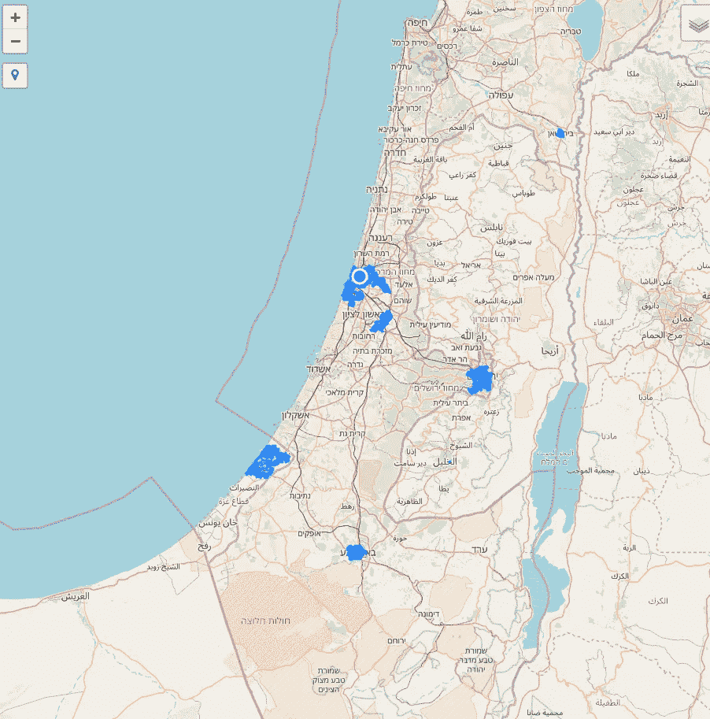
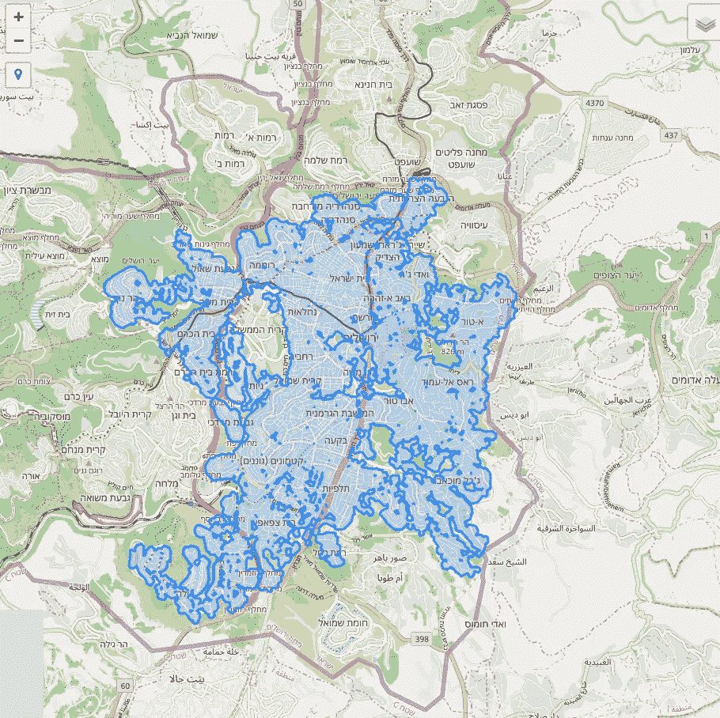
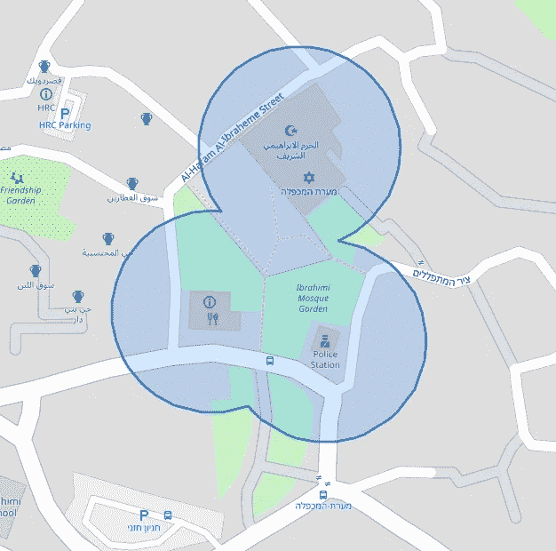
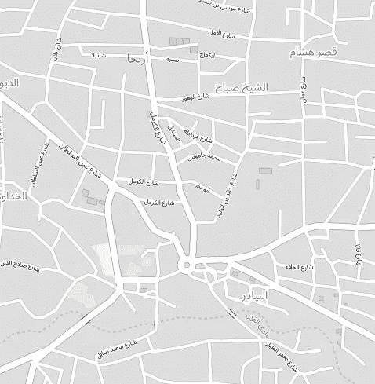

# 使用 GeoPandas 和 Folium 过度设计犹太法律中的一个问题

> 原文：<https://towardsdatascience.com/using-geopandas-and-folium-to-over-engineer-a-question-in-jewish-law-b9b33c4909d2?source=collection_archive---------19----------------------->

## 借助计算地理学解决一个古老问题的尝试

今年是犹太人的普林节，庆祝挫败了古波斯针对犹太人的种族灭绝阴谋。根据你所在的地方，普林节是在 3 月 10 日，或者“蜀山节”是在 3 月 11 日。

这意味着这个古老的节日增加了时间和空间的维度。正是在这样的时候，我喜欢我的职业，数据科学，像过去的拉比和圣贤一样质疑一切。

哈尔布拉查高等犹太法学院的拉比埃利泽·梅拉梅德解释说，某些地方之所以会在一天后庆祝这个节日，是因为一些城市有城墙，而另一些没有。如果一座城市在约书亚·本·嫩时期建有城墙，那么这座城市会庆祝书珊节(后来的日子),否则这座城市会庆祝常规的普林节。

从表面上看，这似乎是一个相对容易的城市之间的划分，但仔细观察，许多问题出现了。

1.  我们怎么知道约书亚·本·嫩时期存在的有城墙的城市就是今天以同样的名字命名的城市呢？Lod 就是这种情况。
2.  这座在约书亚·本·嫩时代被城墙包围的城市已经失去了它的犹太社区和历史记录。
3.  一个历史上存在于约书亚本嫩时期的城市，历史上有城墙，但不知道它是否在奇迹发生时有城墙。希伯伦就属于这一类

唯一一个仍然只庆祝舒山节的城市实际上是耶路撒冷。然而，我们的问题仍然没有完全回答，因为城市的边界在过去的 2000 年里呈指数增长。还有其他城市被认为可能是庆祝蜀山普林节的地方，所以在我们的实验中，我们也将解决它们。

今天的耶路撒冷被认为是约书亚本嫩时代的同一实体吗？

要回答这个问题，我们可以从《塔木德经》中找到一些具体的城市划分规范。[“拉比耶霍舒亚·本·利瓦伊说:一座城市，和所有毗邻它的定居点，以及所有能与它一起被看见的定居点，即，能从有城墙的城市被看见的，都被认为是像这座城市一样的”(Megila 3，2)。](https://www.sefaria.org.il/Megillah.3b.10?lang=bi&with=all&lang2=en)

但是什么是相邻的呢？仅仅是密集的连片建筑吗？拉比·梅拉梅德[澄清道](https://ph.yhb.org.il/category/%d7%96%d7%9e%d7%a0%d7%99%d7%9d/17-%d7%93%d7%99%d7%a0%d7%99-%d7%a4%d7%a8%d7%96%d7%99%d7%9d-%d7%95%d7%9e%d7%95%d7%a7%d7%a4%d7%99%d7%9d/)邻里之间少于 141 肘(67.8 米)的差距足以将他们视为一个邻里。

所以现在我们有了一个关键变量，来过度设计犹太律法的问题。

有许多方法可以用数据来解决这个问题，但我认为最简单的方法是使用 OpenStreetMap 下载以色列的所有空间建筑数据，并将建筑的边界扩展 67.8 米，统一重叠部分，并找到包含耶路撒冷古代部分的多边形。

让我们开始吧:

导入必要的包后，我创建了一个可能的蜀山普林节城市(以及耶路撒冷)的字典，然后将它转换成笛卡尔参考系中的地理数据框架。我通过简单地使用谷歌地图来找到疑似城墙城市的可能历史中心地理坐标。

```
**import** **geopandas** **as** **gpd**
**import** **folium**
**import** **pandas** **as** **pd**
**from** **folium.plugins** **import** LocateControl
**from** **shapely.geometry** **import** Point
**from** **shapely.ops** **import** cascaded_union
walled_cities_dict = {"Tiberias":[32.775011, 35.545584],"Hebron":[31.524723, 35.110460],"Nablus":[32.213117, 35.284881],
                      "Jaffa":[32.053705, 34.750625],"Lod":[31.955268, 34.896203],"Gaza":[31.504135, 34.464426],
                      "Zefat":[32.966292, 35.494927],"Acre":[32.920831, 35.069042],"Haifa":[32.800833, 35.019167],
                      "Beit Shean":[32.499474, 35.498450],"Jericho":[31.870487, 35.440522],
                      "Beer Sheva":[31.237182, 34.793101],"Ramla":[31.924759, 34.872939],"Tyre":[33.274876, 35.193785],
                      "Sidon":[33.562539, 35.369619],"Damascus":[33.511125, 36.301019],"Izmir":[38.418095, 27.139753],
                      "Baghdad":[33.350506, 44.401307],"Jerusalem":[31.777055, 35.234268]}
walled_cities_gdf = gpd.GeoDataFrame()
walled_cities_gdf['City'] = list(walled_cities_dict.keys())
walled_cities_gdf['geometry'] = list(walled_cities_dict.values())
walled_cities_gdf['geometry'] = walled_cities_gdf['geometry'].apply(**lambda** x: Point(x[1],x[0]))
walled_cities_gdf.crs = {'init':'epsg:4326'}
walled_cities_gdf = walled_cities_gdf.to_crs(epsg=3857)
```

我在以色列[这里](https://download.geofabrik.de/asia/israel-and-palestine.html)下载了建筑足迹的 shapefile:

我们在质心中旋转多边形(以使其更容易计算)并将多边形缓冲 67.8 米。

```
buildings = gpd.read_file('/home/arieh/Downloads/israel-and-palestine-latest-free.shp/gis_osm_buildings_a_free_1.shp')
buildings = buildings.to_crs(epsg=3857)
buildings_cent = buildings.copy()
buildings_cent['geometry'] = buildings_cent['geometry'].centroid
buildings_cent['geometry'] = buildings_cent['geometry'].buffer(67.8)
```

然后，我们将其全部转换为一个多面，删除重叠面之间的边界，然后将该多面转换回地理数据框。这样做是为了方便我们在它和城墙城市地理数据框架之间执行空间连接。

```
all_union = cascaded_union(buildings_cent['geometry'])
all_union_polys = []
**for** poly **in** all_union:
    all_union_polys.append(poly)
max_buffers_gdf = gpd.GeoDataFrame()
max_buffers_gdf['geometry'] = all_union_polys
max_buffers_gdf['id'] = range(len(all_union_polys))
max_buffers_gdf.crs = buildings_cent.crs
shushan_extents = gpd.sjoin(walled_cities_gdf,max_buffers_gdf)
max_buffers_gdf_subset = max_buffers_gdf[max_buffers_gdf['id'].isin(shushan_extents['index_right'])]
max_buffers_gdf_subset = max_buffers_gdf_subset.to_crs({'init':'epsg:4326'})
Shushan_Zones = pd.merge(max_buffers_gdf_subset,shushan_extents[['id','City']],on = 'id')
```

现在，我们只剩下可能庆祝蜀山普林节的最大范围。

然后，我们可以使用 leav 将我们计算的蜀山普林节区域转换成交互式网络地图。

```
x1,y1,x2,y2 = Shushan_Zones['geometry'].total_bounds
m = folium.Map(tiles='openstreetmap')
LocateControl().add_to(m)
m.fit_bounds([[y1, x1], [y2, x2]])
folium.GeoJson(Shushan_Zones,name='Shushan Zones').add_to(m)
folium.LayerControl().add_to(m)
m.save('local_files/Shushan_Zone_Tool.html')
```

互动网络应用位于[这里](https://acopelan.github.io/index.html)

来自网络应用的一些截图显示了蜀山区的高级地图:



蜀山区高级地图

一张放大的照片显示了耶路撒冷的细节:



放大到耶路撒冷

嗯，那还行…但是杰里科和希伯伦呢？



希布伦



杰里科

这里没有太多的成功，因为有几个建筑足迹的工作。

所以我们有了它，就像物理[肘杆](https://en.wikipedia.org/wiki/Cubit)如何帮助过去的圣人提出犹太律法的解决方案，所以我们也可以利用今天技术时代的工具和逻辑，并以可扩展和计算的方式应用它们！

这个项目的一个更好的版本将使用对象检测来描绘建筑物，并以光栅聚焦的方式创建区域。我想我们会把改造工作留到明年在耶路撒冷(zone)进行！

在这里找到[笔记本](https://github.com/acopelan/ShushanPurim/blob/master/shushan_zones.ipynb)，在这里找到 [HTML 网页应用](https://acopelan.github.io/index.html)。