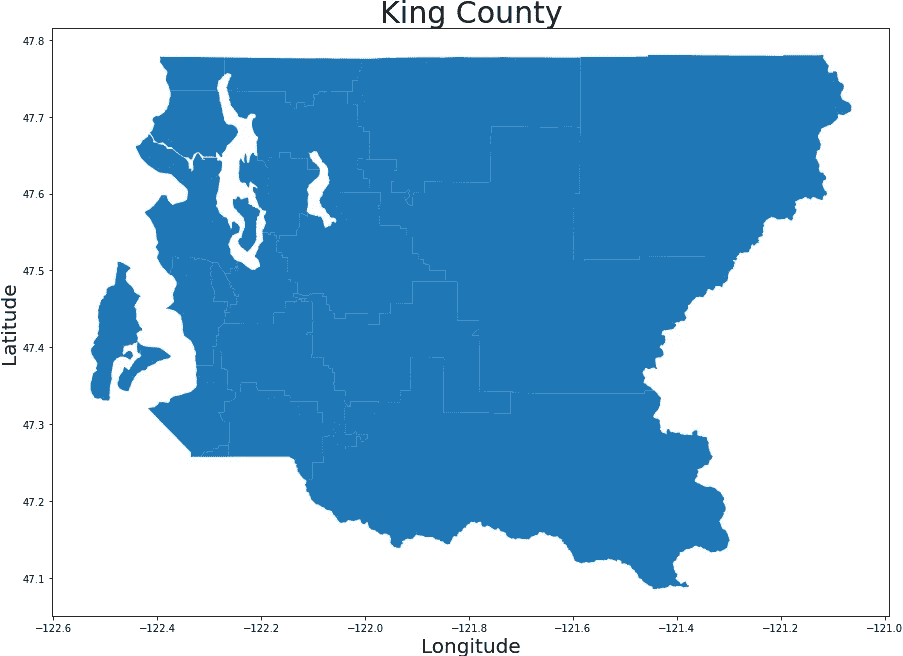
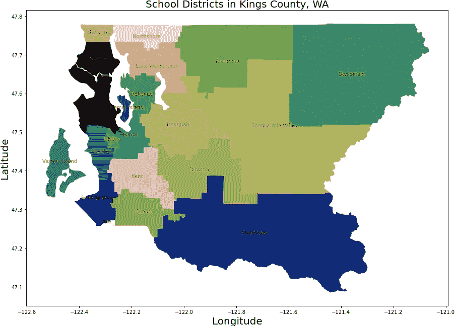
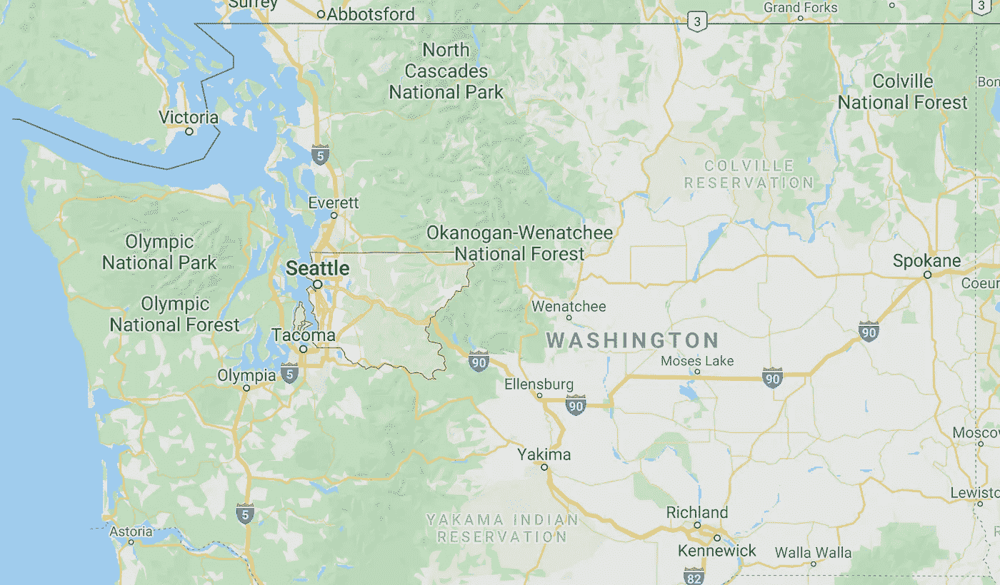
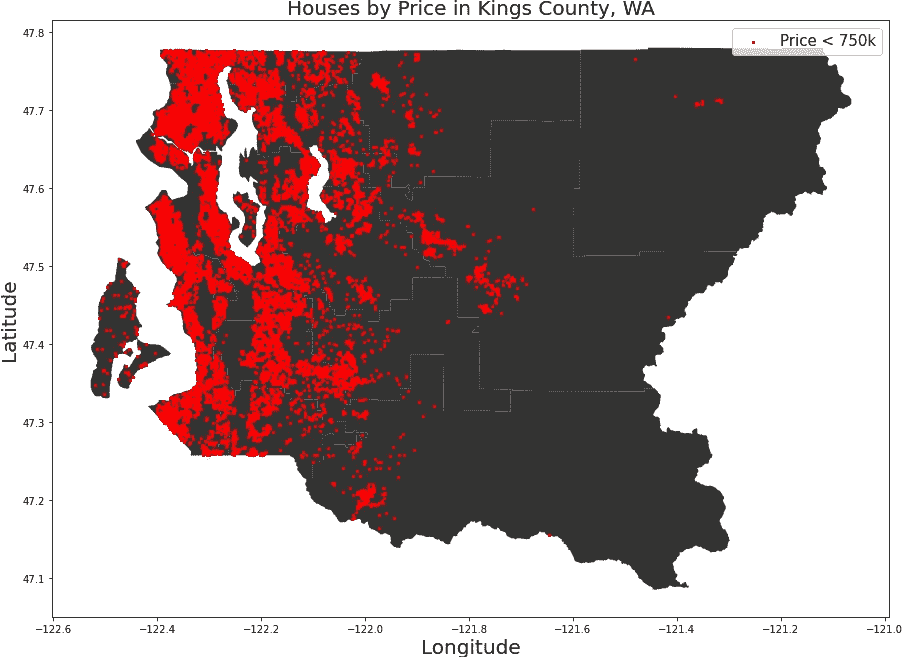
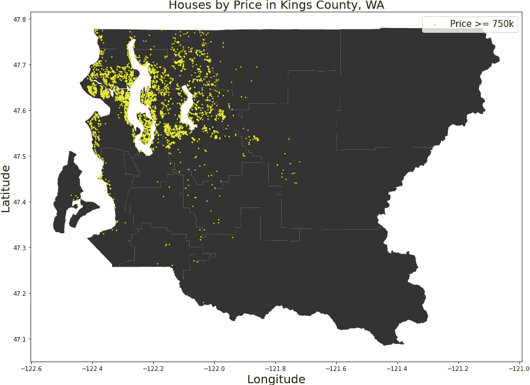
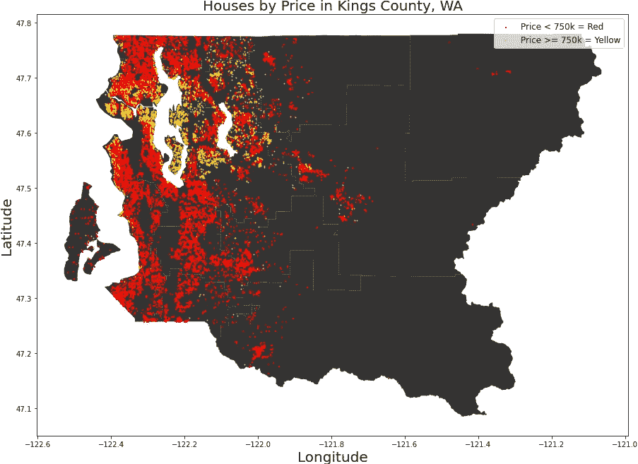

# 使用 GeoPandas 进行空间可视化

> 原文：<https://towardsdatascience.com/using-geopandas-for-spatial-visualization-21e78984dc37?source=collection_archive---------22----------------------->

## 将您的数据带入现实世界

维尔莫索夫在 [Freepik](https://www.freepik.com/) 上的照片

最近，我在做一个项目，试图建立一个模型来预测华盛顿金县——西雅图周围的地区——的房价。在查看了这些特征之后，我想要一种基于位置来确定房屋价值的方法。

数据集包括纬度和经度，很容易通过谷歌搜索它们来查看房屋、它们的街区、它们离水的距离等。但是对于超过 17000 次的观察，这是一个愚蠢的任务。我必须找到更简单的方法。

我以前只用过一次地理信息系统(GIS ),但不是用 Python。所以我做了我最擅长的事情:我谷歌了一下，然后遇到了这个叫做 [GeoPandas](https://geopandas.org/) 的神奇包。我将让 GeoPandas 团队总结他们所做的工作，因为他们可以说得比我好得多。

> GeoPandas 是一个开源项目，旨在简化 python 中地理空间数据的处理。GeoPandas 扩展了 Pandas 使用的数据类型，允许对几何类型进行空间操作。几何运算由 [shapely](https://shapely.readthedocs.io/) 完成。GeoPandas 进一步依赖 [fiona](https://fiona.readthedocs.io/) 进行文件访问，依赖 [descartes](https://pypi.python.org/pypi/descartes) 和 [matplotlib](http://matplotlib.org/) 进行绘图。—来自 GeoPandas 网站的描述(2020)

这让我大吃一惊，我想要的真的只是最基本的功能。我将向您展示如何运行这段代码，并做我所做的事情——在地图上绘制精确的点。

除了基本的 *pandas* 和 *matplotlib，你还需要几个包和一些文件。*它们包括:

*   geo pandas——让这一切成为可能的包
*   [造型优美的](https://pypi.org/project/Shapely/)——用于处理和分析平面几何对象的软件包
*   [笛卡尔](https://pypi.org/project/descartes/) —用 Matplotlib 更好地集成了形状优美的几何对象。不是每次都需要它，但我导入它只是为了安全
*   任何。shp 文件——这将是情节的背景。我的将有国王县，但你应该可以从任何城市的数据部门找到一个。不要从中删除任何文件。压缩文件。总会有东西坏掉。

关于 shapefiles 的更多信息可以在[这里](https://support.esri.com/en/technical-article/000011516)找到，但是总而言之，这些不是普通的图像。它们是一种矢量数据存储格式，包含与位置相关的信息—坐标和其他信息。

首先，我导入了我需要的基本包，然后是新包:

*点*和*多边形*特征帮助我将我的数据与我制作的地图相匹配。

接下来，我加载我的数据。这是基本的熊猫，但对于那些新的，在报价的一切是我不得不访问住房记录文件的名称。

随着所有包的导入和数据的准备，我想看看我将要绘制的地图。我是通过找一个金县政府[网站](https://www.kingcounty.gov/services/gis/GISData.aspx)做的形状文件做到的。他们已经完成了土地勘测和编目的所有艰苦工作——不使用他们免费提供的服务是不礼貌的。加载到形状文件中很容易，与用熊猫加载到 csv 文件中相当。

如果你想看看数据，你可以打开它。King County shape 文件只是一个与他们的学区、几何坐标和面积相匹配的位置数据框架。但是最好的部分是当我们绘制它的时候，是的，我们必须绘制它。这不是一个你可以随便调用的图像——它将内置坐标，因此我们的数据可以像五年级(x，y)图表上的一个点一样放置。

使用下面的代码(注意我是如何编辑它的，就像我编辑图形一样):

我的输出如下所示:

作者提供的图片

在我们开始添加我们的住房数据之前，我们应该充分利用形状文件。我们来看看文件。

如您所见，该县被划分为几个学区，每个学区都有一个用作边界的形状。我们现在将尝试绘制形状文件，并使用提供的数据对区域进行注释，如下所示:

列表——左边、右边、中间——是在地区名称的位置上反复试验的结果。一些重叠或需要被操纵，以便它们不会偏离它们的实际区域太远。

为了清晰起见，我将颜色贴图改为 *gist_earth* 。接下来，我使用 *NAME* 系列中的条目遍历每一行，并将标题放在多边形中明确的一个点上。我根据我之前列的名单排列了这些名字。这是我们的输出:

金县的学区。作者提供的图片

每个区域代表金县的一个学区。这与我找到的关于该县二十个学区的数据相符。我从来没有真正想过一个县的大小和形状，所以我谷歌了一下，只是为了确定一下。

来源:谷歌地图

看起来谷歌地图上的图像是我拼图的完美洞口。从这里开始，只需要格式化我的数据以适应形状文件。我通过初始化我的坐标系统并使用我房子的纬度和经度创建适用的点来做到这一点。

如果你要查看*几何体*中的一个条目，你只会得到它们是*形状优美的*物体。它们需要应用于我们的原始数据帧。下面，你可以看到我做了一个全新的数据框，内置了坐标系统，旧的数据框，以及由房屋的纬度和经度的交叉点创建的点的添加。

这是我们绘制房屋图之前的最后一步。现在，我们把它们放在一起。

# 在上面的代码中，步骤包括:

1.  调用对象进行绘图。
2.  绘制金县形状文件。
3.  绘制包括几何点在内的数据。
    这包括制作标记、选择特征以及为图例添加标签。
4.  添加图例、标题和轴标签。

对每幅图都执行了这些步骤。

我们的产出:

这是一个伟大的产品，但我们的目标是从这个可视化学习一些东西。虽然这提供了一些信息，如远离该县东部的异常值，但它没有提供太多其他信息。我们必须使用参数。让我们试着按价格分割数据。这些是标价低于 75 万美元的房子。

价格低于 75 万美元的房子。作者提供的图片

现在我们用图表表示大于或等于 750，000 美元的房屋。

价格在 75 万美元以上的房子。作者提供的图片

无论是位置还是数量都有很大的区别。但这不是目的，我们还可以将它们一层一层地堆叠起来。我们将在便宜的基础上做昂贵的，因为它更稀缺。

并排比较。作者提供的图片

这幅地图画的图画很有趣。金县有太多的房子低于我们设定的标准。大多数价格较低的房子比价格较高的房子更靠近内陆。

如果放大，更贵的房子点缀在水边。他们也更集中在西雅图市中心。有几个物理异常值，但趋势是明确的。

总的来说，可视化已经完成了它的工作。我们已经根据地图上的房子做了一些决定。价格较高的房屋聚集在市中心周围，散布在普吉特湾周围。他们在数据中也是少数，这可能有助于预测房价。价格较低的房子数量更多，位置也各不相同。这将有助于进一步的 EDA。

如果你想联系更多关于这个技术的讨论，你可以在 LinkedIn 上找到我。如果你想看看代码，看看我的 [Github](https://github.com/ptorres001) 。

# 来源

*   郡王数据集— [此处](https://www.kaggle.com/harlfoxem/housesalesprediction)
    郡王形状文件— [此处](https://www.kingcounty.gov/services/gis/GISData.aspx)
*   [Geopandas](https://geopandas.org/)
*   [身材匀称](https://pypi.org/project/Shapely/)
*   [笛卡尔](https://pypi.org/project/descartes/)
*   [菲奥娜](https://pypi.org/project/Fiona/)